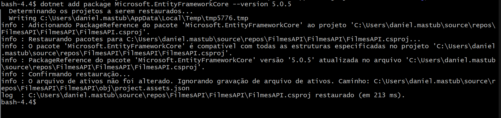
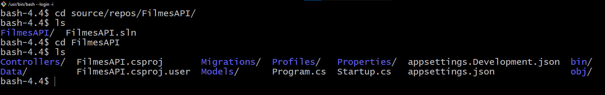

# Curso Alura: .NET 6 criando uma web API

## Aula 1: Entendendo o conceito

### Aula 1: Apresentação - Vídeo 1

Transcrição  
Boas-vindas! Meu nome é Daniel Artine, serei seu instrutor neste curso de API Rest com .NET 6.

Daniel Artine é uma pessoa de pele clara, olhos castanhos escuros e cabelos pretos curtos. Usa barba e bigode, veste uma camiseta cinza escura e está sentado em uma cadeira preta. Ao fundo, há uma parede com iluminação azul.

O que vamos aprender?  
Ao longo deste treinamento, estudaremos os verbos HTTP e focaremos em responder as seguintes questões:

- Como se constrói uma API?
- O que é uma API?
- Quando e como utilizar uma API?
- Por que utilizar uma API?

Construiremos nosso projeto com base em uma API de filmes, com a qual que conseguiremos cadastrar filmes, além de recuperar informações, atualizar dados de diferentes maneiras (com o verbo PUT e com verbo PATCH) e deletar filmes. Ao final do curso, também estudaremos como documentar APIs utilizando Swagger.

A nível de código, vamos:

- desenvolver nosso construtor
- utilizar DTOs para criar, ler e atualizar filmes
- fazer conexões com banco de dados, usando Entity Framework
- realizar conversões entre diferentes tipos, com o AutoMapper
- Vale ressaltar que seguiremos a nova convenção do .NET 6, tendo um arquivo Program.cs e não dependendo mais de um Startup.cs. Desenvolveremos o projeto de uma maneira bem minimalista.

Espero que aproveitem o curso. Caso tenham dúvidas, não deixem de perguntar. Bons estudos!

### Aula 1: Preparando o ambiente - Vídeo 2

Transcrição  
Nesta aula, vamos preparar nosso ambiente de trabalho, fazendo a instalação de todas as ferramentas necessárias para dar continuidade aos nossos estudos. Como vamos desenvolver o projeto no Windows, mostraremos as instalações e configurações nessa plataforma em específico, mas sempre que possível daremos indicações de como realizar esses processos no Linux, caso você precise trabalhar com esse sistema.

Baixando os instaladores  
A primeira ferramenta necessária é o Visual Studio Community 2022. Ao acessar o site na página de downloads, basta clicar no botão roxo "Download gratuito" referente à versão "Comunidade".

Caso você esteja no Linux, você pode usar o Visual Studio Code, um editor de texto bastante poderoso que, às vezes, se compara a uma IDE.

A próxima ferramenta é o MySQL 8.0.31. Na [https://dev.mysql.com/downloads/windows/installer/8.0.html](página de download), há duas opções. Vamos baixar a segunda: o instalador completo (de 431.7 MB). Ao clicar no botão azul "Download" à direita dessa opção, seremos direcionados a uma janela sugerindo que criemos uma conta Oracle. Não é preciso criar a conta, basta clicar no link "No thanks, just start mu download" no final da página, para simplesmente baixar o instalador.

A seguir, vamos baixar do Postman. Na página de downloads do Postman, basta clicar no botão laranja "Windows 64-bit". Essa ferramenta servirá para fazermos requisições de maneira mais prática, visualizar as respostas, preencher o corpo da requisição etc.

Também precisaremos no .NET 6. Na página de downloads do .NET, faremos o download da versão 6.0.402, conforme nosso sistema (Arm64, x64 ou x86).

Caso você esteja no Linux Ubuntu, a Microsoft tem uma documentação explicando passo a passo como fazer essa instalação. Na lateral esquerda dessa página, há tutoriais de outras distribuições, como: Alpine, CentOS, Debian, Fedora e OpenSUSE.

Instalando as ferramentas  
Agora que centralizamos nossos instaladores, passaremos para os processos de instalação em si. O Postman e o .NET são bem simples, basta clicar no botão "Next" diversas vezes até finalizar, você pode fazer por conta própria. Já o Visual Studio e o MySQL têm algumas peculiaridades, então focaremos neles a seguir.

Visual Studio e cargas de trabalho  
Primeiramente, vamos executar o instalador do Visual Studio Community 2022. Logo de início, será aberta uma caixa de diálogo explicando que algumas atualizações são necessárias, então clicaremos no botão "Continuar" no canto direito inferior.

Em seguida, a janela de instalação será aberta. Na parte esquerda da tela, há um retângulo referente ao Visual Studio Community 2022, em que temos o botão "Instalar" à direita. Caso você já tenha o Visual Studio instalado, você terá o botão "Modificar" no lugar.

Clicando no botão "Instalar" (ou "Modificar"), precisamos definir as cargas de trabalho que queremos instalar. Vamos selecionar a opção "ASP.NET e desenvolvimento Web". No painel à direita, temos os detalhes da instalação — não vamos modificar nada nessa seção.

Para agilizar o processo e ocupar menos memória do computador, recomendamos desmarcar qualquer outra carga de trabalho, já que neste curso usaremos apenas "ASP.NET e desenvolvimento Web".

No canto inferior direito, podemos escolher entre duas opções de instalação:

- Instalar durante o download
- Baixar tudo, depois instalar

Marque a opção que você preferir, de acordo com a velocidade da sua internet. Por fim, clicaremos no botão "Instalar" (ou "Modificar") no canto direito inferior.

MySQL e seus componentes  
Agora, vamos executar o instalador do MySQL. De início, ele pedirá permissão no sistema para continuar e depois fará a extração dos itens necessários. Em seguida, será aberta a janela do instalador.

Na primeira tela, selecionaremos a opção "Custom" para fazer uma instalação customizada e clicaremos no botão "Next" no canto direito inferior.

Na segunda tela, vamos definir os elementos que queremos instalar. No painel à esquerda, selecionaremos "MySQL Servers > MySQL Server > MySQL Server 8.0 > MySQL Server 8.0.31 - X64". Em seguida, pressionaremos a seta para a direita (na tela ou no teclado do computador) para adicionar esse componente à lista à direita.

Ainda no painel à esquerda, selecionaremos "Applications > MySQL Workbench > MySQL Workbench 8.0 > MySQL Workbench 8.0.31 - X64" e pressionaremos a seta para a direita novamente. Assim, o painel à direita terá a seguinte lista de componentes a serem instalados:

- MySQL Server 8.0.31 - X64
- MySQL Workbench 8.0.31 - X64

Vamos clicar no botão "Next" no canto direito inferior para prosseguir. Na próxima tela, podemos indicar o diretório de instalação e clicar em "Next". Caso o diretório já exista, o instalador mostrará um aviso, vamos clicar em "Yes".

Na próxima tela, temos a listagem do que será instalado. Basta clicar no botão "Execute" no canto direito inferior. Essa instalação pode ser um pouco demorada.

Enquanto a instalação é feita, fique à vontade para explorar o projeto no GitHub e saciar sua curiosidade sobre tudo que aprenderemos ao longo do curso.

Nós vamos estudar as novidades do .NET 6, entendendo a questão dos namespaces (file-scoped e block-scoped). Também aprenderemos a criar um controlador, modelos e DTOs.

Finalizado o processo, clicaremos em "Next". Na próxima tela, em "Next" mais uma vez para começar a configuração.

Na próxima tela, vamos manter as configurações padrões:

- Config Type: Development Computer
- Port: 3306
- X Protocol Port: 33060

Pressionando o botão "Next", precisamos definir o método de autenticação. Para não nos preocuparmos com a questão de criptografia de senhas e afins, selecionaremos "Use Legacy Authentication Method" e clicaremos em "Next".

Agora, definiremos a nossa senha. Por ora, podemos deixá-la como "root" e clicar em "Next". Não alteraremos nada nas próximas páginas, basta clicar em "Next", "Next" e "Execute".

Caso você esteja usando o Linux, o MySQL está no repositório padrão. Você pode instalá-lo com o apt no Ubuntu.

Ao final, todas as instalações e configurações de ambientes estarão prontas!

### Aula 1: Faça como eu fiz: configurações iniciais

Nesta atividade você irá preparar o seu ambiente de desenvolvimento para dar continuidade ao curso. Para isso, vamos precisar fazer a criação do nosso projeto na IDE que utilizamos durante as aulas, o Visual Studio 2022.

Você colocou isso em prática? Vamos colocar a mão na massa e verifique se ficou com alguma dúvida. Se sim, você pode clicar na “Opinião do instrutor” e conferir o passo a passo de como isso foi feito.

Opinião do instrutor

Inicialmente, abra o Visual Studio. Em seguida, escolha a opção “Criar um projeto”.

- Tela inicial do Visual Studio

Após isso, utilize a barra de pesquisa e escreva “api”, escolhendo a opção com a linguagem C#.

- Tela de seleção do tipo de projeto no Visual Studio

Dê um nome para seu projeto. Para o curso, utilizamos o nome “FilmesAPI”. Clique em “Próximo”.

- Tela de definição de nome e caminho do projeto do Visual Studio

Certifique-se de utilizar a versão .NET 6.0 e clique em “Criar”.

- Tela final antes de criar o projeto no Visual Studio

Com isso seu projeto está criado e você está pronto para escrever seu código.

### Aula 1: O que é uma API - Vídeo 3

Transcrição  
Antes de começar a desenvolver nosso projeto, vamos entender o que são APIs e para que servem.

Primeiramente, "API" é a sigla para o termo "Application Programming Interface" — em português, interface de programação de aplicações. Mas o que isso significa?

Para entender o conceito de API, pensaremos num exemplo relacionado a filmes, já que nosso projeto terá esse tema. Vamos imaginar que o cliente 1 deseja conferir informações sobre o filme "O senhor dos anéis" pelo computador. Por exemplo, o título, o ano de lançamento, o nome do diretor, o gênero e o tempo de duração.

A máquina do cliente fará uma requisição para o servidor. O servidor, por sua vez, consultará os dados cadastrados no banco de dados e os enviará para o servidor, que mandará a resposta de volta para o cliente.

Diagrama de requisição de dados. No canto esquerdo superior, o cliente 1 é representado pela ilustração de um monitor de computador. Em sua tela, há dados do filme "O senhor do anéis". No centro do diagrama, temos um servidor representado por outro monitor. Em sua tela, temos a letra N maiúscula e vermelha, semelhante ao logotipo da empresa Netflix. À direita do diagrama, temos um banco de dados representado por um cilindro segmentado. Há 4 setas: do cliente 1 ao servidor (requisição); do servidor ao banco de dados; do banco de dados ao servidor; e do servidor ao cliente 1 (resposta)

O cliente 2 está utilizando um aplicativo no smartphone ou o próprio navegador do celular e deseja obter as mesmas informações para outros fins. Será que a resposta enviada ao cliente 1 pode ser o mesmo tipo de resposta dada ao cliente 2?

O mesmo diagrama de requisição de dados, com informações extras. No canto esquerdo inferior, o cliente 2 é representado por um smartphone. Uma seta aponta do cliente 2 ao servidor, outra seta aponta do servidor ao cliente 2. Abaixo dessa segunda seta, há vários pontos de interrogação.

Cada cliente pode estar esperando dados em determinado escopo. O servidor precisa sempre estar atento a que tipo de resposta deve ser enviado. Como podemos solucionar essa questão?

Em vez de um servidor, os clientes podem enviar requisições para uma API. Ela será responsável por resolver esse pedido e dar uma resposta que os clientes consigam utilizar os dados designados.

Mas como a API consulta os dados e os devolve para o usuário? No final das contas, isso não importa! O processo é análogo ao conceito de orientação a objetos: basta que sigamos as regras impostas pela interface para receber a resposta padronizada, que pode ser consumida pelos nossos clientes.

Diagrama do uso de uma API. A disposição dos elementos é semelhante aos diagramas anteriores. No canto esquerdo superior, temos o cliente 1 representado por um monitor. No canto esquerdo inferior, temos o cliente 2 representado por um smartphone. Os clientes estão dentro de uma área retangular denominada "Consumidores". No centro do diagrama, temos a API RESTful representada por um quadrado com a letra N maiúscula e vermelha. Na parte direita do diagrama, temos a ilustração de uma cartola com uma varinha mágica e pequenas estrelas brilhantes. Abaixo dela, está escrito "Não importa!". Há 6 setas: do cliente 1 até a API; do cliente 2 até a API; da API até a cartola; da cartola até a API; da API até o cliente 1; e da API até o cliente 2.

Em outras palavras, podemos imaginar a API como uma "casca" que contém um conjunto de regras. Cada cliente que quiser consumir da API, conseguirá interagir com esse sistema, desde que siga essas regras.

Quando implementamos determinado conjunto de regras arquiteturais, um dos mais difundidos é o REST — Representational State Tranfer. Seguindo esse padrão, sempre saberemos o que vamos receber e o que precisamos enviar nas duas pontas, de modo que a comunicação fica padronizada.

Ao segue o padrão REST, uma API é chamada de API RESTful. Ou seja, REST é o nome do conceito arquitetural e RESTful é quem implementa esse conceito.

Recapitulando: os clientes (consumidores) fazem requisições para a API RESTful e não importa como funciona a lógica por trás da API não importa. Pode ser um banco de dados (relacional ou não) ou estar em memória. Desde que os consumidores sigam as regras impostas pela API, eles receberam os dados.

Assim, a API visa disponibilizar informações para outras aplicações, seja para operações de escrita, leitura, atualização ou remoção.

Para consumir seus recursos, é necessário seguir as regras estabelecidas (que entenderemos ao longo do curso). Como as APIs abstraem detalhes de implementação, não precisamos compreender como o back-end está sendo implementado.

Além disso, APIs controlam o que pode ou deve ser acessado. Se criamos um endpoint para devolver determinada informação para o usuário, conseguimos ter um ótimo controle do que será exposto ou não a quem consome a API.

Tendo esses conceitos fixados, vamos partir para a prática na próxima aula!

### Aula 1: Sobre APIs - Exercício

APIs possuem finalidades específicas e diversas utilizações, seja do lado do usuário, seja de quem está desenvolvendo. Um exemplo é o sistema de filmes apresentado anteriormente, no qual podemos acessar diversas informações de maneira padronizada.

Selecione as alternativas abaixo que demonstram características das APIs.

Respostas:

Abstraem detalhes de implementação para quem for consumi-las.

> Os consumidores não precisam saber detalhes de implementação.

Alternativa correta  
Controlam o que pode/deve ser acessado.

> Os consumidores não conseguirão acessar caminhos que não estão expostos.

### Aula 1: O que aprendemos?

Nessa aula aprendemos:

- APIs trazem vantagens como: facilitar o consumo e disponibilização de dados e padronização.
- REST é um padrão arquitetural que visa padronizar os meios de tráfego de dados.
- APIs abstraem detalhes de implementação.
- Como preparar o ambiente no Windows e Linux.

## Aula 2: Iniciando o porjeto .NET 6

### Aula 2: Criando um projeto .NET 6 - Vídeo 1

Caso você esteja usando Linux e Visual Studio Code, mais adiante o instrutor explicará como criar um projeto com esse editor de texto também.

Criando um projeto com Visual Studio 2022  
Vamos abrir o Visual Studio 2022 para criar nosso projeto. À direita da tela inicial, na seção "Introdução", clicaremos na opção "Criar um projeto".

Na barra de pesquisa (cujo atalho é "Alt + S"), vamos buscar por "api" e selecionar o modelo "API Web do ASP.NET Core" com C#. Depois, pressionaremos o botão "Próximo" no canto direito inferior.

Na próxima tela, definiremos o nome do projeto e o nome da solução. Ambos se chamarão "FilmesApi". Além disso, você pode escolher o diretório de criação do projeto, conforme sua preferência. Em seguida, clicaremos no botão "Próximo".

O passo seguinte é escolher o framework. Vamos utilizar o .NET 6.0 (Suporte de longo prazo) — ou seja, o LTS. Em seguida, clicaremos em "Criar" no canto inferior direito da tela.

O .NET 7 ainda não está na versão LTS. Não é recomendado ter projetos (seja em produção ou prontos para produção) com frameworks sem a versão LTS, pois perdemos o suporte tanto da comunidade quanto da própria empresa que desenvolveu a ferramenta.

Arquivos iniciais  
O Visual Studio criará uma base para o nosso projeto, com alguns arquivos iniciais que exploraremos a seguir. Nós vamos acessá-los usando o gerenciador de soluções, à direita da IDE.

Caso o gerenciador não esteja aparecendo na sua tela, basta usar o atalho "Ctrl + Alt + L" ou clicar em "Exibir > Gerenciador de Solução" no menu superior do Visual Studio.

No gerenciador de soluções, temos:

- a pasta "Properties"
- a pasta "Controllers"
- o arquivo appsettings.json
- o arquivo appsettings.Development.json
- o arquivo Program.cs
- o arquivo WeatherForecast.cs

O arquivo WeatherForecast.cs é um modelo para exemplificar uma API base do .NET. Por enquanto, vamos mantê-lo no projeto, pois executaremos a aplicação para entender como interagimos com a API.

O Program.cs é onde nossa aplicação é iniciada e onde temos as definições dos serviços que utilizaremos nela, bem como as dependências necessárias, entre outras informações.

Caso você já tenha usado versões anteriores do .NET, provavelmente reparou que esse arquivo é bem minimalista — não há definição de classe nem do escopo do namespace. A partir do .NET 6, não precisamos mais fazer essas definições. Basta criar o builder, gerar a aplicação e executá-la, em linhas enfileiras. Ao longo do curso, modificaremos bastante o arquivo Program.cs e não precisaremos nos preocupar com questões de indentação. Entre outras vantagens, o código ficará mais legível.

Caso o .NET 6 seja sua primeira experiência com a criação de APIs, saiba que não é necessário ter conhecimentos de versões anteriores.

Nos arquivos appsettings.json e appsettings.Development.json, definimos informações que serão carregadas durante a execução da nossa aplicação, como o endereço do banco de dados ou as credenciais usadas em determinado serviço.

Na pasta "Controllers", temos os controladores. Como o nome sugere, trata-se de classes responsáveis pelo controle. Elas recebem e respondem às requisições dos usuários que interagem com a API. Por ora, temos apenas o arquivo WeatherForecastController.cs. O uso do sufixo "Controller" no nome é uma convenção para indicar o papel da classe. Perceba que o próprio .NET adotou essa convenção ao gerar o arquivo WeatherForecastController.cs.

Da linha 5 a 7 desse arquivo, vale notar o uso da extensão : ControllerBase e das anotações [ApiController] e [Route], importantes para o funcionamento do controlador .NET. Vamos aprender sobre elas mais adiante:

```csharp
[ApiController]
[Route("[controller]")]
public class WeatherForecastController : ControllerBase
```

Ainda nesse arquivo, temos definições de atributos estáticos, como o Summaries (linha 9), _logger (linha 14) e o construtor (linha 16). Ao final, temos um método chamado Get() que não recebe parâmetro nenhum e cujo retorno é um enumerável de WeatherForecast.

Apesar deste curso ser voltado para quem está começando a aprender sobre APIs com .NET, é importante que você já tenha uma base de conhecimento sobre C#. Por exemplo, não vamos explicar o que é uma lista, um enumerável ou como implementar uma interface. O foco do treinamento é entender a criação de APIs e conhecer os padrões a serem seguidos.

Sabemos que o controller é responsável por receber e responder requisições dos usuários, porém como ele sabe que deve chamar esse método Get()? Em breve, vamos executar nossa aplicação para entender como esse processo funciona.

Antes disso, vamos explorar o arquivo launchSettings.json, na pasta "Properties". A partir da linha 11, temos alguns profiles, perfis para a nossa aplicação. O que nos interessa é o trecho referente a "FilmesApi". Inclusive, vamos apagar o trecho do "IIS Express". O arquivo ficará assim:

```csharp
{
  "$schema": "https://json.schemastore.org/launchsettings.json",
  "iisSettings": {
    "windowsAuthentication": false,
    "anonymousAuthentication": true,
    "iisExpress": {
      "applicationUrl": "http://localhost:23847",
      "sslPort": 44335
    }
  },
  "profiles": {
    "FilmesApi": {
      "commandName": "Project",
      "dotnetRunMessages": true,
      "launchBrowser": true,
      "launchUrl": "swagger",
      "applicationUrl": "https://localhost:7106;http://localhost:5106",
      "environmentVariables": {
        "ASPNETCORE_ENVIRONMENT": "Development"
      }
    }
  }
}
```

Para salvar as alterações, pressionaremos "Ctrl + S".

Na linha 17 desse arquivo, temos a applicationUrl. Com protocolo HTTPS, usamos o localhost, na porta 7106. Com protocolo HTTP, a porta 5106. Na linha 15, temos a configuração lauchBrowser: true, de modo que o navegador será aberto automaticamente, quando a aplicação for iniciada.

Executando a aplicação  
A seguir, vamos executar a aplicação. No menu superior da IDE, temos o símbolo de uma seta para a direita com preenchimento verde claro. À sua direita, há uma pequena seta branca para baixo. Clicaremos nela e selecionaremos "FilmesApi". Não queremos WSL.

Em seguida, vamos iniciar sem depurar, clicando no símbolo de seta para a direita com o contorno verde claro, sem preenchimento. Alternativamente, podemos pressionar "Ctrl + F5". A aplicação será aberta no navegador.

Estamos trabalhando com uma API e o foco não é front-end, contudo note que nossa aplicação tem uma tela bonita, bem estruturada e interativa, com links clicáveis. Esse resultado é obtido com o Swagger. Estudaremos mais sobre ele no final deste curso.

Abaixo do título "WeatherForecast", temos a seção "GET /WeatherForecast", indicando que podemos acessar este caminho. Vamos clicar nela para expandi-la. Em seguida, clicaremos no botão "Try it out" (Testar), no canto superior direito da área expandida e, depois, em "Execute".

Mais abaixo, no tópico "Server Response", recebemos um response body com status code 200 e informações de data e temperatura. Examinando esse retorno, reparamos que ele nada mais é que um enumerável convertido em array, como conferimos no método Get() do nosso controlador.

Analisando o tópico "Curl", sabemos que a rota utilizada foi `https://localhost:7106/WeatherForecast`. No arquivo lauchSettings.json, verificamos há pouco que o caminho em que nossa aplicação está sendo executada é `https://localhost:7106`. Mas como o controlador sabe que, com /WeatherForecast, ele deve executar o método Get()?

Anteriormente, reparamos que o nome da classe WeatherForecastController segue a convenção de usar o sufixo "Controller". Na anotação [Route("[controller]")] na linha 6, os colchetes indicam que devemos selecionar o prefixo do nome da classe e colocá-lo no lugar de [controller]. Ou seja, o controlador interpretará a rota como [Route("WeatherForecast")].

A vantagem de usar a anotação [Route("[controller]")] em vez de [Route("WeatherForecast")] é que, se eventualmente alterarmos o nome da classe, não será necessário adaptar a anotação também. Assim, tudo fica mais prático e fácil.

Além disso, imediatamente acima do método Get(), temos a seguinte anotação:

```csharp
[HttpGet(Name = "GetWeatherForecast")]
```

O HttpGet é uma das operações que podem ser executadas em uma API. Na nossa aplicação, foi exatamente essa ação que executamos ao expandir a seção "GET /WeatherForecast" e pressionar o botão "Execute".

Dessa forma, o controlador sabe que, ao acessar a rota /WeatherForecast com o verbo GET, ele deve executar toda a lógica do método Get()!

Não se preocupe se esse processo não ficou muito claro ainda. Ao longo do curso, vamos recriar essa lógica com nossas próprias rotas e aprender mais a fundo como tudo funciona. Por enquanto, a ideia era apenas visualizar esse escopo inicial.

Namespace com escopo de arquivo  
No arquivo WeatherForecastController.cs, note que todo o código está indentado para que a classe e as anotações fiquem dentro de um namespace, em um bloco de chaves. O .NET 6 oferece um recurso para aprimorar essa estrutura. Posicionando o cursor sobre o nome do namespace (linha 3), pressionaremos "Alt + Enter" e selecionaremos "Converter em namespace com escopo de arquivo". Assim, o código ficará indentado mais à esquerda e o bloco de chaves do namespace é removido. O projeto torna-se mais centralizado e legível dessa forma.

Criando um projeto com Visual Studio Code  
Até agora, usamos apenas o Visual Studio 2022. Caso você tenha optado pelo Visual Studio Code, há duas extensões que recomendamos instalar para desenvolver projetos .NET. No painel à esquerda do VS Code, basta acessar a aba "Extensions" e pesquisar as seguintes extensões:

- C# (da Microsoft)
- C# Snippets (de Jorge Serrano)

Em seguida, vamos criar um projeto via linha de comando. No menu superior do VS Code, selecionaremos "Terminal > New Terminal". Alternativamente, podemos usar o atalho "Ctrl + Shift + '".

Um novo terminal será aberto na parte inferior da tela. Vamos criar uma pasta chamada "projetolinux", com o seguinte comando:

```cmd
mkdir projetolinux
```

Em seguida, vamos acessar a pasta:

```cmd
cd projetolinux
```

E abrir uma nova instância do Visual Studio Code nela:

```cmd
code .
```

Na nova instância, abriremos o terminal novamente, com "Ctrl + Shift + '". Para criar um projeto .NET, rodaremos o seguinte comando:

```cmd
dotnet new webapi --name FilmesApi
```

Assim, criaremos um modelo de Web API com o nome "FilmesApi". No painel à esquerda, temos a mesma estrutura de pastas que teríamos no Visual Studio 2022!

Para executar o projeto, basta rodar o seguinte comando no terminal:

```cmd
dotnet run --project FilmesApi/FilmesApi.csproj
```

Após a compilação, serão mostradas várias informações no terminal, como o endereço de execução da aplicação. No caso, no localhost, na porta 7174 com protocolo HTTPS, ou na porta 5177 com HTTP. Basta dar um "Ctrl + Clique" sobre o endereço para acessá-lo no navegador.

Inicialmente, teremos um erro, pois é preciso acessar o endereço com /swagger ao final. Portanto, usaremos o seguinte endereço:

```cmd
https://localhost:7174/swagger/index.html
```

O foco dessa aula foi apenas criar o projeto, conferir algumas particularidade do .NET 6 e entender como interagir com uma API. Caso tenha ficado alguma dúvida, não se preocupe! Na próxima aula, vamos recriar toda essa lógica do início ao fim com nossos próprios controladores e modelos. Pensaremos como apagar os elementos de weather forecast e começar a migrar para o nosso conceito de filmes.

### Aula 2: O papel do controlador - Exercício

Um dos principais papéis da API é lidar com o controle de acesso aos recursos de nosso domínio.

Selecione a afirmação que melhor retrata o papel do controlador dentro do escopo de uma API.

Resposta:  
Controladores servem para lidar com as requisições recebidas e devolver uma resposta.

> Controladores são a porta de entrada da nossa API.

### Aula 2: Recebendo os dados de um filme - Vídeo 2

Transcrição  
Agora, vamos criar efetivamente as partes de cadastro, leitura, alteração e remoção de filmes, começando pelo cadastro.

Primeiramente, vamos apagar os arquivos WeatherForecastController.cs e WeatherForecast.cs.

Nosso objetivo será que, ao enviar uma requisição para /filme, nossa API faça uma operação de escrita. Ou seja, vamos salvar as informações de um filme na nossa aplicação.

Criando um controlador  
Para expor um caminho ou endpoint para que alguém possa acessar, precisamos criar um controlador. Portanto, no gerenciador de soluções, clicaremos com o botão direito do mouse sobre a pasta "Controllers" e selecionaremos "Adicionar > Classe...".

Uma nova janela será aberta. Na parte inferior dela, nomearemos a nova classe de "FilmeController". Vale ressaltar que a palavra "Controller" possui duas letras L — usar a grafia incorreta pode causar problemas no projeto.

O resultado será a classe FilmeController, inicialmente vazia:

```csharp
namespace FilmesApi.Controllers
{
    public class FilmeController
    {
    }
}
```

Vamos posicionar o cursor sobre o namespace, pressionar "Ctrl + Enter" e selecionar "Converter em namespace com escopo de arquivo". Assim, ganhamos mais espaço e centralizamos nosso conteúdo.

Para que essa classe seja um controlador e esteja hábil a lidar com requisições de usuários, precisamos adicionar alguns elementos. A primeira delas são as anotações [ApiController] e [Route], antes da definição da classe:

```csharp
namespace FilmesApi.Controllers;

[ApiController]
[Route]
public class FilmeController
{

}
```

Quando o usuário enviar uma requisição para /filme, queremos atingir este controlador. Portanto, indicaremos que rota é para o nome do controlador. Como aprendemos anteriormente, podemos fazer essa indicação com colchetes:

```csharp
namespace FilmesApi.Controllers;

[ApiController]
[Route("[controller]")]
public class FilmeController
{

}
```

Atualmente, as anotações estão sublinhadas em vermelho como uma indicação de erro, pois faltam algumas importações. Basta posicionar o cursor sobre [ApiController], pressionar "Alt + Enter" e selecionar "using Microsoft.ApsNetCore.Mvc":

```csharp
using Microsoft.AspNetCore.Mvc;

namespace FilmesApi.Controllers;

[ApiController]
[Route("[controller]")]
public class FilmeController
{

}
```

Além disso, é necessário que a classe FilmeController seja uma extensão do ControllerBase:

```csharp
using Microsoft.AspNetCore.Mvc;

namespace FilmesApi.Controllers;

[ApiController]
[Route("[controller]")]
public class FilmeController : ControllerBase
{

}
```

A seguir, vamos desenvolver um método chamado AdicionaFilme() para cadastrar um filme no sistema. A princípio, não vamos nos preocupar com o tipo de retorno, apenas usaremos o void:

```csharp
using Microsoft.AspNetCore.Mvc;

namespace FilmesApi.Controllers;

[ApiController]
[Route("[controller]")]
public class FilmeController : ControllerBase
{
    public void AdicionaFilme()
    {

    }
}
```

Ao receber uma requisição para /filme, receberemos por parâmetro as informações do filme que será cadastrado. Esse parâmetro será um objeto do tipo Filme, que chamaremos de filme:

```csharp
// código anterior omitido

public class FilmeController : ControllerBase
{
    public void AdicionaFilme(Filme filme)
    {

    }
}
```

Em seguida, adicionaremos esse filme a uma lista chamada filmes:

```csharp
// ...
public class FilmeController : ControllerBase
{
    public void AdicionaFilme(Filme filme)
    {
        filmes.Add(filme);
    }
}
```

No entanto, há dois pontos importantes. Nós precisamos:

- criar essa lista de filmes.
- criar a classe Filme, que representa um filme.

Vamos começar pelo primeiro item, que é mais simples. Antes do método AdicionaFilme(), criaremos uma lista estática e privada, chamada filmes:

```csharp
// ...
public class FilmeController : ControllerBase
{

    private static List<Filme> filmes = new List<Filme>();

    public void AdicionaFilme(Filme filme)
    {
        filmes.Add(filme);
    }
}
```

Na sequência, criaremos nossa classe.

Criando um modelo  
A fim de manter a organização do nosso projeto, vamos inserir uma pasta que conterá nossos modelos, que mapearemos do mundo real para o mundo .NET. No gerenciador de soluções, clicaremos com o botão direito sobre "FilmesApi", selecionaremos "Adicionar > Nova Pasta" e a chamaremos de "Models".

Depois, clicaremos com o botão direito sobre a pasta "Models", selecionaremos "Adicionar > Classe...". Na parte inferior da nova janela, nomearemos a nova classe de "Filme". O resultado será a classe Filme, inicialmente vazia:

```csharp
namespace FilmesApi.Models
{
    public class Filme
    {
    }
}
```

Vamos posicionar o cursor sobre o namespace, pressionar "Alt + Enter" e selecionar "Converter em namespace com escopo de arquivo".

Agora, pensaremos nas propriedades de um filme. Existem inúmeras informações relevantes de um filme — neste curso, trabalharemos com:

- título
- gênero
- tempo de duração

Para adicionar uma propriedade, podemos digitar "prop" e pressionar a tecla "Tab" duas vezes para gerar um modelo e adaptá-lo. Nosso modelo Filme, com as três propriedades, ficará assim:

namespace FilmesApi.Models;

```csharp
public class Filme
{
    public string Titulo { get; set; }
    public string Genero { get; set; }
    public int Duracao { get; set; }
}
```

Após salvar o arquivo, vamos voltar ao FilmeController.cs e fazer a importação do namespace em questão. Posicionando o cursor sobre Filme (sublinhado em vermelho), pressionaremos "Alt + Enter" e selecionaremos "using FilmeApi.Models":

```csharp
using FilmesApi.Models;
using Microsoft.AspNetCore.Mvc;

namespace FilmesApi.Controllers;

[ApiController]
[Route("[controller]")]
public class FilmeController : ControllerBase
{

    private static List<Filme> filmes = new List<Filme>();

    public void AdicionaFilme(Filme filme)
    {
        filmes.Add(filme);
    }
}
```

A princípio, tudo está funcionando! O Visual Studio não está mostrando mais nenhuma indicação de erro.

Anteriormente, quando fizemos uma requisição GET para WeatherForecast, estávamos recuperando e lendo uma informação do nosso sistema. Agora, nosso objetivo é escrever dados, criando algo dentro do sistema. Portanto, em lugar do verbo GET, usaremos o verbo POST.

Se em WeatherController usamos a anotação [HttpGet], dessa vez utilizaremos o [HttpPost]:

```csharp
// ...
public class FilmeController : ControllerBase
{

    private static List<Filme> filmes = new List<Filme>();

    [HttpPost]
    public void AdicionaFilme(Filme filme)
    {
        filmes.Add(filme);
    }
}
```

Dessa maneira, sempre que fizermos uma operação do tipo POST para o controlador de prefixo "Filme", cadastraremos o filme recebido por parâmetro. Apesar de recebê-lo por parâmetro, as informações são enviadas através do corpo da requisição e, para explicitar esse fato, usaremos a anotação [FromBody]:

```csharp
// ...
public class FilmeController : ControllerBase
{

    private static List<Filme> filmes = new List<Filme>();

    [HttpPost]
    public void AdicionaFilme([FromBody] Filme filme)
    {
        filmes.Add(filme);
    }
}
```

Sendo assim, definimos que o filme virá pelo corpo da requisição e conterá informações de título, gênero e tempo de duração. Com o método AdicionaFilmes(), adicionaremos esse elemento à lista filmes. Por ora, não estamos nos preocupando em como esse dado será armazenado, vamos simplesmente colocá-lo em uma lista. Mais adiante, podemos melhorar elaborar esses processos.

Como validação, vamos inserir alguns Console.WriteLine() para exibir o título e a duração do filme:

```csharp
// ...
public class FilmeController : ControllerBase
{

    private static List<Filme> filmes = new List<Filme>();

    [HttpPost]
    public void AdicionaFilme([FromBody] Filme filme)
    {
        filmes.Add(filme);
        Console.WriteLine(filme.Titulo);
        Console.WriteLine(filme.Duracao);
    } 
}
```

Em seguida, vamos executar nossa aplicação. No menu superior do Visual Studio, basta pressionar o ícone de play com borda verde, ou usar o atalho "Ctrl + F5". Como usamos a configuração launchBrowser: true no arquivo launchSettings.json, a aplicação será executada no navegador, novamente com o Swagger.

Por enquanto, não nos interessa abrir o browser, então vamos alterar essa configuração e alterar seu valor para false:

```csharp
// código anterior omitido
"profiles": {
    "FilmesApi": {
        "commandName": "Project",
        "dotnetRunMessages": true,
        "launchBrowser": false,
        "launchUrl": "swagger",
        "applicationUrl": "https://localhost:7106;http://localhost:5106",
        "environmentVariables": {
            "ASPNETCORE_ENVIRONMENT": "Development"
        }
    }
}
```

A partir de agora, quando executarmos a aplicação, apenas um console será aberto e utilizaremos o Postman para interagir com a nossa API.

Postman  
Na interface do Postman, temos um menu superior, um painel na lateral esquerda e uma grande área central denominada workbench. No canto superior esquerdo dessa área, clicaremos no símbolo de "+" para criar uma nova requisição.

Uma nova aba será criada, chamada "Untitled Request". À esquerda do método GET, vamos digitar a seguinte URL:

```csharp
https://localhost:7106/filme
```

No menu seguinte, selecionaremos a aba "Body". Depois, vamos marcar "raw" e trocar a opção "Text" para "JSON". Dessa forma, enviaremos um texto no corpo da requisição no formato JSON.

Como estamos usando o padrão arquitetural REST, é comum trafegar dados através de JSON — JavaScript Object Notation. Assim, facilitamos a maneira como trafegamos a informação e sabemos como ela será recebida ou enviada entre os diferentes consumidores e servidores do nosso sistema.

Na sequência, temos a área onde criaremos o nosso JSON. Colocaremos o título, o gênero e o tempo de duração:

```csharp
{
    "Titulo" : "Alura Filmes",
    "Genero" : "Aventura",
    "Duracao" : 180
}
```

Em seguida, vamos clicar no botão azul "Send", à direita da URL que definimos. No painel inferior do Postman, o resultado será o seguinte:

Status: 405 Method Not Allowed

Ou seja, "método não permitido". Enviamos um GET para <https://localhost:7106/filme>, mas nosso controlador está preparado para lidar com um POST. Então, à esquerda da URL que acabamos de digitar, vamos substituir o verbo GET por POST e clicar no botão "Send" novamente.

Agora, no painel inferior do Postman, temos o seguinte resultado:

Status: 200 OK

Acessando o console que foi aberto quando iniciamos a aplicação, notaremos que foram impressas as seguintes linhas:

Alura Filmes

180

Essas mensagens comprovam que passamos pelo método AdicionaFilme() e inserimos um filme na nossa lista! Mais adiante, descobriremos como ler a nossa lista de filmes.

Validação de dados  
Há pouco, enviamos os seguintes dados de um filme, via Postman:

```csharp
{
    "Titulo" : "Alura Filmes",
    "Genero" : "Aventura",
    "Duracao" : 180
}
```

No entanto, o usuário poderia escrever informações erradas, com caracteres inválidos, por exemplo:

```csharp
{
    "Titulo" : "Alura Filmes----------!@#!@#!@#",
    "Genero" : "Televisão",
    "Duracao" : 180000
}
```

É necessário validar a entrada do usuário, verificando o que pode ou não ser enviado ao sistema. Na próxima aula, estudaremos como validar informações, por exemplo, quais são os tamanhos mínimo e máximo permitidos de um campo.

### Aula 2: Enviando requisições para a API - Exercício

APIs também podem lidar com diferentes verbos HTTP, por exemplo, a fim de criar um novo recurso mantendo o padrão arquitetural REST. Neste caso, precisaríamos utilizar um verbo HTTP específico.

Selecione a alternativa que corresponde a este verbo.

Resposta:  
POST

> Sempre devemos seguir as convenções e boas práticas.

### Aula 2: Validando parâmetros recebidos - Vídeo 3

Transcrição  
A seguir, vamos aprender como validar os dados enviados pelo usuário. No Postman, vamos inserir o seguinte JSON no corpo da requisição:

```csharp
{
    "Titulo" : "Avatar",
    "Genero" : "Ação",
    "Duracao" : 162
}
```

Aparentemente, esses dados são válidos. Ao clicar no botão "Send", conseguimos inserir o filme no nosso sistema e obtemos o seguinte resultado no painel inferior do Postman:

Status: 200 OK

O que aconteceria se enviássemos dados inválidos? Vamos testar, informando um caractere de espaço como título do filme e gênero, e uma duração de -120 minutos:

```csharp
{
    "Titulo" : " ",
    "Genero" : " ",
    "Duracao" : -120
}
```

Ao clicar no botão "Send", recebemos o mesmo resultado:

Status: 200 OK

Conseguimos inserir esses dados, sem problemas, porém essa ação não deveria ser permitida. A seguir, vamos explorar como validar essas informações para garantir algumas condições, como duração mínima ou máxima, bem como um título ou gênero que não sejam vazios.

Validação de dados: condicionais  
Uma solução seria incluir algumas validações no nosso código, no método AdicionaFilme(). Por exemplo, antes de adicionar o filme, podemos inserir uma estrutura if para verificar se o título é vazio ou nulo:

```csharp
// ... 
[HttpPost]
public void AdicionaFilme([FromBody] Filme filme)
{
        if (!string.IsNullOrEmpty(filme.Titulo))
        {
                filmes.Add(filme);
                Console.WriteLine(filme.Titulo);
                Console.WriteLine(filme.Duracao);
        }
}
```

Também é preciso checar se o gênero não é vazio e se a duração é de, ao menos, 70 minutos (tempo mínimo para um longa-metragem):

```csharp
// ... 
[HttpPost]
public void AdicionaFilme([FromBody] Filme filme)
{
        if (!string.IsNullOrEmpty(filme.Titulo) &&
                !string.IsNullOrEmpty(filme.Genero) &&
                filme.Duracao >= 70)
        {
                filmes.Add(filme);
                Console.WriteLine(filme.Titulo);
                Console.WriteLine(filme.Duracao);
        }
} 
```

Ainda é possível acrescentar outras validações. Por exemplo, que o título tenha o máximo de 500 caracteres:

```csharp
// ...
[HttpPost]
public void AdicionaFilme([FromBody] Filme filme)
{
        if (!string.IsNullOrEmpty(filme.Titulo) &&
                filme.Titulo.Length <= 500 &&
                !string.IsNullOrEmpty(filme.Genero) &&
                filme.Duracao >= 70)
        {
                filmes.Add(filme);
                Console.WriteLine(filme.Titulo);
                Console.WriteLine(filme.Duracao);
        }
}
```

Essa estratégia funciona, mas não é muito prática, pois são inúmeras condições que poderíamos adicionar manualmente ao código para verificar se os dados enviados são válidos ou não. Além disso, seria bastante problemático exibir uma mensagem de erro customizada, baseada no parâmetro inválido (título, gênero ou duração). Teríamos que adicionar mais condicionais para evidenciar qual parâmetro é inválido, para então gerar um texto específico e conciso.

Concluímos que colocar validações diretamente no código não é a melhor solução, então vamos retornar o método AdicionaFilme() ao estado original:

```csharp
// ...
[HttpPost]
public void AdicionaFilme([FromBody] Filme filme)
{
        filmes.Add(filme);
        Console.WriteLine(filme.Titulo);
        Console.WriteLine(filme.Duracao);
}
```

Validação de dados: data annotations  
A seguir, vamos empregar uma solução mais elegante e funcional, usando as Data Annotations para fazer validações em tempo de execução. No arquivo Filme.cs, vamos adicionar as data annotations acima de cada campo que queremos validar.

Pra tornar o título obrigatório, incluiremos [Required] na linha imediatamente acima dessa propriedade:

namespace FilmesApi.Models;

```csharp
public class Filme
{
    [Required]
    public string Titulo { get; set; }
    public string Genero { get; set; }
    public int Duracao { get; set; }
}
```

Vamos posicionar o cursor sobre essa anotação, pressionar "Alt + Enter" e selecionar "using System.ComponentModelo.DataAnnotations" para fazer a importação do namespace necessário.

Tornaremos as demais propriedades obrigatórias também, adicionando a mesma anotação acima de cada uma delas:

```csharp
using System.ComponentModel.DataAnnotations;

namespace FilmesApi.Models;

public class Filme
{
    [Required]
    public string Titulo { get; set; }
    [Required]
    public string Genero { get; set; }
    [Required]
    public int Duracao { get; set; }
}
```

A seguir, vamos executar nossa aplicação novamente e realizar alguns testes para conferir o que acontece agora quando deixamos de inserir um campo obrigatório.

No Postman, enviaremos uma requisição POST para <https://localhost:7106/filme> com o seguinte JSON:

```csharp
{
    "Titulo" : " ",
    "Genero" : " ",
    "Duracao" : -120
}
```

Ao pressionar o botão "Send", o resultado será:

```csharp
Status: 400 Bad Request

{
    "type": "https://tools.ietf.org/html/rfc7231#section-6.5.1",
    "title": "One or more validation errors occurred.",
    "status": 400,
    "traceId": "00-4709d45b80b52de3e5d90ec002ff3f37-f5ac6af4f861ef6f-00",
    "errors": {
        "Genero": [
            "The Genero field is required."
        ],
        "Titulo": [
            "The Titulo field is required."
        ]
    }
}
```

Ou seja, fizemos uma requisição inválida (bad request) e recebemos uma resposta em inglês, pouco precisa para o usuário, indicando que os campos "Genero" e "Titulo" são obrigatórios. Seria mais interessante elaborar uma resposta clara e concisa, como:

O título do filme é obrigatório.

Para exibir esse texto explicativo mais específico, podemos customizar a anotação [Required] e adicionar uma mensagem de erro:

```csharp
// Filme.cs
using System.ComponentModel.DataAnnotations;

namespace FilmesApi.Models;

public class Filme
{
    [Required(ErrorMessage = "O título do filme é obrigatório")]
    public string Titulo { get; set; }
    [Required(ErrorMessage = "O gênero do filme é obrigatório")]
    public string Genero { get; set; }
    [Required]
    public int Duracao { get; set; }
}
```

Com a data annotation [MaxLength], também adicionaremos uma validação referente à quantidade máxima de caracteres para o gênero. No caso, o valor máximo será 50:

```csharp
using System.ComponentModel.DataAnnotations;

namespace FilmesApi.Models;

public class Filme
{
    [Required(ErrorMessage = "O título do filme é obrigatório")]
    public string Titulo { get; set; }
    [Required(ErrorMessage = "O gênero do filme é obrigatório")]
    [MaxLength(50, ErrorMessage = "O tamanho do gênero não pode exceder 50 caracteres")]
    public string Genero { get; set; }
    [Required]
    public int Duracao { get; set; }
}
```

Com [Range], é possível incluir uma validação do intervalo para a duração do filme. O intervalo válido será de 70 a 600 minutos:

```csharp
using System.ComponentModel.DataAnnotations;

namespace FilmesApi.Models;

public class Filme
{
    [Required(ErrorMessage = "O título do filme é obrigatório")]
    public string Titulo { get; set; }
    [Required(ErrorMessage = "O gênero do filme é obrigatório")]
    [MaxLength(50, ErrorMessage = "O tamanho do gênero não pode exceder 50 caracteres")]
    public string Genero { get; set; }
    [Required]
    [Range(70, 600, ErrorMessage = "A duração deve ter entre 70 e 600 minutos")]
    public int Duracao { get; set; }
}
```

Testando  
Vamos executar nossa aplicação novamente e realizar mais testes. No Postman, enviaremos mais uma vez um JSON com dados inválidos:

```csharp
{
    "Titulo" : " ",
    "Genero" : " ",
    "Duracao" : -120
}
```

Ao pressionar "Send", o resultado obtido será:

```csharp
Status: 400 Bad Request

{
    "type": "https://tools.ietf.org/html/rfc7231#section-6.5.1",
    "title": "One or more validation errors occurred.",
    "status": 400,
    "traceId": "00-788b79563353a3b66442d0eb9f3dd7bd-c20022333467007b-00",
    "errors": {
        "Genero": [
            "O gênero do filme é obrigatório"
        ],
        "Titulo": [
            "O título do filme é obrigatório"
        ],
        "Duracao": [
            "A duração deve ter entre 70 e 600 minutos"
        ]
    }
}
```

As validações estão funcionando e as mensagens de erros ficaram um pouco mais claras para o usuário. Por fim, vamos testar se o nosso sistema continua funcionando normalmente, adicionando informações válidas:

```csharp
{
    "Titulo" : "Avatar",
    "Genero" : "Ação",
    "Duracao" : 162
}
```

Ao enviar, a inserção será bem-sucedida:

Status: 200 OK

Sendo assim, validamos os dados enviados pelo usuário de maneira descomplicada, sem adicionar diversos blocos if na lógica do controlador. Em vez disso, usamos as data annotations no modelo, que será recebido via parâmetro.

Agora, já conseguimos cadastrar filmes no sistema de forma parcialmente robusta. Na sequência, estudaremos as outras operações para consultar, atualizar e remover filmes da API.

### Aula 2: Faça como eu fiz: adicionando restrições

Nesta atividade, a proposta será você utilizar as anotações para adicionar restrições à requisição enviada pelo usuário.

Você colocou isso em prática? Vamos colocar a mão na massa e verifique se ficou com alguma dúvida. Se sim, você pode clicar na “Opinião do instrutor” e conferir passo a passo como isso foi feito.

Opinião do instrutor

Inicialmente, abra a sua classe Filme:

```csharp
public class Filme
{
    public string Titulo { get; set; }
    public string Duracao { get; set; }
    public string Diretor { get; set; }
    public string Genero { get; set; }
}
```

Agora, adicione a restrição de que o parâmetro Titulo deve ser obrigatório. O resultado deve ser algo como:

```csharp
public class Filme
{
    [Required]
    public string Titulo { get; set; }
    public string Duracao { get; set; }
    public string Diretor { get; set; }
    public string Genero { get; set; }
}
```

Para sermos mais expressivos com quem for consumir a API, podemos deixar mensagens mais claras de erro através do parâmetro ErrorMessage.

```csharp
public class Filme
{
    [Required(ErrorMessage = "O título do filme é obrigatório")]
    public string Titulo { get; set; }
    public string Duracao { get; set; }
    public string Diretor { get; set; }
    public string Genero { get; set; }
}
```

Como desafio, tente sozinha/o utilizar as anotações StringLength e Range para definir o limite do tamanho do texto e valor numérico dos parâmetros.

Um possível resultado (que inclusive utilizaremos no decorrer do curso) está exibido abaixo. Nele tornamos os parâmetros Titulo e Duracao obrigatórios. Além disso, o parâmetro de Duracao deve estar entre 1 e 360.

```csharp
public class Filme
{
  [Required(ErrorMessage = "O título do filme é obrigatório")]
  [MaxLength(50, ErrorMessage = "O título do filme não pode exceder 50 caracteres")]
  public string Titulo { get; set; }
  [Required(ErrorMessage = "O campo de duração é obrigatório")]
  [Range(1, 360, ErrorMessage = "A duração deve ter no mínimo 1 minuto e no máximo 360")]
  public int Duracao { get; set; }
  public string Diretor { get; set; }
  public string Genero { get; set; }
}
```

### Aula 2: Praticando o uso de annotations - Exercício

A fim de criar o nosso modelo para representar um filme no banco de dados, o seguinte código foi escrito:

```csharp
public class Filme
{
    [Required]
    [StringLength(30)]
    public string Titulo { get; set; }
    [Required]
    [Range(1, 120)]
    public int Duracao { get; set; }
    public string Diretor { get; set; }
}
```

Escolha a alternativa abaixo que apresenta uma entrada válida para as anotações utilizadas.

Resposta:  
Titulo = "Alura Filmes"  
Duracao = 90  
Diretor = "Luis"

> Todos os parâmetros respeitam as anotações utilizadas.

### Aula 2: O que aprendemos?

Nessa aula aprendemos:

- Como enviar requisições para a API através de rotas padronizadas.
- Como criar controladores, preparando a API para receber requisições.
- A finalidade do verbo POST, que é criar recursos em nosso sistema.
- Como criar um recurso em memória no sistema por meio da utilização de listas.
- A anotação [Required] torna obrigatório passar um parâmetro determinado.
- A anotação [StringLength] limita o tamanho de caracteres de uma string.
- A anotação [Range] limita o intervalo inferior e superior para valores numéricos.

### Aula 3: Cosultando e Paginando

### Aula 3: Projeto da aula anterior

Caso queira, você pode [baixar o projeto do curso](https://github.com/alura-cursos/dotnet-api/tree/Aula-2) no ponto em que paramos na aula anterior.

### Aula 3: Retornando filmes da API - Vídeo 1

Transcrição  
Já conseguimos inserir dados no nosso sistema, realizando a validação. Agora, vamos partir para as operações de busca para conferir os filmes cadastrados!

Como não estamos usando um banco de dados, vamos reiniciar a nossa aplicação para limpar os dados em memória. Uma vez reiniciada, nossa lista de filmes estará vazia novamente.

No Postman, enviaremos duas requisições POST para `https://localhost:7106/filme` com os dados de filmes, para popular nossa lista. Primeiro, o "Avatar":

```csharp
{
    "Titulo" : "Avatar",
    "Genero" : "Ação",
    "Duracao" : 162
}
```

Depois, "Star Wars":

```csharp
{
    "Titulo" : "Star Wars",
    "Genero" : "Aventura",
    "Duracao" : 100
}
```

Abrindo o console da aplicação, saberemos que as inserções foram feitas, pois temos as seguintes mensagens impressas:

Avatar

162

Star Wars

100

Recuperando filmes  
Nós já criamos o método AdicionaFilme() que, com o verbo HTTP POST executa a operação de inserção de recurso no sistema. Agora, para realizar uma operação de leitura, vamos desenvolver outro método e usar o verbo HTTP GET. No controlador, abaixo de AdicionaFilme(), vamos incluir o método RecuperaFilmes(). Inicialmente, deixaremos o tipo de retorno como void:

```csharp
// ...
public void RecuperaFilmes()
{

}
```

Vamos retornar a lista filmes:

```csharp
// ...
public void RecuperaFilmes()
{
        return filmes;
}
```

Em seguida, posicionaremos o cursor sobre a palavra return, pressionaremos "Alt + Enter" e selecionar "Corrigir tipo de retorno". Dessa forma, o void na assinatura do método será substituído por List<Filme>:

```csharp
// ...
public List<Filme> RecuperaFilmes()
{
        return filmes;
}
```

Na sequência, precisamos definir o verbo HTTP utilizado. Para uma operação de leitura, o verbo mais semântico é o GET:

```csharp
// ...
[HttpGet]
public List<Filme> RecuperaFilmes()
{
        return filmes;
}
```

Vale lembrar que os verbos HTTP são convenções. Como estamos seguindo o padrão arquitetural REST, é comum usar esse padrão para facilitar a interpretação do código. Ao se deparar com o [HttpPost], uma pessoa rapidamente identifica que o método AdicionaFilme() é responsável pela inserção de recursos no sistema, por exemplo.

Testando  
Vamos salvar essas alterações e reiniciar nossa aplicação. No Postman, enviaremos duas requisições POST novamente, para popular nossa lista de filmes, com os seguintes dados:

```csharp
{
    "Titulo" : "Avatar",
    "Genero" : "Ação",
    "Duracao" : 162
}

{
    "Titulo" : "Star Wars",
    "Genero" : "Aventura",
    "Duracao" : 100
}
```

À direita da aba atual do Postman, clicaremos no ícone de "+" para criar outra aba. Nela, selecionaremos o verbo GET e digitaremos a seguinte URL:

`https://localhost:7106/filme`

Ao pressionar o botão "Send", obtemos o seguinte resultado:

```csharp
Status: 200 OK
[
    {
        "titulo": "Avatar",
        "genero": "Ação",
        "duracao": 162
    },
    {
        "titulo": "Star Wars",
        "genero": "Aventura",
        "duracao": 100
    }
]
```

Conseguimos recuperar os filmes cadastrados! A seguir, vamos voltar à aba da requisição POST e tentar inserir um recurso com informações inválidas. Por exemplo, com o tempo de duração igual a -1:

```csharp
{
    "Titulo" : "Star Wars",
    "Genero" : "Aventura",
    "Duracao" : -1
}
```

Ao enviar, receberemos um erro no painel inferior:

```csharp
Status: 400 Bad Request

{
    "type": "<https://tools.ietf.org/html/rfc7231#section-6.5.1>",
    "title": "One or more validation errors occurred.",
    "status": 400,
    "traceId": "00-9b23f53c18b421f70c3aa9ac33f390e0-aca586ca9aecf4b0-00",
    "errors": {
        "Duracao": [
            "A duração deve ter entre 70 e 600 minutos"
        ]
    }
}
```

Uma vez que houve falha na validação, esperamos que esse último filme não tenha sido inserido na nossa lista. Vamos voltar à aba da requisição GET e pressionar o botão "Send" novamente para conferir a nossa listagem. O resultado será o seguinte:

```csharp
Status: 200 OK
[
    {
        "titulo": "Avatar",
        "genero": "Ação",
        "duracao": 162
    },
    {
        "titulo": "Star Wars",
        "genero": "Aventura",
        "duracao": 100
    }
]
```

Continuamos apenas com o filme "Avatar" e "Star Wars", não consta o filme cujos dados não passaram pela validação. Nosso sistema está funcionando perfeitamente!

Considerações sobre a classe `List<T>`  
Por fim, comentaremos alguns pontos que envolvem conceitos de polimorfismo. No método RecuperaFilmes(), estamos retornando uma lista de filmes. Vamos fazer um "Ctrl + Clique" sobre List<> para explorar como a classe `List<T>` funciona.

A classe `List<T>` faz a extensão e implementação de algumas classes e interfaces, como `ICollection<T>`, `IEnumerable<T>` e IEnumerable.

Voltando ao método RecuperaFilmes(), em vez de definir o retorno como uma lista de filmes (`List<Filme>`), vamos usar um enumerável de filmes (`IEnumerable<Filme>`). Posteriormente, se a implementação da nossa lista for alterada e deixar de utilizar a classe List<> por outra classe que implemente IEnumerable, não precisaremos trocar a assinatura do nosso método:

```csharp
// ...
[HttpGet]
public IEnumerable<Filme> RecuperaFilmes()
{
        return filmes;
}
```

Ou seja, estamos deixando nosso código mais abstrato possível. Quanto menos dependermos de classes concretas, melhor para o nosso código.

Assim, desenvolvemos mais uma operação no nosso sistema. Agora, os usuários conseguem verificar a lista de filmes cadastrados. A seguir, exploraremos como retornar filmes com critérios mais específicos.

### Aula 3: Validando o retorno - Exercício

Segundo o REST e as boas práticas de criação de uma API, devemos utilizar verbos específicos para determinadas operações, a fim de garantir a padronização ao acesso das pessoas que consumirem a API.

Selecione o trecho de código que melhor representa o retorno de um recurso do sistema.

Resposta:

```csharp
[HttpGet]
public IEnumerable<Filme> RecuperaFilmes()
{
    //lógica de retorno
}
```

> Seguir a convenção de utilizar o verbo mais semântico é essencial.

### Aula 3: Recuperando filmes por ID - Vídeo 2

Transcrição  
Nesta aula, vamos aprimorar a busca por filmes no nosso sistema. De início, pensaremos em alguns casos peculiares que poderiam ser problemáticos na nossa API.

Digamos que um dos itens cadastrados é "Planeta dos Macacos", filme de 1968, do diretor Franklin J. Schaffner:

```csharp
{
    "Titulo" : "Planeta dos Macacos",
    "Genero" : "Ação",
    "Duracao" : 112
}
```

Além disso, também consta no nosso sistema o remake desse filme — "Planeta dos Macacos", de 2011, do diretor Tim Burton:

```csharp
{
    "Titulo" : "Planeta dos Macacos",
    "Genero" : "Ação",
    "Duracao" : 119
}
```

Ao buscar a listagem de filmes, teremos dois filmes com o mesmo nome, ainda que os tempos de durações sejam diferentes:

```json
[
    {
        "titulo": "Avatar",
        "genero": "Ação",
        "duracao": 162
    },
    {
        "titulo": "Star Wars",
        "genero": "Aventura",
        "duracao": 100
    },
    {
        "titulo": "Planeta dos Macacos",
        "genero": "Ação",
        "duracao": 112
    },
    {
        "titulo": "Planeta dos Macacos",
        "genero": "Ação",
        "duracao": 119
    }
]
```

Como podemos diferenciar esses filmes? Para esse caso em específico, uma opção seria adicionar um campo para data de lançamento ou nome dos diretores, mas eventualmente poderíamos nos deparar com outros cenários de conflitos semelhantes. O ideal, então, é ter um identificador para cada filme, um critério que garanta que todo filme seja único no sistema.

Uma maneira bem simples e tradicional é inserir o atributo de identificador, o famoso ID.

Adicionando o ID  
No controlador, criaremos um campo do tipo inteiro, chamado id, cujo valor inicial é 0:

```csharp
using FilmesApi.Models;
using Microsoft.AspNetCore.Mvc;

namespace FilmesApi.Controllers;

[ApiController]
[Route("[controller]")]
public class FilmeController : ControllerBase
{

    private static List<Filme> filmes = new List<Filme>();
    private static int id = 0;

    [HttpPost]
    public void AdicionaFilme([FromBody] Filme filme)
    {
        filmes.Add(filme);
        Console.WriteLine(filme.Titulo);
        Console.WriteLine(filme.Duracao);
    }

    [HttpGet]
    public IEnumerable<Filme> RecuperaFilmes()
    {
        return filmes;
    }
}
```

Ao inserir um filme no sistema, vamos definir o ID do filme como id++. Assim, a cada novo filme, o ID será incrementado:

```csharp
// ...
[HttpPost]
public void AdicionaFilme([FromBody] Filme filme)
{
        filme.Id = id++;
        filmes.Add(filme);
        Console.WriteLine(filme.Titulo);
        Console.WriteLine(filme.Duracao);
}
// ...
```

Além disso, é preciso inserir a propriedade Id no nosso modelo. No método AdicionaFilme(), basta posicionar o cursor sobre Id (em filme.Id), pressionar "Alt + Enter" e selecionar "Gerar propriedade 'Id'".

Acessando o arquivo Filme.cs, a propriedade Id foi gerada abaixo da propriedade Duracao. Para facilitar a visualização desse campo, vamos colocá-lo antes da propriedade Titulo. Além disso, substituiremos o internal set por apenas set:

```csharp
using System.ComponentModel.DataAnnotations;

namespace FilmesApi.Models;

public class Filme
{
    public int Id { get; set; }
    [Required(ErrorMessage = "O título do filme é obrigatório")]
    public string Titulo { get; set; }
    [Required(ErrorMessage = "O gênero do filme é obrigatório")]
    [MaxLength(50, ErrorMessage = "O tamanho do gênero não pode exceder 50 caracteres")]
    public string Genero { get; set; }
    [Required]
    [Range(70, 600, ErrorMessage = "A duração deve ter entre 70 e 600 minutos")]
    public int Duracao { get; set; }
}
```

Não precisamos nos preocupar em colocar a anotação [Required], pois é o nosso próprio sistema que insere esse ID, não um usuário.

Vamos salvar todas as alterações e reexecutar nossa aplicação. Ao reiniciá-la, perderemos a nossa listagem de filmes novamente, então vamos enviar alguns dados pelo Postman, mais uma vez:

```csharp
{
    "Titulo" : "Planeta dos Macacos",
    "Genero" : "Ação",
    "Duracao" : 115
}
```

```csharp
{
    "Titulo" : "Planeta dos Macacos",
    "Genero" : "Ação",
    "Duracao" : 120
}
```

```csharp
{
    "Titulo" : "Star Wars",
    "Genero" : "Aventura",
    "Duracao" : 120
}
```

Em seguida, vamos fazer uma requisição GET para verificar a listagem. Como resultado, notaremos que agora cada filme tem um ID:

```json
[
    {
        "id": 0,
        "titulo": "Planeta dos Macacos",
        "genero": "Ação",
        "duracao": 115
    },
    {
        "id": 1,
        "titulo": "Planeta dos Macacos",
        "genero": "Ação",
        "duracao": 120
    },
    {
        "id": 2,
        "titulo": "Star Wars",
        "genero": "Aventura",
        "duracao": 120
    }
]
```

Buscando por ID  
Agora, conseguimos diferenciar nossos filmes pelo ID. O próximo passo é desenvolver uma maneira de recuperar um elemento pelo ID, independentemente do seu título, para ter um retorno único!

No controlador, já temos um POST para fazer a inserção de recursos e um GET para recuperar todos os filmes cadastrados no sistema. Que verbo utilizaremos agora para recuperar um filme só? Será que podemos repetir o GET?

Podemos, porém com algumas condições! Antes de nos aprofundar nessa questão, vamos desenvolver um método de busca por ID.

Ao final do controlador, vamos criar o método RecuperaFilmePorId(), inicialmente com retorno do tipo void. Assim como recebemos o filme por parâmetro no método AdicionaFilmes(), agora receberemos o ID:

```csharp
// ...
public void RecuperaFilmePorId(int id)
{

}
```

Em seguida, utilizaremos o LINQ para fazer uma solução bem elegante. Com o método .FirstOfDefault(), buscaremos o primeiro resultado cujo ID é igual ao recebido via parâmetro:

```csharp
// ...
public void RecuperaFilmePorId(int id)
{
        return filmes.FirstOrDefault(filme => filme.Id == id);
}
```

Assim, para cada elemento da lista filmes, verificaremos se seu ID é igual ao ID recebido por parâmetro. Se for igual, esse filme será retornado. Porém, se iterarmos por toda a lista e não encontrarmos nenhum elemento que preencha esse requisito, retornaremos o valor default (padrão) — nesse caso, nulo.

Posicionando o cursor sobre a palavra return nesse método, pressionaremos "Alt + Enter" e selecionaremos "Corrigir tipo de retorno":

```csharp
// ...
public Filme? RecuperaFilmePorId(int id)
{
        return filmes.FirstOrDefault(filme => filme.Id == id);
}
```

Note que o Visual Studio indicou o tipo de retorno como Filme?, com um ponto de interrogação ao final, porque o Filme pode ser nulo. Sabemos que, caso não haja nenhum filme com o ID informado, o retorno será nulo, então vamos manter o ponto de interrogação. Se o removêssemos, estaríamos assumindo que o retorno nunca será nulo.

Por fim, faremos a indicação do verbo GET:

```csharp
// ...
[HttpGet]
public Filme? RecuperaFilmePorId(int id)
{
        return filmes.FirstOrDefault(filme => filme.Id == id);
}
```

Agora, tanto o método RecuperaFilmes() quando o método RecuperaFilmePorId() usam o verbo GET. Ao receber uma requisição GET em /filmes, como nosso sistema saberá qual deles acionar? A diferença está no recebimento do parâmetro id! Portanto, junto do verbo HttpGet, vamos informar que ele receberá o parâmetro id:

```csharp
// ... 
[HttpGet("{id}")]
public Filme? RecuperaFilmePorId(int id)
{
        return filmes.FirstOrDefault(filme => filme.Id == id);
}
```

Quando passarmos um ID no GET, o sistema executará o RecuperaFilmePorId(). Do contrário, o método RecuperaFilmes() será acionado.

Sendo assim, será feito um bind automaticamente e o valor passado na requisição será passado como parâmetro ao método.

Testando  
Vamos reiniciar nossa aplicação e popular nossa lista com dois filmes, usando o Postman para enviar requisições com os seguintes dados:

```csharp
{
    "Titulo" : "Star Wars",
    "Genero" : "Aventura",
    "Duracao" : 120
}
```

```csharp
{
    "Titulo" : "Planeta dos Macacos",
    "Genero" : "Ação",
    "Duracao" : 120
}
```

Em seguida, enviaremos uma requisição GET para verificar os itens cadastrados. Como resultado, temos a seguinte lista:

```json
[
    {
        "id": 0,
        "titulo": "Star Wars",
        "genero": "Aventura",
        "duracao": 120
    },
    {
        "id": 1,
        "titulo": "Planeta dos Macacos",
        "genero": "Ação",
        "duracao": 120
    }
]
```

Para recuperar o filme com ID igual a 1, basta realizar uma requisição GET com o parâmetro 1:

```csharp
https://localhost:7106/filme/1
```

Ao pressionar o botão "Send", o retorno no painel inferior do Postman será o filme "Planeta dos Macacos", cujo ID é 0:

```csharp
{
    "id": 1,
    "titulo": "Planeta dos Macacos",
    "genero": "Ação",
    "duracao": 120
}
```

Conseguimos adicionar um novo critério de busca! Agora, é possível pesquisar filmes a partir de seu ID e identificar os recursos do nosso sistema de maneira única!

No entanto, vamos assumir que eventualmente nossa lista pode ficar bastante extensa, por exemplo, com milhares de filmes. Não é interessante que o usuário fique restrito a recuperar apenas um filme pelo ID ou carregar todos os filmes de uma vez. Na próxima aula, vamos pensar em alternativas de carregamento desses dados.

### Aula 3: Faça como eu fiz: implementando a lógica

A proposta desta atividade é prepararmos o código para retornar um Filme do nosso sistema baseado em seu id.

Você colocou isso em prática? Vamos colocar a mão na massa e verifique se ficou com alguma dúvida. Se sim, você pode clicar na “Opinião do instrutor” e conferir passo a passo como isso foi feito.

Opinião do instrutor

Inicialmente, abra a sua classe FilmeController.

Na classe, escreveremos o esqueleto do método:

```csharp
public Filme RecuperaFilmesPorId()
{

}
```

Agora precisamos, de alguma maneira, receber a informação sobre que Filme queremos retornar, ou seja, seu id. Para isso, iremos recebê-lo por parâmetro.

```csharp
public Filme RecuperaFilmesPorId(int id)
{

}
```

Como estamos recuperando um recurso do sistema, por boas práticas devemos utilizar o verbo GET. Então, adicione a anotação necessária e informe que receberá o parâmetro id via url.

```csharp
[HttpGet("{id}")]
public Filme RecuperaFilmesPorId(int id)
{

}
```

Por fim, retorne o elemento de nossa lista que possui o id correspondente.

```csharp
[HttpGet("{id}")]
public Filme RecuperaFilmesPorId(int id)
{
 return filmes.FirstOrDefault(filme => filme.Id == id);
}
```

Agora conseguimos retornar um filme baseado em seu id. Porém, será que fizemos o retorno da maneira mais clara possível para o usuário? E se o filme não existir no sistema? Vamos descobrir isso a seguir!

### Aula 3: Parâmetros na requisição - Exercício

Para recuperar informações de recursos de nosso sistema utilizamos o verbo GET. Com ele garantimos seguir o padrão arquitetural REST. Em diversos casos, precisamos enviar parâmetros em nossas requisições a fim de executar alguma operação.

Selecione a opção que indica como enviar parâmetros por meio da requisição usando o GET.

Alternativa correta:  
Através da anotação [HttpGet("{param}")].

> Podemos utilizar a própria anotação para isso.

### Aula 3: Paginando resultados - Vídeo 3

Transcrição  
No início desta aula, o instrutor preenche a lista com 100 filmes, do ID 0 ao 99, para demonstrar possíveis problemas com bases de dados muito grandes. Se quiser, você pode reproduzir esse cenário no seu computador com várias requisições POST, mas isso não é obrigatório para acompanhar o curso.

Atualmente, nosso sistema conta com apenas duas opções de carregamento de dados:

- carregar um único filme, a partir de seu ID
- carregar a lista completa de filmes de uma única vez

Considerando uma base de dados vasta, poderíamos nos deparar com problemas de consumo de memória ou de vazamento de memória ao carregar todos os elementos ao mesmo tempo. Se estivéssemos usando uma máquina da AWS, por exemplo, precisaríamos aumentar custos com a memória para evitar essas questões!

Em vez disso, seria interessante encontrar um meio-termo entre carregar apenas um filme ou todos eles simultaneamente. Podemos obter esse resultado com a paginação, um conceito bastante difundido em programação para Web.

Paginação  
A paginação nos permite retornar trechos da nossa lista, em lugar de sua totalidade. Para aplicar esse conceito no .NET, utilizaremos os métodos .Skip() e Take().

O método Skip() indica quantos elementos da lista pular, enquanto o Take() define quantos serão selecionados. Vamos conferir na prática como eles funcionam, no método RecuperaFilmes():

```csharp
// ...
[HttpGet]
public IEnumerable<Filme> RecuperaFilmes()
{
    return filmes.Skip(50).Take(10);
}
```

Com esse código, especificamos que queremos pular 50 elementos e, em seguida, selecionar 10 elementos. Vamos salvar essa alteração.

Se reiniciássemos a aplicação, perderíamos os 100 filmes que inserimos na lista. Em vez disso, vamos utilizar o recurso de hot reload do .NET 6! No menu superior do Visual Studio, basta clicar no botão de recarga dinâmica com o símbolo de uma chama vermelha. Alternativamente, podemos usar o atalho "Alt + F10". Assim, recarregamos a aplicação dinamicamente e não perdemos os dados que cadastramos!

Agora, ao realizar uma requisição GET para `https://localhost:7106/filme`, o retorno será uma lista dos filmes do ID 50 ao 59:

```json
[
    {
        "id": 50,
        "titulo": "Planeta dos Macacos",
        "genero": "Ação",
        "duracao": 120
    },
    {
        "id": 51,
        "titulo": "Planeta dos Macacos",
        "genero": "Ação",
        "duracao": 120
    },

// ...

    {
        "id": 59,
        "titulo": "Planeta dos Macacos",
        "genero": "Ação",
        "duracao": 120
    },
]
```

Já reduzimos a quantidade de dados retornada ao usuário, evitando problemas de memória. O próximo passo é parametrizar o método RecuperaFilmes() para o usuário informar quantos elementos pular e quantos exibir.

Parametrizando  
No método RecuperaFilmes(), receberemos como parâmetros os números inteiros skip e take, que serão usados nos métodos Skip() e Take(), respectivamente:

```csharp
// ...
[HttpGet]
public IEnumerable<Filme> RecuperaFilmes(int skip, int take)
{
        return filmes.Skip(skip).Take(take);
}
```

Ao reexecutar dinamicamente a aplicação, surgirá uma caixa de diálogo explicando que a "recarga dinâmica não pode aplicar automaticamente suas alterações". Vamos clicar em "Recriar e Aplicar Alterações".

Enviando uma requisição GET, o resultado será um erro, porque não definimos o valor de skip e take. É preciso explicitar que o próprio usuário informará esses dados, por meio da consulta (query). Para tanto, usaremos a anotação [FromQuery]:

```csharp
// ...
[HttpGet]
public IEnumerable<Filme> RecuperaFilmes([FromQuery]int skip, 
        [FromQuery]int take)
{
        return filmes.Skip(skip).Take(take);
}
```

Vamos reexecutar dinamicamente a aplicação. No Postman, enviaremos uma requisição GET com os parâmetros skip e take. Basta adicionar um ponto de interrogação ao final da URL e informá-los, separados pelo símbolo "&":

```csharp
https://localhost:7106/filme?skip=10&take=5
```

O retorno será uma lista vazia, porque quando pressionamos o botão "Recriar e Aplicar Alterações" perdemos nossos dados. Para continuar nossos testes, precisamos inserir alguns filmes na lista, enviando 20 requisições com dados do filme "Planeta dos Macacos":

```csharp
{
    "titulo": "Planeta dos Macacos",
    "genero": "Ação",
    "duracao": 120
}
```

Depois, vamos repetir a última requisição GET. Dessa vez, o resultado será uma lista de filme com ID de 10 a 14, pois passamos por parâmeotro que queremos pular 10 elementos e selecionar 5:

```csharp
[
    {
        "id": 10,
        "titulo": "Planeta dos Macacos",
        "genero": "Ação",
        "duracao": 120
    },
    {
        "id": 11,
        "titulo": "Planeta dos Macacos",
        "genero": "Ação",
        "duracao": 120
    },
    {
        "id": 12,
        "titulo": "Planeta dos Macacos",
        "genero": "Ação",
        "duracao": 120
    },
    {
        "id": 13,
        "titulo": "Planeta dos Macacos",
        "genero": "Ação",
        "duracao": 120
    },
    {
        "id": 14,
        "titulo": "Planeta dos Macacos",
        "genero": "Ação",
        "duracao": 120
    },
]
```

Valores padrões  
A seguir, vamos definir valores padrões para skip e take. Caso o usuário não informe quantos elementos pular, vamos assumir que o valor de skip é 0:

```csharp
// ...
[HttpGet]
public IEnumerable<Filme> RecuperaFilmes([FromQuery]int skip = 0, 
        [FromQuery]int take)
{
        return filmes.Skip(skip).Take(take);
}
```

Quanto ao parâmetro take, vamos determinar que seu valor padrão é 50, pois é um número razoável de itens para serem carregados em memória. Vale lembrar que essa quantia depende do tipo de conteúdo que estamos carregando. É importante sempre fazer uma avaliação:

```csharp
// ...
[HttpGet]
public IEnumerable<Filme> RecuperaFilmes([FromQuery]int skip = 0, 
        [FromQuery]int take = 50)
{
        return filmes.Skip(skip).Take(take);
}
```

Vamos fazer a recarga dinâmica novamente ("Alt + F10") e clicar em "Recriar e Aplicar Alterações". No Postman, vamos enviar 70 requisições POST para popular nossa lista. Em seguida, enviaremos uma requisição GET sem os parâmetros skip e take:

```csharp
https://localhost:7106/filme
```

No painel inferior do Postman, o retorno será uma lista de filmes do ID 0 ao 49, pois não pulamos nenhum elemento e selecionamos apenas 50.

Por fim, podemos realizar uma requisição GET apenas com o parâmetro take, especificando o número 60:

```csharp
https://localhost:7106/filme?take=60
```

O retorno será uma lista dos filmes do ID 0 ao 59!

Assim, conseguimos aplicar o conceito de paginação na nossa aplicação com os métodos Skip() e Take(). Agora, não precisamos mais carregar todas as instâncias de uma única vez. Em lugar disso, podemos informar quantos elementos queremos pular e quantos pretendemos recuperar. Caso nenhum valor seja passado, temos valores padrões definidos para esses parâmetros.

Na sequência, vamos adequar nossa aplicação aos padrões REST.

### Aula 3: Métodos de paginação - Exercício

Vimos que é possível trabalhar com dois métodos nativos da plataforma .NET para atingir o objetivo de utilizar conceitos de paginação.

Marque a opção que representa a chamada que pula 10 elementos e recupera 5.

Resposta:

```csharp
filmes.Skip(10).Take(5);
```

> Com esta chamada é possível atingir o objetivo.

### Aula 3: Padronizando o retorno - Vídeo 4

Transcrição  
Nesta aula, padronizaremos nossa aplicação a nível de REST.

No Postman, vamos enviar uma requisição GET e buscar pelo filme com ID igual a 1:

```csharp
https://localhost:7106/filme/1
```

No painel inferior, temos o seguinte resultado:

```csharp
Status: 200 OK

{
    "id": 1,
    "titulo": "Planeta dos Macacos",
    "genero": "Ação",
    "duracao": 120
}
```

Posicionando o cursor sobre "200 OK", aparecerá um menu suspenso explicando o que esse status significa: "resposta padrão para requisições HTTP realizadas com sucesso", entre outras informações. Aparentemente, a resposta obtida ao receber uma resposta de uma consulta bem-sucedida está boa.

Agora, vamos buscar por um filme com o ID que não consta na nossa lista, por exemplo, 1000:

```csharp
https://localhost:7106/filme/1000
```

O resultado mostrará o status, mas não terá nada o corpo da resposta:

Status: 204 No Content

Posicionando o cursor sobre "204 No Content", temos a explicação: "o servidor processou a requisição com sucesso, mas não retornou nenhum conteúdo".

Essa resposta parece válida, porém há uma resposta mais semanticamente correta e aceita por quem consome APIs RESTful e não encontra o resultado procurado. Quando estamos navegando por sites e acessamos uma página que não é encontrada, recebemos o famoso 404 Not Found.

Para exemplificar, vamos tentar entrar no site da Alura em uma página que não existe:

```csharp
https://www.alura.com.br/abc
```

No front-end, temos a mensagem "Acho que nos perdemos".

Nessa página, vamos pressionar "F12" para abrir o menu de inspeção na lateral direita do navegador. Após abrir a aba "Console", vamos atualizar a página com a tecla "F5". Na primeira linha, recebemos o erro 404:

```csharp
GET https://www.alura.com.br/abc 404
```

Abrindo a aba "Network", vamos selecionar o item "abc" no início da lista à esquerda. No painel à direita, temos as seguintes informações da requisição:

- Request URL: `https://www.alura.com.br/abc`
- Request Method: GET
- Status Code: 404

Se acessarmos uma página que existe, receberíamos o status 200.

Métodos NotFound() e Ok()  
A seguir, vamos adequar nossa aplicação a este padrão, de modo a receber o status 404 quando algum recurso não for encontrado.

No controlador, no método RecuperaFilmePorId(), não vamos mais simplesmente retornar o resultado do .FirstOfDefault(). Em vez disso, vamos salvar o retorno na variável filme:

```csharp
// ...
[HttpGet("{id}")]
public Filme? RecuperaFilmePorId(int id)
{
        var filme = filmes.FirstOrDefault(filme => filme.Id == id);
}
```

Em seguida, vamos desenvolver um bloco if. Se a variável filme for nula, significa que não encontramos o filme com o ID informado. Nesse caso, vamos retornar um NotFound():

```csharp
// ...
[HttpGet("{id}")]
public Filme? RecuperaFilmePorId(int id)
{
        var filme = filmes.FirstOrDefault(filme => filme.Id == id);
        if (filme == null) return NotFound();
}
```

Se o filme for encontrado, retornamos um Ok(), passando o filme como parâmetro:

```csharp
// ...
[HttpGet("{id}")]
public Filme? RecuperaFilmePorId(int id)
{
        var filme = filmes.FirstOrDefault(filme => filme.Id == id);
        if (filme == null) return NotFound();
        return Ok(filme);
}
```

Além disso, é necessário corrigir o tipo de retorno, pois passamos a retornar NotFound() ou Ok(), que são métodos do ControllerBase. Na assinatura do método, vamos substituir Filme? por IActionResult — resultado de uma ação da interface:

```csharp
// ...
[HttpGet("{id}")]
public IActionResult RecuperaFilmePorId(int id)
{
        var filme = filmes.FirstOrDefault(filme => filme.Id == id);
        if (filme == null) return NotFound();
        return Ok(filme);
}
```

Vamos reexecutar nossa aplicação. No Postman, enviaremos algumas requisições POST para popular nossa lista de filmes novamente. Em seguida, faremos uma requisição GET, buscando um ID que existe na nossa base de dados:

```csharp
https://localhost:7106/filme/1
```

O resultado terá status 200, com os dados do filme:

```csharp
Status: 200 OK

{
    "id": 1,
    "titulo": "Planeta dos Macacos",
    "genero": "Ação",
    "duracao": 120
}
```

Depois, testaremos buscar por um ID que não existe na lista:

```csharp
https://localhost:7106/filme/1000
```

Agora, o retorno será um 404 Not Found:

```csharp
Status: 404 Not Found

{
    "type": "https://tools.ietf.org/html/rfc7231#section-6.5.4",
    "title": "Not Found",
    "status": 404,
    "traceId": "00-6adc20b80b8ddcfb5e5bc0179527ab92-763762aad5622bdc-00"
}
```

Na sequência, vamos adaptar os demais métodos da nossa aplicação.

Outros cenários  
O método RecuperaFilmes() possui dois cenários. Se tivermos filmes em memória, a resposta tem status 200 OK e obtemos a lista de filmes. Mas e se nossa lista estiver vazia?

Vamos reexecutar nossa aplicação para limpar os dados em memória. Ao enviar um GET, continuamos obtendo status 200. A única diferença é que a lista está vazia:

```csharp
Status: 200 OK

[]
```

Será que, nesse caso, seria interessante retornarmos um 404 também? Não, porque pedimos pela lista de filmes e recebemos a lista de filmes. Trata-se de uma lista vazia e não de um recurso que não foi encontrado.

Quanto ao método AdicionaFilme(), vamos remover os dois Console.WriteLine(), pois já validamos e tudo está funcionando como esperado.

Seguindo o REST, o padrão para requisições POST é retornar o objeto que foi criado ao usuário. No nosso caso, o filme que foi cadastrado. Além disso, devemos informar ao usuário o caminho em que ele pode encontrar esse filme que acaba de ser cadastrado.

Ao final do método AdicionaFilme(), vamos retornar um CreatedAtAction():

```csharp
// ... 
[HttpPost]
public void AdicionaFilme([FromBody] Filme filme)
{
        filme.Id = id++;
        filmes.Add(filme);
        return CreatedAtAction();
}
```

Seu primeiro parâmetro será o método utilizado para retornar o elemento que acabamos de criar. No nosso caso, o método RecuperaFilmePorId().

O segundo parâmetro são os parâmetros que o RecuperaFilmePorId() precisa para retornar o elemento que acabamos de criar. No caso, é o ID do filme.

O terceiro parâmetro é o objeto que foi criado:

```csharp
// ...
[HttpPost]
public void AdicionaFilme([FromBody] Filme filme)
{
        filme.Id = id++;
        filmes.Add(filme);
        return CreatedAtAction(nameof(RecuperaFilmePorId), 
                new { id = filme.Id }, 
                filme);
}
```

Por fim, vamos corrigir o tipo de retorno do método AdicionaFilme(), substituindo void por IActionResult:

```csharp
// ...
[HttpPost]
public IActionResult AdicionaFilme([FromBody] Filme filme)
{
        filme.Id = id++;
        filmes.Add(filme);
        return CreatedAtAction(nameof(RecuperaFilmePorId), 
                new { id = filme.Id }, 
                filme);
}
```

Vamos reexecutar nossa aplicação. No Postman, a enviar uma requisição POST, obtemos o status 201 Created e os dados do filme criado:

```csharp
Status: 201 Created
{
    "id": 0,
    "titulo": "Planeta dos Macacos",
    "genero": "Ação",
    "duracao": 120
}
```

Além disso, na aba "Headers" do painel inferior do Postman, agora temos o campo "Location" com a URL referente ao recurso criado:

```csharp
Location: https://localhost:7106/Filme/0
```

Realizando uma requisição GET para esse endereço, o retorno será o objeto que acabamos de criar:

```csharp
Status: 200 OK

{
    "id": 0,
    "titulo": "Planeta dos Macacos",
    "genero": "Ação",
    "duracao": 120
}
```

Conseguimos adequar nossa aplicação aos padrões REST. Futuramente, as pessoas que consumirem essa API entenderão que:

- ao receber um status 201, algum recurso foi criado;
- ao receber um status 200, a requisição foi bem-sucedida;
- ao receber um status 404, o recurso não foi encontrado.

Padronizando nossa API, tanto nosso código quantos nossos resultados são mais compreensíveis para outras pessoas que venham a trabalhar com eles.

### Aula 3: Seguindo as boas práticas - Exercício

Quando criamos um recurso novo no sistema através do verbo POST, há uma convenção do que deve ser retornado caso a requisição tenha sido efetuada com sucesso.

Selecione a alternativa correspondente a esta convenção.

Alternativa correta  
201 (Created) e a localização de onde o recurso pode ser acessado no nosso sistema.

> Além de informarmos que o recurso foi criado, é importante informarmos onde podemos localizá-lo.

### Aula 3: Qual deve ser o retorno? - Exercício

Enviamos uma requisição para a API procurando por um recurso específico. Porém, o recurso procurado não foi encontrado.

Selecione o código que devemos retornar para o usuário quando obtemos o status de "não-encontrado".

Resposta:
404

> 404 representa o famoso Not Found.

### Aula 3: O que aprendemos?

Nessa aula aprendemos:

- Como recuperar informações da API através da criação de actions.
- O verbo GET visa retornar recursos da API.
- Como enviar parâmetros através da URL de requisição.
- Como filtrar recursos para retornar para o usuário utilizando LINQ.
- Status 404 indica que um recurso não foi encontrado.
- Como tornar nossos retornos mais enxutos através de conceitos de paginação.
- Como aplicar paginação através dos métodos Skip() e Take().

## Aula 4: Utilizando banco de dados

### Aula 4: Projeto da aula anterior

Caso queira, você pode [baixar o projeto do curso](https://github.com/alura-cursos/dotnet-api/tree/Aula-3) no ponto em que paramos na aula anterior.

### Aula 4: Conectando ao banco de dados - Vídeo 1

Transcrição  
Inserimos os dados dos filmes na nossa aplicação e colocamos esses dados em memória.

Tivemos que lidar com alguns problemas porque não tivemos uma comunicação bem efetiva com o banco de dados. Para resolver esse problema, precisamos começar a importar o que é necessário na nossa aplicação e fazer as devidas configurações para termos uma comunicação com o banco, pois precisamos ter mais robustez no nosso sistema.

Para isso, precisaremos usar alguns pacotes. Vamos no menu superior em "Ferramentas > Gerenciador de Pacotes do NuGet > Gerenciar Pacotes do NuGet para a Solução". Será aberta uma nova aba e, dentro dela, clicaremos em "Procurar". No campo de pesquisa vamos procurar por "entity", que é o framework de persistência mais utilizado dentro do .NET.

Utilizaremos o Microsoft.EntityFrameworkCore na versão 6.0.10, que é a versão estável mais recente durante a gravação desse vídeo.

Após clicar em "Microsoft.EntityFrameworkCore", deixaremos marcadas as caixas de seleção de "Projeto" e de "FilmesAPI". Em seguida, clicaremos em "Instalar" para começar o processo de instalação.

Faremos também o download de Microsoft.EntityFrameworkCore.Tools na versão 6.0.10 e deixando marcadas as caixas de seleção de "Projeto" e de "FilmesAPI".

Se você usa Linux pode ver a atividade "Para Saber Mais: pacotes Nuget no Linux" para instalar pacotes do Nuget utilizando o Linux.

Instalados os pacotes Microsoft.EntityFrameworkCore e Microsoft.EntityFrameworkCore.Tools vamos configurar a forma como usaremos o mapeamento entre a nossa aplicação e o banco de dados.

Qual será o contexto que teremos para acessar esse banco?

Se começaremos a mexer com a parte de persistência e acesso a dados, é recomendado criarmos uma pasta responsável pela questão do acesso ao banco. Então, no gerenciador de soluções, clique com o botão direito do mouse em cima do nome do nosso projeto "FilmesApi", adicionaremos uma nova pasta chamada "Data".

Com um clique do botão direito do mouse sobre a pasta "Data" vamos adicionar uma classe chamada FilmeContext.cs que será responsável por fazer esse contexto entre nossa aplicação e o banco de dados.

Essa classe recém-criada é um contexto de banco de dados, como especificar isso e garantir que isso vai acontecer?

Assim como a classe Controller estende de ControllerBase, no caso do FilmeContext precisamos informar que ele vai estender de DbContext.

```csharp
using Microsoft.EntityFrameworkCore;

namespace FilmesApi.Data
{
    public class FilmeContext : DbContext
    {

    }

}
```

Vamos inserir um construtor dessa classe. Podemos usar o atalho para a sintaxe de construtor, escrevendo ctor e pressionando "Tab" duas vezes.

```csharp
namespace FilmesApi.Data
{
    public class FilmeContext : DbContext
    {
        public FilmeContext()
        {

        }
    }
}
```

Esse construtor vai receber uma configuração, as opções de acesso ao banco desse contexto. Como parâmetro de FilmeContext vamos inserir (DbContextoOptions`<FilmeContext>` opts), "opts" como abreviação de "options". Mas não faremos a utilização dele especificamente dentro desse construtor, faremos a passagem dessas opções para o construtor da classe que estamos estendendo, que é o próprio DbContext.

```csharp
namespace FilmesApi.Data
{
    public class FilmeContext : DbContext
    {
        public FilmeContext(DbContextoOptions<FilmeContext> opts)
            : base(opts)
        {

        }
    }

}
```

A parte do nosso construtor já foi resolvida, agora precisamos criar a propriedade que vai dar acesso aos filmes da nossa base de dados.

Para isso, criaremos um public DbSet`<Filme>` Filmes {get; set;}, vai ser um conjunto de dados do nosso banco e o nome da propriedade será Filmes porque ela vai conter os filmes que teremos na nossa base.

Como o editor está indicando erro em `<Filme>`, vamos pressionar com o cursor em cima dele o atalho "Alt + Enter" para fazer o import desse modelo.

```csharp
public DbSet<Filme> Filmes {get; set;}
```

Perfeito. Já declaramos o FilmeContext e o construtor, e criamos a propriedade. Mas falta o seguinte: como saberemos onde conectar? Onde está o banco de dados?

No início do curso fizemos o download do MySQL, criamos também usuário e senha. Precisamos colocar isso na aplicação de alguma maneira. Como a aplicação vai se autenticar no banco e saber onde ele está? É isso que resolveremos agora.

Primeiro, vamos adicionar essa informação no appsettings.json. Adicionaremos o campo "ConnectionStrings" e dentro desse campo teremos "FilmeConnection" indicando o servidor ao qual queremos nos conectar, o usuário e a senha, são diversas informações que colocaremos agora à frente do "FilmeConnection":.

Qual servidor utilizaremos? Ele está rodando na nossa máquina, então server=localhost. Qual o banco de dados que queremos utilizar? O database=filme. Quando criamos o usuário e a senha definimos como root, user=root e password=root.

```json
{
  "Logging": {
    "LogLevel": {
      "Default": "Information",
      "Microsoft.AspNetCore": "Warning"
    }
  },
  "AllowedHosts": "*",
  "ConnectionStrings": {
    "FilmeConnection": "server=localhost;database=filme;user=root;password=root"
  }
}
```

Fizemos as definições do servidor, do banco de dados, do usuário e senha. Mas ainda falta um detalhe. Em qual momento vamos carregar essa informação da ConnectionStrings na aplicação?

A classe que define o que queremos fazer no momento de construção da aplicação é o Program.cs. Então no Program.cs vamos utilizar o builder.Services e adicionar uma conexão ao banco de dados com builder.Services.AddDbContext`<FilmeContext>`.

```csharp
using FilmesApi.Data;

var builder = WebApplication.CreateBuilder(args);

builder.Services.AddDbContext<FilmeContext>
```

Em seguida, definiremos quais as opções para conectar a esse banco. Com essas opções quero utilizar SQL. Mas ao escrever opts => opts.use não aparece na caixa de autocompletar a opção "useMySQL" porque estamos dependendo de uma outra dependência.

Precisamos baixar a biblioteca do MySQL. Vamos para a aba que abrimos no começo do vídeo, aba de "Gerenciar Pacotes do NuGet para a Solução" e vamos pesquisar por "mysql".

Usaremos a Pomelo.EntityFrameworkCore.MySql, a versão 6.0.2 com as caixas de seleção para "Projeto" e "FilmesApi" selecionadas vamos clicar em "Instalar".

Por fim, voltando ao Program.cs vamos inserir o UseMySql, agora temos acesso a ele. E passaremos como parâmetro dele o builder.Configuration pegando a ConnectionStrings e a string de conexão que queremos pegar é a FilmeConnection.

```csharp
using FilmesApi.Data;

var builder = WebApplication.CreateBuilder(args);

builder.Services.AddDbContext<FilmeContext>(opts =>
 opts.UseMySql(builder.Configuration.GetconnectionString("FilmeConnection")));
```

A partir desse momento, como estamos usando a biblioteca da Pomelo, ele recebe um parâmetro adicional. Então, caso você esteja habituado a usar o Entity Framework diretamente, ou tem usado as versões anteriores do .NET sem a Pomelo, o que você precisa fazer agora é passar um outro parâmetro importante que é a versão do servidor que ele vai utilizar. Então, o segundo parâmetro que passaremos é ServerVersion com o AutoDetect para ele mesmo detectar qual versão vai utilizar com essa ConnectionString.

```csharp
using FilmesApi.Data;

var builder = WebApplication.CreateBuilder(args);

builder.Services.AddDbContext<FilmeContext>(opts =>
 opts.UseMySql(builder.Configuration.GetconnectionString("FilmeConnection"), ServerVersion.AutoDetect(connectionString));
```

Como estamos passando a connectionString duas vezes, podemos criar na linha acima uma var connectionString e passar a connectionString como parâmetro.

```csharp
using FilmesApi.Data;
using Microsoft.EntityFrameworkCore;

var builder = WebApplication.CreateBuilder(args);

var connectionString = builder.Configuration.GetConnectionString("FilmeConnection");

builder.Services.AddDbContext<FilmeContext>(opts =>
    opts.UseMySql(connectionString, ServerVersion.AutoDetect(connectionString)));
```

Perfeito. Nós fizemos a definição do FilmeContext, como vamos nos conectar e acessar o banco, fizemos toda a questão de autenticação através do Program.cs.

Agora precisamos verificar como vamos gerar esses dados efetivamente dentro do banco. Como vamos começar a substituir o que já temos por acesso ao banco efetivamente?

Faremos isso no próximo vídeo. Até mais!

### Aula 4: Para saber mais: pacotes Nuget no Linux

Como foi dito em vídeo, a proposta desta atividade será ilustrar como instalar pacotes do NUGET utilizando o Linux como ambiente de desenvolvimento.

1 - Será necessário acessar o diretório de seu arquivo .csproj através do comando cd. Por exemplo, cd caminho/do/projeto/.


2- Execute os comandos para instalar os pacotes necessários:

dotnet add package Microsoft.EntityFrameworkCore --version 6.0.10

dotnet add package Microsoft.EntityFrameworkCore.Tools --version 6.0.10

dotnet add package Pomelo.EntityFrameworkCore.MySql --version 6.0.2



Pronto! Conseguimos fazer a instalação dos pacotes.

### Aula 4: Papel do DbContext - Exercício

Recentemente, vimos que utilizar o DbContext é uma das principais maneiras de acessar o banco de dados.

Marque a alternativa que apresenta uma grande vantagem de utilizar esse recurso.

Resposta:  
Abstrair a lógica de acesso ao banco de dados.

> Dessa maneira, nosso esforço de acessar o banco de dados é reduzido.

### Aula 4: Gerando a primeira migration - Vídeo 2

Transcrição  
Nós já definimos como vamos nos conectar com o banco e qual será o contexto. Mas tem um detalhe importante: precisamos informar como o modelo FilmesApi.Models.Filme que temos na nossa aplicação será mapeado para uma tabela de banco de dados, já que estamos usando o MySQL que é um SGPD relacional, como faremos isso?

No arquivo Filme.cs temos algo que vai nos ajudar nisso. As anotações de Required já valem muito também para o banco porque informam que são campos obrigatórios que devemos ter.

Mas já temos o nosso id no começo do código de Filme.cs. Como informar que esse id deve ser, por exemplo, uma chave que vai identificar esse campo dentro do campo de dados? Basta inserir a chave [Key] e também informar que esse campo é Required.

```csharp
using System.ComponentModel.DataAnnotations;

namespace FilmesApi.Models;

public class Filme
{
    [Key]
    [Required]
    public int Id { get; set; }
    [Required(ErrorMessage = "O título do filme é obrigatório")]
    public string Titulo { get; set; }
    [Required(ErrorMessage = "O gênero do filme é obrigatório")]
    [MaxLength(50, ErrorMessage = "O tamanho do gênero não pode exceder 50 caracteres")]
    public string Genero { get; set; }
    [Required]
    [Range(70, 600, ErrorMessage = "A duração deve ter entre 70 e 600 minutos")]
    public int Duracao { get; set; }
}
```

Mas tem um problema que abordaremos mais adiante, se esse campo é Required como vamos passá-lo para o usuário? Em breve trataremos disso.

Agora, precisamos informar que o .NET deve fazer o mapeamento desse Filme que tem os campos duração, gênero, título e id para o banco de dados. Para isso, existe um comando bem útil e interessante que vamos usar agora no console do gerenciador de pacotes. Para acessá-lo vamos no menu "Ferramentas > Gerenciador de Pacotes do NuGet > Console do Gerenciador de Pacotes" e será aberto um console na área inferior da tela.

Nesse console vamos executar o comando Add-Migration. Esse comando vai gerar uma migração de dados da nossa aplicação para o banco. Então vamos colocar CriandoTabelaDeFilme:

```csharp
Add-Migration CriandoTabelaDeFilme
```

Precisamos ter essa tabela criada no banco de dados para conseguirmos armazenar dados lá.

Ao executarmos o comando acima ele vai buildar todo o nosso código. Note que ele criou uma pasta chamada "Migration" com um arquivo com o nome "CriandoTabelaDeFilme" e um arquivo chamado FilmeContextModelSnapshot.cs, em breve entenderemos do que isso se trata.

Repare que no código do arquivo 20221016170122_CriandoTabelaDeFilme.cs ele gerou uma classe que faz o processo de converter a informação do nosso modelo de filme para uma tabela no banco de dados.

código de 20221016170122_CriandoTabelaDeFilme.cs

```csharp
using Microsoft.EntityFrameworkCore.Metadata;
using Microsoft.EntityFrameworkCore.Migrations;

#nullable disable

namespace FilmesApi.Migrations;

public partial class CriandoTabelaDeFilme : Migration
{
    protected override void Up(MigrationBuilder migrationBuilder)
    {
        migrationBuilder.AlterDatabase()
            .Annotation("MySql:CharSet", "utf8mb4");

        migrationBuilder.CreateTable(
            name: "Filmes",
            columns: table => new
            {
                Id = table.Column<int>(type: "int", nullable: false)
                    .Annotation("MySql:ValueGenerationStrategy", MySqlValueGenerationStrategy.IdentityColumn),
                Titulo = table.Column<string>(type: "longtext", nullable: false)
                    .Annotation("MySql:CharSet", "utf8mb4"),
                Genero = table.Column<string>(type: "varchar(50)", maxLength: 50, nullable: false)
                    .Annotation("MySql:CharSet", "utf8mb4"),
                Duracao = table.Column<int>(type: "int", nullable: false)
            },
            constraints: table =>
            {
                table.PrimaryKey("PK_Filmes", x => x.Id);
            })
            .Annotation("MySql:CharSet", "utf8mb4");
    }

    protected override void Down(MigrationBuilder migrationBuilder)
    {
        migrationBuilder.DropTable(
            name: "Filmes");
    }
}
```

Mas você pode se perguntar se poderíamos ter feito isso manualmente. Sim, poderíamos, mas seria um trabalho desnecessário dado que é possível criar o código dessa conversão de maneira automática.

Após gerar essa migração, devemos aplicar essa mudança efetivamente no banco de dados.

Vamos abrir o MySQL Workbench e entrar na conexão que temos Local Instance MySQL80.

Agora vamos mostrar quais são as bases de dados que efetivamente temos no nosso SGBD.

Ao executarmos a query

```csharp
show databases;
```

Ele retorna que temos as seguintes tabelas;

- information
- mysql
- performance
- sys

Ele ainda não tem o banco de dados de filmes que criamos. Então, precisamos criar esse banco junto com as tabelas que usaremos. Para fazer isso, agora que temos a migration gerada, vamos digitar o seguinte comando no console do gerenciador de pacotes:

```csharp
Update-Database
```

Com esse comando ele vai pegar todas as configurações de conexão que já definimos e aplicar nesse banco de dados. Após executarmos esse comando, vamos voltar ao MySQL Workbench e executarmos novamente o comando show databases; o banco de dados filme estará listado.

Agora vamos executar o comando use filme;. E em seguida faremos o comando show tables. Ele vai exibir duas tabelas, uma de migração gerada pelo próprio .Net e a tabela de filmes.

- Tables_in_filme
- efmigrationhistory
- filmes

Podemos usar o comando describe filmes para exibir a composição dessa tabela.

```csharp
describe filmes;
```

|Field|Type|Null|Key|Default|Extra|
|-----|----|----|---|-------|-----|
|Id|int|NO|PRI||auto_increment|
|Titulo|longtext|NO||||
|Genero|varchar(50)|NO||||
|Duracao|int|NO||||

A chave primária é o id e ele já faz automaticamente a definição de que o id é autoincrementado. Então, não precisamos nos preocupar em ficar criando id para o filme. A conexão do Entity vai ser responsável por fazer isso.

Recapitulando, o que fizemos foi criar o banco de dados e tabelas automaticamente através dos comandos do .NET com o Entity Framework.

Agora precisamos analisar como usaremos esse contexto, que nós criamos, para inserir e consultar os dados do nosso banco.

A partir de agora teremos mais robustez na nossa aplicação e poderemos pensar em como realizar outras operações dentro da base de dados.

### Aula 4: Para saber mais: migrations no Linux

A proposta desta atividade é ilustrar como gerar suas migrations utilizando o Linux como ambiente de desenvolvimento.

1 - Será necessário acessar o diretório de seu arquivo .csproj através do comando cd. Por exemplo, cd caminho/do/projeto/.



2 - Execute o comando para instalar o dotnet ef tools:

> dotnet tool install --global dotnet-ef

3 - Execute o comando de criação de migration:

> dotnet ef migrations add FilmeMigration

4 - Aplique as mudanças no banco de dados:

> dotnet ef database update

Pronto! Agora já podemos gerar as migrations no Linux.

### Aula 4: A importância das migrations - Exercício

Entendemos que migrations possuem um importante papel em possibilitar o mapeamento de dados para o banco.

Marque as opções com as principais vantagens da utilização de migrations neste primeiro cenário de utilização.

Respostas:  
Gerar o banco e tabelas de maneira programática.

> Com isso, não precisamos nos preocupar em detalhes de utilização do banco em questão.

A possibilidade de conferir se o que vamos criar no banco está conforme esperamos.

> Ao gerar a migration, um código C# é criado, representando as operações que serão executadas no banco.

### Aula 4: Realizando operações no banco - Vídeo 3

Transcrição  
Agora, no código de FilmeController.cs, vamos remover a parte de lista que criamos manualmente. Para em seguida fazer a conexão e utilização do banco de dados.

Podemos apagar este trecho de código de lista que está abaixo de public class FilmeController : ControllerBase:

```csharp
private static List<Filme> filmes = new List<Filme();
private static int id = 0;
```

Após apagar o trecho acima, a IDE vai indicar alguns pontos de erro porque não existe mais a lista de filmes nem o id que criamos manualmente.

O que queremos fazer agora? Queremos fazer com que o nosso controlador utilize o contexto que será responsável por acessar o banco de dados e conectar a aplicação e os dados do banco.

A partir de agora estamos falando que nosso controlador de filme depende da funcionalidade e da injeção do nosso contexto.

Para fazer a injeção de dependência basta definir o campo, será o private FilmeContext _context e com o cursor em cima de_context podemos usar o atalho "Alt + Enter" e na lista que vai aparecer vamos selecionar "Gerar construtor" para gerar o código do construtor.

```csharp
public FilmeController(FilmeContext context)
    {
        _context = context;
    }
```

A partir de agora ele vai fazer a injeção de dependência e o _context será uma instância do contexto que vamos utilizar.

Podemos utilizar o _context em cada um dos métodos que já temos. Apagaremos o código filmes.Id = id++; filmes.Add(filme;), não precisamos mais delas. E usaremos_context.Filmes.Add(filme);.

```csharp
public FilmeController(FilmeContext context)
    {
        _context = context;
    }

[HttpPost]

public IActionResult AdicionarFilme([FromBody]) Filme filme)
{
    _context.Filmes.Add(filme);
    return CreatedAction(nameof(RecuperaFilmePorId),
      new { id = filme.Id },
      filme);
}
```

É isso. Em breve veremos se isso vai funcionar. Agora, no HttpGet vamos retornar a nossa lista de filmes inserindo return _context.Filmes.Skip(skip).Take(take);

```csharp
[HttpGet]
public IEnumerable<Filme> RecuperaFilmes([FromQuery] int skip = 0, 
    [FromQuery] int take = 50)
{
    return _context.Filmes.Skip(skip).Take(take);
}
```

Por fim, vamos também fazer, no bloco de código de HttpGet("{id}")] inserir _context.Filmes:

```csharp
[HttpGet("{id}")]
public IActionResult RecuperaFilmePorId(int id)
{
var filme = _context.Filmes
    .FirstOrDefault(filme => filme.Id == id);
if (filme == null) return NotFound();
return Ok(filme);
}
```

E ainda falta um detalhe no AdicionaFilme, porque estamos fazendo a adição de um filme no nosso banco, mas depois de adicionar precisamos confirmar que essa operação foi realizada, precisamos salvar essas alterações.

Para isso, usaremos o comando _context.SaveChanges().

```csharp
[HttpPost]
public IActionResult AdicionaFilme(
    [FromBody] Filme filme)
{
    _context.Filmes.Add(filme);
    _context.SaveChanges();
    return CreatedAtAction(nameof(RecuperaFilmePorId),
        new { id = filme.Id },
        filme);
}
```

Antes de executar nosso código, vamos para o código de Filmecontext.cs e vamos deixar o cursor em cima da palavra Data da linha namespace FilmesApi.Data para converter em namespace com escopo de arquivo vamos pressionar o atalho "Alt + Enter" e selecionar a opção "Converter em namespace com escopo de arquivo".

Podemos fazer o mesmo procedimento com o Migrations de namespace FilmesApi.Migrations nos arquivos CriandoTabeladeFilme e FilmeContextModelSnapshot.

Agora podemos salvar nossos arquivos e executar o projeto clicando no ícone "Play".

Em seguida, vamos abrir o Postman e criar um filme.

```csharp
POST http://localhost:7106/filme

{
    "Titulo" : "Planeta dos Macacos",
    "Genero" : "Ação",
    "Duracao" : 120
}
```

Ao clicarmos no botão "Send" ele retornou um 201 Created, o caminho criado <http://localhost:7106/Filme/1> e no body retornou o os campos que acabamos de criar.

Vamos cadastrar mais um filme:

```csharp
{
    "Titulo" : "Senhor dos anéis",
    "Genero" : "Fantasia",
    "Duracao" : 270
}
```

E ele também foi cadastrado corretamente.

Consultando filmes  
Na outra aba do Postman vamos realizar o método GET, colocaremos a URL do filme Planeta dos Macacos: `http://localhost:7106/Filme/1`. Ao clicar em "Send" ele retornou no body e informou 200 OK:

Agora vamos fazer uma consulta para um filme que não existe, usando o id 100, <http://localhost:7106/Filme/100>. Ele retornou 404 Not Found.

```csharp
{
    "Type" : "https://tools.ietf.org/html/rfc7231#section-6.5.4",
    "title" : "Not Found",
    "status" : 404,
    "traceId": "00-cad7f13203e646873116c8d21d1cf85b-92ec65f70b0d17e2-00"
}
```

Agora vamos procurar pelo filme O senhor dos Anéis, o id 2. `http://localhost:7106/Filme/2`. Retornou corretamente. E podemos pesquisar todos os filmes cadastrados inserindo a URL `http://localhost:7106/Filme/`.

Agora vamos voltar na IDE e reiniciar a aplicação para garantir que esses dados estão sendo salvos. E ao pesquisar novamente no Postman veremos que os dados continuam aparecendo.

Além disso, podemos consultar as informações que estão na coluna de filmes no MySQL Workbench, usando o comando:

```csharp
select * from filmes;
```

Id Titulo Genero Duracao
1 Planeta dos macacos Ação 120
2 O senhor dos anéis Fantasia 270

Os dados apareceram corretamente. Estamos inserindo e armazenando os dados no banco de dados.

Lembram que comentei com você que quando criamos o filme estamos recebendo FromBody o filme , mas não passamos nenhum id. Estamos passando apenas as outras informações.

Tem algumas questões que passamos a questionar. Será que o nosso modelo Filme.cs está coerente? Para o banco sim, mas para o parâmetro que estamos recebendo para o usuário adicionar esse dado no banco não está tão coerente.

Porque o usuário não precisa daber do id, por mais que não esteja passando isso é um campo que está dentro do modelo recebido pelo envio do usuário. Então, precisamos nos atentar a isso: essa é a melhor maneira de receber parâmetros de requisições que vamos inserir no banco?

Falaremos mais sobre isso nos próximos vídeos. Até mais!

### Aula 4:  DbContext para escrita - Exercício

Vimos que através do DbContext podemos realizar diversas operações no banco. Uma delas é a de escrita. Utilizando .NET 6, precisamos utilizar a sintaxe correta para adicionar um objeto mapeado no banco por meio do DbContext e salvar esta operação.

Marque a opção que corresponde a esta sintaxe.

Alternativa correta  
_context.Filmes.Add(filme);  
_context.SaveChanges();

> Dessa maneira estamos adicionando o objeto ao banco e salvando o resultado da operação.

### Aula 4: Faça como eu fiz: utilizando o DbContext

A proposta desta atividade é migrarmos nosso código para que possamos utilizar o DbContext e persistir nossos dados em um banco. Você colocou isso em prática? Vamos colocar a mão na massa e verifique se ficou com alguma dúvida. Se sim, você pode clicar na “Opinião do instrutor” e conferir passo a passo como isso foi feito.

Opinião do instrutor

Inicialmente, abra a sua classe FilmeController.

Na classe, criaremos o atributo e o inicializaremos através do construtor:

```csharp
private FilmeContext _context;

public FilmeController(FilmeContext context)
{
    _context = context;
}
```

Agora é necessário substituirmos a utilização da lista em memória para o DbContext em nosso método AdicionaFilme().

```csharp
[HttpPost]
public IActionResult AdicionaFilme(
    [FromBody] Filme filme)
{
    _context.Filmes.Add(filme);
    _context.SaveChanges();
    return CreatedAtAction(nameof(RecuperaFilmePorId),
        new { id = filme.Id },
        filme);
}
```

Para nosso método RecuperaFilmes, a substituição será simples:

```csharp
[HttpGet]
public IEnumerable<ReadFilmeDto> RecuperaFilmes([FromQuery] int skip = 0,
    [FromQuery] int take = 50)
{
    return _context.Filmes.Skip(skip).Take(take);
}
```

Por fim, altere o método RecuperaFilmePorId():

```csharp
[HttpGet("{id}")]
public IActionResult RecuperaFilmePorId(int id)
{
    var filme = _context.Filmes
        .FirstOrDefault(filme => filme.Id == id);
    if (filme == null) return NotFound();
    return Ok(filme);
}
```

Agora faça o teste em seu ambiente e tente fazer inserções e leituras de recursos em seu banco de dados. Através da utilização do EntityFramework, todo o processo estará robusto e estável.

### Aula 4: Utilizando DTOs - Vídeo 4

Transcrição  
Agora vamos dar uma atenção ao parâmetro que estamos recebendo em AdicionaFilme([FromBody] Filme filme). Porque nesse momento estamos recebendo uma informação que, na verdade, diz respeito ao banco de dados.

Podemos ver no modelo Filme.cs que ele tem a propriedade de id, tem o Maxlength também sendo utilizado. Mas qual é o problema de nosso usuário enviar esse modelo de filme se atualmente está funcionando?

Acontece que não é uma prática muito boa deixarmos o nosso modelo de banco muito exposto, principalmente na nossa camada de controlador. Porque essa é uma informação interna.

Já comentamos que não importa como vamos tratar os dados, só importa que o usuário deve seguir um padrão de regras para se comunicar com a API. No caso, a informação do modelo de banco de dados é uma informação que não deveria estar tão exposta assim.

Não é necessário que a informação que o usuário está enviando tenha um id, ou o Maxlength que, no fim das contas, esse Maxlength especifica o tamanho máximo de qual é o tamanho que deve ser alocado para a string do campo de gênero no banco de dados que está como varchar(50).

Mas, como vamos receber um filme sem efetivamente receber um filme?

Uma boa prática nesse caso é criar classes que vão instanciar objetos que são responsáveis por trafegar dados em diferentes camadas. Como, por exemplo, a camada de apresentação, o HttpPost, que é onde o usuário interage com nossa aplicação, e esse dado vai ser trafegado, por exemplo, para uma camada de persistência que é onde vamos gravar o dado no banco.

Como usar o DTO (Data Transfer Object)  
Agora vamos criar uma classe que vai ser bem parecida com a classe de Filme, mas vai conter apenas as validações que devem ser feitas a partir do que o usuário vai mandar e das informações que o usuário vai mandar efetivamente.

Vamos criar uma nova pasta dentro da pasta "Data" chamada "Dtos". Dentro da pasta "Dtos" vamos criar uma nova classe chamada CreateFilmeDto. Usaremos o create em inglês para manter o padrão do CRUD (Create, Read, Update e Delete); o filme porque esse é o nome do nosso modelo; e Dto para indicar que é um Data Transfer Object.

Agora vamos copiar o seguinte trecho de Filme.cs e colar no CreateFilmeDto:

```csharp
[Key]
[Required]
public int Id { get; set; }
[Required(ErrorMessage = "O título do filme é obrigatório")]
public string Titulo { get; set; }
[Required(ErrorMessage = "O gênero do filme é obrigatório")]
[MaxLength(50, ErrorMessage = "O tamanho do gênero não pode exceder 50 caracteres")]
public string Genero { get; set; }
[Required]
[Range(70, 600, ErrorMessage = "A duração deve ter entre 70 e 600 minutos")]
public int Duracao { get; set; }
```

Primeiro, vamos usar o atalho "Alt + Enter" em cima do termo "Data" do namespace FilmesApi.Data.Dtos para converter em namespace com escopo de arquivo.

Vamos tirar a propriedade de id porque o usuário não precisa enviar id. Comentei com você que o MaxLength é usado para definir a alocação do tamanho da string no banco de dados. Mas qual seria a notação mais aconselhada a fim apenas de validação?

Existe a StringLength, que faz esse mesmo papel mas sem o poder de fazer alocação de memória dentro do banco de dados, tornando também o nosso código mais semântico.

```csharp
using System.ComponentModel.DataAnnotations;

namespace FilmesApi.Data.Dtos;

public class CreateFilmeDto
{
[Required(ErrorMessage = "O título do filme é obrigatório")]
public string Titulo { get; set; }
[Required(ErrorMessage = "O gênero do filme é obrigatório")]
[StringLength(50, ErrorMessage = "O tamanho do gênero não pode exceder 50 caracteres")]
public string Genero { get; set; }
[Required]
[Range(70, 600, ErrorMessage = "A duração deve ter entre 70 e 600 minutos")]
public int Duracao { get; set; }
}
```

Agora, precisamos voltar ao nosso controlador e informar que não vamos mais receber um Filme e sim um CreateFilmeDto.

```csharp
[HttpPost]
public IActionResult AdicionaFilme(
[FromBody] CreateFilmeDto filmeDto)
```

Como receberemos um filmeDto, precisamos converter as informações do filmeDto em um filme. Porque o _context guarda um filme no banco de dados.

A maneira mais simples para fazer isso seria criar um filme manualmente, Filme filme = new Filme e ir passando parâmetro por parâmetro, mas isso seria mais trabalhoso.

Existe uma maneira de fazer isso de forma bem mais simples e prática utilizando a lib AutoMapper. Vamos selecionar o menu "Ferramentas > Gerenciador de Pacotes do NuGet > Gerenciar Pacotes do NuGet para a Solução".

No campo de pesquisa vamos procurar por "mapper" e vamos instalar o AutoMapper na sua versão 12.0.0. Instalaremos também o AutoMapper.Extension.Microsoft.dependencyInjection também a versão 12.0.0.

A ideia é que o AutoMapper faça mapeamento automático de um DTO para um filme. Já que são duas classes que possuem as mesmas propriedades. Essa ferramenta conseguirá fazer isso de maneira implícita sempre que precisarmos mapear parâmetro por parâmetro.

Primeiro, vamos adicionar o AutoMapper ao Program.cs.

```csharp
builder.Services.
AddAutoMapper(AppDomain.CurrentDomain.GetAssemblies());
```

A partir disso, estamos usando o AutoMapper. Agora, precisamos informar para o AutoMapper o que ele deve fazer. Vamos criar uma nova classe para informar isso para o AutoMapper.

Teremos um perfil específico do AutoMapper que chamaremos de "profile". Vamos adicionar uma nova pasta ao projeto chamada "Profile" e dentro dessa pasta adicionaremos uma nova classe chamada FilmeProfile.cs. Nesta classe teremos o construtor e o CreateMap, que usaremos para conseguirmos fazer o mapeamento.

```csharp
using AutoMapper;
using FilmesApi.Data.Dtos;
using FilmesApi.Models;

namespace FilmesApi.Profiles;

public class FilmeProfile : Profile
{
public FilmeProfile()
{
CreateMap<CreateFilmeDto, Filme>();
}
}
```

Por fim, precisamos chamar o AutoMapper no controlador. Primeiro, vamos declarar um campo para o AutoMapper.

```csharp
private FilmeContext _context;
private IMapper _mapper;
```

Vamos usar o atalho "Alt + Enter" sobre _mapper e o parâmetro ao construtor. Em seguida, vamos inserir a linha que fará referência ao AutoMapper. Filme filme = _mapper.Map<Filme>(filmeDto);.

```csharp
public FilmeController(FilmeContext context, IMapper mapper)
{
_context = context;
_mapper = mapper;
}

[HttpPost]
public IActionResult AdicionaFilme(
[FromBody] CreateFilmeDto filmeDto)
{
Filme filme = _mapper.Map<Filme>(filmeDto);
_context.Filmes.Add(filme);
_context.SaveChanges();
return CreatedAtAction(nameof(RecuperaFilmePorId),
new { id = filme.Id },
filme);
}
```

Pronto. Agora podemos executar nosso código e testar uma inserção no Postman. Tudo continua funcionando corretamente. Tornamos o nosso código um pouco mais bem escrito, pois não estamos mais expondo informações desnecessárias.

Estamos começando a dar passos importantes dentro do nosso projeto. Nós criamos os nossos DTOs para a parte de criação. E para a parte de leitura? Será que devemos retornar o modelo diretamente? Ainda faltam as operações também, como atualizar e remover um filme? Veremos isso nos próximos vídeos.

### Aula 4: Por que DTOs? - Exercício

DTOs trazem diversas vantagens relacionadas a organização de código. Além disso, utilizando DTOs, conseguimos ter um maior controle em nossas requisições e respostas. Por quê?

Marque a opção que melhor explique como os DTOs colaboram para o controle de respostas e requisições.

Alternativa correta  
Com DTOs podemos definir os parâmetros enviados de maneira isolada do nosso modelo do banco de dados.

> Há parâmetros que não precisamos enviar, como por exemplo o id. Outro fator é que não estamos mais o nosso modelo do banco de dados.

## Aula 5: Atualizando e removendo

### Aula 5: Projeto da aula anterior

Caso queira, você pode [baixar o projeto do curso](https://github.com/alura-cursos/dotnet-api/tree/Aula-4) no ponto em que paramos na aula anterior.

### Aula 5: Atualizando dados com PUT - Vídeo 1

Transcrição  
Agora vamos implementar operações de atualização e deleção seguindo os padrões de utilização dos DTOs.

Para isso, vamos criar um novo método responsável pela atualização de um filme. Repetiremos o mesmo comportamento que temos feito, public IActionResult AtualizaFilme(). E se vamos atualizar um filme precisamos saber qual filme vamos atualizar e quais informações queremos atualizar.

Vamos receber o id do filme, que é a maneira que vamos identificar o filme que vamos atualizar e receber quais são os campos que serão alterados. Basta seguirmos a mesma receita que fizemos no CreateFilmeDto. Podemos criar uma cópia do arquivo CreateFilmeDto.cs e nomeá-la como UpdateFilmeDto.cs e neste arquivo alterar o nome da classe para public class UpdateFilmeDto.

Nesse contexto, a nossa CreateFilmeDto e a UpdateFilmeDto são idênticas, só mudamos o nome da classe.

```csharp
using System.ComponentModel.DataAnnotations;

namespace FilmesApi.Data.Dtos;

public class UpdateFilmeDto
{
    [Required(ErrorMessage = "O título do filme é obrigatório")]
    public string Titulo { get; set; }
    [Required(ErrorMessage = "O gênero do filme é obrigatório")]
    [StringLength(50, ErrorMessage = "O tamanho do gênero não pode exceder 50 caracteres")]
    public string Genero { get; set; }
    [Required]
    [Range(70, 600, ErrorMessage = "A duração deve ter entre 70 e 600 minutos")]
    public int Duracao { get; set; }
}
```

Porém, por mais que estejamos causando uma repetição de código, temos finalidades diferentes para essas classes Claro que, dependendo do contexto, conseguiríamos aglutinar isso em uma única classe. Mas a fim de manter uma separação efetiva de responsabilidade de cada uma dessas classes, vamos mantê-las separadas.

Agora, vamos voltar para FilmeController.cs inserir o UpdateFilmeDto:

```csharp
public IActionResult AtualizaFilme(int id,
 [FromBody] UpdateFilmeDto filmeDto)
 {

 }
```

Se vamos atualizar um recurso dentro do nosso sistema, temos duas maneiras de fazer esse tipo de atualização. Existem dois verbos que servem para isso: PUT e PATCH. Nós vamos usar o PUT.

```csharp
[HttpPut("{id}")]
  public IActionResult AtualizaFilme(int id,
   [FromBody] UpdateFilmeDto filmeDto)
     {

     }
```

Vamos recuperar um filme do banco de dados a partir do id recebido, se esse filme for igual a nulo vamos retornar um NotFound. Se não, vamos atualizar esse filme que recebemos com as informações do filme novo. Usaremos o _mapper.Map(filmeDto, filme para fazer o mapeamento do filme a partir do filmeDto. Por fim, vamos salvar as atualizações com _context.SaveChanges().

```csharp
[HttpPut("{id}")]
public IActionResult AtualizaFilme(int id,
    [FromBody] UpdateFilmeDto filmeDto)
{
var filme = _context.Filmes.FirstOrDefault(
    filme => filme.Id == id);
if (filme == null) return NotFound();
_mapper.Map(filmeDto, filme);
_context.SaveChanges();
}
```

Nós não fizemos nenhuma alteração manual, pegamos o filme direto e alteramos os campos desse filme. Não precisamos criar um objeto novo nem fazer uma nova inserção. Alteramos o valor do objeto que pegamos do nosso banco.

Por fim, devemos retornar um status code. Mas qual é o status code que devemos usar ao fazer uma atualização de um recurso dentro do nosso banco?

O tipo de código que geralmente utilizamos ao fazer alguma alteração em algum recurso é o NoContent(), vamos adicioná-lo no fim do bloco de código.

```csharp
[HttpPut("{id}")]
public IActionResult AtualizaFilme(int id,
[FromBody] UpdateFilmeDto filmeDto)
{
var filme = _context.Filmes.FirstOrDefault(
    filme => filme.Id == id);
if (filme == null) return NotFound();
_mapper.Map(filmeDto, filme);
_context.SaveChanges();
        return NoContent();
}
```

Agora falta especificar no arquivo FilmeProfile.cs que precisamos também fazer map de um UpdateFilmeDto para um Filme:

```csharp
public class FilmeProfile : Profile
{
    public FilmeProfile()
    {
        CreateMap<CreateFilmeDto, Filme>();
        CreateMap<UpdateFilmeDto, Filme>();
    }
}
```

Já podemos iniciar novamente a aplicação e voltar ao Postman na aba que está fazendo uma requisição POST.

Vamos cadastrar um filme novo com um erro no campo título, em vez de "Avatar" vou colocar "Avatarz" com um "Z" no final. E o gênero vou colocar "comédia".

```csharp
{
    "Titulo": "Avatarz",
    "Genero": "Comédia",
    "Duracao": 100

}
```

Para inserir vamos clicar em "Send". Na outra aba do Postman, que está fazendo uma requisição GET, vamos fazer a leitura a partir do endereço que foi dado no campo "Location": https://localhost:7106/Filme/6.

Retornou corretamente no body:

```csharp
{
    "id": 6,
    "Titulo": "Avatarz",
    "Genero": "Comédia",
    "Duracao": 100

}
```

Agora precisamos alterar para corrigir as informações inseridas.

Abriremos uma nova aba do Postman na qual selecionaremos o método PUT para a URL do filme que cadastramos: `https://localhost:7106/Filme/6`, selecionaremos a opção "Raw" e em seguida selecionaremos a opção de texto JSON. Podemos inserir as informações corretas no corpo:

```csharp
{
    "Titulo": "Avatar",
    "Genero": "Ação",
    "Duracao": 130

}
```

Ao executarmos, ele dará um retorno de 204 No Content e se fizermos novamente a consulta do filme 6 com GET `https://localhost:7106/Filme/6` as informações aparecerão corrigidas:

```csharp
{
    "Titulo": "Avatar",
    "Genero": "Ação",
    "Duracao": 130

}
```

Seguindo as boas práticas de receber os dados através do DTO, converter isso em nosso modelo fazendo as devidas alterações, conseguimos criar um método de atualização de um filme. Está funcionando corretamente e sem muitos mistérios.

Recapitulando, nós finalizamos o processo de atualização. Nos próximos vídeos trataremos a questão de como ter o nosso DTO de leitura, que não será muito mistério. Além disso, falta fazer a operação de deleção.

### Aula 5:  - Vídeo 2
### Aula 5:  - Vídeo 3
### Aula 5:  - Vídeo 4
### Aula 5:  - Vídeo 5
### Aula 5:  - Vídeo 6
### Aula 5:  - Vídeo 7
