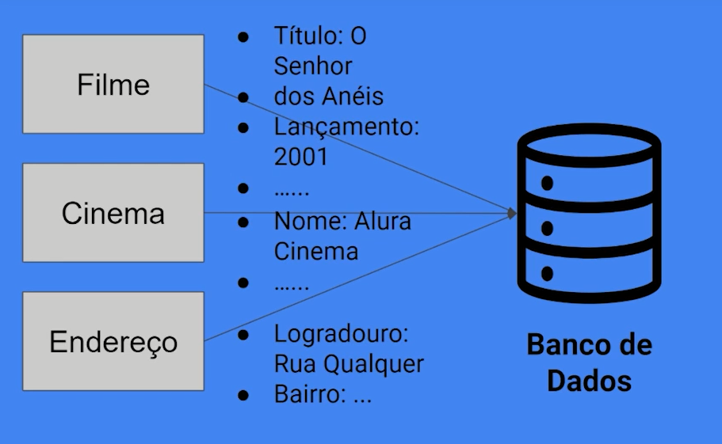
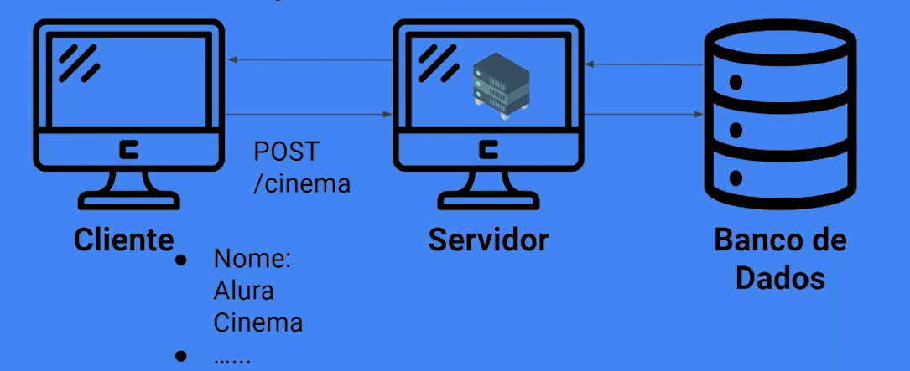

# Curso Alura .NET 6: relacionando entidades

## Aula 1: Crescendo o projeto

### Aula 1: Apresentação - Vídeo 1

Transcrição  
Olá! Sou o Daniel e serei seu instrutor nesse curso de relacionamento com entidades .NET e Entity.

Daniel Artine é uma pessoa de pele clara, olhos castanhos escuros e cabelos pretos curtos. Usa barba e bigode. Está com camiseta preta, sentado em uma cadeira preta. Ao fundo, há uma parede com iluminação azul.

Neste curso, começaremos exatamente de onde paramos no curso anterior, vamos crescer o nosso projeto. Além de fazer a inserção de filmes, vamos também inserir cinemas, endereços e sessões.

Nosso sistema ficará mais complexo e completo.

Agora precisaremos relacionar os conceitos. Como um filme vai se relacionar com o cinema dentro do nosso sistema? Ou como o endereço do cinema pode ser recuperado através de uma consulta?

Faremos criações e mudanças através de migrations. Já vimos esse conceito no curso anterior e veremos mais nesse curso, pois vamos gerar novas migrations para alterar nosso banco de dados.

E faremos a construção dos modelos:

- Cinema.cs
- Endereco.cs
- Filme.cs
- Sessão.cs

Faremos também os devidos mapeamentos com o AutoMapper, usando as mesmas ferramentas do curso anterior.

Pré-requisitos  
Antes de começarmos, é muito importante que você tenha feito os cursos de pré-requisito:

HTTP: Entendendo a web por baixo dos panos

.NET 6: criando uma web API

O nosso ponto de partida será o projeto final do curso anterior. Caso você tenha feito esse projeto e queira seguir com ele, certifique-se de que ele está bem alinhado com a forma como terminamos o curso anterior para evitar incompatibilidades.

Espero que você aproveite esse curso e saia com novos conhecimentos. No próximo vídeo começaremos com nosso conteúdo. Até lá!

### Aula 1: Projeto inicial do curso

Para acompanhar este curso, antes de iniciá-lo é importante você [baixar o projeto inicial](https://github.com/alura-cursos/dotnet-api-2/tree/Aula-Ini) neste link.

### Aula 1: Adicionando o Cinema - Vídeo 2

Transcrição  
Neste curso queremos tornar nosso projeto ainda maior, no conceito de termos diferentes entidades que vão se relacionar.

Para isso, o primeiro passo será criar uma dessas novas entidades. Começaremos nosso projeto exatamente de onde paramos no curso anterior, então já temos a entidade de filmes. Recomendo que você faça a partir desse projeto que está mais alinhado com o fluxo que usaremos aqui.

O primeiro passo será criar a classe Cinema e os nossos conceitos de cinema que, futuramente, vão se relacionar com a entidade de filmes.

Esse vídeo será uma espécie de revisão sobre criação de:

- Modelo
- DTOs
- Controlador
- Profile do AutoMapper

A princípio, vamos criar o modelo de Cinema. No painel do gerenciador de soluções clicaremos com o botão direto sobre a pasta "Models" e selecionaremos "Adicionar > Classe...". Criaremos uma nova classe chamada Cinema.cs.

Neste momento, o que precisamos no código de Cinema.cs é um identificador, dentro do escopo de public class Cinema vamos inserir [Key]. Com o Key selecionado usaremos o atalho "Alt + Enter" para importar o namespace necessário, que é o de DataAnnotations.

Teremos também a chave Required e criaremos um public int Id, que é o identificador dessa entidade dentro do banco de dados.

```csharp
using System.ComponentModel.DataAnnotations;
namespace FilmesApi.Models
{
    public class Cinema
    {
        [Key]
        [Required]
        public int Id { get; set; }
    }
}
```

Por enquanto, nosso atributo terá mais um item como Required, o nome, ou seja, qual o nome do cinema que será criado?

```csharp
using System.ComponentModel.DataAnnotations;
namespace FilmesApi.Models
{
    public class Cinema
    {
        [Key]
        [Required]
        public int Id { get; set; }
        [Required]
        public string Nome { get; set; }
    }
}
```

Para tornar o nosso modelo um pouco mais robusto vamos complementar o Required do campo de nome definindo uma mensagem de erro, informaremos que o nome é obrigatório:

```csharp
[Required(ErrorMessage = "O campo de nome é obrigatório.")]
```

Cinema.cs

```csharp
using System.ComponentModel.DataAnnotations;
namespace FilmesApi.Models
{
    public class Cinema
    {
        [Key]
        [Required]
        public int Id { get; set; }
        [Required(ErrorMessage = "O campo de nome é obrigatório.")]
        public string Nome { get; set; }
    }
}
```

DTOs  
Já criamos o modelo de Cinema, agora criaremos os DTOs.

No painel do gerenciador de soluções, clicaremos com o botão direto sobre a pasta "Dtos" e selecionaremos a opção "Adicionar > Classe...". Criaremos uma nova classe chamada CreateCinemaDto.cs.

Para criar um cinema qual é o campo que precisamos passar? Nosso usuário precisará se preocupar em passar ID porque ainda estamos criando esse recurso, então só precisamos nos preocupar com a criação de um nome. Vamos inserir as linhas que dizem respeito ao nome do cinema para o código do arquivo CreateCinemaDto, as linhas de [Required] e a de public string Nome.

```csharp
using System.ComponentModel.DataAnnotations;
namespace FilmesApi.Data.Dtos
{
    public class CreateCinemaDto
    {
        [Required(ErrorMessage = "O campo de nome é obrigatório.")]
        public string Nome { get; set; }
    }
}
```

Em seguida, criaremos também o DTO de leitura.

No painel do gerenciador de soluções, clicaremos com o botão direto sobre a pasta "Dtos" e selecionaremos a opção "Adicionar > Classe...". Criaremos uma nova classe chamada ReadCinemaDto. E dentro desse arquivo teremos esses dois parâmetros, duas propriedades que queremos retornar: ID e nome.

```csharp
namespace FilmesApi.Data.Dtos
{
    public class ReadCinemaDto
    {
        public int Id { get; set; }
        public string Nome { get; set; }
    }
}
```

Agora, podemos adicionar outra nova classe dentro da pasta "Dtos". Nomearemos essa classe de UpdateCinemaDto. O arquivo UpdateCinemaDto.cs terá o parâmetro de Nome. Vamos receber o ID através da URL e definiremos qual será o nome do cinema.

```csharp
using System.ComponentModel.DataAnnotations;
namespace FilmesApi.Data.Dtos
{
    public class UpdateCinemaDto
    {
        [Required(ErrorMessage = "O campo de nome é obrigatório.")]
        public string Nome { get; set; }
    }
}
```

Controller  
Já criamos o nosso modelo e os DTOs. Agora criaremos o controlador.

No painel do gerenciador de soluções, clicaremos com o botão direto sobre a pasta "Controllers" e selecionaremos a opção "Adicionar > Classe...". Nomearemos essa classe de CinemaController.

Lembrando que já estudamos esses procedimentos com mais profundidade no curso anterior. Caso você não esteja entendendo, é sinal de que você deve fazer o curso anterior que é pré-requisito para este curso.

Então, como o controlador é uma classe que terá um bloco de código um pouco maior, vou colar um código pronto que eu tenho aqui para seguirmos mais rapidamente. De qualquer forma, passaremos por ele para dar uma revisada.

CinemaController.cs

```csharp
using AutoMapper;
using FilmesApi.Data.Dtos;
using FilmesApi.Data;
using FilmesApi.Models;
using Microsoft.AspNetCore.Mvc;

namespace FilmesApi.Controllers
{
    [ApiController]
    [Route("[controller]")]

    public class CinemaController : ControllerBase
    {
        private FilmeContext _context;
        private IMapper _mapper;

        public CinemaController(FilmeContext context, IMapper mapper)
        {
            _context = context;
            _mapper = mapper;
        }

        [HttpPost]
        public IActionResult AdicionaCinema([FromBody] CreateCinemaDto cinemaDto)
        {
            Cinema cinema = _mapper.Map<Cinema>(cinemaDto);
            _context.Cinemas.Add(cinema);
            _context.SaveChanges();
            return CreatedAtAction(nameof(RecuperaCinemasPorId), new { Id = cinema.Id }, cinemaDto);
        }

        [HttpGet]
        public IEnumerable<ReadCinemaDto> RecuperaCinemas()
        {
            return _mapper.Map<List<ReadCinemaDto>>(_context.Cinemas.ToList());
        }

        [HttpGet("{id}")]
        public IActionResult RecuperaCinemasPorId(int id)
        {
            Cinema cinema = _context.Cinemas.FirstOrDefault(cinema => cinema.Id == id);
            if (cinema != null)
            {
                ReadCinemaDto cinemaDto = _mapper.Map<ReadCinemaDto>(cinema);
                return Ok(cinemaDto);
            }
            return NotFound();
        }

        [HttpPut("{id}")]
        public IActionResult AtualizaCinema(int id, [FromBody] UpdateCinemaDto cinemaDto)
        {
            Cinema cinema = _context.Cinemas.FirstOrDefault(cinema => cinema.Id == id);
            if (cinema == null)
            {
                return NotFound();
            }
            _mapper.Map(cinemaDto, cinema);
            _context.SaveChanges();
            return NoContent();
        }

        [HttpDelete("{id}")]
        public IActionResult DeletaCinema(int id)
        {
            Cinema cinema = _context.Cinemas.FirstOrDefault(cinema => cinema.Id == id);
            if (cinema == null)
            {
                return NotFound();
            }
            _context.Remove(cinema);
            _context.SaveChanges();
            return NoContent();
        }
    }
}
```

Neste código que colamos em CinemaController.cs, estamos definindo as anotações de controlador com [ApiController] e nossa rota para /cinema que é o nome do nosso controlador, [Route("[controller]")].

Em seguida, estendemos o ControllerBase, fizemos a injeção das dependências, que no caso serão FilmeContext e IMapper.

Depois, temos as operações básicas. O bloco do [HttpPost] para adicionar um cinema. Neste bloco de código nós recebemos o CreateCinemaDto, mapeamos ele para um Cinema, adicionamos ele no nosso context– Então, precisamos ainda criar o DbSet, que é nosso próximo passo – Salvamos as alterações com SaveChanges() e retornamos à rota em que ele foi criado.

Em seguida, no bloco de código de [HttpGet] usamos o RecuperaCinemas(), retornamos todos os cinemas que temos cadastrados.

E temos também o GET por ID, [HttpGet("{id}")]. Em que recebemos um ID e retornamos o cinema correspondente.

Para atualização inserimos o PUT por ID, [HttpPut("{id}")].

E, por fim, temos o bloco do DELETE por ID, [HttpDelete("{id}")].

Agora precisamos criar o DbSet. Para criá-lo vamos para o início do código de CinemaController e, segurando o "Ctrl", clicaremos em "FilmeContext" para acessar o arquivo FilmeContext.cs.

No FilmeContext.cs criaremos o DbSet de Cinema, DbSet`<Cinema>` Cinemas { get; set; }:

```csharp
public class FilmeContext : DbContext
{
    public FilmeContext(DbContextOptions<FilmeContext> opts)
        : base(opts)
    {

    }

    public DbSet<Filme> Filmes { get; set; }
    public DbSet<Cinema> Cinemas { get; set; }
}
```

Agora, um último detalhe. Tem um erro silencioso que aconteceria caso executássemos o nosso sistema. Porque ainda não ensinamos o AutoMapper a fazer esse mapeamento Cinema cinema = _mapper.Map<Cinema>(cinemaDto).

Para fazer isso, criaremos um profile. Na pasta "Profiles", vamos criar uma nova classe chamada CinemaProfile.

Profile  
Para ser efetivamente um profile precisamos estender da classe Profile e para criar o construtor usaremos o atalho de escrever "ctor" e pressionar "Tab" duas vezes. Usaremos o método CreateMap para criar o Map de CreateCinemaDto para Cinema e faremos a mesma coisa para os outros DTOs, na segunda linha, faremos de um Cinema para um ReadCinemaDto e, na terceira linha, de um UpdateCinemaDto para um Cinema.

```csharp
using AutoMapper;
using FilmesApi.Data.Dtos;
using FilmesApi.Models;

namespace FilmesApi.Profiles
{
    public class CinemaProfile : Profile
    {
        public CinemaProfile()
        {
            CreateMap<CreateCinemaDto, Cinema>();
            CreateMap<Cinema, ReadCinemaDto>();
            CreateMap<UpdateCinemaDto, Cinema>();
        }
    }
}
```

Agora, ao analisar o CinemaControllerestamos, a princípio, sem nenhum problema.

Então, neste vídeo o que fizemos foi uma breve revisão desses conceitos mais importantes que vimos anteriormente. Seguiremos aplicando-os em alguns cenários.

Agora temos um conceito de cinema. Conseguimos cadastrar cinemas e fazer operações com cinemas dentro do nosso sistema.

Agora precisamos pensar: como o Cinema vai se relacionar com outras classes dentro do nosso banco?

Te espero no próximo vídeo!

### Aula 1: Faça como eu fiz: expandindo o sistema

Chegou a hora de incrementar o sistema e criar o escopo de Cinema. A proposta desta atividade é criar as classes de modelo, DTOs, controlador e profile.

Você colocou isso em prática? Vamos colocar a mão na massa e verifique se ficou com alguma dúvida. Se sim, você pode clicar na “Opinião do instrutor” e conferir passo a passo como isso foi feito.

Opinião do instrutor

Para isso, primeiramente crie a classe Cinema dentro da pasta Models:

```csharp
public class Cinema
{
    [Key]
    [Required]
    public int Id { get; set; }
    [Required(ErrorMessage = "O campo de nome é obrigatório.")]
    public string Nome { get; set; }

}
```

Em seguida, precisamos criar na pasta Data/Dtos os DTOs de escrita, leitura e atualização, respectivamente:

```csharp
public class CreateCinemaDto
{
    [Required(ErrorMessage = "O campo de nome é obrigatório.")]
    public string Nome { get; set; }
}
```

```csharp
public class ReadCinemaDto
{
    public int Id { get; set; }
    public string Nome { get; set; }
}
```

```csharp
public class UpdateCinemaDto
    {
        [Required(ErrorMessage = "O campo de nome é obrigatório.")]
        public string Nome { get; set; }
    }
```

Para que possamos lidar com as requisições recebidas, precisamos criar o controlador com o comportamento padrão que vimos no curso anterior. Na pasta Controllers, crie o CinemaController:

```csharp
[ApiController]
    [Route("[controller]")]
    public class CinemaController : ControllerBase
    {
        private FilmeContext _context;
        private IMapper _mapper;

        public CinemaController(FilmeContext context, IMapper mapper)
        {
            _context = context;
            _mapper = mapper;
        }

        [HttpPost]
        public IActionResult AdicionaCinema([FromBody] CreateCinemaDto cinemaDto)
        {
            Cinema cinema = _mapper.Map<Cinema>(cinemaDto);
            _context.Cinemas.Add(cinema);
            _context.SaveChanges();
            return CreatedAtAction(nameof(RecuperaCinemasPorId), new { Id = cinema.Id }, cinemaDto);
        }

        [HttpGet]
        public IEnumerable<ReadCinemaDto> RecuperaCinemas()
        {
            return _mapper.Map<List<ReadCinemaDto>>(_context.Cinemas.ToList());
        }

        [HttpGet("{id}")]
        public IActionResult RecuperaCinemasPorId(int id)
        {
            Cinema cinema = _context.Cinemas.FirstOrDefault(cinema => cinema.Id == id);
            if (cinema != null)
            {
                ReadCinemaDto cinemaDto = _mapper.Map<ReadCinemaDto>(cinema);
                return Ok(cinemaDto);
            }
            return NotFound();
        }

        [HttpPut("{id}")]
        public IActionResult AtualizaCinema(int id, [FromBody] UpdateCinemaDto cinemaDto)
        {
            Cinema cinema = _context.Cinemas.FirstOrDefault(cinema => cinema.Id == id);
            if (cinema == null)
            {
                return NotFound();
            }
            _mapper.Map(cinemaDto, cinema);
            _context.SaveChanges();
            return NoContent();
        }

        [HttpDelete("{id}")]
        public IActionResult DeletaCinema(int id)
        {
            Cinema cinema = _context.Cinemas.FirstOrDefault(cinema => cinema.Id == id);
            if (cinema == null)
            {
                return NotFound();
            }
            _context.Remove(cinema);
            _context.SaveChanges();
            return NoContent();
        }
    }
```

Por fim, para que nosso modelo possa ser convertido para um DTO e vice-versa, precisamos de nosso AutoMapper configurado. Dentro da pasta Profiles, crie o CinemaProfile:

```csharp
public class CinemaProfile : Profile
{
    public CinemaProfile()
    {
        CreateMap<CreateCinemaDto, Cinema>();
        CreateMap<Cinema, ReadCinemaDto>();
        CreateMap<UpdateCinemaDto, Cinema>();
    }
}
```

### Aula 1:  Convertendo tipos - Exercício

A fim de crescer nosso projeto, criamos o modelo de Cinema. Para facilitar a conversão entre os diferentes tipos de DTO e nossos modelos, utilizamos a biblioteca AutoMapper. Por meio de uma sintaxe determinada podemos converter um objeto do tipo CreateCinemaDto para Cinema.

Assinale a alternativa que corresponde a essa sintaxe.

Resposta:
_mapper.Map`<Cinema>`(createCinemaDto);

> Através dessa sintaxe faremos a conversão desejada.

### Aula 1: Apresentando o problema - Vídeo 3

Transcrição  
Agora vamos discutir um pouco de teoria para entender qual é o problema a ser resolvido.

Qual situação queremos melhorar?  
Temos, por enquanto, a classe Filme, a classe Cinema com seus respectivos DTOs, controladores e profile. Ainda não temos a classe Endereço, mas em breve vamos criá-la.



O ponto aqui é o seguinte: nós temos algumas maneiras de representar esses dados. Podemos ter um filme com título "O senhor dos Anéis" e ano de lançamento "2001"; um cinema com nome "Alura Cinema", por enquanto é o único campo que temos; um endereço com dados de logradouro e bairro.

Temos maneiras de representar esses dados e sabemos que jogaremos tudo isso dentro do nosso banco de dados. Mas onde queremos chegar?

No momento em que fazemos alguma operação como, por exemplo, cadastrar um cinema ou pegar uma informação desse cinema, na visão do usuário final podemos pensar na pergunta: eu sei que o cinema existe, mas qual é o endereço desse cinema?

Anteriormente, vimos que a ideia é relacionar, por exemplo, um cinema com um filme, mas temos que pensar também em conceitos mais simples. Por exemplo: cinema e endereço.

Poderíamos criar uma coluna de endereço para cada cinema e colocar essa informação lá.

É uma opção válida, mas vamos pensar que podemos querer usar esse mesmo endereço em outros campos, outras informações que tenham esse mesmo endereço e queremos armazenar endereço para diversos tipos de informações diferentes.

Então, faz sentido ter essa informação em uma tabela.

A partir de agora a ideia é que tenhamos um cinema e tenhamos também uma relação com o endereço, que ainda vamos criar.

Diagrama representando a conexão entre tabela Cinema e tabela Endereço no banco de dados. Cinema, Endereço e Banco de Dados conectados por uma seta em formato triangular.

Então, esse endereço vai ter informações como logradouro e bairro, e o cinema terá esse endereço.

Como isso funcionará dentro da visão de cliente, servidor e banco de dados?

No momento em que fizermos uma operação de recuperar um cinema por ID, GET /cinema/{id}, vamos trazer a informação desse cinema e, junto com essa informação, teremos também qual é o endereço desse cinema.

Então, a partir desse momento conseguimos fazer essa operação. Precisamos ver como fazer esse relacionamento entre a tabela de cinema e a tabela de endereço que estão no nosso banco de dados.

Mas, como vamos trazer essa informação? Como saberemos que o endereço do cinema está correto? Como juntamos essas informações? Responderemos isso em breve.

Mas temos que resolver algumas perguntas antes.

- No momento em que formos criar um cinema, faz sentido um cinema existir sem o endereço?
- E o endereço existir sem um cinema?
- Como o Entity vai relacionar as entidades?


Respondendo à primeira questão, pensando de maneira física: não. Se um cinema está em algum lugar, ele precisa ter um endereço.

E um endereço pode existir sem um cinema? Pode. Note que estamos criando uma relação de dependência.

Então qual é a classe que tem mais importância nesse cenário? Seria o endereço.

Adiante vamos entender como criar todo o conceito de endereço, que será parecido com o que fizemos com cinema. Mas como criaremos e relacionaremos os endereços aos cinemas.

### Aula 1: Pacotes de banco - Exercício

Anteriormente, vimos que teremos a necessidade de relacionar diferentes entidades em nosso sistema, por exemplo, Cinema e Endereço. Com isso, conseguiremos dar mais informação ao usuário a partir de dados mais complexos. Alguns pacotes serão necessários para estabelecer relações entre entidades em um banco de dados.

Marque as opções com estes pacotes.

Respostas:  
Microsoft.EntityFrameworkCore.Tools

> Esse é um dos pacotes necessários.

Microsoft.EntityFrameworkCore

> Esse é um dos pacotes necessários.

### Aula 1: O que aprendemos?

Nessa aula aprendemos:

- Conteúdo de sedimentação de como criar, ler, atualizar e remover recursos no sistema.
- O .NET por si só é capaz de gerenciar múltiplos recursos e endpoints através de uma API.
- O Entity provê a capacidade de relacionar entidades dentro de um banco de dados.
- Através do Entity conseguimos abstrair questões de dependências entre entidades a nível de banco.

## Aula 2: Relacionamento 1:1

### Aula 2: Adicionando o Endereço - Vídeo 1

Transcrição  
Agora vamos criar todo escopo de um endereço dentro do nosso sistema. Como faremos isso? Repetiremos o passo a passo que fizemos para o nosso cinema.

O primeiro passo é criarmos o modelo, para isso, do lado direito em "Gerenciador de soluções" com o cursor em "Models" clicamos com o botão direito do mouse. Será exibido um menu e nele clicamos em "Adicionar > Classe".

No pop-up seguinte, na parte inferior esquerda, temos o campo "Nome" e nele digitaremos "Endereco". Em seguida, à direita, selecionamos o botão "Adicionar". Seremos redirecionados para o arquivo "Endereco", localizado em "FilmesApi > Models".

Endereco

```csharp
namespace FilmesApi.Models
{
    public class Endereco
    {
    }
}
```

Vamos adicionar o endereço com seus respectivos campos. Como vimos anteriormente, precisamos definir as propriedades que desejamos mapear para o banco de dados. Colocaremos dentro da classe entre colchetes a nossa key e o required, logo após teclamos "Alt + Enter" para importarmos a anotação.

Endereco

```csharp
using System.ComponentModel.DataAnnotations;

namespace FilmesApi.Models
{
    public class Endereco
    {
        [Key]
        [Required]
    }
}
```

Na linha seguinte, incluímos a propriedade de id, depois o logradouro e o número do endereço.

Endereco

```csharp
using System.ComponentModel.DataAnnotations;

namespace FilmesApi.Models
{
    public class Endereco
    {
        [Key]
        [Required]
        public int Id { get; set; }
        public string Logradouro { get; set; }
                public int Numero { get; set; }
    }
}
```

Podemos pensar em inserir um required para logradouro e para o número, fique à vontade para aplicar as restrições conforme achar melhor. Porém, neste caso não estamos nos preocupando tanto com isso, por isso deixaremos sem o required, seguiremos em um fluxo mais rápido. Assim, criamos o nosso endereço.

Agora vamos criar os nossos DTOs. Para tal, com o cursor sobre "Dtos" do lado direito, selecionamos as opções "Adicionar > Classe". Nomearemos o arquivo de "CreateEnderecoDto" e logo após clicamos no botão "Adicionar", seremos redirecionados para o arquivo "CreateEnderecoDto", localizado em "Data > Dtos".

CreateEnderecoDto

```csharp
namespace FilmesApi.Data.Dtos
{
    public class CreateEnderecoDto
    {
    }
}
```

Para criar um endereço de fato, precisamos passar o nosso logradouro e o número - lembrando que não estamos nos preocupando com a obrigatoriedade, mas vamos inserir esses parâmetros para podermos criar.

CreateEnderecoDto

```csharp
namespace FilmesApi.Data.Dtos
{
    public class CreateEnderecoDto
    {
        public string Logradouro { get; set; }
        public int Numero { get; set; }
    }
}
```

Pronto! Agora, vamos criar o nosso Dto de leitura do endereço. Novamente, com o cursor sobre "Dtos" clicamos nas opções "Adicionar > Classe", nomearemos o arquivo de "ReadEnderecoDto" e depois selecionamos o botão "Adicionar". Seremos redirecionados para o arquivo:

ReadEnderecoDto

```csharp
namespace FilmesApi.Data.Dtos
{

    public class ReadEnderecoDto
    {
    }
}
```

No arquivo "Endereco" copiaremos as três linhas referentes aos três campos: id, logradouro e número. Em seguida, colamos dentro da classe ReadEnderecoDto no arquivo "ReadEnderecoDto"

ReadEnderecoDto

```csharp
namespace FilmesApi.Data.Dtos
{
    public class ReadEnderecoDto
    {
        public int Id { get; set; }
        public string Logradouro { get; set; }
        public int Numero { get; set; }
    }
}
```

Por fim, vamos criar o "UpdateEnderecoDto" seguindo o mesmo passo a passo mencionado anteriormente para a criação de arquivos Dtos.

UpdateEnderecoDto

```csharp
namespace FilmesApi.Data.Dtos
{

    public class UpdateEnderecoDto
    {
    }
}
```

Para podermos atualizar o endereço, passaremos as mesmas informações do arquivo "CreateEnderecoDto", sem o id.

UpdateEnderecoDto

```csharp
namespace FilmesApi.Data.Dtos
{
    public class UpdateEnderecoDto
    {
        public string Logradouro { get; set; }
        public int Numero { get; set; }
    }
}
```

Com isso, criamos os Dtos. Agora, vamos criar os nossos controladores. Com o mouse sobre a pasta "Controllers" do lado direito, em "Gerenciador de soluções", clicamos com o botão direito e escolhemos as opções "Adicionar > Classe". No campo "Nome" do pop-up seguinte, digitamos "EnderecoController" e depois clicamos no botão "Adicionar".

EnderecoController

```csharp
namespace FilmesApi.Controllers
{
         public class EnderecoController
         {
         }
}
```

Como já vimos anteriormente, colaremos o seguinte script dentro da classe "EnderecoController", para não perdermos tempo com conceitos que já aprendemos.

EnderecoController

```csharp
using AutoMapper;
using FilmesApi.Data.Dtos;
using FilmesApi.Data;
using FilmesApi.Models;
using Microsoft.AspNetCore.Mvc;

namespace FilmesApi.Controllers
{
    [ApiController]
    [Route("[controller]")]
    public class EnderecoController : ControllerBase
    {
        private FilmeContext _context;
        private IMapper _mapper;

        public EnderecoController(FilmeContext context, IMapper mapper)
        {
            _context = context;
            _mapper = mapper;
        }

        [HttpPost]
        public IActionResult AdicionaEndereco([FromBody] CreateEnderecoDto enderecoDto)
        {
            Endereco endereco = _mapper.Map<Endereco>(enderecoDto);
            _context.Enderecos.Add(endereco);
            _context.SaveChanges();
            return CreatedAtAction(nameof(RecuperaEnderecosPorId), new { Id = endereco.Id }, endereco);
        }

        [HttpGet]
        public IEnumerable<ReadEnderecoDto> RecuperaEnderecos()
        {
            return _mapper.Map<List<ReadEnderecoDto>>(_context.Enderecos);
        }

        [HttpGet("{id}")]
        public IActionResult RecuperaEnderecosPorId(int id)
        {
            Endereco endereco = _context.Enderecos.FirstOrDefault(endereco => endereco.Id == id);
            if (endereco != null)
            {
                ReadEnderecoDto enderecoDto = _mapper.Map<ReadEnderecoDto>(endereco);

                return Ok(enderecoDto);
            }
            return NotFound();
        }

        [HttpPut("{id}")]
        public IActionResult AtualizaEndereco(int id, [FromBody] UpdateEnderecoDto enderecoDto)
        {
            Endereco endereco = _context.Enderecos.FirstOrDefault(endereco => endereco.Id == id);
            if (endereco == null)
            {
                return NotFound();
            }
            _mapper.Map(enderecoDto, endereco);
            _context.SaveChanges();
            return NoContent();
        }


        [HttpDelete("{id}")]
        public IActionResult DeletaEndereco(int id)
        {
            Endereco endereco = _context.Enderecos.FirstOrDefault(endereco => endereco.Id == id);
            if (endereco == null)
            {
                return NotFound();
            }
            _context.Remove(endereco);
            _context.SaveChanges();
            return NoContent();
        }

    }
}
```

Geramos de forma análoga aos nossos controladores anteriores, com as anotações "ApiController" e "Route["controller"]", com o construtor com as injeções de dependências necessárias para este caso:

Construtor e dependências do arquivo "EnderecoController"

```csharp
//código omitido
{
        private FilmeContext _context;
        private IMapper _mapper;

        public EnderecoController(FilmeContext context, IMapper mapper)
        {
            _context = context;
            _mapper = mapper;
        }
//código omitido
```

Temos os métodos de adicionar, recuperar, atualizar e remover o endereço. Observe que no método DeletaEndereco a palavra "Enderecos" está com um sublinhado na cor vermelha. Isso significa que precisamos criar em "FilmeContext" o nosso Dbset de endereço, localizado em "Data".

FilmeContext

```csharp
//código omitido

public DbSet<Endereco> Enderecos { get; set; }

//código omitido
```

Até o momento temos quase toda a parte de endereço criada, precisamos finalizar com o nosso profile. Com o mouse sobre a pasta "Profiles", clicamos com o botão direito e escolhemos as opções "Adicionar > Classe", nomearemos o arquivo de "EnderecoProfile". Logo após, selecionamos o botão "Adicionar".

EnderecoProfile

```csharp
namespace FilmesApi.Profiles
{
    public class EnderecoProfile 
    {
    }
}
```

Esse arquivo vai estender da nossa classe de profile (do automapper), por isso, incluiremos dois pontos profile (": Profile"), após o nome da classe.

EnderecoProfile

```csharp
namespace FilmesApi.Profiles
{
    public class EnderecoProfile : Profile
    {
    }
}
```

A classe "profile" está sublinhada na cor vermelha, teclamos "Alt + Enter" para importar e escolhemos a opção "using AutoMapper;".

EnderecoProfile

```csharp
using AutoMapper;

namespace FilmesApi.Profiles
{
    public class EnderecoProfile : Profile
    {
    }
}
```

Logo após, dentro da classe, digitamos "ctor" e clicamos na tecla "tab" duas vezes. Será gerado de forma automática o public EnderecoProfile(){}.

EnderecoProfile

```csharp
using AutoMapper;

namespace FilmesApi.Profiles
{
    public class EnderecoProfile : Profile
    {

        public EnderecoProfile()
        {
        }
    }
}
```

Estamos fazendo mais rápido, pois já aprendemos isso de forma mais detalhada em vídeos passados. Dentro de "EnderecoProfile" faremos o create map de "CreateEnderecoDto" para "Endereco". Logo após, de "Endereco" para "ReadEnderecoDto" e de "UpdateEnderecoDto" para "Endereco".

EnderecoProfile

```csharp
using AutoMapper;
using FilmesApi.Data.Dtos;
using FilmesApi.Models;

namespace FilmesApi.Profiles
{
    public class EnderecoProfile : Profile
    {
        public EnderecoProfile()
        {
            CreateMap<CreateEnderecoDto, Endereco>();
            CreateMap<Endereco, ReadEnderecoDto>();
            CreateMap<UpdateEnderecoDto, Endereco>();
        }
    }
}
```

Ou seja, quando estamos criando mapeamos do Dto para o endereço, quando buscamos passamos do endereço para o read, e para atualizar é a mesma lógica do create.

Desse modo, criamos toda a nossa parte de endereço. O que temos dentro do nosso sistema após isso? Filmes, endereço e cinemas. Conseguimos cadastrar esses três recursos com as operações básicas de criar, ler, atualizar e remover.

Na sequência, vamos fazer a primeira interação entre um Cinema e um Endereço. Te espero na próxima aula!

### Aula 2: Projeto da aula anterior

Caso queira, você pode [baixar o projeto do curso](https://github.com/alura-cursos/dotnet-api-2/tree/Aula-1) no ponto em que paramos na aula anterior.

### Aula 2:  Relacionando Endereço e Cinema - Vídeo 2

Transcrição  
Na aula anterior nos fizemos algumas perguntas:



Perguntas

- Um Cinema pode existir sem um endereço? E um endereço, pode existir sem um Cinema?
Como o Entity irá relacionar as entidades?
- Precisamos responder essas perguntas! No momento em que cadastrarmos o Cinema desejamos lidar com esses diferentes cenários. Mas vamos entender por partes o que desejamos alcançar.

Diagrama representando a conexão entre tabela Cinema e tabela Endereço no banco de dados. Cinema, Endereço e Banco de Dados conectados por uma seta em formato triangular.

A princípio temos uma tabela Cinema e outra tabela Endereço. O que estamos representando? Estamos informando que um Cinema e um Endereço se relacionam. Como? No nosso sistema, um cinema possui somente um endereço. Logo, um cinema físico não pode estar em vários endereços simultaneamente, com isso, o endereço conterá apenas um cinema.

No exemplo mencionado anteriormente, que o endereço pode conter um estoque ou loja, conseguimos aplicar essa regra da mesma forma, isso porque o endereço estaria se relacionando com outras entidades. Logo, com o Cinema é uma relação um para um, mas podemos incluir outras relações com outras entidades.

Desse modo, o tipo de relacionamento entre Cinema e Endereço é de um para um, representado pela nomenclatura 1:1. Um cinema possuirá somente um endereço, e um endereço será relacionado apenas a um cinema. Como isso vai funcionar?

Se tivermos os cinemas "A", "B" e "C" com os endereços "A", "B" e "C" também, caso o Cinema A tenha alguma relação com o Endereço A, possuirá apenas este endereço. Se cadastrarmos o Cinema A com o Endereço B, seria uma relação somente com esse endereço e assim por diante.

Temos esses diferentes cenários, em que estamos relacionando um cinema com um endereço. Mas ainda fica uma pergunta: como o Cinema A sabe com qual endereço está se relacionando? Qual campo de endereço que podemos usar para identificarmos o endereço que estamos nos referindo? A resposta é o nosso ID.

Com isso, dentro do nosso Cinema A precisamos incluir de alguma forma a informação que faz menção ao endereço desejado. E dentro do Cinema A teremos uma coluna que vai conter o endereço que esse cinema possui. Aplicaremos isso agora.

Para isso, precisamos informar ao entity que a partir desse momento vamos criar para o nosso cinema uma nova propriedade que vai possuir o id do endereço.

Do lado direito do projeto, clicamos no arquivo "Cinema.cs", localizado em "Models". Nele, incluiremos "EnderecoId" após o campo "Nome".

Cinema.cs

```csharp
//código omitido
public int EnderecoId { get; set; }
```

Na linha seguinte, informamos ao entity que o Cinema e o Endereço possuem uma relação de 1:1. Para o entity entender isso, precisamos explicitar dentro de "Cinema" que ele terá uma propriedade virtual que será do tipo endereço nomeado "Endereco".

Cinema.cs

```csharp
//código omitido
public int EnderecoId { get; set; }
public virtual Endereco Endereco { get; set; }
```

Desse modo, o arquivo completo fica:

Cinema.cs

```csharp
using System.ComponentModel.DataAnnotations;

namespace FilmesApi.Models
{
    public class Cinema
    {
        [Key]
        [Required]
        public int Id { get; set; }
        [Required(ErrorMessage = "O campo de nome é obrigatório.")]
        public string Nome { get; set; }
        public int EnderecoId { get; set; }
        public virtual Endereco Endereco { get; set; }

    }
}
```

Com isso, estamos comunicando ao entity que essa entidade "Cinema" possui uma relação de somente um endereço, e estamos explicitando isso na última linha do arquivo que acabamos de incluir. Precisamos aplicar a mesma lógica em "Endereco.cs".

No arquivo "Endereco.cs" digitamos public virtual Cinema Cinema com get e set na última linha, após o campo de número.

Endereco.cs

```csharp
using System.ComponentModel.DataAnnotations;

namespace FilmesApi.Models
{
    public class Endereco
    {
        [Key]
        [Required]
        public int Id { get; set; }
        public string Logradouro { get; set; }
        public int Numero { get; set; }
        public virtual Cinema Cinema { get; set; }
    }
}
```

Não usamos o Id do cinema dentro de endereço porque estamos imaginando da seguinte forma: qual a relação de dependência entre essas duas entidades? Vamos entender associando com situações fora do escopo de cinema e filmes.

Uma instituição ou empresa pode existir (fisicamente) sem possui um endereço? A princípio, não. Para uma empresa existir fisicamente ela precisa ter um endereço, mas caso não tenha nada no lugar indicado o endereço continua existindo.

Por exemplo, caso o cinema não exista no endereço indicado, o logradouro e o número continuam existindo. Portanto, temos uma relação de dependência: para que o cinema exista, é necessário ter um endereço prévio, isto é, no momento de cadastrarmos um cinema já precisamos ter o endereço.

E é justamente isso que estamos explicitando no arquivo "Cinema.cs" a partir da linha 12.

Parte selecionada pelo instrutor do arquivo "Cinema.cs"

```csharp
//código omitido

        public int EnderecoId { get; set; }
```

Isto é, para que um cinema seja criado no banco de dados ele deve receber o Id do endereço desse cinema. Agora, no momento de criarmos esse cinema dentro do banco de dados, precisamos receber como parâmetro através do Dto o Id do endereço no controlador. Passaremos isso via parâmetro.

Para isso, vamos ao arquivo "CreateCinemaDto" em "Dtos", e na última linha incluímos public int EnderecoId { get; set; }.

CreateCinemaDto

```csharp
using System.ComponentModel.DataAnnotations;

namespace FilmesApi.Data.Dtos
{
    public class CreateCinemaDto
    {
        [Required(ErrorMessage = "O campo de nome é obrigatório.")]
        public string Nome { get; set; }
        public int EnderecoId { get; set; }
    }
}
```

Por fim, precisamos que no momento de retornarmos a informação de ReadCinemaDto possamos colocar a propriedade que será "ReadEnderecoDto" que chamaremos pelo mesmo nome, sendo "ReadEnderecoDto".

ReadCinemaDto

```csharp
namespace FilmesApi.Data.Dtos
{
    public class ReadCinemaDto
    {
        public int Id { get; set; }
        public string Nome { get; set; }
        public ReadEnderecoDto ReadEnderecoDto { get; set; }
    }
}
```

Com isso, no momento de fazermos o parse para o nosso "ReadCinemaDto" teremos a informação de "ReadEnderecoDto".

Para gerarmos essa mudança, clicamos no menu superior em "Ferramentas" e depois nas opções "Gerenciador de Pacotes do NuGet > Console do Gerenciador de Pacotes". Na parte inferior será exibido o console, nele rodaremos o comando Add-Migration "Cinema e Endereco".

```csharp
Add-Migration "Cinema e Endereco"
```

Após apertarmos a tecla "Enter", o build vai começar e a migration será gerada. Como retorno, obtemos:

Build started…

Build succeeded.

Microsoft.EntityFrameworkCore.Infraestructure[10403]

Entity Framework Core 6.0.10 initialized 'FilmeContext' using provider 'Pomelo.EntityFrameworkCore.MySql:6.0.2' with options: ServerVersion 5.6.26-mysql

To undo this action, use Remove-Migration

Vamos analisar o arquivo gerado chamado "20221218222033_Cinema e Endereco.cs", em "Migrations".

20221218222033_Cinema e Endereco.cs

Nesse arquivo, é gerada a tabela de endereços com as colunas "Id", "Logradouro" e "Numero" sendo o que definimos para o endereço. Logo após, criamos o Id como chave primária.

Parte do código selecionada pelo instrutor no arquivo "20221218222033_Cinema e Endereco.cs".

```csharp
// código omitido
namespace FilmesApi.Migrations
{
    public partial class CinemaeEndereco : Migration
    {
        protected override void Up(MigrationBuilder migrationBuilder)
        {
            migrationBuilder.CreateTable(
                name: "Enderecos",
                columns: table => new
                {
                    Id = table.Column<int>(type: "int", nullable: false)
                        .Annotation("MySql:ValueGenerationStrategy", MySqlValueGenerationStrategy.IdentityColumn),
                    Logradouro = table.Column<string>(type: "longtext", nullable: false)
                        .Annotation("MySql:CharSet", "utf8mb4"),
                    Numero = table.Column<int>(type: "int", nullable: false)
                },
                constraints: table =>
                {
                    table.PrimaryKey("PK_Enderecos", x => x.Id);
                })
                .Annotation("MySql:CharSet", "utf8mb4");

// código omitido
```

Na tabela "Cinemas", temos os campos "Id", "Nome" e "EnderecoId". A nossa chave primária é o Id do cinema e temos uma chave estrangeira ("Foreign Key"). Isso significa que essa chave faz menção a outra tabela, ele informa que o "EnderecoId" referência a tabela de endereços através da coluna "Id".

20221218222033_Cinema e Endereco.cs

```csharp
// código omitido
  migrationBuilder.CreateTable(
                name: "Cinemas",
                columns: table => new
                {
                    Id = table.Column<int>(type: "int", nullable: false)
                        .Annotation("MySql:ValueGenerationStrategy", MySqlValueGenerationStrategy.IdentityColumn),
                    Nome = table.Column<string>(type: "longtext", nullable: false)
                        .Annotation("MySql:CharSet", "utf8mb4"),
                    EnderecoId = table.Column<int>(type: "int", nullable: false)
                },
                constraints: table =>
                {
                    table.PrimaryKey("PK_Cinemas", x => x.Id);
                    table.ForeignKey(
                        name: "FK_Cinemas_Enderecos_EnderecoId",
                        column: x => x.EnderecoId,
                        principalTable: "Enderecos",
                        principalColumn: "Id",
                        onDelete: ReferentialAction.Cascade);
                })
                .Annotation("MySql:CharSet", "utf8mb4");

// código omitido
```

Mas como o entity conseguiu deduzir isso? Usando o nome. No arquivo "Endereco.cs" definimos a propriedade "Id" e no arquivo "Cinema.cs" passamos public int EnderecoId, sendo "Endereco" o nome da nossa tabela com o sufixo Id. Com isso, o entity fez essa inferência.

Voltando ao arquivo gerado na pasta "Migrations", ele cria o campo endereço id com a chave estrangeira do nosso cinema em relação ao endereço. Descendo um pouco mais o código, temos o seguinte trecho:

20221218222033_Cinema e Endereco.cs

```csharp
// código omitido
migrationBuilder.CreateIndex(
    name: "IX_Cinemas_EnderecoId",
    table: "Cinemas",
    column: "EnderecoId",
    unique: true);
// código omitido
```

Nesse trecho é indicado a unidade que definimos, no campo "unique". Agora, no console, executaremos o comando update-Database para criarmos o banco de dados.

```csharp
update-Database
```

No caso do instrutor, ele não estava com o banco de dados criado. E no momento de executar o comando (já tínhamos removido anteriormente com o comando drop database filme;), no console do MySQL rodaremos o comando use filme;.

```csharp
use filme;
```

Usamos "filme" porque definimos no campo "FilmeConnection" do arquivo "appsettings.json".

appsettings.json

```Json
{
  "Logging": {
    "LogLevel": {
      "Default": "Information",
      "Microsoft.AspNetCore": "Warning"
    }
  },
  "AllowedHosts": "*",
  "ConnectionStrings": {
    "FilmeConnection": "server=localhost;database=filme;user=root;password=root"
  }
}
```

Aprendemos em cursos anteriores como efetuar essa conexão com o banco de dados.

Após rodarmos o comando use filme;, executamos show tables; para visualizarmos as tabelas.

```csharp
show tables;
```

Como retorno, obtemos:

- Tables_in_filme
- efmigrationshi…
- cinemas
- enderecos
- filmes

Temos as tabelas "cinemas", "enderecos" e "filmes". Se rodarmos describe cinemas; é exibida a tabela com as suas respectivas colunas, tipo, se é nulo, o tipo de chave (primária, única ou estrangeira), uma coluna "Default" e uma "Extra".

```csharp
describe cinemas;
```

Como retorno, teremos:

|Field|Type|Null|Key|Default|Extra|
|---|---|---|---|---|---|
|Id|int(11)|NO|PRI||auto_increment|
|Nome|longtext|NO||||
|EnderecoId|int(11)|NO|UNI|||

Agora, se rodarmos describe enderecos; também temos as informações de Id, logradouro e número.

```csharp
describe enderecos;
```

Como retorno, temos:

|Field|Type|Null|Key|Default|Extra|
|---|---|---|---|---|---|
|Id|int(11)|NO|PRI||auto_increment|
|Nome|longtext|NO||||
|EnderecoId|int(11)|NO|UNI|||

Desse modo, estamos criando o vínculo de 1:1 entre a entidade Cinema e um Endereço.

Na sequência, vamos testar o nosso sistema e veremos algumas curiosidades acerca da propriedade virtual que criamos para cada modelo.

Te espero na próxima aula!

### Aula 2: Faça como eu fiz: modificando os modelos

Chegou a hora de estabelecer o relacionamento 1:1 entre um Cinema e um Endereco. Nossa intenção com essa prática é modificar os modelos atuais a fim de informar o relacionamento ao Entity.

Você colocou isso em prática? Vamos colocar a mão na massa e verifique se ficou com alguma dúvida. Se sim, você pode clicar na “Opinião do instrutor” e conferir passo a passo como isso foi feito.

Opinião do instrutor

Para isso, primeiramente altere a classe Cinema para:

```csharp
public class Cinema
    {
        [Key]
        [Required]
        public int Id { get; set; }
        [Required(ErrorMessage = "O campo de nome é obrigatório.")]
        public string Nome { get; set; }
        public int EnderecoId { get; set; }
        public virtual Endereco Endereco { get; set; }
    }
```

Em seguida, será necessário fazer o processo de maneira parecida na classe Endereco:

```csharp
public class Endereco
{
    [Key]
    [Required]
    public int Id { get; set; }
    public string Logradouro { get; set; }
    public int Numero { get; set; }
    public virtual Cinema Cinema { get; set; }
}
```

Para criarmos um Cinema agora será necessário informar um EnderecoId no momento de criação. Para isso, altere a classe CreateCinemaDto:

```csharp
public class CreateCinemaDto
    {
        [Required(ErrorMessage = "O campo de nome é obrigatório.")]
        public string Nome { get; set; }
        public int EnderecoId { get; set; }
    }
```

Para leitura, também modificaremos nosso ReadCinemaDto:

```csharp
public class ReadCinemaDto
    {
        public int Id { get; set; }
        public string Nome { get; set; }
        public ReadEnderecoDto Endereco { get; set; }
    }
```

Por fim, não esqueça de gerar e aplicar as migrations com os comandos Add-Migrations e Update-Database.

### Aula 2: Cadastrando recursos - Vídeo 3

Transcrição  
Rodaremos a nossa aplicação, para isso clicamos no botão com o ícone de play "▶" no menu superior referente ao "Iniciar Sem Depurar" ou podemos usar o atalho "Ctrl + F5". Observe que ele está escutando na porta 7106.

Agora, usaremos o Postman para enviarmos uma requisição post para cinema. Na aba com o método post, temos o seguinte caminho:

```csharp
https://localhost:7106/cinema
```

Copiamos esse caminho e abriremos mais uma aba no Postman com o método post, só que ao invés de "cinema" após a barra, colocaremos "endereco".

```csharp
https://localhost:7106/endereco
```

Vimos que para criarmos um cinema precisamos previamente já ter cadastrado um endereço. Por isso, na aba de cinema, clicamos em "Body" no menu após o caminho, depois marcamos a opção "raw" e depois selecionamos "Text". Neste, escolhemos o formato "JSON". Faremos a mesma coisa para a aba de endereço.

O que precisamos para criar um endereço? Logradouro e número. Por isso, digitaremos as seguintes informações em "Body":

Body da aba de endereço

```csharp
{
"Logradouro" : "Rua das Couves",
"Numero" : 300
}
```

Logo após, clicamos no botão "Send". Observe que gerou o status 201 Created com a seguinte estrutura no body do retorno:

```csharp
{
“id”: 1,
“logradouro”: “Rua das Couves”,
“numero”: 300,
“cinema”: null
}
```

O campo "cinema" está como nulo, isso significa que criamos essa informação que não contém nenhum cinema dentro do sistema. Agora, vamos tentar criar o cinema, para isso voltamos para a aba de cinema no Postman e em "Body", digitamos:

```csharp
{
"Nome" : "Alura Cinemas",
"EnderecoId" : 1
}
```

No campo "EnderecoId" colocamos o número de Id que acabou de ser gerado, no caso o Id de número 1. Em seguida, podemos clicar no botão azul "Send". Observe que foi devolvido o status 201 created.

Agora tentaremos realizar uma leitura. Para isso, abrimos mais uma aba no Postman usando o método get com o endereço `https://localhost:7106/cinema`. Ou seja, estamos buscando todos os cinemas cadastrados no banco de dados.

Após clicarmos no botão "Send", obtemos:

```csharp
{
“id”: 1,
“nome”: “Alura Cinemas”,
“readEnderecoDto”: null
}
```

Vamos entender mais adiante o motivo do campo "readEnderecoDto" estar nulo. Antes, desejamos testar outra coisa.

Na aba de criação do cinema (método post), vamos alterar o campo "Nome" adicionando a palavra "Outro" no final e manteremos o endereço Id.

```csharp
{
"Nome" : "Alura Cinemas Outro",
"EnderecoId" : 1
}
```

Em seguida, clicamos no botão "Send". Observe que retornou o status 500 Internal Server Error, e no "Body" no retorno, temos:

Microsoft.EntityFrameworkCore.DbUpdateException: An error occurred while saving the entity changes. See the inner exception for details.

Isso significa que ocorreu um erro quando ele foi realizar a inserção do endereço. Logo após, em "Duplicate entry '1' for key 'IXCinemasEnderecoId'", ele informa que a entrada está duplicada para o cinema e endereço especificado.

Isto é, ele não permitiu inserirmos outro cinema com o mesmo endereço de um cinema já cadastrado no banco de dados. Desse modo, garantimos a unicidade.

Se formos na aba de endereço e tentarmos criar "Rua das Couves Outros" no número 600, será gerado um novo endereço.

Body da aba de endereço

```csharp
{
"Logradouro" : "Rua das Couves Outro",
"Numero" : 600
}
```

Podemos clicar no botão "Send". Logo após, na aba de cinema colocaremos o cinema "Alura Cinemas Outros" no endereço Id número 2 (nosso novo endereço).

Body da aba cinema

```csharp
{
"Nome" : "Alura Cinemas Outro",
"EnderecoId" : 2
}
```

Após clicamos no botão para enviarmos a requisição, note que funcionou conforme o esperado, com status 201 Created.

Body do retorno da aba cinema

```csharp
{
"nome" : "Alura Cinemas Outro",
"enderecoId" : 2
}
```

Com isso, validamos o nosso sistema. Ainda precisamos entender melhor o motivo do campo "readEnderecoDto" estar como nulo e como a propriedade virtual funciona e como podemos usá-la ao nosso favor.

Vamos aprender isso no próximo vídeo. Te espero lá!

### Aula 2: Características do relacionamento - Exercício

Através do código escrito anteriormente, foi possível estabelecer um relacionamento 1:1 entre um Cinema e um Endereço em nosso sistema. Por qual motivo esse relacionamento recebe o nome de “um para um”?

Marque a alternativa correta.

Alternativa correta  
Pois em nosso sistema um Cinema se relaciona com um e apenas um Endereço e vice-versa.

> Esse é o motivo que dá nome ao tipo de relacionamento.

### Aula 2: Lazy Properties - Vídeo 5

Transcrição  
Agora vamos entender um detalhe importante: atualmente estamos retornando nulo no campo "readEnderecoDto". Como podemos resolver isso?

Arquivo Cinema.cs

O primeiro passo é analisarmos a classe Cinema. Observe que temos o nosso "EnderecoId" e na linha seguinte temos um "Endereco", sendo uma propriedade virtual.

A propriedade virtual serve para algo além de indicar a unicidade ou não em uma relação, ou de cardinalidade entre as diversas entidades. Ou seja, não usamos somente para indicar se é 1:1, essa propriedade possui uma função importante.

No momento que estamos carregando um cinema em memória no sistema, por exemplo, ao recuperarmos um cinema no arquivo "CinemaController", conseguimos que para cada cinema (usando a propriedade virtual) seja recuperado uma instância do seu respectivo endereço.

Com isso, conseguimos ter, além do acesso ao "EnderecoId", o acesso ao nome e ao logradouro (isso devido à instância que será gerada). Na linha sobre a propriedade virtual, será gerado um objeto para essa entidade que se relaciona com o cinema (que no caso é o endereço).

Linha selecionada pelo instrutor no arquivo "Cinema"

```csharp
//código omitido

public int EnderecoId { get; set; }
public virtual Endereco Endereco { get; set; }

//código omitido
```

Contudo, precisamos configurar o nosso código para executarmos isso e para resolvermos o problema do Dto. Iniciaremos abrindo o console, para isso, clicamos em "Ferramentas" no menu superior e depois nas opções "Gerenciador de Pacotes do NuGet > Gerenciar Pacotes do NuGet para a Solução…".

Na canto superior esquerdo da página seguinte temos um campo de pesquisa (cujo atalho é "Ctrl + L"), nele digitaremos "proxies" para buscarmos pelo pacote proxies. Na primeira opção exibida, temos a "Microsoft.EntityFrameworkCore.Proxies", podemos selecioná-la.

À direita, será mostrada uma caixa com as versões. Nela, selecionamos a checkbox referente ao nosso projeto "FilmesApi" e depois escolhemos a versão desejada no campo "Versão" abaixo da caixa de checkbox. No caso, usaremos a versão 6.0.10 e, em seguida, clicamos no botão "Instalar".

Caso esteja usando uma versão diferente de 6.0.10 no "EntityFrameworkCore", é necessário alterar agora para o proxies.

Será exibida duas janelas posteriormente, em que clicamos no botão "Ok" e depois no "I Accept". Por fim, precisamos configurar que desejamos efetuar o carregamento dessas informações na nossa classe "Program.cs". Ou seja, no momento de instanciamos um cinema desejamos instanciar junto uma propriedade endereço.

Precisamos informar ao .NET que ele carregará isso de forma lazy ("lenta"). Logo, no momento em que o arquivo "Cinema.cs" for instanciado, o endereço será instanciado.

Para configurarmos isso, vamos ao arquivo "Program.cs". Nele, aproximadamente na linha 11, entre o opts e o useMysql digitamos o método "UseLazyLoadingProxies()".

Program

```csharp
//código omitido

builder.Services.AddDbContext<FilmeContext>(opts =>
    opts.UseLazyLoadingProxies().UseMySql(connectionString, ServerVersion.AutoDetect(connectionString)));

//código omitido
```

Logo após, rodamos a aplicação clicando no botão "▶" na parte superior. Depois vamos ao Postman e clicamos no botão "Send" da aba cinema com o método get, para executarmos. Observe que no retorno continua devolvendo nulo no campo "readEnderecoDto".

Vamos entender o motivo disso continuar acontecendo e como resolvemos esse problema usando as Lazy Loading Proxies. Para compreendermos bem o que estamos fazendo, isolaremos cada chamada que estamos efetuando no método "RecuperaCinemas()" no arquivo "CinemaController.cs".

Parte do arquivo "CinemaController" usada pelo instrutor

```csharp
//código omitido

[HttpGet]
public IEnumerable<ReadCinemaDto> RecuperaCinemas()
        {
    return _mapper.Map<List<ReadCinemaDto>>(_context.Cinemas.ToList());
        }

//código omitido
```

Acima do retorno, criamos uma variável chamada "listaDeCinemas" que será igual ao nosso mapper (copiamos tudo após o retorno e colamos após o sinal de igual da variável) e depois retornamos essa lista.

CinemaController

```csharp
//código omitido

[HttpGet]
public IEnumerable<ReadCinemaDto> RecuperaCinemas()
{
    var listaDeCinemas = _mapper.Map<List<ReadCinemaDto>>(_context.Cinemas.ToList());
    return listaDeCinemas;
}

//código omitido
```

Vamos parar a aplicação e rodá-la novamente, mas desta vez em modo de depuração (para compreendermos melhor o que vai acontecer). Para colocarmos um breakpoint ("ponto de interrupção") selecionamos, do lado esquerdo, a parte em cinza mais escuro - aproximadamente na linha 35.

Em seguida, apertamos diretamente no nome do projeto "FilmesApi" na parte superior. Assim, a aplicação rodará em modo de depuração para visualizarmos passo a passo do que está acontecendo por trás.

Depois voltamos ao Postman e selecionamos o botão "Send" da aba cinema. Voltando ao código, observe que ele trava para nós: a linha da variável que criamos está grifada em amarelo e há um ícone de lâmpada à esquerda da linha.

Na parte superior, temos uma seta referente ao "Pular método (F10)", clicaremos nela para executarmos a linha grifada. Note que ele travou na linha do retorno agora. O que é essa lista de cinemas?

Com o cursor sobre "return listaDeCinemas;" note ser exibidos os dois cinemas previamente cadastrados ("Alura Cinemas" e "Alura Cinemas Outro"). Cada um possui suas respectivas colunas, e realmente o campo "readEnderecoDto" está nulo.

Com a depuração, conseguimos verificar que a nossa lista de cinemas está com um problema de mapeamento entre um endereço (que carregamos em memória) e o nosso listaDeCinemas, o Dto.

Para provarmos efetivamente que isso está acontecendo, criaremos mais uma variável (para visualizarmos) que será igual ao context.Cinemas.ToList() (sendo efetivamente os nossos cinemas do banco de dados).

CinemaController

```csharp
//código omitido

[HttpGet]
public IEnumerable<ReadCinemaDto> RecuperaCinemas()
{
    var listaDeCinemasBanco = _context.Cinemas.ToList();
    var listaDeCinemas = _mapper.Map<List<ReadCinemaDto>>(_context.Cinemas.ToList());
    return listaDeCinemas;
}
//código omitido
```

Novamente paramos a aplicação e clicamos em "FilmesApi" na parte superior, para rodarmos com depuração. Após subir a aplicação, vamos ao Postman e selecionamos o botão "Send" na aba de cinema com o método get.

No console do projeto, se analisarmos o valor de "listaDeCinemasBanco" ele mostra uma tabela que clicando que cada linha podemos expandir. Por exemplo, ao clicarmos em "listaDeCinemasBanco" conseguimos abrir mais informações, e clicando em "[0]" temos mais detalhes.

Ao selecionarmos "Endereco", temos as informações de id, logradouro e número. Podemos parar a aplicação. Logo, as informações estão aqui e, com isso, podemos deduzir que o problema está no momento de mapear a nossa lista de cinemas que vem do banco de dados (listaDeCinemasBanco) para a nossa lista de ReadCinemaDto.

Podemos remover as alterações que fizemos no código, voltando ao trecho que estava antes:

CinemaController

```csharp
//código omitido

[HttpGet]
public IEnumerable<ReadCinemaDto> RecuperaCinemas()
        {
      return _mapper.Map<List<ReadCinemaDto>>(_context.Cinemas.ToList());
        }

//código omitido
```

Como o nosso problema está no mapeamento vamos ao arquivo "CinemaProfile".

CinemaProfile

```csharp
using AutoMapper;
using FilmesApi.Data.Dtos;
using FilmesApi.Models;

namespace FilmesApi.Profiles
{
    public class CinemaProfile : Profile
    {
        public CinemaProfile()
        {
            CreateMap<CreateCinemaDto, Cinema>();
            CreateMap<Cinema, ReadCinemaDto>();
            CreateMap<UpdateCinemaDto, Cinema>();
        }
    }
}
```

No momento que estamos mapeando um "Cinema" para "ReadCinemaDto", o que precisamos passar? Informamos ao AutoMapper que para determinado membro ("ForMember") ele deve fazer um mapeamento específico.

CinemaProfile

```csharp
//código omitido

CreateMap<Cinema, ReadCinemaDto>()
                .ForMember();

//código omitido
```

Estamos passando de "cinemaDto" para o membro "ReadEnderecoDto" do nosso "cinemaDto". O que desejamos fazer? Desejamos definir uma opção de mapeamento ("opt"), e queremos que para essa opção seja mapeado de algum lugar ("MapFrom"), no caso do "cinema" (já que neste momento pegamos o "cinema.Endereco" e fazer o mapeamento).

CinemaProfile

```csharp
//código omitido

            CreateMap<Cinema, ReadCinemaDto>()
                .ForMember(cinemaDto => cinemaDto.ReadEnderecoDto, 
                    opt => opt.MapFrom(cinema => cinema.Endereco));

//código omitido
```

Neste trecho, estamos criando um mapeamento entre Cinema e ReadCinemaDto, ou seja, estamos ensinando a nossa aplicação a converter de Cinema para ReadCinemaDto. O campo de endereço do arquivo "Cinema.cs" será mapeado para o campo de ReadEnderecoDto (o Automapper sabe fazer isso porque no arquivo "EnderecoProfile" ensinamos a conversão de Endereco para ReadEnderecoDto).

Agora, vamos rodar a nossa aplicação sem depurar. Após a aplicação subir, vamos ao Postman clicar no botão "Send" na aba de cinema. Observe que no corpo do retorno ele devolve a estrutura esperada:

Body do retorno no Postman

```csharp
{
"nome" : "Alura Cinemas",
"readEnderecoDto" : {
        "id": 1,
        "logradouro": "Rua das Couves",
        "numero": 300
    }
},

// retorno omitido
```

Para finalizar, por questões estéticas, no arquivo "ReadCinemaDto" alteraremos de "ReadEnderecoDto" para "Endereco" na linha 7.

ReadEnderecoDto

```csharp
// código omitido

public ReadEnderecoDto Endereco { get; set; }

// código omitido
```

Estamos padronizando e alterando para "Endereco" dado que já sabemos o tipo dele. Agora, no arquivo "CinemaProfile" vamos alterar o nome "ReadEnderecoDto" para somente "Endereco" também. Isso porque alteramos o nome da propriedade.

CinemaProfile

```csharp
CreateMap<Cinema, ReadCinemaDto>()
         .ForMember(cinemaDto => cinemaDto.Endereco, 
            opt => opt.MapFrom(cinema => cinema.Endereco));
```

Podemos rodar novamente a aplicação e voltar no Postman para selecionar o botão "Send". Observe que o nome do campo foi alterado.

Retorno no Postman

```csharp
[
    {
        "id" :1,
        "nome" : "Alura Cinemas",
        "endereco" : {
                "id": 1,
                "logradouro": "Rua das Couves",
                "numero": 300
    }
},

// retorno omitido
```

Neste vídeo, mapeamos diferentes campos passando para o Automapper como aplicar isso. Aprendemos, também, como fazer o carregamento em memória de informações entre entidades relacionadas. Esses conceitos nos ajudam a obter um retorno mais robusto para o usuário final.

Espero que tenha gostado. Até a próxima aula!

### Aula 2: Carregando em tempo de execução - Exercício

No vídeo anterior aprendemos a utilizar o conceito de “laziness” para carregar propriedades diretamente de nossas entidades.

Selecione as alternativas com as etapas que devemos seguir para que isso seja possível.

Resposta correta  
Devemos utilizar a palavra reservada virtual em nossas propriedades e definir em nosso startup que usaremos o carregamento através do método UseLazyLoadingProxies().

> Com isso, será possível carregarmos as propriedades em tempo de execução.

### Aula 2: O que aprendemos?

Nessa aula aprendemos:

- Que um relacionamento 1:1 cria um vínculo entre uma e somente uma entidade dos dois lados.
- Podemos definir a cardinalidade do relacionamento através das propriedades do modelo.
- Como definir relações de dependência através das propriedades.
- Como habilitar e utilizar Lazy Properties com o método UseLazyLoadingProxies().
- Propriedades lazy podem ser acessadas diretamente em tempo de execução.
- Como fazer mapeamentos mais complexos com os métodos ForMember() e MapFrom().

## Aula 2: Relacionamento 1:n

### Aula 3: Projeto da aula anterior

Caso queira, você pode [baixar o projeto do curso](https://github.com/alura-cursos/dotnet-api-2/tree/Aula-2) no ponto em que paramos na aula anterior.

### Aula 3: Criando a Sessão - Vídeo 1

Transcrição  
Nós criamos cinemas, filmes, endereços e já temos algumas entidades. A seguir, vamos crescer ainda mais o nosso sistema, usando o conceito de sessão.

Quando decidimos ir ao cinema, nós compramos um ingresso para assistir a uma sessão, que ocorrerá em um cinema e exibirá um filme para nós. Portanto, vamos criar o conceito de sessão no nosso sistema.

Classe  
No Visual Studio, vamos clicar com o botão direito sobre a pasta "Models", selecionar "Adicionar > Classe..." e criar uma classe chamada Sessao.cs. O resultado será o seguinte arquivo:

```csharp
namespace FilmesApi.Models
{
    public class Sessao
    {
    }
}
```

Apesar de já termos realizado esse processo na criação das classes Cinema e Endereco, vamos reparar em breve que a sessão tem algumas peculiaridades.

A princípio, a sessão terá a propriedade ID com os atributos [Key] e [Required]. Logo, também será preciso importar o namespace dos Data Annotations:

```csharp
using System.ComponentModel.DataAnnotations;

namespace FilmesApi.Models
{
    public class Sessao
    {
        [Key]
        [Required]
        public int Id { get; set; }
    }
}
```

A sessão pode ter uma série de campos, como capacidade máxima de pessoas ou preço. Nosso objetivo atual é que o sistema seja funcional e enxuto, então vamos prosseguir apenas com a propriedade ID, por enquanto.

DTO  
A seguir, vamos criar nossos DTOs. Vamos clicar com o botão direito sobre a pasta "Data > Dtos", selecionar "Adicionar > Classe..." e nomeá-la ReadSessaoDto.cs. Nesse arquivo de leitura, retornaremos o ID:

```csharp
namespace FilmesApi.Data.Dtos
{
    public class ReadSessaoDto
    {
            public int Id { get; set; }
    }
}
```

Em seguida, vamos clicar novamente sobre a pasta "Data > Dtos", selecionar "Adicionar > Classe..." e nomeá-la CreateSessaoDto.cs. O resultado será o seguinte arquivo:

```csharp
using System.ComponentModel.DataAnnotations;

namespace FilmesApi.Data.Dtos
{
    public class CreateSessaoDto
    {
    }
}
```

Por que criamos um DTO responsável pela criação, se a única propriedade que temos atualmente é o ID e, no momento da criação, não passamos esse valor? Mais adiante, vamos entender o motivo!

Profile  
Assim, temos o modelo Sessao.cs, o DTO de leitura ReadSessaoDto.cs e o DTO de criação CreateSessaoDto.cs. A seguir, criaremos o profile.

Vamos clicar sobre a pasta "Profiles", selecionar "Adicionar > Classe..." e nomeá-la SessaoProfile.cs. Essa classe estenderá o Profile do AutoMapper:

```csharp
using AutoMapper;

namespace FilmesApi.Profiles
{
    public class SessaoProfile : Profile
    {
    }
}
```

Nessa classe, criaremos um construtor que terá um CreateMap<> de CreateSessaoDto para uma Sessao. Para fazer as importações correspondentes, podemos posicionar o cursor sobre Sessao e pressionar "Ctrl + Enter":

```csharp
using AutoMapper;
using FilmesApi.Data.Dtos;
using FilmesApi.Models;

namespace FilmesApi.Profiles
{
    public class SessaoProfile : Profile
    {
        public SessaoProfile()
        {
            CreateMap<CreateSessaoDto, Sessao>();
        }
    }
}
```

Além disso, teremos um CreateMap<> para uma Sessao até um ReadSessaoDto:

```csharp
using AutoMapper;
using FilmesApi.Data.Dtos;
using FilmesApi.Models;

namespace FilmesApi.Profiles
{
    public class SessaoProfile : Profile
    {
        public SessaoProfile()
        {
            CreateMap<CreateSessaoDto, Sessao>();
            CreateMap<Sessao, ReadSessaoDto>();
        }
    }
}
```

Não vamos nos preocupar muito com questões de atualização e remoção, pois já estudamos esses recursos no curso anterior. Para evitar essa repetição, deixaremos essa parte mais enxuta.

Controlador  
Vamos clicar com o botão direito sobre a pasta "Controllers", selecionar "Adicionar > Classe..." e nomeá-la SessaoController.cs. Nesse arquivo, colocaremos o seguinte código:

```csharp
using AutoMapper;
using FilmesApi.Data.Dtos;
using FilmesApi.Data;
using FilmesApi.Models;
using Microsoft.AspNetCore.Mvc;

namespace FilmesApi.Controllers
{
    [ApiController]
    [Route("[controller]")]
    public class SessaoController : ControllerBase
    {
        private FilmeContext _context;
        private IMapper _mapper;

        public SessaoController(FilmeContext context, IMapper mapper)
        {
            _context = context;
            _mapper = mapper;
        }

        [HttpPost]
        public IActionResult AdicionaSessao(CreateSessaoDto dto)
        {
            Sessao sessao = _mapper.Map<Sessao>(dto);
            _context.Sessoes.Add(sessao);
            _context.SaveChanges();
            return CreatedAtAction(nameof(RecuperaSessoesPorId), new { Id = sessao.Id }, sessao);
        }

        [HttpGet]
        public IEnumerable<ReadSessaoDto> RecuperaSessoes()
        {
            return _mapper.Map<List<ReadSessaoDto>>(_context.Sessoes.ToList());
        }

        [HttpGet("{id}")]
        public IActionResult RecuperaSessoesPorId(int id)
        {
            Sessao sessao = _context.Sessoes.FirstOrDefault(sessao => sessao.Id == id);
            if (sessao != null)
            {
                ReadSessaoDto sessaoDto = _mapper.Map<ReadSessaoDto>(sessao);

                return Ok(sessaoDto);
            }
            return NotFound();
        }
    }
}
```

O controlador SessaoController estende de ControllerBase, assim como os demais controladores que desenvolvemos anteriormente.

Nele, também temos o FilmeContext e precisamos criar nosso DbSet<> de Sessoes. Para acessar o arquivo FilmeContext.cs, podemos fazer um "Ctrl + Clique" sobre FilmeContext, na linha 13.

Em FilmeContext.cs, criaremos o DbSet`<Sessoes>` chamado Sessoes:

```csharp
using FilmesApi.Models;
using Microsoft.EntityFrameworkCore;

namespace FilmesApi.Data;

public class FilmeContext : DbContext
{
    public FilmeContext(DbContextOptions<FilmeContext> opts)
        : base(opts)
    {

    }

    public DbSet<Filme> Filmes { get; set; }
    public DbSet<Cinema> Cinemas { get; set; }
    public DbSet<Endereco> Enderecos { get; set; }
    public DbSet<Sessao> Sessoes { get; set; }
}
```

Voltando ao controlador, ele estará funcionando sem problemas.

Como criamos esse projeto apenas com operações de escrita e leitura, não temos o verbo de atualização (PUT ou PATCH) nem o de remoção (DELETE).

O método AdicionaSessao() será responsável por adicionar uma sessão ao sistema, mas o que acontecerá exatamente? Nesse método, recebemos um CreateSessaoDto (que até então está vazio), realizamos o mapeamento para uma sessão, geramos um ID, adicionamos a sessão e salvamos essas mudanças. Seguindo o padrão arquitetural REST, o retorno é a localização para acessarmos o recurso recém-criado.

Por que criamos uma sessão se ela só tem um ID e um DTO vazio? Agora que geramos a sessão no sistema, começaremos a relacioná-la com um filme e um cinema, dado que esses elementos estão ligados à sessão. Assim, a disposição e o tráfego de informações ficarão melhor estruturados no nosso sistema, pois adicionaremos uma camada de complexidade (no bom sentido).

Na sequência, vamos relacionar a sessão com a entidade do filme.

### Aula 3: Revisando o AutoMapper - Exercício

A fim de criarmos um mapeamento automático entre nossas diferentes classes, podemos utilizar o AutoMapper. De qual classe nós devemos estender, no contexto de polimorfismo, para que tenhamos um perfil de mapeamento definido?

Alternativa correta  
Profile

> Essa classe deve ser estendida para que possamos mapear nossos campos.

### Aula 3: Relacionando Filme e Sessão - Vídeo 2

Transcrição  
Enquanto uma sessão de cinema apresenta apenas um filme, esse mesmo filme pode ser exibido em muitas sessões! Trata-se de um relacionamento de um para muitos ou um para N, também representado por 1:N. Em outras palavras, um filme pode ter uma ou muitas sessões, enquanto uma sessão terá somente um filme.

Para entender melhor essa dinâmica, vamos montar um diagrama de filmes e sessões:

Diagrama de filmes e sessões. Na parte superior, há três retângulos dispostos horizontalmente. Da esquerda para a direita: "Filme A", "Filme B" e "Filme C". Na parte inferior, há outros três retângulos dispostos horizontalmente. Da esquerda para a direita: "Sessão A", "Sessão B" e "Sessão C".

Por exemplo, o filme A pode se relacionar simultaneamente com a sessão A e a sessão B, enquanto o filme B se relaciona com a sessão C:

Mesmo diagrama de filmes e sessões. Agora, uma reta liga "Filme A" e "Sessão A". Outra reta liga "Filme A" e "Sessão B". Outra reta liga "Filme B" e "Sessão C".

Note que a relação pode ter múltiplas saídas do filme em direção às sessões, mas cada sessão só pode ter uma saída em direção a um filme. No caso, o filme A tem duas sessões diferentes, já o filme C tem apenas uma sessão. Ou seja, um filme pode ter uma ou muitas sessões, enquanto uma sessão deve ter somente um filme.

Indicando relações com Entity  
Para que uma sessão saiba que filme está cadastrado para ser exibido, utilizaremos o ID. Então, vamos usar o Entity para gerar esse relacionamento de um para muitos entre um filme e uma sessão.

Em nosso modelo Sessao.cs, vamos inserir o campo FilmeId com o atributo [Required]. Desse modo, estaremos explicitando que haverá uma relação entre um filme e uma sessão:

```csharp
using System.ComponentModel.DataAnnotations;

namespace FilmesApi.Models
{
    public class Sessao
    {
        [Key]
        [Required]
        public int Id { get; set; }
        [Required]
        public int FilmeId { get; set; }
    }
}
```

Em resumo, uma sessão só pode existir no banco de dados, se ela tiver o ID de um filme já criado e associado a ela.

Além disso, vamos adicionar a propriedade virtual Filme para indicar ao Entity que essa relação está sendo estabelecida:

```csharp
using System.ComponentModel.DataAnnotations;

namespace FilmesApi.Models
{
    public class Sessao
    {
        [Key]
        [Required]
        public int Id { get; set; }
        [Required]
        public int FilmeId { get; set; }
        public virtual Filme Filme { get; set; }
    }
}
```

Na classe Filme, será preciso cadastrar o ID da sessão para instanciar um filme? A relação de dependência nesse relacionamento de um para muitos está apenas do lado da sessão, então não é preciso! Afinal, se a criação de um filme dependesse do ID de uma sessão e a criação de uma sessão dependesse do ID de um filme, teríamos um loop em que não conseguiríamos criar nem um nem outro.

Portanto, em Filme.cs, apenas informaremos a relação de um filme com uma sessão. Como temos a possibilidade de ter uma ou muitas sessões, utilizaremos o tipo ICollection`<Sessao>` para a propriedade virtual que chamaremos de sessoes:

```csharp
using System.ComponentModel.DataAnnotations;

namespace FilmesApi.Models;

public class Filme
{
    [Key]
    [Required]
    public int Id { get; set; }
    [Required(ErrorMessage = "O título do filme é obrigatório")]
    public string Titulo { get; set; }
    [Required(ErrorMessage = "O gênero do filme é obrigatório")]
    [MaxLength(50, ErrorMessage = "O tamanho do gênero não pode exceder 50 caracteres")]
    public string Genero { get; set; }
    [Required]
    [Range(70, 600, ErrorMessage = "A duração deve ter entre 70 e 600 minutos")]
    public int Duracao { get; set; }
    public virtual ICollection<Sessao> Sessoes { get; set; }
}
```

Gerando uma migration  
A seguir, vamos fazer um teste. No menu superior do Visual Studio, vamos acessar "Ferramentas > Gerenciador de pacotes do NuGet > Console do Gerenciador de Pacotes".

No terminal, vamos gerar uma migration com o seguinte comando:

```csharp
Add-Migration "Sessao e Filme"
```

Na sequência, analisaremos o arquivo resultante para entender o que está sendo feito a nível de banco de dados:

```csharp
using Microsoft.EntityFrameworkCore.Metadata;
using Microsoft.EntityFrameworkCore.Migrations;

#nullable disable

namespace FilmesApi.Migrations
{
    public partial class SessaoeFilme : Migration
    {
        protected override void Up(MigrationBuilder migrationBuilder)
        {
            migrationBuilder.CreateTable(
                name: "Sessoes",
                columns: table => new
                {
                    Id = table.Column<int>(type: "int", nullable: false)
                        .Annotation("MySql:ValueGenerationStrategy", MySqlValueGenerationStrategy.IdentityColumn),
                    FilmeId = table.Column<int>(type: "int", nullable: false)
                },
                constraints: table =>
                {
                    table.PrimaryKey("PK_Sessoes", x => x.Id);
                    table.ForeignKey(
                        name: "FK_Sessoes_Filmes_FilmeId",
                        column: x => x.FilmeId,
                        principalTable: "Filmes",
                        principalColumn: "Id",
                        onDelete: ReferentialAction.Cascade);
                })
                .Annotation("MySql:CharSet", "utf8mb4");

            migrationBuilder.CreateIndex(
                name: "IX_Sessoes_FilmeId",
                table: "Sessoes",
                column: "FilmeId");
        }

        protected override void Down(MigrationBuilder migrationBuilder)
        {
            migrationBuilder.DropTable(
                name: "Sessoes");
        }
    }
}
```

A partir da linha 13, estamos criando no banco de dados a tabela "Sessoes", cujos campos são Id e FilmeId. A chave primária (primary key) é o ID, enquanto a chave estrangeira (foreign key) é o ID de um filme. Ou seja, para que a sessão exista, é preciso ter um filme atrelado a ela.

No terminal, vamos executar o seguinte comando:

```csharp
Update-Database
```

Finalizado esse processo, iniciaremos o projeto sem depurar ("Ctrl + F5") e abrir o Postman. Primeiramente, vamos preparar uma requisição POST para cadastrar um filme. A URL será a seguinte:

```csharp
https://localhost:7106/filme
```

Dado que os campos obrigatórios são título, gênero e duração, enviaremos o seguinte objeto:

```csharp
{
    "Titulo" : "Alura Filme",
    "Genero" : "Aventura",
    "Duracao" : 120
}
```

Por fim, pressionaremos o botão "Send", à direita da URL. Para nos certificar de que o cadastro foi bem-sucedido, podemos enviar uma requisição GET para essa mesma URL e verificar a listagem. No caso, temos apenas um filme, cujo ID é igual a 1.

Em seguida, vamos criar uma sessão. Em uma nova aba, enviaremos um POST para a seguinte URL:

```csharp
https://localhost:7106/sessao
```

Assim como as requisições anteriores, vamos acessar a aba "Body" abaixo da URL e selecionar "raw". Mais à direita dessa linha, há um campo dropdown em que é necessário especificar a opção "JSON". Vamos informar o seguinte objeto:

```csharp
{
    "FilmeID" : 1
}
```

Ao pressionar o botão "Send", vamos receber o status "500 Internal Error" e uma mensagem de que não estamos informando o FilmeId! Esse erro ocorre porque não passamos o ID no nosso DTO de criação!

Vamos voltar ao Visual Studio, abrir o arquivo CreateSessaoDTO.cs e inserir a propriedade FilmeId:

```csharp
using System.ComponentModel.DataAnnotations;

namespace FilmesApi.Data.Dtos
{
    public class CreateSessaoDto
    {
        public int FilmeId { get; set; }
    }
}
```

Após salvar essa alteração, vamos reiniciar nossa aplicação. Voltando ao Postman, pressionaremos o botão "Send" novamente para cadastrar uma sessão. Dessa vez, o processo será bem-sucedido:

```csharp
Status: 201 Created

{
    "id": 2,
    "filmeId": 1,
    "filme": null
}
```

Podemos enviar uma requisição GET para /sessao. No retorno, teremos apenas uma sessão:

```csharp
Status: 200 OK

[
    }
        "id": 2
    }
]
```

Ao enviar um GET para /filme, ainda não constará as sessões desse filme. Mais adiante, trabalharemos nesse ponto.

### Aula 3: Faça como eu fiz: modificando os modelos

Chegou a hora de estabelecer o relacionamento 1:n entre um Filme e uma Sessao. A ideia da atividade é modificar nossos modelos atuais a fim de informar ao Entity o relacionamento.

Você colocou isso em prática? Vamos colocar a mão na massa e verifique se ficou com alguma dúvida. Se sim, você pode clicar na “Opinião do instrutor” e conferir passo a passo como isso foi feito.

Opinião do instrutor

Para isso, primeiramente altere a classe Filme para:

```csharp
public class Filme
{
    [Key]
    [Required]
    public int Id { get; set; }
    [Required(ErrorMessage = "O título do filme é obrigatório")]
    public string Titulo { get; set; }
    [Required(ErrorMessage = "O gênero do filme é obrigatório")]
    [MaxLength(50, ErrorMessage = "O tamanho do gênero não pode exceder 50 caracteres")]
    public string Genero { get; set; }
    [Required]
    [Range(70, 600, ErrorMessage = "A duração deve ter entre 70 e 600 minutos")]
    public int Duracao { get; set; }
    public virtual ICollection<Sessao> Sessoes { get; set; }
}
```

Em seguida, será necessário fazer o processo de maneira parecida na classe Sessao:

```csharp
public class Sessao
{
    [Key]
    [Required]
    public int Id { get; set; }
    public virtual Filme Filme { get; set; }
    public int FilmeId { get; set; }
}
```

Para gerar uma Sessão agora informaremos um FilmeId no momento de criação. Altere a classe CreateSessaoDto:

```csharp
 public class CreateSessaoDto
    {
        [Required]
        public int FilmeId { get; set; }
    }
```

Por fim, não esqueça de gerar e aplicar as migrations com os comandos Add-Migrations e Update-Database.

### Aula 3: Características do relacionamento - Exercício

Através do código escrito anteriormente, foi possível estabelecer um relacionamento 1:n entre um Filme e uma Sessão em nosso sistema. Por qual motivo esse relacionamento recebe o nome de “um para muitos”?

Resposta correta  
Pois em nosso sistema um Filme se relaciona com uma ou muitas sessões enquanto uma Sessão se relaciona com um e somente um Filme.

> Esse é o motivo que dá nome ao tipo de relacionamento.

### Aula 3: Relacionando Cinema e Sessão - Vídeo 3

Transcrição  
Vamos relacionar a sessão e o cinema.

Fazendo uma analogia com o mundo real, sabemos que uma sessão é exibida em somente um cinema. Não é possível assistir a uma sessão em dois lugares diferentes ao mesmo tempo. Quanto ao cinema, ele pode ter uma ou múltiplas sessões em exibição. Ou seja, novamente se trata de um relacionamento de um para muitos (1:N):

Diagrama de relacionamentos entre sessão, cinema e banco de dados. Na parte superior esquerda, há um retângulo denominado "Sessão". Na parte inferior esquerda, há um retângulo denominado "Cinema". À esquerda, há um ícone de banco de dados. Uma seta aponta de "Sessão" até "Banco de Dados". Outra seta aponta de "Cinema" até "Banco de Dados". Uma reta conecta "Sessão" e "Cinema". À esquerda de "Cinema" está escrito o número 1. À esquerda de "Sessão" está escrito "n".

Será que a relação entre sessão e cinema se comportará de maneira semelhante ao relacionamento entre sessão e filme? Para responder à essa questão, vamos montar um diagrama novamente:

Diagrama de cinemas e sessões. Na parte superior, há três retângulos dispostos horizontalmente. Da esquerda para a direita: "Cinema A", "Cinema B" e "Cinema C". Na parte inferior, há outros três retângulos dispostos horizontalmente. Da esquerda para a direita: "Sessão A", "Sessão B" e "Sessão C". Uma reta liga "Cinema A" a "Sessão A". Outra reta liga "Cinema A" e "Sessão B". Outra reta liga "Cinema B" a "Sessão C".

Por exemplo, o cinema A pode estar exibindo a sessão A e a sessão B. Já o cinema B pode estar exibindo a sessão C. Em resumo, um cinema pode ter uma ou múltiplas sessões, enquanto uma sessão só pode estar vinculado a um único cinema.

Mais uma vez, utilizaremos o ID para saber que cinema está exibindo determinada sessão.

Modelos  
Em Sessao.cs, vamos criar uma propriedade do tipo inteiro chamada CinemaId, com o atributo [Required]. Além disso, vamos inserir uma propriedade virtual:

```csharp
using System.ComponentModel.DataAnnotations;

namespace FilmesApi.Models
{
    public class Sessao
    {
        [Key]
        [Required]
        public int Id { get; set; }
        [Required]
        public int FilmeId { get; set; }
        public virtual Filme Filme { get; set; }
        [Required]
        public int CinemaId { get; set; }
        public virtual Cinema Cinema { get; set; }
    }
}
```

Em Cinema.cs, criaremos a propriedade virtual Sessoes cujo tipo será uma coleção de sessões:

```csharp
using System.ComponentModel.DataAnnotations;

namespace FilmesApi.Models
{
    public class Cinema
    {
        [Key]
        [Required]
        public int Id { get; set; }
        [Required(ErrorMessage = "O campo de nome é obrigatório.")]
        public string Nome { get; set; }
        public int EnderecoId { get; set; }
        public virtual Endereco Endereco { get; set; }
        public virtual ICollection<Sessao> Sessoes { get; set; }
    }
}
```

Migration  
No menu superior do Visual Studio, vamos selecionar "Ferramentas > Gerenciador de Pacotes do NuGet > Console do Gerenciador de Pacotes". No terminal, vamos gerar a migration com o seguinte comando:

```csharp
Add-Migration "Sessao e Cinema"
```

Finalizado o processo, vamos analisar o arquivo resultante:

```csharp
using Microsoft.EntityFrameworkCore.Migrations;

#nullable disable

namespace FilmesApi.Migrations
{
    public partial class SessaoeCinema : Migration
    {
        protected override void Up(MigrationBuilder migrationBuilder)
        {
            migrationBuilder.AddColumn<int>(
                name: "CinemaId",
                table: "Sessoes",
                type: "int",
                nullable: false,
                defaultValue: 0);

            migrationBuilder.CreateIndex(
                name: "IX_Sessoes_CinemaId",
                table: "Sessoes",
                column: "CinemaId");

            migrationBuilder.AddForeignKey(
                name: "FK_Sessoes_Cinemas_CinemaId",
                table: "Sessoes",
                column: "CinemaId",
                principalTable: "Cinemas",
                principalColumn: "Id",
                onDelete: ReferentialAction.Cascade);
        }

        // trecho de código omitido

    }
}
```

A partir da linha 11, acrescenta-se uma coluna chamada "CinemaId" na tabela "Sessoes". Essa coluna é do tipo inteiro e não pode ser nula, pois usamos o atributo [Required].

A partir da linha 18, cria-se um índice para fazer o mapeamento. A partir da linha 23, adiciona-se uma chave estrangeira, de modo que a coluna "CinemaId" se refere diretamente a um ID necessariamente presente na tabela de cinemas.

No terminal, vamos atualizar o banco de dado com o seguinte comando:

```csharp
Update-Database
```

Ocorrerá um erro e receberemos a mensagem de que não foi possível atualizar uma linha, pois houve um erro com uma chave estrangeira:

Cannot add or update a child row: a foreign key constraint fails (`filme`. `#sql-16b0_48`, CONSTRAINT `FK_Sessoes_Cinemas_CinemaId` FOREIGN KEY (`CinemaId`) REFERENCES `cinemas` (`Id`) ON DELETE CASCADE)

Para verificar o que aconteceu, vamos abrir o MySQL Workbench e fazer uma consulta na tabela de sessões, que estamos tentando atualizar:

```csharp
select * from sessoes;
```

|Id|FilmeId|CinemaId|
|---|---|---|
|2|1|0|

Repare que temos o valor 0 na coluna "CinemaId". Vamos checar a nossa tabela de cinemas:

```csharp
select * from cinemas;
```

|Id|Nome|EnderecoId|
|---|---|---|
|1|Alura Cinemas|1|
|3|Alura Cinemas Outro|2|

Não temos um cinema com ID igual a 0 — encontramos o erro! A mensagem de erro que recebemos indica que a atualização não foi bem-sucedida porque a foreign key adicionada na tabela de sessões (com valor igual a zero) não existe na tabela dominante dessa relação, no caso, a tabela de cinemas.

Existem algumas formas de resolver esse cenário. A primeira delas seria simplesmente ter um cinema previamente cadastrado com ID igual a zero. A segunda seria permitir a nulidade do campo CinemaId. Nós não conseguimos realizar a operação porque, em Sessao.cs, a propriedade CinemaId tem o atributo [Required].

Campo nulo  
Antes de aplicar essa segunda opção em nosso projeto, vamos retornar nossa aplicação para o estado anterior para resolvermos esse problema de forma apropriada.

Como a atualização do banco de dados não ocorreu na maneira esperada, o primeiro passo será remover a última migration, que foi parcialmente realizada, com o seguinte comando:

```csharp
Remove-Migration
```

No MySQL Workbench, vamos fazer uma nova consulta à tabela de sessões:

```csharp
select * from sessoes
```

|Id|FilmeId|CinemaId|
|---|---|---|
|2|1|0|

A coluna "CinemaId" ainda consta na tabela. Vamos removê-la, pois logo vamos recriá-la com um valor apropriado:

```csharp
alter table sessoes drop column CinemaId;
```

Para nos certificar de que a coluna foi removida, podemos fazer uma nova consulta à tabela de sessões:

```csharp
select * from sessoes
```

|Id|FilmeId|
|2|1|

Assim, a aplicação voltou ao estado anterior.

Na sequência, voltaremos ao Visual Studio e abriremos o arquivo Sessao.cs. Vamos remover a anotação [Required] da propriedade CinemaId. Para permitir que o valor dessa propriedade seja nulo (nullable), acrescentaremos um ponto de interrogação logo após o int:

```csharp
using System.ComponentModel.DataAnnotations;

namespace FilmesApi.Models
{
    public class Sessao
    {
        [Key]
        [Required]
        public int Id { get; set; }
        [Required]
        public int FilmeId { get; set; }
        public virtual Filme Filme { get; set; }
        public int? CinemaId { get; set; }
        public virtual Cinema Cinema { get; set; }
    }
}
```

No terminal, vamos gerar a migration novamente:

```csharp
Add-Migration "Sessao e Cinema"
```

Terminado o processo, vamos analisar o arquivo resultante:

```csharp
using Microsoft.EntityFrameworkCore.Migrations;

#nullable disable

namespace FilmesApi.Migrations
{
    public partial class SessaoeCinema : Migration
    {
        protected override void Up(MigrationBuilder migrationBuilder)
        {
            migrationBuilder.AddColumn<int>(
                name: "CinemaId",
                table: "Sessoes",
                type: "int",
                nullable: true);

            migrationBuilder.CreateIndex(
                name: "IX_Sessoes_CinemaId",
                table: "Sessoes",
                column: "CinemaId");

            migrationBuilder.AddForeignKey(
                name: "FK_Sessoes_Cinemas_CinemaId",
                table: "Sessoes",
                column: "CinemaId",
                principalTable: "Cinemas",
                principalColumn: "Id");
        }

        // trecho de código omitido

    }
}
```

Diferentemente da outra vez, agora adicionamos a coluna "CinemaId" com nullable: true (linha 15).

A seguir, vamos atualizar o banco de dados:

```csharp
Update-Database
```

Dessa vez, não haverá nenhuma falha. No MySQL Workbench, consultaremos a tabela de sessões mais uma vez:

```csharp
select * from sessoes
```

|Id|FilmeId|CinemaId|
|---|---|---|
|2|1|NULL|

Agora, temos uma sessão com ID do cinema nulo e conseguiríamos fazer operações de inserção e leitura nessa tabela, passando um FilmeId e um CinemaId.

Refinamento do retorno  
Nos arquivos ReadFilmeDto.cs e ReadCinemaDto.cs, vamos acrescentar informações das sessões de um filme e das sessões de um cinema. Esse processo será semelhante ao que fizemos com cinemas e endereços anteriormente.

Em ReadFilmeDto.cs, criaremos a propriedade Sessoes, do tipo `ICollection:

```csharp
using System.ComponentModel.DataAnnotations;

namespace FilmesApi.Data.Dtos
{
    public class ReadFilmeDto
    {
        public string Titulo { get; set; }
        public string Genero { get; set; }
        public int Duracao { get; set; }
        public DateTime HoraDaConsulta { get; set; } = DateTime.Now;
        public ICollection<ReadSessaoDto> Sessoes { get; set; }
    }
}
```

Repetiremos o processo em ReadCinemaDto.cs:

```csharp
namespace FilmesApi.Data.Dtos
{
    public class ReadCinemaDto
    {
        public int Id { get; set; }
        public string Nome { get; set; }
        public ReadEnderecoDto Endereco { get; set; }
        public ICollection<ReadSessaoDto> Sessoes { get; set; }
    }
}
```

Além disso, é preciso fazer o mapeamento. Vamos abrir o arquivo CinemaProfile.cs e relembrar como fizemos o mapeamento de endereços:

```csharp
using AutoMapper;
using FilmesApi.Data.Dtos;
using FilmesApi.Models;

namespace FilmesApi.Profiles
{
    public class CinemaProfile : Profile
    {
        public CinemaProfile()
        {
            CreateMap<CreateCinemaDto, Cinema>();
            CreateMap<Cinema, ReadCinemaDto>()
                .ForMember(cinemaDto => cinemaDto.Endereco, 
                    opt => opt.MapFrom(cinema => cinema.Endereco))
            CreateMap<UpdateCinemaDto, Cinema>();
        }
    }
}
```

Ao mapear um Cinema para um ReadCinemaDto, para um membro de endereço, selecionamos o valor do modelo do banco de dados. Para mapear as sessões, basta copiar esse trecho e adaptá-lo:

```csharp
using AutoMapper;
using FilmesApi.Data.Dtos;
using FilmesApi.Models;

namespace FilmesApi.Profiles
{
    public class CinemaProfile : Profile
    {
        public CinemaProfile()
        {
            CreateMap<CreateCinemaDto, Cinema>();
            CreateMap<Cinema, ReadCinemaDto>()
                .ForMember(cinemaDto => cinemaDto.Endereco, 
                    opt => opt.MapFrom(cinema => cinema.Endereco))
                .ForMember(cinemaDto => cinemaDto.Sessoes,
                    opt => opt.MapFrom(cinema => cinema.Sessoes));
            CreateMap<UpdateCinemaDto, Cinema>();
        }
    }
}
```

Repetiremos o processo no arquivo FilmeProfile.cs. Para tornar o código mais semântico, apenas substituiremos a variável cinemaDto por filmeDto e a variável cinema por filme:

```csharp
using AutoMapper;
using FilmesApi.Data.Dtos;
using FilmesApi.Models;

namespace FilmesApi.Profiles;

public class FilmeProfile : Profile
{
    public FilmeProfile()
    {
        CreateMap<CreateFilmeDto, Filme>();
        CreateMap<UpdateFilmeDto, Filme>();
        CreateMap<Filme, UpdateFilmeDto>();
        CreateMap<Filme, ReadFilmeDto>()
           .ForMember(filmeDto => filmeDto.Sessoes,
                   opt => opt.MapFrom(filme => filme.Sessoes));
    }
}
```

Como já temos o arquivo SessaoProfile.cs, que faz o mapeamento de uma Sessao para uma ReadSessaoDto, nosso projeto deve continuar funcionando sem problemas.

Por fim, em CreateSessaoDto.cs, criaremos a propriedade CinemaId:

```csharp
using System.ComponentModel.DataAnnotations;

namespace FilmesApi.Data.Dtos
{
    public class CreateSessaoDto
    {
        public int FilmeId { get; set; }
        public int CinemaId { get; set; }
    }
}
```

Salvas todas as alterações, vamos iniciar nossa aplicação sem depurar ("Ctrl + F5").

Testes  
No Postman, vamos criar um filme, um endereço, um cinema e uma sessão. Depois, faremos uma leitura tanto do filme quanto do cinema, para validar se tudo está funcionando como esperado.

Para criar o filme, enviaremos um POST para /filme. No corpo da requisição, mandaremos o seguinte objeto:

```json
{
    "Titulo" : "Alura Filme - Teste",
    "Genero" : "Aventura",
    "Duracao" : 120
}
```

Ao pressionar o botão "Send", temos o seguinte retorno:

```json
Status: 201 Created

{
    "id": 2,
    "titulo": "Alura Filme - Teste",
    "genero": "Aventura",
    "duracao": 120,
    "sessoes": null
}
```

Para inserir um endereço, enviaremos uma requisição POST para /endereco com o seguinte objeto:

```json
{
    "Logradouro" : "Rua das Couves - Teste",
    "Numero" : 600
}
```

Como retorno, teremos um endereço com ID igual a 3:

```json
Status: 201 Created
{
    "id": 3,
    "logradouro": "Rua das Couves - Teste",
    "numero": 600,
    "cinema": null
}
```

Para criar um cinema, enviaremos um POST para /cinema. No corpo da requisição, mandaremos um objeto com o ID do endereço que acabamos de criar:

```json
{
    "Nome" : "Alura Cinema - Teste",
    "EnderecoId" : 3
}
```

O retorno:

```json
Status: 201 Created

{
    "nome": "Alura Cinema - Teste",
    "enderecoId": 3
}
```

Note que o ID do cinema recém-criado não aparece no retorno. Para consultar essa informação, podemos fazer uma requisição GET para /cinema e checar o ID de "Alura Cinema - Teste". No caso, seu valor é 5.

Para criar uma sessão, enviaremos uma requisição POST para /sessao. No objeto JSON, informaremos o ID do cinema que acabamos de criar:

```json
{
    "FilmeId" : 2,
    "CinemaId" : 5
}
```

Como retorno, temos uma sessão com ID igual a 3:

Status: 201 Created

```json
{
    "id": 3,
    "filmeId": 2,
    "filme": null,
    "cinemaId": 5,
    "cinema": null
}
```

Com todos esses recursos criados, agora vamos enviar uma requisição GET para /cinema. Ao final da listagem de cinemas, encontraremos o seguinte objeto:

```json
{
    "id": 5,
    "nome": "Alura Cinema - Teste",
    "endereco": {
        "id": 3,
        "logradouro": "Rua das Couves - Teste",
        "numero": 600
    },
    "sessoes": [
        {
            "id": 3
        }
    ]
}
```

Na chave "sessoes", temos listada a sessão de ID 3 que acabamos de criar!

Agora, ao enviar uma requisição GET para filme, receberemos um status "500 Internal Server Error" com uma mensagem de erro explicando que não foi possível mapear Filme para ReadFilmeDto. Em outras palavras, ocorreu um problema na conversão de um EntityQueryable para um List.

Vamos voltar ao Visual Studio, abrir o arquivo FilmeController.cs e analisar o método RecuperaFilmes() para entender o que aconteceu:

```csharp
// ...
[HttpGet]
public IEnumerable<ReadFilmeDto> RecuperaFilmes([FromQuery] int skip = 0,
    [FromQuery] int take = 50)
{
    return _mapper.Map<List<ReadFilmeDto>>(_context.Filmes.Skip(skip).Take(take));
}

// ...
```

Estamos fazendo um mapeamento de uma lista de Filme para um ReadFilmeDto. Contudo, o trecho _context.Filmes.Skip().Take() retorna um Queryable!

Apesar de ambos List e Queryable implementarem o INumerable, trata-se de tipos diferentes, por isso, nosso código está alegando um erro. Para converter esse Queryable em uma lista, usaremos o método ToList():

```csharp
// ...
[HttpGet]
public IEnumerable<ReadFilmeDto> RecuperaFilmes([FromQuery] int skip = 0,
    [FromQuery] int take = 50)
{
    return _mapper.Map<List<ReadFilmeDto>>(_context.Filmes.Skip(skip).Take(take).ToList());
}
// ...
```

Após salvar essa alteração, vamos iniciar a aplicação sem depurar ("Ctrl + F5") e reenviar a última requisição, isto é, o GET para /filme. No retorno, ao final da listagem de filmes, teremos o "Alura Filme - Teste" com a sessão de ID 3:

```csharp
{
    "titulo": "Alura Filme - Teste",
    "genero": "Aventura",
    "duracao": 120,
    "horaConsulta": "2022-12-20T12:15:23.0943757-03:00",
    "sessoes": [
        {
            "id": 3
        }
    ]
}
```

Criamos os vínculos entre filmes, sessões e cinemas e já conseguimos fazer a leitura dessas informações de maneira fácil e dinâmica! Para tanto, foi necessário empregar algumas manipulações de dados e as devidas conversões com o AutoMapper.

## Aula 4: Relacionamento n:n

### Aula 4: Projeto da aula anterior

Caso queira, você pode [baixar o projeto do curso](https://github.com/alura-cursos/dotnet-api-2/tree/Aula-3) no ponto em que paramos na aula anterior.

### Aula 4: Relacionando Filme e Cinema - Vídeo 1

Transcrição  
Chegou o momento de fazer o relacionamento entre um cinema e um filme.

Como vai funcionar se fizermos uma analogia ao mundo real?

Um filme pode ser exibido em uma sessão que acontece em um ou muitos cinemas. E um cinema pode exibir, também através de uma sessão, um ou muitos filmes.

Então, nesse caso, de um lado temos muitos e do outro também temos muitos.

Esse tipo de relacionamento em que um filme pode estar em um ou muitos cinemas e um cinema pode exibir um ou muitos filmes é um relacionamento de N para N (N:N), ou seja, de muitos para muitos.

Diagrama representando a conexão entre tabela Cinema e tabela Filme no banco de dados. Retângulo representando Cinema, Retângulo representando Filme e um ícone de Banco de Dados conectados por uma seta em formato triangular. Ao lado de cada retângulo uma letra "n".

Como isso vai funcionar no Entity com o C Sharp?

Agora podemos ter diversas combinações entre Filme A, Filme B, Filme C e Cinema A, Cinema B, Cinema C. Já que não temos a exigência de ter a saída de uma relação para outra. Pode ter várias saindo para muitas e várias recebendo muitas.

Diagrama de filmes e sessões. Na parte superior, há três retângulos dispostos horizontalmente. Da esquerda para a direita: "Filme A", "Filme B" e "Filme C". Na parte inferior, há outros três retângulos dispostos horizontalmente. Da esquerda para a direita: "Cinema A", "Cinema B" e "Cinema C". Filme A está ligado por retas a Cinema A e Cinema B; Filme B está ligado por retas a Cinema B e Cinema C; Filme C está ligado por retas a Cinema A.

Faz sentido utilizar o ID?

Vamos pensar. Nesse cenário que estamos vendo, se o Filme A está conectado com o Cinema A e com o Cinema B, como guardaríamos esses dois IDs dentro do Filme A para que soubéssemos onde ele está sendo exibido?

Precisamos ter uma maneira prática e coesa de garantir essas informações.

A boa notícia é que para estabelecer esse relacionamento entre filmes e cinemas precisaremos de uma tabela de relacionamento.

Dentro dessa tabela de relacionamento teremos, por exemplo, a informação de que temos um relacionamento entre um Filme de D1 e um Cinema de D2, um Filme de D2 e um Cinema de D3, etc.

Teremos um par de dados nessa tabela de relacionamento que será responsável por armazenar essas informações como chave dessa tabela. Para garantir que não tenhamos relacionamentos repetidos e que tenhamos a informação de todos esses pares que estão sendo criados.

Parando pra pensar, já temos uma tabela que vai nos auxiliar nesse relacionamento: a tabela de Sessão.

Então, de maneira indireta, conforme construirmos o relacionamento de 1 para N entre Filme e Sessão e de 1 para N entre Cinema e Sessão acabaremos construindo a relação de muitos para muitos entre um filme e um cinema.

Três retângulos organizados horizontalmente e conectados por retas. Retângulo "Filme" está conectado ao retângulo "Sessão" que está conectado ao retângulo "Cinemas". Sobre o retângulo "Filme" temos  o número 1, sobre o retângulo "Sessão" duas letras "n" e sobre o retângulo "Cinemas" o número 1.

Vamos partir do que já temos no nosso código e, sem muito esforço, vamos construir esse relacionamento entre um cinema e um filme utilizando a tabela de sessão como tabela de relacionamento entre esses dois.

Esse vídeo foi mais teórico, para sabermos como já avançamos nesse relacionamento sem nem saber diretamente. E no próximo vídeo faremos esse relacionamento de acordo com a nossa teoria.

### Aula 4: Características do relacionamento - Exercício

Nós já vimos que aos poucos, construímos um relacionamento n:n entre um Filme e um Cinema através da entidade Sessão. Esse relacionamento recebe o nome de “muitos para muitos”.

Marque a opção que demonstre o motivo de chamarmos o relacionamento desta forma.

Alternativa correta  
Pois em nosso sistema um Filme se relaciona com um ou muitos Cinemas e vice-versa. Além disso, temos uma entidade de Sessão construída para armazenar esse relacionamento.

> Esse é o motivo que dá nome ao tipo de relacionamento.

### Aula 4: Relacionando com ModelBuilder - Vídeo 2

Transcrição  
Antes de começarmos a prática, vamos validar que sabemos o que deve ser feito.

A ideia é que filme e cinema estejam relacionados através da tabela de sessão.

Então, teremos as tabelas Filme, Sessão e Cinema. A tabela Sessão será alterada para armazenar como identificador um par de dados composto pelos ID de Filme e de Cinema.

Filme  
Id  
1  
2

Sessão  
Id
(1,1)  
(1,2)  
(2,2)  

Cinema  
Id  
1  
2

O que podemos deduzir ao observar a tabela Sessão?

Com o par (1,1) podemos deduzir que o filme 1 está sendo exibido no cinema 1. Com o par (1,2) deduzimos que o filme 1 está sendo exibido no cinema 2, e assim por diante.

Só para validar que realmente entendemos, podemos afirmar que o filme 2 não está sendo exibido pelo cinema 1, porque não temos o par (2,1) na tabela Sessão.

Agora que já entendemos, vamos voltar ao código do nosso projeto.

Para começar, vamos abrir a classe Sessao. E se observarmos a migração de Sessão e Filme que já foi executada, o que aconteceu aqui? Nós criamos a sessão fazendo uma referência ao filme. Criamos um index para isso. No caso, uma SQL acaba fazendo isso para nós.

```csharp
migrationBuilder.CreateIndex(
    name: "IX_Sessoes_FilmeId",
    table: "Sessoes",
    column: "FilmeId");
}
```

Mas tem uma diferença entre essa criação de índice e a outra que foi feita a partir do momento em que criamos a referência ao CinemaId.

```csharp
migrationBuilder.AddForeignKey(
    name: "FK_Sessoes_Cinemas_CinemaId",
    table: "Sessoes",
    column: "FilmeId",
    principalTable: "Cinemas",
    principalColumn: "Id");
}
```

No momento em que criamos a Sessao, o FilmeId não podia ser nulo e o CinemaId podia ser nulo.

```csharp
{
public class Sessao
{
[Key]
[Required]
public int Id { get; set; }
[Required]
public int FilmeId { get; set; }
public virtual Filme Filme { get; set; }
public int? CinemaId { get; set; }
public virtual Cinema Cinema { get; set; }
}
}
```

Então, para evitar qualquer conflito a nível de nulidade com nosso índice, precisamos retirar o required de FilmeId e adicionar o sinal de interrogação em seu int para manter FilmeId e CinemaId com restrições iguais. Agora, os dois poderão ser nulos:

```csharp
{
    public class Sessao
    {
                [Key]
                [Required]
        public int Id { get; set; }
        public int? FilmeId { get; set; }
        public virtual Filme Filme { get; set; }
        public int? CinemaId { get; set; }
                public virtual Cinema Cinema { get; set; }
    }
}
```

Em seguida, vamos limpar o banco de dados com o comando:

```csharp
drop database filme;
```

Agora podemos acessar o Console do Gerenciador de Pacotes no caminho do menu "Ferramentas > Gerenciador de Pacotes do NuGet > Console do Gerenciador de Pacotes".

Vamos executar, no Console do Gerenciador de Pacotes, o comando para adicionar a migration.

```csharp
Add-Migration "FilmeId Nulo"
```

Depois que ele gerar a migração para nós podemos executar o seguinte comando no console:

```csharp
Update-Database
```

Ele executou, fez as devidas alterações no nosso banco de dados. Agora precisamos estabelecer o relacionamento entre um filme e um cinema com uma chave composta pelos seus respectivos IDs dentro de uma sessão.

Como faremos isso, não precisaremos mais do ID que definimos anteriormente no modelo de Sessao. Podemos apagar as linhas referentes ao ID e deixaremos assim:

```csharp
{
    public class Sessao
    {

        public int? FilmeId { get; set; }
        public virtual Filme Filme { get; set; }
        public int? CinemaId { get; set; }
                public virtual Cinema Cinema { get; set; }
    }
}
```

Agora, no FilmeContext.cs, vamos fazer a definição de como será construído o relacionamento entre sessão e cinema, sessão e filme, e como esse ID será montado de maneira composta. Vamos escrever esse relacionamento como código.

Colocaremos o protected override porque faremos a sobrescrita de um método que já vem no nosso DbContext.

```csharp
protected override void OnModelCreating(ModelBuilder builder)
{

}
```

Dentro do escopo desse OnModelCreating definiremos que o builder terá a entidade Sessao, que terá como chave HasKey a definição de que para cada sessao será criada uma chave composta com sessao.FilmeId e sessão.CinemaId.

```csharp
    protected override void OnModelCreating(ModelBuilder builder)
    {
        builder.Entity<Sessao>()
            .HasKey(sessao => new { sessao.FilmeId, sessao.CinemaId });
                        
}
```

Agora, precisamos estabelecer o relacionamento entre as entidades. Uma sessão vai ter um cinema, esse cinema vai ter uma ou mais sessões e essa sessão terá como chave estrangeira o id do cinema.

```csharp
 builder.Entity<Sessao>()
 .HasOne(sessao => sessao.Cinema)
 .WithMany(cinema => cinema.Sessoes)
 .HasForeignKey(sessao => sessao.CinemaId);
```

Agora vamos repetir esse mesmo processo para o relacionamento entre sessão e filme:

```csharp
 builder.Entity<Sessao>()
 .HasOne(sessao => sessao.Filme)
 .WithMany(filme => filme.Sessoes)
 .HasForeignKey(sessao => sessao.FilmeId);
```

Nosso código ficará assim:

```csharp
    protected override void OnModelCreating(ModelBuilder builder)
    {
        builder.Entity<Sessao>()
            .HasKey(sessao => new { sessao.FilmeId, sessao.CinemaId });

        builder.Entity<Sessao>()
            .HasOne(sessao => sessao.Cinema)
            .WithMany(cinema => cinema.Sessoes)
            .HasForeignKey(sessao => sessao.CinemaId);

        builder.Entity<Sessao>()
            .HasOne(sessao => sessao.Filme)
            .WithMany(filme => filme.Sessoes)
            .HasForeignKey(sessao => sessao.FilmeId);
}
```

E, para podermos gerar a migration a partir disso, precisamos deixar nosso código compilável. Será que ele está compilável? Vamos recompilar nossa solução clicando no menu "Compilação > Compilar Solução".

Ele está indicando alguns problemas na lista de erros. Por exemplo, no SessaoController, no AdicionaSessao, como não existe mais o atributo sessao.Id o RecuperaSessoesPorId quebrou.

Precisamos informar que não teremos mais sessão.Id e sim um FIlme.Id e ou Cinema.Id.

Antes de darmos continuidade no AdicionaSessao, vamos ver como vai ficar no RecuperaSessoesPorId. Já que estamos lidando com a chamada desse método.

A partir de agora, no HttpGet de RecuperaSessoesPorId vamos receber um filmeId e um cinemaId

```csharp
[HttpGet("{filmeId}/{cinemaId}")]
 public IActionResult RecuperaSessoesPorId(int filmeId, int cinemaId)
```

E vamos substituir o parâmetro de _context.Sessoes.FirstOrDefault. Onde está sessao.Id == id deixaremos (sessao => sessao.FilmeId == filmeId && sessao.CinemaId == cinemaId).

```csharp
[HttpGet("{filmeId}/{cinemaId}")]
public IActionResult RecuperaSessoesPorId(int filmeId, int cinemaId)
{
    Sessao sessao = _context.Sessoes.FirstOrDefault(sessao => sessao.FilmeId == filmeId && sessao.CinemaId == cinemaId);
    if (sessao != null)
    {
        ReadSessaoDto sessaoDto = _mapper.Map<ReadSessaoDto>(sessao);

        return Ok(sessaoDto);
    }
    return NotFound();
}
```

Agora, voltando ao AdicionaSessao, ficou mais fácil entender o que vamos colocar no AdicionaSessao. Passaremos um filmeId que será igual a sessao.filmeId, e pasaremos um cinemaId que será igual sessao.CinemaId.

```csharp
[HttpPost]
public IActionResult AdicionaSessao(CreateSessaoDto dto)
{
    Sessao sessao = _mapper.Map<Sessao>(dto);
    _context.Sessoes.Add(sessao);
    _context.SaveChanges();
    return CreatedAtAction(nameof(RecuperaSessoesPorId), new { filmeId = sessao.FilmeId, cinemaId = sessao.CinemaId }, sessao);
}
```

Um último detalhe: no ReadSessaoDto não vamos mais exibir o Id, pois não o temos mais. Será exibido FilmeId e CinemaId.

```csharp
namespace FilmesApi.Data.Dtos
{
    public class ReadSessaoDto
    {
        public int FilmeId { get; set; }
        public int CinemaId { get; set; }
    }
}
```

Agora podemos fazer o teste para verificar se está tudo funcionando corretamente. Vamos clicar no ícone de play (Iniciar sem depurar) do menu superior.

O console indica que está funcionando corretamente, a aplicação foi compilada.

Agora vamos no console do gerenciador de pacotes NuGet e vamos executar o comando para adicionar a migração "Cinema e Filme".

```csharp
Add-Migration "Cinema e Filme"
```

Ele vai buildar e gerar a nossa migration.

```csharp
Update-Database
```

Está atualizando o nosso banco de dados.

Agora vamos executar a aplicação e abriremos o Postman para cadastrar um novo filme:

```csharp
POST <https://localhost:7106/filme>

{
    "Titulo": "Alura Filme - Teste",
    "Genero": "Aventura",
    "Duracao": 120
}
```

Vamos clicar em "Send". Nosso banco estará vazio, vai gerar um filme de id 1. Em seguida, vamos cadastrar um endereço:

```csharp
POST <https://localhost:7106/endereço>

{
    "Logradouro": "Rua das Couves - Teste",
    "Numero": "600"
}
```

Cadastraremos também um cinema:

```csharp
POST <https://localhost:7106/cinema>

{
    "Nome": "Alura Cinema - Teste",
    "EnderecoId": 1
}
```

E, por fim, uma sessão com FilmeId 1 e CinemaId 1:

```csharp
POST <https://localhost:7106/sessao>

{
    "FilmeId": 1,
    "CinemaId": 1
}
```

Se tentarmos fazer um GET em /cinema, veremos que que o cinema de id 1 tem a sessão que acabamos de cadastrar. E se dermos um GET em /filme e em /sessao também teremos essa informação.

Perfeito! Conseguimos estabelecer o relacionamento que queríamos.

Precisamos avançar um pouco mais e entender algumas questões como, por exemplo, como funcionaria a deleção de um endereço no nosso sistema? Será que podemos deletar um endereço dado que um cinema depende do endereço para existir?

### Aula 4: Sobrescrevendo o OnModelCreating - Exercício

Anteriormente, vimos que relacionamentos também podem ser definidos através de código escrito diretamente em nosso DbContext. Como podemos, através do builder do método OnModelCreating(), definir as características de uma entidade Sessao?

Resposta correta  
builder.Entity`<Sessao>`()

> Essa é a sintaxe correta para definição de uma entidade.

### Aula 4: Tipos de deleção - Vídeo 3

Transcrição  
Agora vamos entender algumas questões de deleção dentro do nosso projeto.

O que acontece se, no Postman, tentarmos deletar o endereço de ID 1?

Vamos executar uma requisição DELETE na URL

```csharp
https://localhost:7106/endereco/1
```

Ao clicarmos em "Send" teremos um status 204 - No Content. A princípio, a operação foi bem-sucedida.

Mas ao executar um GET em/sessao vemos que a nossa sessão também foi apagada. Então, apagamos o endereço, que apagou nosso cinema, que apagou a nossa sessão.

Essa deleção causou um efeito cascata.

Essa deleção do tipo cascata é o tipo de deleção padrão configurado dentro do .NET com o Entity.

Como evitar que isso aconteça futuramente?

Vamos voltar ao código do nosso projeto e analisar o seguinte cenário: no momento em que fazemos a definição do nosso modelo, o que estamos falando é que esse modelo será deletado se ele for deletado em cascata.

Para modificar isso, devemos fazer uma alteração em FilmeContext.cs.

Vamos definir qual é o tipo de deleção que queremos.

Para evitar a deleção em cascata ao deletarmos um endereço, vamos definir o relacionamento entre um endereço e um cinema a partir do código do OnModelCreating. No OnDelete vamos informar que queremos comportamento restrito.

```csharp
 builder.Entity<Endereco>()
 .HasOne(endereco => endereco.Cinema)
 .WithOne(cinema => cinema.Endereco)
.OnDelete(DeleteBehavior.Restrict);
```

Agora podemos abrir o console do gerenciador de pacotes e executar o comando:

```csharp
Add-Migration "Delete restrict"
```

Em seguida, executaremos o seguinte comando para atualizar o banco de dados:

```csharp
Update-Database
```

Agora podemos voltar ao Postman e realizar algumas operações novamente.

### Aula 4: Desabilitando o cascade - Exercício

Anteriormente vimos que o padrão do Entity Framework é utilizar o tipo de deleção CASCADE. O problema dessa deleção em nosso cenário atual é que ao deletar um Endereço em nosso sistema, um eventual Cinema associado também será deletado.

Selecione a opção que define como podemos mudar esse comportamento para rejeitar essa operação.

Resposta correta  
Devemos usar o comportamento Restrict.

> Dessa maneira, a deleção será rejeitada em caso de dependência entre entidades.

### Aula 4: Faça como eu fiz: removendo o cascade

Chegou a hora de verificar e alterar o comportamento padrão de deleção em nosso sistema a fim de evitar deleções em cascata indesejadas.

Você colocou isso em prática? Vamos colocar a mão na massa e verifique se ficou com alguma dúvida. Se sim, você pode clicar na “Opinião do instrutor” e conferir passo a passo como isso foi feito.

Opinião do instrutor

Para isso, adicione a seguinte chamado dentro do método OnModelCreating na classe FilmeContext:

```csharp
builder.Entity<Endereco>()
            .HasOne(endereco => endereco.Cinema)
            .WithOne(cinema => cinema.Endereco)
            .OnDelete(DeleteBehavior.Restrict);
```

Por fim, não esqueça de gerar e aplicar as migrations com os comandos Add-Migrations e Update-Database.

### Aula 4: Para saber mais: outros tipos de deleção

O Entity provê diferentes comportamentos que podem ser utilizados no momento de deleção de alguma entidade no banco. Esses diferentes tipos podem ser [consultados na documentação oficial](https://learn.microsoft.com/pt-br/ef/core/saving/cascade-delete).

### Aula 4: O que aprendemos?

Nessa aula aprendemos:

- Que um relacionamento n:n cria um vínculo entre muitas e muitas entidades.
- Como criar e customizar relacionamentos através do método OnModelCreating().
- Um relacionamento n:n pode ser composto por dois relacionamentos 1:n através de uma tabela auxiliar.
- Deleções em cascata são perigosas, pois podem apagar todos os dados de determinado fluxo em cadeia.
- Como alterar o comportamento de deleção padrão através do DbContext.

## Aula 5: Efetuando consultas

### Aula 5: Projeto da aula anterior

Caso queira, você pode [baixar o projeto do curso](https://github.com/alura-cursos/dotnet-api-2/tree/Aula-4) no ponto em que paramos na aula anterior.

### Aula 5: Consultas com RAW SQL - Vídeo 1

Transcrição  
Chegou o momento de validar se tudo o que fizemos está fazendo sentido. Para isso, realizaremos consultas.

A primeira consulta envolverá o relacionamento 1 para 1 entre o nosso cinema e o Endereco. Ele foi o primeiro que criamos e também o mais simples.

Neste caso, qual consulta podemos realizar? A ideia é parametrizar os retornos do RecuperaCinemas() para que possamos filtrar cinemas que possuem determinado id de endereço, por exemplo. Portanto, queremos passar esse EnderecoId e retornar qualquer cinema que possuí-lo.

Se voltarmos ao Postman, veremos dois cinemas cadastrados. Faremos um get em <https://localhost:7106/cinema>" no qual veremos que recém-cadastramos um terceiro: "Alura Cinema", com o EnderecoId de valor 3.

```csharp
{
    "Nome" : "Alura Cinema",
    "EnderecoId" : 3
}
```

Se dermos um post em "https://localhost:7106/endereco", o Postman retornará os endereços que cadastramos, entre eles "Rua Alura", que pertence ao id 3:

```csharp
{
// Código omitido

    {
    "id" : 3,
    "logradouro" : "Rua Alura",
    "numero" : 1200
    }
}
```

Temos um cinema registrado na "Rua das Couves" e outro na "Rua Alura". Como passamos um id para buscar cinemas que possuem um determinado EnderecoId? Primeiro devemos alterar a estrutura do controlador.

Vimos anteriormente como parametrizar e passar informações via requisição utilizando skip e take para a paginação. Faremos algo parecido.

Retornaremos ao Visual Studio e acessaremos o arquivo CinemaController.cs, onde buscaremos o bloco de public IEnumerable`<ReadCinemaDto>` RecuperaCinemas(). Dentro dos parênteses, adicionaremos um [FromQuery] que será um int enderecoId.

Esse enderecoId pode ser informado ou não, portanto em casos negativos vamos considerá-lo como valor nulo. Para isso adicionaremos uma interrogação no int, tranformando-o em int? e atribuindo a enderecoId o valor null.

```csharp
namespace FilmesApi.Controllers
{

// Código omitido

    public class CinemaController : ControllerBase
    {

// Código omitido

        [HttpGet]
        public IEnumerable<ReadCinemaDto> RecuperaCinemas([FromQuery] int? enderecoId = null)
        {
            return _mapper.Map<List<ReadCinemaDto>>(_context.Cinemas.ToList());
        }
// Código omitido
    }
// Código omitido
}
```

No interior das chaves de RecuperaCinemas(), adicionaremos um if(enderecoId == null) seguido de um bloco de chaves. Recortaremos a linha return _mapper.Map`<List<ReadCinemaDto>>`(_context.Cinemas.ToList()) e colaremos entre as chaves deste if.

```csharp
public IEnumerable<ReadCinemaDto> RecuperaCinemas([FromQuery] int? enderecoId = null)
{
    if(enderecoId == null)
    {
        return _mapper.Map<List<ReadCinemaDto>>(_context.Cinemas.ToList());
    }
}
```

O context nos permite realizar alguns tipos de operações no banco, entre elas a execução de uma query SQL. Para realizar essa query, adicionaremos abaixo do bloco de chaves de if um return com o comando _context.Cinemas.FromSqlRaw().

```csharp
public IEnumerable<ReadCinemaDto> RecuperaCinemas([FromQuery] int? enderecoId = null)
{
    if(enderecoId == null)
    {
        return _mapper.Map<List<ReadCinemaDto>>(_context.Cinemas.ToList());
    }
    return _context.Cinemas.FromSqlRaw()
}
```

Entre os parênteses desta query adicionaremos, entre aspas duplas, a consulta que queremos realizar. Adicionaremos o comando SQL abaixo para que, nos casos em que o valor de EnderecoId forem iguais ao id que estamos recebendo, consultarmos dentro da tabela cinemas os valores de Id, nome e EnderecoId.

SELECT Id, Nome, EnderecoId FROM cinemas where cinemas.EnderecoId = enderecoId
Precisamos interpolar o valor do enderecoId para usá-lo dentro da string. Para isso, adicionaremos um $ à esquerda do comando SQL, fora das aspas duplas, e envolveremos o enderecoId em chaves.

```csharp
$"SELECT Id, Nome, EnderecoId FROM cinemas where cinemas.EnderecoId = {enderecoId}"
```

Observação: Já que se trata de um comando SQL puro (ou Raw SQL), utilizamos o sinal = e não ==.

Abaixo podemos consultar o código completo do if.

```csharp
public IEnumerable<ReadCinemaDto> RecuperaCinemas([FromQuery] int? enderecoId = null)
{
    if(enderecoId == null)
    {
        return _mapper.Map<List<ReadCinemaDto>>(_context.Cinemas.ToList());
    }
    return _context.Cinemas.FromSqlRaw($"SELECT Id, Nome, EnderecoId FROM cinemas where cinemas.EnderecoId = {enderecoId}");
}
```

A condicional que criamos trabalhará com a seguinte lógica:

Se o enderecoId for igual a null, retornaremos o _mapper.Map`<List<ReadCinemaDto>>`(_context.Cinemas.ToList()). Caso contrário, retornaremos uma busca de cinemas com determinado enderecoId.
Precisamos também mapear a busca para um `<ReadCinemaDto>` assim como estávamos fazendo antes, já que o nosso retorno será um Enumerable de `<ReadCinemaDto>` e não somente um Cinema.

Para isso, adicionaremos no return um _mapper.Map`<List<ReadCinemaDto>>`(). Recortaremos o comando _context.Cinemas.FromSqlRaw() e toda a busca SQL e o colaremos entre os parênteses desse Map.

```csharp
public IEnumerable<ReadCinemaDto> RecuperaCinemas([FromQuery] int? enderecoId = null)
{
    if(enderecoId == null)
    {
        return _mapper.Map<List<ReadCinemaDto>>(_context.Cinemas.ToList());
    }
    return _mapper.Map<List<ReadCinemaDto>>(_context.Cinemas.FromSqlRaw($"SELECT Id, Nome, EnderecoId FROM cinemas where cinemas.EnderecoId = {enderecoId}"));
}
```

Para realizarmos esse mapeamento específico, precisamos realizar um passo já abordado anteriormente: já que o _context.cinemas retorna um queryable, temos que convertê-lo para uma lista, adicionando à direita dos parênteses da query um .ToList().

```csharp
public IEnumerable<ReadCinemaDto> RecuperaCinemas([FromQuery] int? enderecoId = null)
{
    if(enderecoId == null)
    {
        return _mapper.Map<List<ReadCinemaDto>>(_context.Cinemas.ToList());
    }
    return _mapper.Map<List<ReadCinemaDto>>(_context.Cinemas.FromSqlRaw($"SELECT Id, Nome, EnderecoId FROM cinemas where cinemas.EnderecoId = {enderecoId}").ToList());
}
```

Executaremos o código e voltaremos ao Postman para ver o resultado. Realizaremos uma busca selecionando GET e digitando o comando `https://localhost:7106/cinema?enderecoid=2`.

Com o id 2, o sistema retornará somente o cinema "Alura Cinema - Teste".

```csharp
[
    {
        "id": 2,
        "nome": "Alura Cinema - Teste",
        "endereco": {
            "id": 2,
            "logradouro": "Rua das Couves - Teste",
            "numero": 600
        },
        "sessoes": [
            {
                "filmeId": 2,
                "cinemaId": 2,
            }
        ]
    }
]
```

Se informarmos o id 3, será retornado somente o "Alura Cinema".

```csharp
[
    {
        "id": 3,
        "nome": "Alura Cinema",
        "endereco": {
            "id": 3,
            "logradouro": "Rua Alura",
            "numero": 1200
        },
        "sessoes": []
    }
]
```

Com esses testes, constatamos que tudo está funcionando. Já conseguimos realizar consultas utilizando o nosso próprio parâmetro de enderecoId que referencia uma outra tabela.

Contudo, será que conseguimos realizar ações mais elaboradas? Como, por exemplo, relacionar uma entidade com a outra a partir do relacionamento de sessão? Como isso vai funcionar?

Além disso, será que precisamos entender a sintaxe SQL para realizar consultas? A resposta é não! Existe uma maneira mais fácil de realizá-las.

Conseguimos realizar a nossa primeira consulta. A seguir, realizaremos outra mais complexa. Até lá!

### Aula 5:  - Vídeo 2
### Aula 5:  - Vídeo 3
### Aula 5:  - Vídeo 4
### Aula 5:  - Vídeo 5
### Aula 5:  - Vídeo 6
