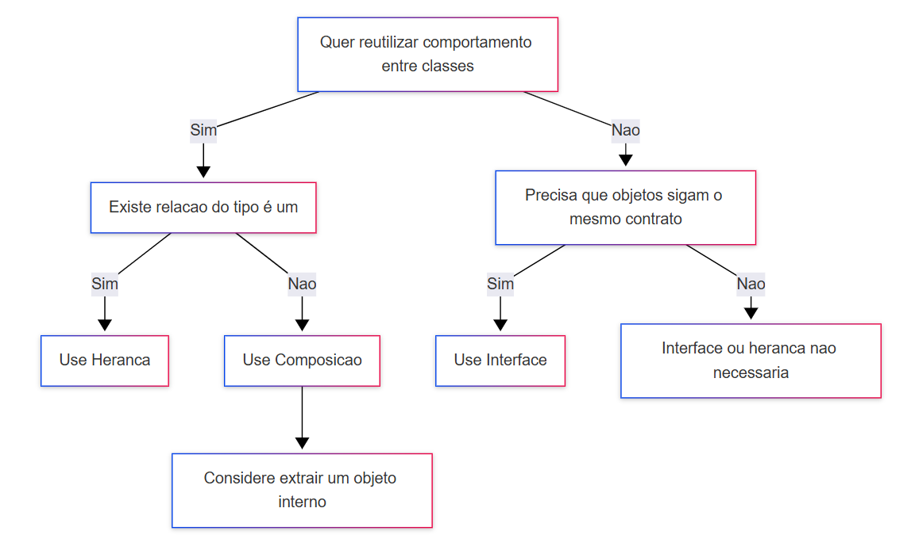

# Curso Alura - Praticando C# orientação a objetos com herança

## Aula 1 - O que é Herança

### Aula 1 - Apresentação - Vídeo 1

Transcrição
Olá! Meu nome é Yasmin Araújo, sou instrutora na Escola de Programação, e irei me autodescrever para fins de acessibilidade.

Audiodescrição: Yasmin é uma mulher branca, com cabelo castanho escuro na altura dos ombros. Ela veste uma blusa bege e, ao fundo, há uma parede iluminada com luz azul.

Objetivos do Curso
Neste curso, vamos trabalhar a coerência, que é um dos pilares da orientação a objetos. Abordaremos diversos tópicos relacionados a isso.

Conteúdo do Curso
Começaremos aprendendo a utilizar a herança, com foco principalmente no uso de herança em C#. Também trabalharemos com classes mães e classes filhas.

Vamos utilizar a herança para definir esses tópicos. Além disso, veremos as classes abstratas e as interfaces, aprendendo a diferenciar essas duas abordagens. Por fim, trabalharemos com o uso de composição e compararemos o uso de composição com o uso de herança.

Importância da Orientação a Objetos
Temos diversos tópicos aqui que são bastante importantes, e todos eles, juntos, nos permitem representar o mundo real e diversas situações complexas do mundo real utilizando a programação. É nesse ponto que reside a magia da orientação a objetos.

Conclusão e Expectativas
Estamos bastante animados para trabalhar com todos esses tópicos e esperamos que vocês nos acompanhem também.

Observações Finais
Infelizmente, não há snippets de código fornecidos para este vídeo, mas a explicação detalhada de Yasmin nos dá uma boa base teórica para entender como a herança, classes abstratas, interfaces e composição são fundamentais na programação orientada a objetos.

### Aula 1 - O que esperar deste curso?

Antes de mergulharmos no código, que tal alinharmos as expectativas?

**O que significa um curso prático?**  
Já se pegou pensando — será que consigo aplicar o que aprendi na prática? Este curso é a sua resposta. Aqui, o foco é colocar a mão no código, resolver problemas e testar seu conhecimento de forma ativa. Você terá:

- Vídeo de revisão do conteúdo
- Material de apoio
- Desafios de código

Pré requisitos

É importante ter concluído o curso C#: criando sua primeira aplicação, pois ele cobre os fundamentos da linguagem, garantindo que você consiga realizar os exercícios deste curso com mais segurança.

**Dicas para potencializar seu aprendizado neste curso**  

- Assista ao vídeo de revisão com atenção. Pause, anote e revise sempre que necessário.
- Baixe o material complementar para ter um apoio nas atividades.
- Faça os desafios na sua IDE favorita.
- Compartilhe o que aprendeu no fórum, pois sua abordagem pode inspirar outras pessoas.

Vamos começar?

### Aula 1 - Preparando o ambiente: instalando o Visual Studio

Olá!  
O IDE do Visual Studio é uma plataforma de lançamento criativa que você pode usar para editar, depurar e criar código e, em seguida, publicar um aplicativo. Além do editor e depurador padrão fornecidos pela maioria dos IDEs, o Visual Studio inclui compiladores, ferramentas de conclusão de código, designers gráficos e muitos outros recursos para aprimorar o processo de desenvolvimento de software.

O IDE mais abrangente para desenvolvedores .NET no Windows e Mac para criação de web, nuvem, desktop, aplicativos móveis, serviços e jogos. Sabendo disso, preparamos alguns vídeos para instalar em diferentes sistemas operacionais. Caso o seu objetivo seja desenvolver em .NET, marque a opção ASP.NET e Desenvolvimento Web no processo de instalação, mas, caso o seu objetivo seja apenas C#, marque a opção Desenvolvimento para Desktop com .NET.

Videos internos da plataforma:

Visual Studio no Windows

Visual Studio no Mac

C# no VSCODE (SDK)

C# em distribuições Linux
[Neste link](https://learn.microsoft.com/pt-br/dotnet/core/install/linux), você encontra um passo a passo da própria Microsoft de como instalar em distribuições Linux, como Alpine, CentOS, Debian, entre outras.

Vamos começar?

### Aula 1 - Preparando o ambiente: material de apoio

Após revisar os conceitos sobre herança é hora de colocar o conhecimento em prática com uma série de atividades focadas no tema. Caso queira acessar os slides da revisão, eles estão disponíveis no link abaixo:

[Baixe os slides do curso](https://cdn3.gnarususercontent.com.br/4703-csharp/Praticando%20C%23_orienta%C3%A7%C3%A3o%20a%20objetos%20com%20heran%C3%A7a.pdf)

Após finalizar todos os desafios, não esqueça de compartilhar sua solução no fórum. Será incrível ver como você resolveu! Vamos nessa?

### Aula 1 - Classes mães e filhas - Vídeo 2

Transcrição  
Nós vamos continuar trabalhando neste curso com a classe Produto, para simular um sistema de e-commerce. Ao analisarmos a nossa classe Produto, percebemos que ela contém informações que representam produtos físicos. Por exemplo, um produto só pode ser estocado se for um produto físico. No entanto, queremos representar produtos físicos em nosso site, mas também desejamos vender produtos digitais. Um produto digital não terá estoque, mas, por outro lado, terá um link de download. Assim, um produto digital terá todas as características de um produto físico, exceto o estoque, além de outras informações e métodos que um produto físico não possui.

**Criação das Classes ProdutoFisico e ProdutoDigital**  
Para modelar essa situação, podemos copiar e colar a classe Produto e fazer as alterações necessárias. No gerenciador de soluções, vamos copiar a classe Produto e colar, renomeando a cópia para ProdutoDigital, que será a classe diferente. Na classe Produto original, vamos renomeá-la para ProdutoFisico, para diferenciar bem as duas. O Visual Studio perguntará se desejamos renomear todas as referências, mas não faremos isso, então clicaremos em "não" e renomearemos manualmente. Assim, a classe Produto passará a se chamar ProdutoFisico, e o construtor também será ProdutoFisico.

**Implementação das Classes**  
Vamos começar criando a classe ProdutoFisico:

> class ProdutoFisico

E o seu construtor:

```csharp
public ProdutoFisico(string nome, string descricao,
            decimal preco, string imagem)
```

Na classe ProdutoDigital, a classe e o construtor serão renomeados para ProdutoDigital.

```csharp
class ProdutoDigital
```

```csharp
public ProdutoDigital(string nome, string descricao,
            decimal preco, string imagem)
```

**Ajustes na Classe ProdutoDigital**  
Um produto digital não possui estoque, então podemos remover o estoque da classe, do construtor e do método estaDisponivel.

```csharp
// Deletes the following line from ProdutoDigital.cs
public int Estoque { get; };

// Deletes the following line from the ProdutoDigital constructor
this.Estoque = 0;

// Deletes the following method from ProdutoDigital.cs
public bool EstaDisponivel()
{
    return Estoque > 0;
}
```

Além disso, um produto digital terá um link de download, que será semelhante à imagem, que era um link usado para exibir no site. Esse link precisa ser validado usando a propriedade. Portanto, vamos duplicar a propriedade da imagem e fazer o mesmo código.

```csharp
private string linkDownload;
```

```csharp
// Duplicates the existing Imagem property block
public string Imagem
{
    get
    {
        return imagem;
    }
    set
    {
        if (value.Length > 0)
        {
            this.imagem = value;
        }
    }
}
```

Agora, vamos criar a propriedade LinkDownload:

```csharp
public string LinkDownload
{
    get
    {
        return linkDownload;
    }
    set
    {
        if (value.Length > 0)
        {
            this.linkDownload = value;
        }
    }
}
```

**Problemas de Duplicação de Código**  
Com essas alterações, temos a nossa classe ProdutoDigital e também o nosso ProdutoFisico. No entanto, se observarmos bem, temos vários códigos duplicados. Para visualizar isso melhor, vamos para o nosso slide. Atualmente, temos uma classe ProdutoFisico com um código verde e outro transparente, e uma classe ProdutoDigital com o mesmo código verde, que está duplicado, e abaixo, a parte transparente, onde estão as especificidades do produto digital. Se quisermos construir um novo produto, criaríamos uma nova classe que teria toda essa parte verde, comum a todos, e uma parte específica. A cada nova classe criada, duplicamos mais e mais nossos códigos. Essa duplicação dificulta a manutenção das classes. Não queremos trabalhar com duplicação de código, e é por isso que a orientação a objetos nos propõe o conceito de herança.

**Introdução ao Conceito de Herança**  
Com a herança, vamos separar as informações que aparecem em comum em uma outra classe. Teremos uma classe Produto, onde estará tudo o que é genérico. Faremos com que as outras classes herdem dessa classe. Assim, ProdutoFisico herdará de Produto, e ProdutoDigital também herdará de Produto. Com isso, eles herdarão esses atributos, mas não necessariamente precisaremos escrever esse código dentro dessas classes mais específicas. Dessa forma, evitamos a duplicação de código, erros na manutenção e outros problemas que podem surgir dessa duplicação.

**Implementação da Herança**  
Como vamos modelar a herança dentro das nossas classes no Visual Studio? Vamos voltar para lá. No Visual Studio, precisaremos criar uma nova classe Produto, conforme vimos no slide.

```csharp
class Produto
```

Dentro de "Praticando C Sharp", vamos pegar o ProdutoFisico novamente e usar Ctrl C, Ctrl V para facilitar nosso trabalho. Vamos renomear essa classe de ProdutoFisico para Produto. Entraremos no arquivo e identificaremos o que Produto tem em comum em todas as classes: imagem, nome, descrição e preço. O estoque é específico do ProdutoFisico, então vamos apagá-lo.

```csharp
// Deletes the following line from Produto.cs
public int Estoque { get; };
```

O construtor também pode ser apagado por enquanto.

```csharp
// Deletes the following constructor from Produto.cs
public Produto(string nome, string descricao,
            decimal preco, string imagem)
{
    this.Nome = nome;
    this.Descricao = descricao;
    this.Preco = preco;
    this.Estoque = 0;
    this.Imagem = imagem;
}
```

Alterar preço com desconto é geral, assim como a imagem. Dessa forma, já definimos nossa classe Produto.

**Aplicação da Herança nas Classes Filhas**  
Agora, vamos modelar a herança. Salvamos a classe Produto, vamos para ProdutoDigital e adicionamos dois pontos, Produto. Ao fazer isso, estamos dizendo que ProdutoDigital herda de Produto.

```csharp
class ProdutoDigital : Produto
```

Assim, tudo o que existe dentro de Produto estará dentro de ProdutoDigital também. Podemos apagar o nome, a descrição, o preço e a imagem.

```csharp
// Deletes the following lines from ProdutoDigital.cs
public string Nome { get; };
public string Descricao { get; };
public decimal Preco { get; private set; }
```

Também podemos apagar o método de alterar preço com desconto e a propriedade da imagem.

```csharp
// Deletes the following method and property from ProdutoDigital.cs
public void AlterarPrecoComDesconto(decimal desconto)
{
    Preco = Preco * (1 - desconto/100);
}

public string Imagem
{
    get
    {
        return imagem;
    }
    set
    {
        if (value.Length > 0)
        {
            this.imagem = value;
        }
    }
}
```

Vamos fazer o mesmo para ProdutoFisico.

```csharp
class ProdutoFisico : Produto
```

No ProdutoFisico, apagamos tudo o que está em Produto, que são o nome, a descrição, o preço e a imagem.

```csharp
// Deletes the following lines from ProdutoFisico.cs
public string Nome { get; };
public string Descricao { get; };
public decimal Preco { get; private set; }
```

Podemos apagar também o método de alterar preço com desconto e a imagem.

```csharp
// Deletes the following method and property from ProdutoFisico.cs
public void AlterarPrecoComDesconto(decimal desconto)
{
    Preco = Preco * (1 - desconto/100);
}

public string Imagem
{
    get
    {
        return imagem;
    }
    set
    {
        if (value.Length > 0)
        {
            this.imagem = value;
        }
    }
}
```

**Conclusão e Próximos Passos**  
Dessa forma, temos uma nova classe para ProdutoFisico e uma nova classe para ProdutoDigital. O ProdutoFisico deve herdar a classe de fato, para que possamos utilizar os atributos. Então, adicionamos dois pontos, Produto.

Estamos trabalhando com a herança tanto em ProdutoFisico quanto em ProdutoDigital. Nosso construtor está com alguns problemas associados a propriedades, que vamos comentar por enquanto, e depois entenderemos melhor.

```csharp
// Comments out the constructor in ProdutoFisico.cs
/*public ProdutoFisico(string nome, string descricao,
            decimal preco, string imagem)
{
    this.Nome = nome;
    this.Descricao = descricao;
    this.Preco = preco;
    this.Estoque = 0;
    this.Imagem = imagem;
}*/
```

```csharp
// Comments out the constructor in ProdutoDigital.cs
/*public ProdutoDigital(string nome, string descricao,
            decimal preco, string imagem)
{
    this.Nome = nome;
    this.Descricao = descricao;
    this.Preco = preco;
    this.Imagem = imagem;
}*/
```

Comentando esses códigos dos construtores, nosso código está compilando. Note que ProdutoDigital agora é uma classe muito menor do que estava antes, e o mesmo ocorre com ProdutoFisico. Se quisermos criar um novo tipo de produto, não precisaremos declarar novamente as propriedades nome, descrição, preço e imagem. Basta herdar da classe Produto, evitando toda essa duplicação de código.

Uma nomenclatura formal é que todas as classes que herdam de outras são classes filhas, e as classes das quais herdamos são as classes mães. Nesse caso, Produto é a classe de quem herdamos, então é uma classe mãe, e as classes ProdutoDigital e ProdutoFisico são classes filhas. Na sequência, veremos como resolver o problema do construtor para conseguir executar nosso código de fato, pois ele está com alguns problemas.

continuar lendo

### Aula 1 - Herança - Vídeo 3

Transcrição  
Nós observamos que, ao implementar a herança, o nosso construtor deixou de funcionar, tanto para o caso de produto digital quanto para o caso de produto físico. Vamos descomentar o nosso construtor de produto digital para entender o que ocorreu e quais são os erros. Dentro do nosso construtor, notamos que surgiram erros relacionados a nome, descrição e preço. O erro que aparece é que a propriedade ou indexador não podem ser atribuídos, pois esse indexador é somente leitura.

Para ilustrar, aqui está o construtor original do ProdutoDigital que causou o problema:

```csharp
public ProdutoDigital(string nome, string descricao,
    decimal preco, string imagem)
{
    this.Nome = nome;
    this.Descricao = descricao;
    this.Preco = preco;
    this.Imagem = imagem;
}
```

**Análise dos Erros e Solução com protected set**  
O que isso significa? Se voltarmos ao nosso arquivo produto.cs, veremos que as propriedades nome, descrição e preço possuem vários GETs, e no caso do preço, há um private set. Portanto, não conseguimos alterar a propriedade fora da classe. Se tentarmos utilizar o construtor para acessar atributos dessa classe, não conseguiremos alterá-los, justamente porque não existe um set ou porque o set é privado.

Como podemos resolver isso? Podemos utilizar um modificador de acesso que permita que nossas propriedades sejam acessadas e alteradas dentro das classes filhas. Para isso, usaremos o modificador protected. No lugar do private set do preço, colocaremos um protected set. Faremos o mesmo para a descrição, adicionando um protected set, e novamente para o nome, colocando um protected set.

Aqui estão as alterações nas propriedades:

```csharp
public decimal Preco { get; protected set; }
public string Descricao { get; protected set; }
public string Nome { get; protected set; }
```

Se voltarmos à nossa classe de produto digital e salvarmos, notaremos que agora tudo está compilando corretamente, pois indicamos que em classes filhas conseguimos alterar esses valores. Essa é uma das soluções. Se formos ao produto físico e descomentarmos, ele funcionará normalmente, pois alteramos tudo para todas as classes.

**Considerações sobre Encapsulamento e Alternativa com Construtor Base**  
No entanto, essa solução de usar protected set pode gerar outros problemas. Pode ser que desejemos que nome, descrição e preço sejam realmente alteráveis apenas dentro da classe de produto. Ou seja, se quisermos alterar o preço com desconto em outra classe filha, não conseguiremos, pois toda essa lógica está encapsulada apenas dentro de produto. Essa é uma boa prática.

Em vez de ter um protected set e permitir alterações dentro das outras classes, podemos manter nossa propriedade oculta e permitir que apenas no construtor ela seja alterada. Como faremos isso? Primeiro, apagaremos o protected set. Vamos reverter o código para o estado anterior. Em seguida, podemos criar um construtor com todos os elementos gerais de produto. Copiaremos o construtor de produto digital e colaremos na classe produto, renomeando para produto. Esse construtor contém exatamente o que desejamos: elementos gerais de produto e atribuições conforme criamos anteriormente.

Aqui está o construtor da classe Produto:

```csharp
public Produto(string nome, string descricao,
    decimal preco, string imagem)
{
    this.Nome = nome;
    this.Descricao = descricao;
    this.Preco = preco;
    this.Imagem = imagem;
}
```

**Implementação de Herança de Construtores**  
Uma vez que temos esse construtor, podemos usá-lo nas classes filhas. Como faremos isso? Utilizando uma herança de construtores. No produto digital, logo após a declaração dos parâmetros, podemos usar dois pontos e a palavra-chave base.

Usando essa palavra base, nós vamos abrir e fechar os parênteses e passar todos os atributos de produto digital. Vamos passar nome, descrição, preço e imagem. Ao fazer isso, estamos chamando o construtor da nossa classe base, a classe mãe, que é o construtor de produto. Assim, toda vez que quisermos inicializar um produto digital, faremos primeiro uma inicialização de produto da parte mais genérica e depois a parte mais específica.

Aqui está como o construtor do ProdutoDigital foi modificado:

```csharp
public ProdutoDigital(string nome, string descricao,
    decimal preco, string imagem, string linkDownload)
    : base(nome, descricao, preco, imagem)
{
    this.LinkDownload = linkDownload;
}
```

Nesse caso, toda a inicialização de nome, descrição, preço e imagem já é feita em produto, então podemos apagar essas linhas. Podemos deixar apenas as partes mais específicas de um produto digital, como, por exemplo, o linkDownload. Vamos adicionar no produto digital uma string linkDownload. Podemos dizer que as partes iniciais vão usar o nosso construtor base e a parte específica, que é o this.linkDownload, vai receber o linkDownload do parâmetro.

Podemos fazer exatamente a mesma coisa na nossa classe produto físico. Como faremos isso? Vamos copiar o que está em produto digital e colar. Agora, todas as nossas inicializações gerais não precisam mais ficar no construtor de produto físico; elas ficam no construtor de produto genérico. Podemos apagar essas outras linhas e deixar apenas o this.stock. Dessa forma, reaproveitamos o código do construtor e garantimos melhor o nosso encapsulamento, tanto de produto quanto de produto físico e produto digital.

Aqui está o construtor do ProdutoFisico:

```csharp
public ProdutoFisico(string nome, string descricao,
    decimal preco, string imagem)
    : base(nome, descricao, preco, imagem)
{
    this.Estoque = 0;
}
```

**Criação de Produtos no program.cs**  
Vamos salvar as nossas classes. Podemos utilizar essas classes agora no nosso program.cs. Se formos para o program.cs, estamos criando produtos genéricos, mas podemos criar produtos específicos. Vamos criar um produto físico, que é um new ProdutoFisico. Aqui, o nosso código não altera nada, mas vamos criar também um produto digital. Vamos copiar todo esse código de cima, colar e alterar para produto digital. Então, produtoDigital item2 será um new ProdutoDigital.

Aqui está como criamos os produtos no program.cs:

```csharp
ProdutoFisico item1 = new ProdutoFisico("Teclado", "Modelo compacto e silencioso, " +
    "perfeito para produtividade diária.",
    80.00m, "Imagem");

ProdutoDigital item2 = new ProdutoDigital("Curso", "OO em C#",
    100.00m, "Imagem ilustrativa", "Link");
```

Um produto digital pode ser, por exemplo, um curso. Vamos criar os nossos valores. Ele será um curso e a descrição dele será "OO em C-sharp". O preço será de 100 reais, então colocaremos 100.00m. Além disso, temos também o link de download. Vamos colocar um link. Além disso, temos a imagem também antes. Vamos colocar "imagem ilustrativa", só para ficar diferente. Temos um curso de "OO em C-sharp", que custa 100 reais, uma imagem ilustrativa e um link de download.

**Exibição dos Dados dos Produtos**  
Aqui embaixo, podemos passar também dados do item2, que serão item2.nome, item2.descrição, item2.preço. E ali, ao invés de ser estoque, colocamos link. Colocamos item2.link. Assim, criamos um produto físico e um produto digital. Aparentemente, está tudo compilando. Vamos executar o nosso código para ver se realmente está funcionando. O código está sendo executado e temos os nossos dados. Os dados do item1, assim como estavam antes, e as alterações aqui também. Os dados do item2 também foram construídos com sucesso. Conseguimos criar produtos do tipo produto físico e produto digital, utilizando a herança.

Aqui está o código para exibir os dados do item2:

```csharp
Console.WriteLine(@$"Dados do item 2:
    Nome: {item2.Nome};
    Descrição: {item2.Descricao};
    Preço: {item2.Preco};
    Link: {item2.LinkDownload};
");
```

## Aula 2 - Classes abstratas e interfaces

### Aula 2 - Classes abstratas - Vídeo 1

Transcrição  
Atualmente, em nosso sistema, conseguimos criar produtos de vários tipos. No programa CS, é possível instanciar uma classe do tipo produto físico. Instanciar um produto físico é o mesmo que criar um objeto do tipo produto físico. Vamos ver como isso é feito com o seguinte código:

```csharp
ProdutoFisico item1 = new ProdutoFisico("Teclado", "Modelo compacto e silencioso perfeito para produtividade diária.", 80.00m, "Imagem");
```

Esse trecho de código cria um produto físico chamado item1, que representa um teclado. Podemos exibir suas informações usando o seguinte código:

```csharp
Console.WriteLine(@$"Dados do item 1:
    Nome: {item1.Nome};
    Descricao: {item1.Descricao};
    Preco: {item1.Preco};
    Estoque: {item1.Estoque};
");
```

E para exibir a imagem associada ao produto, usamos:

```csharp
Console.WriteLine($"Imagem: {item1.Imagem}");
```

Se quisermos alterar a imagem do produto, podemos fazer isso da seguinte forma:

```csharp
item1.Imagem = "Nova Imagem";
Console.WriteLine($"Imagem: {item1.Imagem}");
```

**Criação de Produtos Digitais**  
Além de produtos físicos, também conseguimos instanciar um produto digital. Veja o exemplo abaixo:

```csharp
ProdutoDigital item2 = new ProdutoDigital("Curso", "00 em C#", 100.00m, "Imagem ilustrativa", "Link");
```

Podemos exibir as informações do produto digital com o seguinte código:

```csharp
Console.WriteLine(@$"Dados do item 2:
    Nome: {item2.Nome};
    Descricao: {item2.Descricao};
    Preco: {item2.Preco};
    Link: {item2.LinkDownload};
");
```

**Considerações sobre Produtos Genéricos**  
Agora, para comprovar que podemos adaptar a construção de um produto digital para um produto genérico, vamos modificar o código. Vamos apagar a parte referente ao digital, nomear o produto como item3 e definir como um new Produto. Como um produto não possui link, apagaremos a última opção do construtor, que é o link:

```csharp
Produto item3 = new Produto("Curso", "00 em C#", 100.00m, "Imagem ilustrativa");
```

Nosso código está compilando normalmente, permitindo a criação de vários tipos de produto. No entanto, ao considerar nossas regras de negócio, temos produtos físicos e digitais, além do produto genérico. Faz sentido criar esse produto genérico em nosso contexto? Se desejamos adicionar novos produtos ao sistema, eles serão digitais ou físicos. A classe Produto serve apenas para representar tudo que é comum entre os produtos, evitando a duplicação de código. Não é necessariamente utilizada para criar novos produtos.

**Implementação de Classe Abstrata**  
Portanto, a ideia é bloquear a criação de produtos genéricos, mas permitir que a herança ocorra. Não vamos simplesmente apagar a classe Produto.

Como podemos fazer isso? Podemos definir nossa classe Produto como uma classe abstrata, ou seja, ela terá apenas definições de um produto e não poderá ser instanciada. Para que as informações possam ser atribuídas, utilizaremos as especificações, as classes filhas dessa classe, que são ProdutoDigital ou ProdutoFisico.

Para indicar que uma classe é abstrata, utilizamos um modificador chamado abstract. Assim, antes da declaração da classe, inserimos essa palavra-chave, indicando que ela não pode ser instanciada, ou seja, não podemos criar produtos genéricos. Vamos ver como isso é feito:

```csharp
abstract class Produto
{
    private string Imagem;
    public string Nome { get; }
    public string Descricao { get; }
    public decimal Preco { get; private set; }

    public Produto(string nome, string descricao, decimal preco, string imagem)
    {
        this.Nome = nome;
        this.Descricao = descricao;
        this.Preco = preco;
        this.Imagem = imagem;
    }

    public void AlterarPrecoComDesconto(decimal desconto)
    {
        Preco = Preco * (1 - desconto/100);
    }

    public string Imagem
    {
        get
        {
            return Imagem;
        }
        set
        {
            if (value.Length > 0)
            {
                this.Imagem = value;
            }
        }
    }
}
```

**Ajustes no Código e Considerações Finais**  
Após salvarmos a classe Produto, ao verificarmos o arquivo program.cs, no último construtor que criamos, notamos que ele apresenta um erro. O erro indica que não é possível criar uma instância de um tipo abstrato, pois nossa classe agora contém apenas definições. Portanto, podemos apagar esse construtor.

Para sintetizar melhor as informações, vamos analisar o slide. Anteriormente, tínhamos Produto, ProdutoFisico e ProdutoDigital, sendo que ProdutoDigital e ProdutoFisico herdavam de Produto. Todas essas classes podiam ser instanciadas. Agora, a parte comum de Produto não é mais instanciada, e só conseguimos instanciar as informações e atribuir valores utilizando a classe ProdutoFisico ou a classe ProdutoDigital. Dessa forma, conseguimos modelar melhor nosso contexto, evidenciando essas diferenças.

Em alguns casos, desejaremos instanciar as classes mães, pois fará sentido, mas em outros casos, essas classes mães serão apenas conceitos abstratos. Por isso, utilizamos a palavra-chave abstract. Na sequência, veremos a diferença entre trabalhar com classes abstratas e com interfaces.

continuar lendo

### Aula 2 - Interfaces - Vídeo 2

Transcrição  
Para evoluir ainda mais nossa aplicação, criamos uma classe Pedido. A classe Pedido serve para representar os pedidos realizados em nosso e-commerce. Um pedido pode ser pago ou não, e possui um ID, um cliente, uma data e um valor total. A data é do tipo date-time. Por enquanto, não vamos focar muito nesse tipo específico, mas é importante saber que ele serve para representar datas em nosso sistema.

**Definição da Classe Pedido**  
Vamos começar definindo a classe Pedido com suas propriedades e métodos básicos:

```csharp
public class Pedido
{
    private bool pago;
    public int Id { get; }
    public string Cliente { get; }
    public DateTime Data { get; }
    public decimal ValorTotal { get; }

    public Pedido(int id, string cliente, decimal valorTotal)
    {
        Id = id;
        Cliente = cliente;
        Data = DateTime.Now;
        ValorTotal = valorTotal;
        pago = false;
    }

    public void ExibirResumo()
    {
        Console.WriteLine($"Pedido #{Id} - Cliente: {Cliente}");
        Console.WriteLine($"Valor Total: R$ {ValorTotal:F2}");
        Console.WriteLine($"Status: {(EstaExpirado() ? "Expirado" : "Válido")}");
    }

    public bool EstaExpirado()
    {
        return !pago && DateTime.Now > Data.AddMinutes(15);
    }

    public void Pagar()
    {
        pago = true;
    }
}
```

**Lógica de Expiração e Produtos Digitais**  
Além disso, o pedido possui um construtor, um método para exibir um resumo dos dados, um método para verificar se está expirado e um método para efetuar o pagamento, que simplesmente marca o pedido como pago. A lógica do método que verifica se está expirado é verificar se o pedido não foi pago e se já se passaram 15 minutos desde que foi criado. Assim, ao criar um pedido, é atribuída uma data inicial. Se essa data, somada a 15 minutos, já tiver passado e o pedido não tiver sido pago, ele será considerado expirado.

Esse conceito de expiração também faz sentido na classe de produto digital. Produtos digitais podem ser fornecidos ao usuário por um certo tempo, e após esse período, podem expirar, exigindo que o usuário compre novamente o produto. Para isso, criamos um método específico que retorna se o produto digital está expirado ou não. A ideia é que haja uma data de compra, e após dois anos, o produto digital expire, necessitando de uma nova compra.

```csharp
public bool EstaExpirado()
{
    return DateTime.Now > DataCompra.AddYears(2);
}
```

**Introdução ao Uso de Interfaces**  
Observamos que tanto o método de expiração do produto digital quanto o do pedido são semelhantes, resultando em códigos duplicados. Na orientação a objetos, evitamos trabalhar com duplicação de código. Podemos pensar que tanto um produto digital quanto um pedido podem expirar. Assim, ambos são "expiráveis". Poderíamos criar uma classe Expirável para agrupar essas ideias e comportamentos semelhantes. No entanto, isso poderia resultar em uma herança forçada, pois estaríamos agrupando comportamentos distantes entre pedido e produto digital, o que não é desejável.

Para resolver isso, em vez de usar herança, podemos estabelecer uma relação através de interfaces. Em uma interface, produtos podem compartilhar alguns métodos sem necessariamente compartilhar todos os atributos e métodos. Dessa forma, conseguimos selecionar quais comportamentos serão herdados e compartilhados.

**Implementação da Interface IExpiravel**  
Para aplicar o uso das interfaces, vamos ao nosso Visual Studio. No Visual Studio, criaremos uma interface que conterá os métodos em comum do produto digital e do pedido. Essa interface será chamada de Expirável. Em C Sharp, há uma convenção de que todas as interfaces devem começar com a letra "I".

```csharp
// New file: IExpiravel.cs
interface IExpiravel
{
    bool EstaExpirado();
}
```

Qual é a ideia da nossa interface? No caso de expirar, um produto digital terá o método estáExpirado, assim como o pedido. Se voltarmos à interface IExpiravel, podemos declarar um bool estáExpirado. Feito isso, simplesmente fecharemos a declaração do nosso método. A ideia é que a interface apenas declare que algo pode ser feito com ela. Assim, algo que é IExpiravel pode ter o comportamento estáExpirado, e decidiremos como esse comportamento será implementado especificamente dentro das nossas classes.

**Aplicação da Interface em Classes**  
Uma outra coisa importante sobre interfaces é que os métodos já são públicos por padrão. Portanto, não precisamos usar a palavra-chave public ou internal. Por padrão, eles já são públicos. Assim, uma vez que declaramos a nossa interface IExpiravel, podemos fazer com que as outras classes implementem essa interface. Na classe ProdutoDigital, faremos com que ela implemente a interface IExpiravel.

```csharp
// In ProdutoDigital.cs
class ProdutoDigital : Produto, IExpiravel
```

Observe que não temos nenhum erro, justamente porque já existia o método estáExpirado. Na linha 29, ao lado do estáExpirado, há um ícone que é um "i" com uma seta. Ao clicar nesse ícone, ele mostra que há membros implementados de uma interface. Nesse caso, estamos implementando o membro estáExpirado da interface IExpiravel. Além disso, podemos fazer o mesmo em Pedido.

```csharp
// In Pedido.cs
class Pedido : IExpiravel
```

**Testando a Implementação da Interface**  
Para implementar uma interface, usamos, assim como na herança, os dois pontos. Colocamos um IExpiravel ali. Feito isso, como o método já está definido, o compilador entende que estamos fazendo uma definição baseada na interface.

Toda vez que utilizamos os dois pontos IExpiravel, estamos indicando que vamos utilizar a interface IExpiravel. Se não utilizarmos essa interface, o compilador apresentará um erro. Vamos comentar o estáExpirado para testar.

```csharp
/*public bool EstaExpirado()
{
    return !pago && DateTime.Now > Data.AddMinutes(15);
}*/
```

Comentando, se voltarmos, ele começa a dar erro dizendo que a classe Pedido não está implementando os membros da interface IExpiravel. Trabalhar com interfaces é trabalhar com contratos. Toda vez que decidimos implementar a interface, somos obrigados a implementar todos os métodos definidos na interface. O contrato é o seguinte: podemos utilizar o método desde que o implementemos. Vamos descomentar agora. Estávamos comentando apenas por curiosidade.

Dessa forma, temos o uso de interfaces no nosso código. Vamos salvar tudo. Na classe Program.cs, podemos ir ao nosso item 2, por exemplo, que é um produto digital, e adicionar uma informação para estáExpirado.

```csharp
// In Program.cs
Console.WriteLine($"Está expirado: {item2.EstaExpirado()}");
```

Na linha 20, declararemos no formato de string o estáExpirado, para verificar se a nossa interface está  funcionando. Vamos pegar o nosso item 2, ponto, estáExpirado. Fazendo isso, esperamos ver se o item realmente está expirado ou não. Vamos executar o nosso código. Executando, temos o nosso resultado. No item 2, ele indica que não está expirado, então estáExpirado é falso. No pedido, que estava imprimindo as informações, o status é válido. Esse status estava utilizando também o método estáExpirado, então podemos ver que as nossas interfaces estão compilando corretamente.

**Conclusão sobre o Uso de Interfaces**  
Assim, conseguimos representar esses comportamentos em comum sem necessariamente trabalhar com herança. É muito importante entender o conceito de interface, pois ele é bastante aplicado no dia a dia. Na sequência, trabalharemos com outro conceito também importante, que é o uso de composições.

## Aula 3 - Herança e Composição

### Aula 3 - Composição - Vídeo 1

Transcrição  
Para evoluir nosso sistema, vamos imaginar que queremos avaliar nossos produtos. Para isso, adicionamos duas propriedades na classe: nota e comentário. A nota será um inteiro entre 1 e 10, que o cliente poderá adicionar, e o comentário será opcional, permitindo que a pessoa escreva sobre o produto.

**Definindo Propriedades na Classe Produto**  
Primeiro, vamos definir essas propriedades na classe Produto:

```csharp
public int Nota { get; private set; }
public string Comentario { get; private set; }
```

Para alterar essas propriedades, teremos um método chamado avaliar. Nele, passaremos os parâmetros nota e comentário e faremos a atribuição para as propriedades correspondentes. Com isso, nosso produto está configurado corretamente.

```csharp
public void Avaliar(int nota, string comentario)
{
    Nota = nota;
    Comentario = comentario;
}
```

**Implementação no Programa Principal**  
No arquivo program.cs, utilizamos os atributos nota e comentário para visualizar a avaliação. Ao executar, inicialmente não temos a definição da avaliação, mas após avaliarmos o produto, obtemos a nota 10 e o comentário "excelente". Tudo está compilando perfeitamente na classe produto.

```csharp
item1.Avaliar(10, "Excelente!");
Console.WriteLine(@$"Dados do item 1:
    Nome: {item1.Nome};
    Descrição: {item1.Descricao};
    Preço: {item1.Preco};
    Estoque: {item1.Estoque};
    Nota: {item1.Nota}
    Comentário: {item1.Comentario}
");
```

**Problema de Código Duplicado**  
No entanto, temos uma nota e um comentário que caracterizam essa avaliação. Se quisermos, por exemplo, avaliar um pedido, precisaríamos replicar esses atributos e o método avaliar na classe pedido. Isso resultaria em código duplicado, o que não é desejável.

**Solução com Composição**  
Qual seria a solução para isso? Poderíamos pensar em herança ou interfaces, mas pedido e produto não têm tanto em comum. Embora possamos considerar criar uma interface, ela está mais relacionada a comportamentos. Aqui, queremos indicar que todo produto tem uma avaliação, composta por uma nota e um comentário. Queremos sempre armazenar essas informações de forma estruturada, utilizando composição.

**Criando a Classe Avaliação**  
Para implementar isso, criaremos uma nova classe para agrupar os atributos nota e comentário. Na nossa solução em C#, no menu à direita, adicionaremos uma nova classe chamada Avaliação. Dentro da classe Avaliação, teremos os atributos nota e comentário.

```csharp
class Avaliacao
{
    public int Nota { get; private set; }
    public string Comentario { get; private set; }

    public Avaliacao(int nota, string comentario)
    {
        Nota = nota;
        Comentario = comentario;
    }
}
```

**Integração da Classe Avaliação no Produto**  
No produto, em vez de termos nota e comentário diretamente, utilizaremos esse agrupamento, que é a Avaliação. Assim, teremos uma propriedade do tipo Avaliação, chamada avaliação, com um get e um private set. Isso nos permitirá criar e alterar a avaliação conforme necessário.

```csharp
public Avaliacao Avaliacao { get; private set; }
```

Quando quisermos avaliar um produto, precisaremos criar uma avaliação real, instanciando um objeto. Para isso, faremos a propriedade avaliação ser igual a um new Avaliação, passando a nota e o comentário.

```csharp
public void Avaliar(int nota, string comentario)
{
    Avaliacao = new Avaliacao(nota, comentario);
}
```

**Ajustes no Construtor e Benefícios da Composição**  
No nosso construtor, inicialmente, encontramos um erro, pois não havíamos declarado esse construtor anteriormente. Para resolver isso, vamos declarar um construtor utilizando as teclas ALT e ENTER. Ao pressionar ALT e ENTER, selecionamos a opção de gerar um construtor a partir dos membros, escolhendo nota e comentário. O próprio Visual Studio gerará o construtor para nós.

Retomando o que fizemos, removemos os atributos da classe Produto e criamos uma classe específica chamada Avaliação, que contém nota e comentário. Isso foi feito porque esses atributos estão mais associados a uma avaliação do que ao produto em si. Após removermos esses atributos, podemos utilizá-los na classe Produto por meio da classe Avaliação, através de composição.

**Vantagens da Composição**  
No método avaliar, estamos realizando a avaliação utilizando o objeto Avaliação, em vez da definição anterior. Qual é o benefício disso? À primeira vista, parece que apenas movemos alguns atributos para uma nova classe, resultando em mais classes no projeto. No entanto, ao analisarmos mais profundamente, percebemos que podemos reutilizar o código de forma mais eficiente. Por exemplo, ao criar a classe Avaliação, podemos reutilizá-la em Pedido. Assim, podemos declarar um public Avaliação em Pedido, permitindo reutilizar a classe sem repetir códigos, tornando tudo mais semântico e organizado. Esse é o benefício de trabalhar com composição.

**Diferença entre Herança e Composição**  
A composição modela relações do tipo "tem um". Enquanto na herança temos relações do tipo "é um" (por exemplo, um produto físico é um produto), na composição dizemos que um produto "tem uma" avaliação. Por isso, utilizamos a composição. Quando estivermos em dúvida entre herança e composição, é importante observar se a relação é de "é um" ou de "tem um".

**Verificação e Conclusão**  
Para finalizar, vamos voltar à classe Program.cs para verificar como nossa composição está funcionando. Observamos que item1.nota não compila mais, pois o item não possui mais uma nota diretamente. Para acessar a nota, utilizamos item1.avaliação.nota, permitindo o encadeamento entre os objetos. O mesmo se aplica ao comentário, conforme recomendado pelo Visual Studio.

```csharp
Console.WriteLine(@$"Dados do item 1:
    Nome: {item1.Nome};
    Descrição: {item1.Descricao};
    Preço: {item1.Preco};
    Estoque: {item1.Estoque};
    Nota: {item1.Avaliacao.Nota}
    Comentário: {item1.Avaliacao.Comentario}
");
```

Ao reexecutar o programa, visualizamos o resultado. Inicialmente, ele mostrou 10 para ambos, pois inserimos a nota em ambos os campos, nota e comentário. Após a reexecução, conseguimos visualizar os dados corretamente, com a avaliação funcionando como antes.

Agora que sabemos diferenciar herança de composição, é importante praticar essas habilidades. Na sequência, teremos uma série de exercícios para internalizar esses conhecimentos.

### Aula 3 - Faça como eu fiz, 1: registro de clientes

Você está desenvolvendo um sistema para um clube, onde a experiência do cliente é prioridade. Os membros comuns têm acesso básico, mas os clientes VIP possuem benefícios exclusivos, como níveis de fidelidade e identificadores personalizados. Seu desafio é criar uma estrutura que diferencie esses perfis.

Crie um programa que:

- Defina uma classe Pessoa com os atributos Nome e Idade.
- Crie uma classe ClienteVIP que herde de Pessoa, adicionando:
- Um atributo nível de fidelidade (ex: Ouro, Diamante).
- Um atributo código VIP (ex: VIP123A).
- Instancie dois clientes VIP com dados fictícios.
- Exiba no console uma mensagem formatada para cada cliente, incluindo:
- Uma saudação personalizada (ex: "Bem-vindo, cliente VIP: [Nome]").
- Idade, nível de fidelidade e código VIP em linhas separadas.

Exemplo de entrada:

```csharp
ClienteVIP cliente1 = new ClienteVIP("Renata", 32, "Ouro", "VIP123A");  
ClienteVIP cliente2 = new ClienteVIP("Leonardo", 40, "Diamante", "VIP789X");  
```

Saída esperada:

```csharp
Bem-vindo, cliente VIP: Renata
Idade: 32
Nível de Fidelidade: Ouro
Código VIP: VIP123A
 
Bem-vindo, cliente VIP: Leonardo
Idade: 40
Nível de Fidelidade: Diamante
Código VIP: VIP789X
```

Opinião do instrutor

Nesta atividade, exploramos a herança. A herança permite que uma classe herde atributos e comportamentos de outra classe (classe base), facilitando a reutilização de código e a organização lógica de sistemas.

A classe Pessoa serve como base, definindo os atributos Nome e Idade. Esses atributos são inicializados por meio de um construtor, garantindo que toda instância de Pessoa (ou de suas classes derivadas) tenha esses valores definidos corretamente.

A classe ClienteVIP estende Pessoa, adicionando características específicas de clientes vip: NivelFidelidade e CodigoVIP. Observe que o construtor de ClienteVIP utiliza a palavra-chave base para delegar a inicialização de Nome e Idade ao construtor da classe Pessoa. Isso evita repetição de código e mantém a lógica de inicialização centralizada.

No trecho de instanciação, criamos dois objetos ClienteVIP com dados distintos, demonstrando como a herança permite que a classe derivada mantenha a estrutura da classe base enquanto adiciona suas próprias particularidades.

Program.cs

```csharp
ClienteVIP cliente1 = new ClienteVIP("Renata", 32, "Ouro", "VIP123A");  
ClienteVIP cliente2 = new ClienteVIP("Leonardo", 40, "Diamante", "VIP789X");  
 
Console.WriteLine($"Bem-vindo, cliente VIP: {cliente1.Nome}");  
Console.WriteLine($"Idade: {cliente1.Idade}");  
Console.WriteLine($"Nível de Fidelidade: {cliente1.NivelFidelidade}");  
Console.WriteLine($"Código VIP: {cliente1.CodigoVIP}\n");  
 
Console.WriteLine($"Bem-vindo, cliente VIP: {cliente2.Nome}");  
Console.WriteLine($"Idade: {cliente2.Idade}");  
Console.WriteLine($"Nível de Fidelidade: {cliente2.NivelFidelidade}");  
Console.WriteLine($"Código VIP: {cliente2.CodigoVIP}\n");  
```

Pessoa.cs

```csharp
class Pessoa  
{  
    public string Nome { get; }  
    public int Idade { get; }  
 
    public Pessoa(string nome, int idade)  
    {  
        this.Nome = nome;  
        this.Idade = idade; 
    }  
}  
```

ClienteVIP.cs

```csharp
class ClienteVIP : Pessoa  
{  
    public string NivelFidelidade { get; }  
    public string CodigoVIP { get;}  
 
    public ClienteVIP(string nome, int idade, string nivelFidelidade, string codigoVIP)  
        : base(nome, idade)  
    {  
        this.NivelFidelidade = nivelFidelidade;  
        this.CodigoVIP = codigoVIP;  
    }  
}  
```

Agora é sua vez! Teste o programa, compartilhe no fórum e compare sua lógica com outras soluções.

### Aula 3 - Faça como eu fiz, 2: cadastro de funcionários

Você está desenvolvendo um sistema interno para uma empresa que deseja organizar as informações de seus colaboradores. A empresa possui funcionários fixos, que recebem salário mensal, e freelancers, que trabalham por projetos com valores específicos. Seu desafio é criar uma estrutura que represente esses dois tipos de colaboradores, aproveitando os conceitos de herança para evitar repetição de código.

Crie um programa que:

- Defina uma classe base Funcionario com os atributos Nome e Cargo.
- Crie uma classe filha Freelancer que herde de Funcionario e adicione o atributo ValorProjeto.
- Crie uma classe filha Interno que herde de Funcionario e adicione o atributo Salario.
- Instancie pelo menos um objeto de cada classe filha, atribuindo valores a cada atributo.
- Exiba as informações no terminal.

Exemplo de entrada:

```csharp
Interno f1 = new Interno("Luciana", "Desenvolvedora", 7000.00m);  
Freelancer f2 = new Freelancer("Carlos", "Designer", 3500.00m);  
```

Saída esperada:

```csharp
Funcionária Luciana – Cargo: Desenvolvedora – Salário: R$ 7000,00
Freelancer Carlos – Cargo: Designer – Projeto atual: R$ 3500,00
```

Opinião do instrutor

Nesta atividade, a classe base Funcionario define os atributos Nome e Cargo, que são comuns a todos os colaboradores, enquanto as classes filhas (Interno e Freelancer) estendem essa estrutura com informações específicas de cada tipo de contrato.

A classe Interno adiciona o atributo Salario, representando o vínculo empregatício tradicional, enquanto a classe Freelancer inclui ValorProjeto, refletindo o modelo de trabalho por projetos. Observe como o construtor de cada classe filha utiliza base(nome, cargo) para delegar a inicialização desses campos à classe pai, garantindo que a lógica comum seja centralizada em um único lugar.

Na instanciação dos objetos, vemos como a herança simplifica a criação de entidades relacionadas. O objeto f1 do tipo Interno e o objeto f2 do tipo Freelancer compartilham a mesma base, mas cada um possui seus próprios atributos adicionais. A exibição das informações no terminal demonstra como a estrutura hierárquica mantém a organização dos dados, apresentando apenas os campos para cada tipo de funcionário.

Program.cs

```csharp
Interno f1 = new Interno("Luciana", "Desenvolvedora", 7000.00m);  
Freelancer f2 = new Freelancer("Carlos", "Designer", 3500.00m);  
 
Console.WriteLine($"Funcionária {f1.Nome} – Cargo: {f1.Cargo} – Salário: R$ {f1.Salario}");  
Console.WriteLine($"Freelancer {f2.Nome} – Cargo: {f2.Cargo} – Projeto atual: R$ {f2.ValorProjeto}");  
```

Funcionario.cs

```csharp
class Funcionario  
{  
    public string Nome { get; }  
    public string Cargo { get; }  
 
    public Funcionario(string nome, string cargo)  
    {  
        this.Nome = nome;  
        this.Cargo = cargo;  
    }  
}
```

Interno.cs

```csharp
class Interno : Funcionario  
{  
    public decimal Salario { get; }  
 
    public Interno(string nome, string cargo, decimal salario)  
        : base(nome, cargo)  
    {  
        this.Salario = salario;  
    }  
}  
```

Freelancer.cs

```csharp
class Freelancer : Funcionario  
{  
    public decimal ValorProjeto { get; }  
 
    public Freelancer(string nome, string cargo, decimal valorProjeto)  
        : base(nome, cargo)  
    {  
        this.ValorProjeto = valorProjeto;  
    }  
}  
```

Agora é sua vez! Teste o programa, compartilhe no fórum e compare sua lógica com outras soluções.

### Aula 3 - Faça como eu fiz, 3: dados de passageiros

Imagine que você está desenvolvendo um sistema para uma empresa de transporte que precisa gerenciar informações sobre seus passageiros. Cada pessoa cadastrada possui dados básicos, como nome e idade, mas os passageiros também podem informar quantos bilhetes já adquiriram. Seu objetivo é criar uma estrutura que organize essas informações de forma clara e eficiente.

Crie um programa que:

- Defina uma classe Pessoa com os atributos Nome e Idade.
- Crie a classe Passageiro, herdando de Pessoa, e adicione o atributo QuantidadeBilhetes.
- Implemente um método dentro de Passageiro para exibir os dados formatados no console.
- Cadastre dois passageiros com dados fictícios e exiba suas informações.

Exemplo de entrada:

```csharp
Passageiro p1 = new Passageiro("Lúcia", 45, 3);  
Passageiro p2 = new Passageiro("Rodrigo", 30, 1);
```

Saída esperada:

```csharp
Passageiro: Lúcia - Idade: 45 - Bilhetes: 3
Passageiro: Rodrigo - Idade: 30 - Bilhetes: 1
```

Opinião do instrutor

Nesta atividade, a classe Pessoa serve como base, definindo propriedades comuns a qualquer indivíduo, como Nome e Idade. Essas propriedades são marcadas com {get;}, o que significa que são somente leitura após a inicialização, garantindo que os dados não sejam alterados inadvertidamente após a criação do objeto. O construtor da classe Pessoa recebe esses valores e os atribui às propriedades correspondentes.

A classe Passageiro herda de Pessoa, ampliando sua funcionalidade com a propriedade QuantidadeBilhetes. O construtor de Passageiro utiliza a palavra-chave base para repassar nome e idade ao construtor da classe base, evitando repetição de código.

O método ExibirDados() demonstra como acessar as propriedades herdadas (Nome e Idade) junto com a propriedade específica da classe filha (QuantidadeBilhetes).

Program.cs

```csharp
Passageiro p1 = new Passageiro("Lúcia", 45, 3);  
Passageiro p2 = new Passageiro("Rodrigo", 30, 1);  
 
p1.ExibirDados();  
p2.ExibirDados();  
```

Pessoa.cs

```csharp
class Pessoa  
{  
    public string Nome {get;} 
    public int Idade {get;}  
 
    public Pessoa(string nome, int idade)  
    {  
        this.Nome = nome;  
        this.Idade = idade;  
    }  
}
```

Passageiro.cs

```csharp
class Passageiro : Pessoa  
{  
    public int QuantidadeBilhetes {get;}
 
    public Passageiro(string nome, int idade, int quantidadeBilhetes) : base(nome, idade)  
    {  
        this.QuantidadeBilhetes = quantidadeBilhetes;  
    }  
 
    public void ExibirDados()  
    {  
        Console.WriteLine($"Passageiro: {this.Nome} - Idade: {this.Idade} - Bilhetes: {this.QuantidadeBilhetes}");  
    }  
}  
```

Agora é sua vez! Teste o programa, compartilhe no fórum e compare sua lógica com outras soluções.

### Aula 3 - Faça como eu fiz, 4: certificado de profissões

Você está desenvolvendo um sistema para uma instituição que emite certificados de validação profissional. Cada profissão cadastrada precisa ser reconhecida como um tipo válido, mas a entidade base (Profissão) não deve ser instanciada diretamente, pois representa apenas um conceito abstrato.

Crie um programa que:

- Defina uma classe abstrata Profissao com um atributo titulo.
- Crie duas classes que herdem de Profissao:
- Analista: deve receber o título via construtor.
- Docente: deve receber o título via construtor.
- Implemente uma classe Certificado que:
- Aceite qualquer objeto do tipo Profissao em seu construtor.
- Exiba a mensagem formatada: "Certificado emitido para: `<titulo>`".

Exemplo de entrada:

```csharp
Analista analista = new Analista("Analista de Sistemas");
Docente docente = new Docente("Docente de Matemática");
Certificado cerf1 = new Certificado(analista);
Certificado certf2 = new Certificado(docente);
```

Saída esperada:

```csharp
Certificado emitido para: Analista de Sistemas
Certificado emitido para: Docente de Matemática
```

Opinião do instrutor

Nesta atividade, além da herança, nós também exploramos classe abstrata. A classe Profissao foi definida como abstrata, o que significa que ela serve como um modelo para outras classes, mas não pode ser instanciada diretamente. Isso é comum quando queremos garantir que apenas tipos específicos de profissões (como Analista e Docente) sejam criados, seguindo uma estrutura já pré-definida.

A herança é demonstrada quando Analista e Docente estendem a classe Profissao, herdando seu atributo titulo e seu construtor. O uso do base(titulo) nos construtores das classes filhas garante que o título seja passado corretamente para a classe mãe, mantendo o comportamento consistente.

Essa separação entre o genérico e o específico é um dos pilares do design orientado a objetos e facilita a manutenção e a expansão do código no futuro.

Program.cs

```csharp
Analista analista = new Analista("Analista de Sistemas");
Docente docente = new Docente("Docente de Matemática");
Certificado cerf1 = new Certificado(analista);
Certificado certf2 = new Certificado(docente);
```

Profissao.cs

```csharp
abstract class Profissao  
{  
    public string titulo;  
 
    public Profissao(string titulo)  
    {  
        this.titulo = titulo;  
    }  
}  
```

Docente.cs

```csharp
class Docente : Profissao  
{  
    public Docente(string titulo) : base(titulo) {}  
}  
```

Analista.cs

```csharp
class Analista : Profissao  
{  
    public Analista(string titulo) : base(titulo) {}  
}  
```

Certificado.cs

```csharp
class Certificado  
{  
    public Certificado(Profissao prof)  
    {  
        Console.WriteLine("Certificado emitido para: " + prof.titulo);  
    }  
}  
```

Agora é sua vez! Teste o programa, compartilhe no fórum e compare sua lógica com outras soluções.

### Aula 3 - Faça como eu fiz, 5: catalogação de itens

Imagine que você está desenvolvendo um sistema de gerenciamento para uma biblioteca digital. Esse sistema precisa organizar diferentes tipos de mídias, como documentos de texto e imagens, cada um com suas próprias características, mas compartilhando propriedades básicas.

Sua tarefa é criar uma estrutura que permita catalogar esses itens, garantindo que cada tipo de mídia possa exibir suas informações específicas.

Crie um programa que:

- Defina uma classe base chamada ItemDigital com um atributo para armazenar o título do item.
- Crie uma classe Pergaminho que herde de ItemDigital, adicionando um atributo para armazenar o conteúdo  textual.
- Implemente o método MostrarDetalhes() para exibir o título e o conteúdo no console.
- Instancie um objeto da classe Pergaminho, atribuindo um título e um conteúdo.
- Chame o método MostrarDetalhes()

Exemplo de entrada:

```csharp
Pergaminho pergaminhoAntigo = new Pergaminho("Segredos_Antigos.txt", "A chave para a sabedoria reside na observação...");
```

Saída esperada:

```csharp
Detalhes do Pergaminho:
Título: Segredos_Antigos.txt
Descrição: A chave para a sabedoria reside na observação...
```

Opinião do instrutor

A ideia foi mostrar que orientação a objetos pode (e deve) ser usada para representar qualquer tipo de entidade que compartilhe uma estrutura em comum.

A classe ItemDigital representa qualquer mídia digital com um atributo comum: Titulo. Ela é nossa classe base. A partir dela, criamos a classe Pergaminho, que herda esse título e adiciona um novo atributo: Descricao, responsável por armazenar o conteúdo textual do pergaminho.

O método MostrarDetalhes() foi implementado diretamente na classe Pergaminho, e sua função é exibir de forma organizada as propriedades do objeto. Ao encapsular esse comportamento dentro da própria classe, mantemos o programa principal mais limpo e damos mais responsabilidade ao objeto.

No Program.cs, instanciamos o objeto com os dados desejados e chamamos o método que exibe os detalhes no console.

Program.cs

Pergaminho pergaminhoAntigo = new Pergaminho("Segredos_Antigos.txt", "A chave para a sabedoria reside na observação...");

```csharp
Console.WriteLine("Detalhes do Pergaminho:");
pergaminhoAntigo.MostrarDetalhes();
```

ItemDigital.cs

```csharp
class ItemDigital
{
    public string Titulo { get; }

    public ItemDigital(string titulo)
    {
        Titulo = titulo;
    }
}
```

Pergaminho.cs

```csharp
class Pergaminho : ItemDigital
{
    public string Descricao { get; }

    public Pergaminho(string titulo, string descricao) : base(titulo)
    {
        Descricao = descricao;
    }

    public void MostrarDetalhes()
    {
        Console.WriteLine($"Título: {Titulo}");
        Console.WriteLine($"Descrição: {Descricao}");
    }
}
```

Agora é sua vez! Teste o programa, compartilhe no fórum e compare sua lógica com outras soluções.

### Aula 3 - Faça como eu fiz, 6: dispositivos com sensores

Você está desenvolvendo um sistema para monitoramento de sensores inteligentes em diferentes dispositivos eletrônicos. Cada dispositivo pode ativar ou desativar sensores, mas os tipos de sensores variam conforme o modelo.

Seu desafio é criar uma estrutura que garanta que todos os dispositivos implementem um comportamento padrão. Para isso, vamos usar interfaces.

Crie um programa que:

- Defina uma interface ISensor com os métodos Ativar() e Desativar().
- Crie uma classe SensorTemperatura que implemente a interface ISensor.
- Crie uma classe SensorPresenca que também implemente a interface ISensor.
- Para cada tipo de sensor, exiba no console uma mensagem personalizada ao ativar e desativar.
- No Program.cs, instancie cada sensor e chame os métodos Ativar() e Desativar().

Exemplo de entrada:

```csharp
SensorTemperatura temp = new SensorTemperatura();
SensorPresenca presenca = new SensorPresenca();

temp.Ativar();
temp.Desativar();

presenca.Ativar();
presenca.Desativar();
```

Saída esperada:

```csharp
Sensor de temperatura ativado.
Sensor de temperatura desativado.
Sensor de presença ativado.
Sensor de presença desativado.
```

Opinião do instrutor

Nesta atividade, apresentamos o conceito de interface, que define um conjunto de métodos que uma classe deve implementar. Diferente de uma classe abstrata, a interface não define lógica: ela apenas obriga quem a implementa a fornecer uma definição para os métodos declarados.

Começamos criando a interface ISensor, que declara os métodos Ativar() e Desativar(). Isso funciona como um contrato: toda classe que implementar ISensor será obrigada a escrever esses dois métodos.

Em seguida, criamos duas classes diferentes: SensorTemperatura e SensorPresenca. Ambas implementam a interface, mas com mensagens diferentes no console. Isso mostra como podemos padronizar comportamentos, mesmo com implementações distintas.

No Program.cs, instanciamos objetos dessas classes e chamamos os métodos da interface, observando que cada sensor responde de maneira personalizada.

Essa abordagem é extremamente útil em sistemas que precisam tratar objetos diferentes da mesma forma, como em listas, coleções ou comunicação entre camadas.

Program.cs

```csharp
SensorTemperatura temp = new SensorTemperatura();
SensorPresenca presenca = new SensorPresenca();

temp.Ativar();
temp.Desativar();

presenca.Ativar();
presenca.Desativar();
```

ISensor.cs

```csharp
interface ISensor
{
    void Ativar();
    void Desativar();
}
```

SensorTemperatura.cs

```csharp
class SensorTemperatura : ISensor
{
    public void Ativar()
    {
        Console.WriteLine("Sensor de temperatura ativado.");
    }

    public void Desativar()
    {
        Console.WriteLine("Sensor de temperatura desativado.");
    }
}
```

SensorPresenca.cs

```csharp
class SensorPresenca : ISensor
{
    public void Ativar()
    {
        Console.WriteLine("Sensor de presença ativado.");
    }

    public void Desativar()
    {
        Console.WriteLine("Sensor de presença desativado.");
    }
}
```

Agora é sua vez! Teste o programa, compartilhe no fórum e compare sua lógica com outras soluções.

### Aula 3 - Faça como eu fiz, 7: montagem de computadores

Você está desenvolvendo um sistema para um centro técnico especializado na montagem de computadores personalizados. Cada computador é composto por diferentes peças, e cada peça possui características próprias. Ao invés de herdar, faz mais sentido compor um computador com essas peças, já que um computador tem uma placa-mãe, tem um processador, e assim por diante.

Seu desafio é criar uma estrutura que represente essa montagem usando composição.

Crie um programa que:

- Defina a classe Processador, com os atributos Marca e Modelo.
- Defina a classe PlacaMae, com os atributos Fabricante e Socket.
- Crie a classe Computador, que possua como atributos um Processador e uma PlacaMae.
- Instancie objetos das peças com dados fictícios e associe a um objeto da classe Computador.
- Crie um método ExibirConfiguracao() na classe Computador que exiba no console os dados completos do computador.

Exemplo de entrada:

```csharp
Processador cpu = new Processador("Intel", "i7-12700K");
PlacaMae mobo = new PlacaMae("ASUS", "LGA1700");
Computador pc = new Computador(cpu, mobo);

pc.ExibirConfiguracao();
```

Saída esperada:

```csharp
Computador configurado com:
Processador: Intel - i7-12700K
Placa-mãe: ASUS - LGA1700
```

Opinião do instrutor

Neste exercício, exploramos o conceito de composição, que ocorre quando uma classe contém outras como parte de sua estrutura. Aqui, a classe Computador tem um processador e tem uma placa-mãe. Em vez de herança, usamos composição porque essas peças são partes integrantes do computador, mas não são variações dele.

Começamos definindo as classes Processador e PlacaMae, cada uma com seus próprios atributos. Ambas representam entidades independentes, que podem inclusive ser reaproveitadas em outros contextos.

Depois, criamos a classe Computador, que possui dois atributos do tipo Processador e PlacaMae. No construtor, recebemos esses dois objetos como parâmetros, e os associamos diretamente à instância do computador. Essa abordagem mostra como objetos podem ser montados a partir de outros, simulando estruturas mais complexas do mundo real.

O método ExibirConfiguracao() é responsável por acessar os atributos desses objetos e exibir uma descrição clara da configuração montada.

Program.cs

```csharp
Processador cpu = new Processador("Intel", "i7-12700K");
PlacaMae mobo = new PlacaMae("ASUS", "LGA1700");
Computador pc = new Computador(cpu, mobo);

pc.ExibirConfiguracao();
```

Processador.cs

```csharp
class Processador
{
    public string Marca { get; }
    public string Modelo { get; }

    public Processador(string marca, string modelo)
    {
        Marca = marca;
        Modelo = modelo;
    }
}
```

PlacaMae.cs

```csharp
class PlacaMae
{
    public string Fabricante { get; }
    public string Socket { get; }

    public PlacaMae(string fabricante, string socket)
    {
        Fabricante = fabricante;
        Socket = socket;
    }
}
```

Computador.cs

```csharp
class Computador
{
    private Processador Cpu;
    private PlacaMae Mobo;

    public Computador(Processador cpu, PlacaMae mobo)
    {
        Cpu = cpu;
        Mobo = mobo;
    }

    public void ExibirConfiguracao()
    {
        Console.WriteLine("Computador configurado com:");
        Console.WriteLine($"Processador: {Cpu.Marca} - {Cpu.Modelo}");
        Console.WriteLine($"Placa-mãe: {Mobo.Fabricante} - {Mobo.Socket}");
    }
}
```

Agora é sua vez! Teste o programa, compartilhe no fórum e compare sua lógica com outras soluções.

### Aula 3 - Faça como eu fiz, 8: sistema de pagamentos

Você está desenvolvendo um sistema para processar diferentes tipos de pagamento em uma loja online. Cada pagamento é feito por uma pessoa (cliente), mas o tipo de transação varia: pode ser via cartão de crédito, boleto, ou outro meio.

O sistema precisa garantir que todo tipo de pagamento execute um método chamado ProcessarPagamento(), mas cada um com uma lógica diferente. Além disso, as pessoas envolvidas na transação têm dados em comum.

Seu desafio é combinar herança (para modelar as pessoas) e interfaces (para padronizar os métodos de pagamento).

Crie um programa que:

- Defina uma classe base Pessoa com os atributos Nome e Email.
- Crie uma interface IPagamento com o método ProcessarPagamento().
- Crie duas classes:
- PagamentoCredito, que herda de Pessoa e implementa IPagamento.
- PagamentoBoleto, que também herda de Pessoa e implementa IPagamento.
- Em cada classe de pagamento, personalize o método ProcessarPagamento() com uma mensagem diferente.
- Instancie um cliente para cada tipo de pagamento e chame o método ProcessarPagamento().

Exemplo de entrada:

```csharp
PagamentoCredito cliente1 = new PagamentoCredito("André", "andre@email.com");
PagamentoBoleto cliente2 = new PagamentoBoleto("Juliana", "juliana@email.com");

cliente1.ProcessarPagamento();
cliente2.ProcessarPagamento();
```

Saída esperada:

```csharp
Processando pagamento com cartão de crédito para André - andre@email.com
Processando pagamento via boleto para Juliana - juliana@email.com
```

Opinião do instrutor

Nessa atividade, o objetivo foi mostrar como é possível ter uma classe que herda atributos de uma classe base (reutilizando estrutura) ao mesmo tempo em que implementa comportamentos obrigatórios de uma interface.

A classe Pessoa representa qualquer indivíduo envolvido no processo de pagamento, com atributos comuns como Nome e Email. Já a interface IPagamento declara o método ProcessarPagamento(), que cada classe de pagamento precisa obrigatoriamente implementar.

As classes PagamentoCredito e PagamentoBoleto herdam de Pessoa, trazendo consigo os dados do cliente, e implementam a interface IPagamento, garantindo que a operação de pagamento esteja presente com sua lógica específica.

Durante a execução, instanciamos dois clientes usando os diferentes tipos de pagamento. Ao chamar o método ProcessarPagamento() em cada um, observamos o comportamento distinto e contextualizado.

Program.cs

```csharp
PagamentoCredito cliente1 = new PagamentoCredito("André", "andre@email.com");
PagamentoBoleto cliente2 = new PagamentoBoleto("Juliana", "juliana@email.com");

cliente1.ProcessarPagamento();
cliente2.ProcessarPagamento();
```

Pessoa.cs

```csharp
class Pessoa
{
    public string Nome { get; }
    public string Email { get; }

    public Pessoa(string nome, string email)
    {
        Nome = nome;
        Email = email;
    }
}
```

IPagamento.cs

```csharp
interface IPagamento
{
    void ProcessarPagamento();
}
```

PagamentoCredito.cs

```csharp
class PagamentoCredito : Pessoa, IPagamento
{
    public PagamentoCredito(string nome, string email) : base(nome, email) { }

    public void ProcessarPagamento()
    {
        Console.WriteLine($"Processando pagamento com cartão de crédito para {Nome} - {Email}");
    }
}
```

PagamentoBoleto.cs

```csharp
class PagamentoBoleto : Pessoa, IPagamento
{
    public PagamentoBoleto(string nome, string email) : base(nome, email) { }

    public void ProcessarPagamento()
    {
        Console.WriteLine($"Processando pagamento via boleto para {Nome} - {Email}");
    }
}
```

Agora é sua vez! Teste o programa, compartilhe no fórum e compare sua lógica com outras soluções.

### Aula 3 - Faça como eu fiz: gestão de serviços

Imagine que você está criando um sistema para uma empresa de tecnologia que oferece diferentes tipos de serviços (como manutenção ou consultoria). Cada serviço tem um responsável técnico (funcionário), e cada tipo de serviço possui sua própria forma de executar a tarefa.

O objetivo é garantir que todos os serviços possam ser executados de forma padronizada, mas com lógica específica. E, cada serviço deve conter um funcionário responsável.

Seu desafio é combinar interface e composição para representar essa estrutura.

Crie um programa que:

- Defina a interface IServico, com o método ExecutarServico().
- Crie a classe Funcionario, com os atributos Nome e Departamento.
- Crie as classes Manutencao e Consultoria, que implementam IServico.

Em cada classe, associe um Funcionario por composição e implemente o método ExecutarServico() com:

- O tipo do serviço
- O título da tarefa
- E os dados do funcionário responsável.
- No Program.cs, instancie os serviços e chame o método ExecutarServico().

Exemplo de entrada:

```csharp
Funcionario tecnico = new Funcionario("João", "TI");
IServico s1 = new Manutencao("Atualização de servidor", tecnico);

Funcionario analista = new Funcionario("Marina", "Consultoria");
IServico s2 = new Consultoria("Planejamento estratégico", analista);

s1.ExecutarServico();
s2.ExecutarServico();
```

Saída esperada:

```csharp
Executando serviço de manutenção: Atualização de servidor
Responsável: João - Departamento: TI

Executando serviço de consultoria: Planejamento estratégico
Responsável: Marina - Departamento: Consultoria
```

Opinião do instrutor

Nesta atividade, trabalhamos com dois conceitos que se complementam muito bem: interface e composição.

A interface IServico define um contrato: toda classe que representa um serviço precisa implementar o método ExecutarServico(). Isso permite padronizar a execução dos serviços, mesmo que a lógica interna seja diferente em cada caso.

A classe Funcionario representa quem está responsável por realizar o serviço. Aqui, usamos composição, ou seja, cada serviço tem um funcionário. Isso reflete melhor a estrutura do mundo real e mantém o código organizado.

As classes Manutencao e Consultoria representam dois tipos de serviço. Ambas implementam a interface IServico e possuem um campo do tipo Funcionario, que é usado dentro do método ExecutarServico() para exibir os dados no console.

Veja no diagrama abaixo como essas classes se relacionam:

Diagrama de classes mostrando a interface IServico com o método ExecutarServico(), que é implementada por duas classes: Manutencao e Consultoria. Ambas as classes possuem um atributo Funcionario e o método ExecutarServico(). A classe Funcionario contém os atributos Nome e Departamento e está associada por composição às classes Manutencao e Consultoria, indicando que cada uma dessas depende da existência de um Funcionario."Durante a execução, instanciamos os serviços e chamamos o método ExecutarServico() em cada um. O console exibe as informações específicas do serviço e do funcionário responsável.

Program.cs

```csharp
Funcionario tecnico = new Funcionario("João", "TI");
IServico s1 = new Manutencao("Atualização de servidor", tecnico);

Funcionario analista = new Funcionario("Marina", "Consultoria");
IServico s2 = new Consultoria("Planejamento estratégico", analista);

s1.ExecutarServico();
s2.ExecutarServico();
```

IServico.cs

```csharp
interface IServico
{
    void ExecutarServico();
}
```

Funcionario.cs

```csharp
class Funcionario
{
    public string Nome { get; }
    public string Departamento { get; }

    public Funcionario(string nome, string departamento)
    {
        Nome = nome;
        Departamento = departamento;
    }
}
```

Manutencao.cs

```csharp
class Manutencao : IServico
{
    private string Titulo;
    private Funcionario Responsavel;

    public Manutencao(string titulo, Funcionario responsavel)
    {
        Titulo = titulo;
        Responsavel = responsavel;
    }

    public void ExecutarServico()
    {
        Console.WriteLine($"Executando serviço de manutenção: {Titulo}");
        Console.WriteLine($"Responsável: {Responsavel.Nome} - Departamento: {Responsavel.Departamento}\n");
    }
}
```

Consultoria.cs

```csharp
class Consultoria : IServico
{
    private string Titulo;
    private Funcionario Responsavel;

    public Consultoria(string titulo, Funcionario responsavel)
    {
        Titulo = titulo;
        Responsavel = responsavel;
    }

    public void ExecutarServico()
    {
        Console.WriteLine($"Executando serviço de consultoria: {Titulo}");
        Console.WriteLine($"Responsável: {Responsavel.Nome} - Departamento: {Responsavel.Departamento}\n");
    }
}
```

Agora é sua vez! Teste o programa, compartilhe no fórum e compare sua lógica com outras soluções.

### Aula 3 - Faça como eu fiz: plataforma de cursos

Imagine que você está desenvolvendo um sistema para uma plataforma de cursos online. Existem diferentes tipos de cursos, como programação e design, e todos devem ser validados e publicados, com mensagens específicas para cada tipo.

Além disso, cada curso tem um instrutor associado, com nome e área de especialidade. Seu desafio é criar um sistema usando interface única e composição.

Crie um programa que:

Crie uma interface ICurso, com os métodos:

- ValidarConteudo()
- PublicarCurso()

Crie a classe Instrutor, com os atributos:

- Nome
- Especialidade
- Crie duas classes:

**CursoProgramacao e CursoDesign**  
Ambas devem implementar ICurso e receber um Instrutor por composição
Em cada classe, implemente os métodos com mensagens personalizadas.

No Program.cs, instancie os cursos e chame os dois métodos:

```csharp
ValidarConteudo()
PublicarCurso()
Exemplo de entrada:

Instrutor instrutor1 = new Instrutor("Carla", "Back-end");
ICurso curso1 = new CursoProgramacao("C# com POO", instrutor1);
 
Instrutor instrutor2 = new Instrutor("Felipe", "UI/UX");
ICurso curso2 = new CursoDesign("Design de Interfaces", instrutor2);
 
curso1.ValidarConteudo();
curso1.PublicarCurso();
 
curso2.ValidarConteudo();
curso2.PublicarCurso();
```

Saída esperada:

Validando conteúdo do curso de programação: C# com POO
Curso publicado com sucesso: C# com POO - Instrutora: Carla (Back-end)

```csharp
Validando conteúdo do curso de design: Design de Interfaces
Curso publicado com sucesso: Design de Interfaces - Instrutor: Felipe (UI/UX)
```

Opinião do instrutor

Essa atividade mostra como interfaces e composição ajudam a organizar comportamentos comuns em diferentes tipos de objetos. Criamos uma interface ICurso que define um contrato único com os métodos ValidarConteudo() e PublicarCurso(), garantindo que todo curso criado siga esse padrão.

As classes CursoProgramacao e CursoDesign têm implementações específicas, mas respeitam a mesma estrutura. Além disso, cada curso possui um instrutor, representado por composição: o instrutor é um objeto separado, mas que faz parte do curso.

Ao usar uma interface única, eliminamos a necessidade de casting e deixamos o código mais limpo, seguro e legível. Esse padrão é ideal quando você sabe que todos os objetos precisam fornecer os mesmos comportamentos, mesmo com variações internas.

Program.cs

```csharp
Instrutor instrutor1 = new Instrutor("Carla", "Back-end");
ICurso curso1 = new CursoProgramacao("C# com POO", instrutor1);

Instrutor instrutor2 = new Instrutor("Felipe", "UI/UX");
ICurso curso2 = new CursoDesign("Design de Interfaces", instrutor2);

((IValidavel)curso1).ValidarConteudo();
curso1.PublicarCurso();

((IValidavel)curso2).ValidarConteudo();
curso2.PublicarCurso();
```

Instrutor.cs

```csharp
class Instrutor
{
    public string Nome { get; }
    public string Especialidade { get; }
 
    public Instrutor(string nome, string especialidade)
    {
        Nome = nome;
        Especialidade = especialidade;
    }
}
```

ICurso.cs

```csharp
interface ICurso
{
    void ValidarConteudo();
    void PublicarCurso();
}
```

CursoProgramacao.cs

```csharp
class CursoProgramacao : ICurso
{
    private string Titulo;
    private Instrutor Instrutor;
 
    public CursoProgramacao(string titulo, Instrutor instrutor)
    {
        Titulo = titulo;
        Instrutor = instrutor;
    }
 
    public void ValidarConteudo()
    {
        Console.WriteLine($"Validando conteúdo do curso de programação: {Titulo}");
    }
 
    public void PublicarCurso()
    {
        Console.WriteLine($"Curso publicado com sucesso: {Titulo} - Instrutora: {Instrutor.Nome} ({Instrutor.Especialidade})\n");
    }
}
```

CursoDesign.cs

```csharp
class CursoDesign : ICurso
{
    private string Titulo;
    private Instrutor Instrutor;
 
    public CursoDesign(string titulo, Instrutor instrutor)
    {
        Titulo = titulo;
        Instrutor = instrutor;
    }
 
    public void ValidarConteudo()
    {
        Console.WriteLine($"Validando conteúdo do curso de design: {Titulo}");
    }
 
    public void PublicarCurso()
    {
        Console.WriteLine($"Curso publicado com sucesso: {Titulo} - Instrutor: {Instrutor.Nome} ({Instrutor.Especialidade})\n");
    }
}
```

Agora é sua vez! Teste o programa, compartilhe no fórum e compare sua lógica com outras soluções.

### Aula 3 - Para saber mais: quando usar herança, interface ou composição?

Com tantas possibilidades: classes, herança, interfaces, composição — é comum se perguntar:"Qual usar em cada situação?"

A resposta depende de como os objetos se relacionam conceitualmente e quais responsabilidades eles devem cumprir. Veja abaixo um pequeno guia para ajudar a tomar essa decisão com mais clareza:



Fluxograma de decisão sobre o uso de herança, interface ou composição. Começa com a pergunta "Quer reutilizar comportamento entre classes?". Se sim, pergunta se há relação do tipo "é um". Se sim, recomenda herança. Se não, recomenda composição, e depois sugere extrair um objeto interno. Se a resposta inicial for não, pergunta se precisa que objetos sigam o mesmo contrato. Se sim, recomenda interface. Se não, diz que interface ou herança não são necessárias.

### Aula 3 - Conclusão - Vídeo

Parabéns por concluir este curso! Durante essa jornada, você desenvolveu soluções para problemas reais do dia a dia de uma pessoa desenvolvedora, usando os principais pilares de herança, composição e polimorfismo. Agora você é capaz de:

- Utilizar herança com segurança, criando classes base e especializações para reaproveitar e organizar melhor o código.
- Implementar interfaces, garantindo contratos de comportamento entre diferentes classes.
- Definir classes abstratas, separando responsabilidades e evitando instanciamento indevido de estruturas genéricas.
- Aplicar composição, montando objetos mais complexos a partir de outros, refletindo relações reais do tipo "tem-um".
- Combinar múltiplas técnicas para construir sistemas mais robustos, escaláveis e bem modelados.

Quer continuar evoluindo em C#? Recomendamos a [formação C# e Orientação a Objetos: coleções, arquivos e bibliotecas](https://cursos.alura.com.br/formacao-avancando-c-sharp) para avançar ainda mais na linguagem e explorar recursos como listas, arquivos e integração com bibliotecas externas.

Nos vemos nos próximos cursos práticos!
