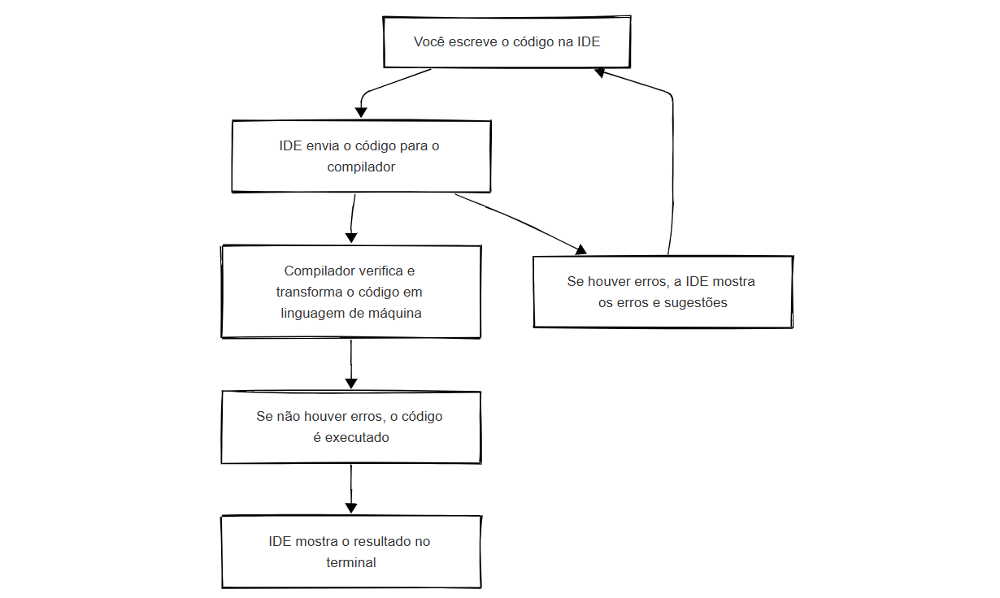

# Curso Alura - C#: criando sua primeira aplicação

## Aula 1 - Criando o primeiro programa

### Aula 1 - Apresentação - Vídeo 1

Transcrição  
Guilherme: Olá, meu nome é Guilherme Lima e sou formado em Sistemas de Informação. Já trabalhei com alguns projetos focados em linguagens de alto nível, como JavaScript, Python e Go, e agora vou te acompanhar nessa aventura com o C#!

Guilherme é um homem branco, de cabelo curto castanho, olhos castanhos, e barba curta castanha. Ele usa um óculos de armação preta e quadrada, e veste uma camisa preta com a estampa branca "The Beatles". Ele está sentado à esquerda de uma mesa preta com um computador e um microfone à sua frente, e ao fundo há uma parede iluminada em lilás com o logo da Alura sobre um painel preto.

Daniel: Olá, eu sou o Daniel Portugal, e assim como o Guilherme, sou graduado em Sistemas de Informação. Trabalho com desenvolvimento há 20 anos, especialmente com C# e .NET, mas também outras linguagens, como JavaScript.

Daniel é um homem branco, de cabelo curto preto, olhos pretos e bigode preto. Ele usa óculos de armação preta e quadrada, e veste uma camisa preta com a estampa roxa "Black Sabbath". Ele está sentado à direita da mesa em frente ao instrutor Guilherme, também com um computador e um microfone à sua frente, e com o mesmo cenário lilás ao fundo.

Guilherme: Estamos muito felizes por ter você nesse curso sobre C#!

Daniel: Ao longo do curso, construiremos um projeto do zero, chamado Screen Sound, em que faremos registros e avaliações de bandas, além de visualizar a média de avaliação.

Com esse projeto, conheceremos o C#, sua sintaxe, e também alguns recursos que vão nos ajudar no desenvolvimento do projeto. Correto, Gui?

Guilherme: Isso mesmo! Como pré-requisito para essa formação, é importante que você tenha assistido aos cursos de lógica de programação. A partir desse conhecimento, daremos continuidade ao tema e nos aprofundaremos de fato como funciona o C# e a estrutura do .NET.

Daniel: Estou curioso!

Guilherme: Vamos iniciar nossos estudos e colocar a mão na massa?!

### Aula 1 - IDE e lógica de programação

Olá!  
Antes de você começar a escrever programas em C#, é importante entender conceitos que guiam a forma como esse código é construído. Nesta atividade, vamos te ajudar a fazer essa ponte entre ferramenta e pensamento lógico.

O que é uma IDE (e por que você precisa de uma)?

Uma IDE é um programa, como qualquer outro que você já usa no computador. Assim como você tem um navegador (como Firefox ou Chrome) para acessar a internet, a IDE é o programa que você vai usar para escrever, testar e rodar seus códigos. Mas ela vai além disso. Uma IDE – Integrated Development Environment (ambiente de desenvolvimento integrado) – é mais do que um editor de texto com destaque de sintaxe. Ela combina editor de código, compilador, depurador, terminal integrado e outras ferramentas que tornam o processo de desenvolver software mais fluido, seguro e produtivo.

Em vez de você precisar usar várias ferramentas separadas (um editor para escrever, um terminal para compilar, outro programa para rodar o código), a IDE centraliza tudo em um só lugar.

Além disso, ela oferece:

- Autocompletar inteligente (com base em contexto e tipo dos dados)
- Detecção de erros em tempo real
- Depuração passo a passo, com breakpoints e visualização de variáveis
- Templates e assistentes para começar projetos mais rápido
- Integração com plataformas de nuvem e bancos de dados

Ou seja, a IDE ajuda você a se concentrar na lógica do seu código, em vez de perder tempo com tarefas manuais e repetitivas. Funciona da seguinte forma:



Visual Studio x Visual Studio Code: qual escolher?

Uma IDE bastante comum para escrever códigos em C# é o Visual Studio, criado pela própria Microsoft. Ele é o ambiente oficial para desenvolvimento com .NET, e é amplamente usado por profissionais que desenvolvem sistemas web, aplicações desktop, APIs, jogos, entre outros.

Mas existe também uma segunda opção, que é o Visual Studio Code, também da Microsoft — e apesar dos nomes parecidos, eles são ferramentas bem diferentes.

Visual Studio (IDE completa)

- Voltado para desenvolvimento .NET, C#, ASP.NET, Azure, Blazor, entre outros.
- Recomendado para projetos profissionais, corporativos ou complexos.
- Traz suporte nativo a testes automatizados, modelagem visual de dados e interface gráfica.
- É mais pesado e roda oficialmente só em Windows e Mac.

Visual Studio Code (editor leve + extensões)

- É um editor de código leve, rápido e multiplataforma (Linux, Windows e macOS).
- Funciona como um "canivete suíço": com as extensões certas, você transforma ele em um - ambiente poderoso.
- Para C#, você vai precisar instalar a extensão da linguagem + .NET SDK.

Nas próximas aulas iremos ensinar a instalar ambas ferramentas no sistema operacional de sua preferência.

Lógica de programação

É a capacidade de descrever soluções de problemas usando sequências bem definidas de instruções. É ela que conecta o que você quer fazer com o que o computador precisa para entender.


Para programar bem, você precisa pensar de forma estruturada:

- Entrada → processamento → saída: essa é a base de qualquer programa.
- Estruturas de controle: comandos que permitem tomar decisões e repetir tarefas.
- Estrutura de dados: organiza as informações que serão manipuladas no seu código.
- Funções: formas de reutilizar lógica, organizando o código em blocos nomeados, cada um com uma responsabilidade específica.

Pense em lógica de programação como projetar uma receita de bolo. Você precisa dizer exatamente o que fazer, na ordem certa, prevendo todos os cenários possíveis. Quanto mais clara e organizada sua lógica, mais confiável será seu programa. E você deve estar se perguntando: Por que isso importa? Esses conceitos não são apenas "teoria". Eles vão te dar clareza e autonomia na hora de ler erros, organizar seu código, dividir tarefas em etapas menores e buscar ajuda quando precisar. Entender o ambiente (IDE) e o raciocínio lógico é o que vai te tornar uma pessoa desenvolvedora com base sólida, independente da linguagem ou da ferramenta.

> Agora que você estudou alguns conceitos importantes da linguagem, é hora de aplicar tudo na prática! Vamos lá?

### Aula 1 - Preparando o ambiente: Windows - Vídeo 2

Transcrição (o texto era apenas isso)

Se você utiliza o sistema operacional Windows, este vídeo é para você. Caso esteja usando outro sistema (como Linux ou macOS), recomendamos que você pule esta aula e vá diretamente para a que corresponde ao seu sistema operacional. Isso garante que você siga as instruções corretas para a sua máquina.

### Aula 1 - Preparando o ambiente: Linux

Se você está começando a programar em C# e usa Linux, este guia é para você! Antes de escrever seus primeiros códigos, é necessário configurar o ambiente de desenvolvimento corretamente. Mas talvez você se pergunte: C# não é uma linguagem da Microsoft? Será que funciona no Linux? A resposta é sim! Graças ao .NET, que é multiplataforma, você pode desenvolver aplicações C# no Linux com tranquilidade.

Neste passo a passo, vamos instalar o .NET SDK, um conjunto de ferramentas necessário para criar, compilar e testar aplicações em C# no Linux. Com o SDK instalado, você poderá:

- Criar projetos em C#,
- Escrever e editar seu código,
- Executar e testar diretamente pelo terminal.

Vamos focar na instalação em distribuições baseadas no Debian, como Ubuntu, Linux Mint, Pop!OS, entre outras. Siga as instruções abaixo para instalar o .NET SDK. Importante: Alguns comandos utilizam sudo, que requer permissões de administrador. Ao executá-los, o terminal solicitará sua senha. Digite-a e pressione Enter. Por motivos de segurança, é normal que nenhum caractere seja exibido enquanto você digita.

Atualize os pacotes do sistema

Abra o terminal e execute o seguinte comando:

> sudo apt update && sudo apt upgrade -y

Esse comando atualiza a lista de pacotes disponíveis e instala as atualizações mais recentes para seu sistema, garantindo que tudo esteja em dia antes da instalação do .NET.

Janela de terminal exibindo um comando para atualizar e atualizar pacotes em um sistema Linux, solicitando uma senha

Instale o .NET SDK
No terminal, execute o comando abaixo para realizar a instalação:

> sudo apt install -y dotnet-sdk-8.0

Este comando baixa e instala o SDK da versão 8.0 do .NET, que inclui as ferramentas necessárias para compilar e rodar aplicações em C#.

Janela de terminal exibindo comandos do Ubuntu, com comando destacado para instalar o .NET SDK versão 8.0

Verificando a instalação
Você pode executar o seguinte comando para verificar se o SDK foi instalado corretamente:

> dotnet --version

Se tudo estiver certo, o terminal mostrará o número da versão instalada (por exemplo: 8.0.100), confirmando que o SDK está pronto para uso.

Saída do terminal mostrando o processo de instalação do .NET 8.0.116 no Ubuntu, indicando as etapas de preparação e configuração do pacote

Com o .NET SDK instalado, seu ambiente está preparado para começar a desenvolver aplicações em C# no Linux. Agora você pode criar seus primeiros projetos, escrever códigos diretamente no editor de sua preferência e executar tudo pelo terminal. Se ainda não escolheu um editor, recomendamos o Visual Studio Code. Ele é leve, flexível, funciona muito bem no Linux e, com a extensão do C# instalada, oferece recursos como autocompletar, realce de sintaxe e muito mais.

Se quiser começar agora, abra o terminal e experimente criar um novo projeto com:

dotnet new console -n MeuPrimeiroApp
cd MeuPrimeiroApp
> dotnet run

Isso criará e executará um programa em C# que exibe "Hello, World!" no terminal.

Te vejo na próxima atividade!

### Aula 1 - Preparando o ambiente: macOS - Vídeo 3

Transcrição  
Se você utiliza o sistema operacional macOS, este vídeo é para você. Caso esteja usando outro sistema (como Linux ou Windows), recomendamos que você pule esta aula e vá diretamente para a que corresponde ao seu sistema operacional. Isso garante que você siga as instruções corretas para a sua máquina.

### Aula 1 - Preparando o ambiente: Visual Studio Code - Vídeo 4

Transcrição  
Se você já usa o Visual Studio Code e quer utilizá-lo para programar em C#, este vídeo é para você.

### Aula 1 - Primeiro programa - Vídeo 5

Transcrição  
Guilherme: Com o Visual Studio aberto, inicialmente temos o primeiro programa feito com C#: o Hello World (arquivo Program.cs). Ao executá-lo, é aberto apenas o terminal com a seguinte mensagem:

Terminal na máquina do instrutor Guilherme:

```C#
Hello, World!

O C:\Users\guilherme\source\repos\PrimeiroProjeto\PrimeiroProjeto\bin\Debug\net7.0\PrimeiroProjeto.exe (processo 26844) foi encerrado com o código 0.
Pressione qualquer tecla para fechar esta janela…
```

Nosso objetivo é desenvolver uma aplicação back-end para um sistema de músicas. Criaremos então uma aplicação de streaming com diversos artistas, bandas e músicas, mas o foco não será a parte visual, e sim o back-end da aplicação.

Dito isso, aprenderemos a armazenar músicas e a manipular determinados conteúdos, como registrar ou avaliar bandas… Faremos tudo isso com o C#!

Retornando ao Visual Studio, temos o código do programa "Hello, World!". Ele é formado apenas por uma primeira linha de comentário e por uma segunda linha contendo o comando Console.WriteLine(), adicionado quando iniciamos o programa.

Vamos remover ambas as linhas e começar a desenvolver a nossa aplicação.

Daniel: O nome do nosso projeto será Screen Sound, correto?

Guilherme: Exatamente. Começaremos o código com um comentário contendo o nome da aplicação de músicas. Para isso, utilizamos o sinal //.

> // Screen Sound

O primeiro ponto importante que precisamos entender em relação ao C# é que se trata de uma linguagem fortemente tipada. O que isso significa, Daniel?

Daniel: Significa que precisamos sempre declarar o tipo das variáveis criadas. Podemos iniciar declarando uma variável que represente uma mensagem de boas-vindas ao nosso projeto.

Guilherme: Legal! Quando vamos escrever um texto, geralmente usamos aspas duplas.

Em JavaScript e algumas outras linguagens, podemos escolher entre aspas simples ou aspas duplas. Em C#, existe a possibilidade de usar aspas simples, mas não é esse o caso.

Escreveremos a seguinte mensagem entre as aspas:

```C#
// Screen Sound
"Boas vindas ao Screen Sound"
```

Porém, não é somente dessa forma que criamos uma variável. Precisaremos adicionar algumas outras informações, certo, Daniel?

Daniel: Sim, a informação com a mensagem de boas-vindas precisa estar armazenada em uma variável. Criaremos a nossa primeira variável do tipo string (que representa um texto) e a chamaremos de mensagemDeBoasVindas. Vamos adicionar então ambos os elementos seguidos de um sinal de =, separando a declaração da variável e a mensagem de fato.

```C#
// Screen Sound
string mensagemDeBoasVindas = "Boas vindas ao Screen Sound"
```

Guilherme: Feito isso, ainda aparenta existir um problema no fechamento das aspas duplas. Ao posicionar o cursor sobre ela, temos a seguinte informação:

CS1002: ; esperado

O que esse último dado significa, Daniel?

Daniel: Significa que toda instrução no C# precisa ser terminada com ponto e vírgula. Essa é a indicação feita pelo computador.

```C#
// Screen Sound
string mensagemDeBoasVindas = "Boas vindas ao Screen Sound";
```

Guilherme: Colocamos o ponto e vírgula e a notificação do erro desapareceu. Porém, a variável mensagemDeBoasVindas também está marcada com um sublinhado. Posicionando o cursor sobre ela, temos a mensagem abaixo:

CS0219: A variável "mensagemDeBoasVindas" é atribuída, mas seu valor nunca é usado

Ou seja, temos um espaço na memória para a variável, mas não usamos o conteúdo.

Daniel: Perceba que no compilador, o Visual Studio dá feedbacks visuais imediatos. No fechamento das aspas, havia um indicador vermelho que representa um erro. No caso acima, o indicador visual (isto é, o sublinhado) é verde, representando que a variável foi declarada, mas não utilizada.

Guilherme: Antes de começar a usar a variável, vamos deixar a nossa tela um pouco mais limpa em relação aos conteúdos, para focar apenas no código.

Podemos, por exemplo, fechar o Gerenciador de Soluções na lateral direita do Visual Studio. Temos a opção de clicar no botão "X" ou de usar o atalho "Shift + Esc". Além disso, podemos fechar a aba inferior "Saída", onde está selecionada a opção "Mostrar saída de: Compilação".

Dessa forma, teremos somente o código exibido na tela.

Daniel:

No caso da aba "Saída", quando executarmos novamente o programa, o processo de compilação também será executado, então pode ser que essa aba volte a aparecer.

Guilherme: Agora vamos usar o comando Console.WriteLine(). Entre parênteses, vamos passar o nome da variável mensagemDeBoasVindas.

```C#
// Screen Sound
string mensagemDeBoasVindas = "Boas vindas ao Screen Sound";
Console.WriteLine(mensagemDeBoasVindas);
```

Lembre-se: não colocamos a variável entre aspas, pois queremos exibir seu próprio conteúdo, e não de fato o texto "mensagemDeBoasVindas".

Note que a variável é composta por 4 palavras, sendo que as 3 últimas são iniciadas com letra maiúscula. Quando trabalhamos com variáveis, seguimos o padrão Camel Case.

Daniel: Nesse padrão, a primeira palavra começa com letra minúscula e o restante com letra maiúscula.

Guilherme: Agora vamos executar o código! Para isso, temos o botão "Iniciar Sem Depurar" (ícone ▶), localizado na barra superior do Visual Studio. Caso prefira, você pode usar o atalho "Ctrl + F5".

Após a execução, é aberta novamente a aba "Saída", exibindo a saída de compilação. Finalizado o processo, o programa será aberto em outra janela chamada "Console de Depuração do Microsoft Visual Studio", onde teremos a mensagem de boas-vindas:

Terminal na máquina do instrutor Guilherme:

Boas vindas ao Screen Sound

```C#
O C:\Users\guilherme\source\repos\PrimeiroProjeto\PrimeiroProjeto\bin\Debug\net7.0\PrimeiroProjeto.exe (processo 22548) foi encerrado com o código 0.
Pressione qualquer tecla para fechar esta janela…
```

Temos um programa melhor, com conceitos que fazem sentido para todo o desenvolvimento a seguir.

Conforme dito anteriormente, a C# é uma linguagem fortemente tipada, então definimos o tipo, o nome da variável com a qual vamos trabalhar, e depois passamos o valor do conteúdo para o comando Console.WriteLine(). Dessa forma, conseguimos utilizar nossas variáveis!

### Aula 1 - Hello World - Exercício

O "Hello World" é geralmente o primeiro programa que um iniciante em programação escreve em uma nova linguagem de programação. Essa tradição se iniciou em um tutorial que foi desenvolvido pela Bell Labs em 1972 para ensinar a programação em C. O programa em C simplesmente exibia a mensagem "Hello, World!" na tela do computador.

Desde então, a tradição se espalhou e tornou-se uma forma comum de iniciar o aprendizado em programação em várias outras linguagens, incluindo C#, Java, Python e muitas outras.

Sabendo disso, analise as informações abaixo e marque aquela com a finalidade de exibir uma mensagem no console com a mensagem Hello World.

Dica: para testar essa e as demais atividades, você pode usar o Tutorial interativo do C# clicando neste link e clicar no botão entrar no modo de foco.

Resposta:  
Console.WriteLine("Hello World!");

> Isso aí! Escrever um "Hello World" é uma forma simples e rápida de testar se o ambiente de desenvolvimento da linguagem de programação está funcionando corretamente.

### Aula 1 - Bastidores de um programa C# - Vídeo 6

Transcrição  
Olá! Nesse vídeo, Daniel Portugal trouxe um aprofundamento para a dúvida que surge na cabeça de todo estudante: como funciona a mágica entre eu escrever código e o programa rodar, de fato? Para isso, vamos sair um pouco do Visual Studio e entender o que é necessário para executar um código C#!

Estamos com o Visual Studio aberto, utilizando um programa em C#, no caso, o programa Screen Sound. Queremos executar esse programa. Para isso, clicamos no botão com um ícone de triângulo verde, que no nosso caso está associado ao projeto chamado Primeiro Projeto, relacionado ao Screen Sound. Ao clicar, uma tela do terminal aparece com a execução do programa. No entanto, houve um problema: precisamos instalar ou atualizar o .NET para rodar a aplicação.

Processo de Execução Manual no Terminal  
Vamos discutir o que ocorre quando clicamos no botão de execução do Visual Studio até a exibição do programa no terminal. Para isso, deixaremos de utilizar o Visual Studio, mostrando o processo de forma mais didática. Fechamos o Visual Studio e abrimos um novo terminal. É importante fechar o Visual Studio para não interferir no processo, assumindo-o manualmente.

No terminal, navegamos para a pasta onde está o programa C#, usando o comando cd para acessar a pasta "src/repos/alura/CSharp". Dentro dessa pasta, encontramos duas subpastas, "bin" e "obj", além de arquivos como PrimeiroProjeto.csproj e Programa.cs. Vamos limpar a pasta removendo os diretórios "bin" e "obj" com o comando rmdir e listar novamente os arquivos para confirmar a remoção.

Compilação e Execução de Programas .NET  
O processo de execução de um programa .NET ocorre em dois passos: compilação e execução. A compilação transforma o código C# em uma saída utilizável no ambiente de execução do .NET. As pastas "obj" e "bin" são criadas nesse processo. A pasta "obj" contém objetos intermediários, enquanto a "bin" contém os arquivos finais para execução.

Para compilar, usamos o comando dotnet build, que cria as pastas "bin" e "obj". A pasta "obj" acelera o processo de compilação, pois armazena objetos intermediários, evitando recompilar todos os arquivos C#. A pasta "bin" mantém os arquivos finais para execução.

Após a compilação, o segundo passo é a execução, que utiliza o comando dotnet run. No entanto, ao tentar executar, recebemos a mensagem de erro indicando a necessidade de instalar ou atualizar o .NET. Isso ocorre porque o framework de destino não está instalado na máquina.

Ajuste do Projeto para Versão Correta do .NET  
Para resolver, ajustamos o projeto para uma versão do .NET que está instalada. No arquivo de projeto, PrimeiroProjeto.csproj, alteramos a tag TargetFramework para uma versão disponível, como a 8. Após salvar a alteração, recompilamos e executamos novamente com dotnet run. Com o framework correto, o programa é executado com sucesso.

Estrutura de Pastas e Propósitos de Execução  
Uma coisa interessante é que, ao executar um dir, podemos ver o arquivo bin. Se fizermos dir /bin/debug, estaremos listando tudo o que está dentro da parte chamada debug. Vamos explicar o que há dentro dessa pasta. Agora, temos tanto uma pasta .NET 7 quanto .NET 8. Foi necessário recompilar a aplicação, agora apontando para o target framework 8. Quando executamos o dotnet run, o sistema percebeu que precisávamos dos arquivos finais no .NET 8 e fez a compilação para essa versão.

A pasta debug é algo que ainda não discutimos. Observem a estrutura de pastas dentro da pasta bin, que contém os arquivos finais. Temos a pasta bin, e dentro dela, uma pasta chamada debug, que contém os arquivos finais para cada framework de destino. O que significa debug? Refere-se ao objetivo da execução. Queremos executar o programa para depuração, ou seja, para diagnósticos. Se houver algum erro ou dúvida sobre a lógica utilizada, podemos fazer uma depuração. Lembre-se de que ainda não é o arquivo final para publicação ou entrega ao cliente. Quando entregarmos ao cliente, otimizaremos ainda mais o processo, tornando a compilação mais enxuta e a execução final mais rápida. O processo de depuração deixa o arquivo mais completo, permitindo parar a aplicação em um determinado ponto de execução para verificação. Isso requer carregar os símbolos utilizados, e a depuração compila usando mais informações e metadados.

Publicação do Programa  
Para publicar o programa, podemos executar dotnet run com o propósito de fazer uma publicação ou release. Ao fazer isso, uma nova pasta chamada Release é criada dentro da pasta bin. Essa pasta indica que o objetivo agora é entregar ao cliente, tornando os arquivos mais enxutos e a execução mais otimizada. Podemos compilar a aplicação para diferentes propósitos. As duas configurações padrão do .NET são Debug para depuração e Release para publicação. É possível criar configurações próprias, mas isso não será abordado neste vídeo.

Recapitulação do Processo de Compilação e Execução  
Recapitulando, tivemos a compilação com dotnet build, que cria as pastas bin e obj. Depois, executamos o arquivo final na pasta bin, dependendo do propósito e configuração, seja Debug ou Release, em um framework de destino. Encontramos um erro por não ter a versão 7 do framework de destino, mas ao mudar para 8, conseguimos executar o Screen Sound no terminal. A execução de um programa C# ocorre em dois passos: compilação e execução.

Funções da Common Language Runtime (CLR)  
A execução acontece dentro de uma máquina virtual chamada CLR (Common Language Runtime). Vamos falar sobre essa máquina virtual e seus componentes. A CLR gerencia a memória, alocando e desalocando objetos dentro dos limites definidos para o processo em execução. Isso torna os programas C# gerenciados, pois são executados dentro de uma CLR que monitora e limita o acesso à memória. A CLR também garante a segurança do código, impedindo ações maliciosas no computador, como acesso indevido ao processador, memória ou disco.

Outra função da CLR é o tratamento de exceções. Se ocorrer um erro de execução, ela fornece mecanismos para lidar com isso. Aprenderemos a lidar com exceções no código, mas a CLR já oferece esses mecanismos. Além disso, a CLR gerencia threads, permitindo execuções paralelas de tarefas, algo que aprenderemos a fazer.

A função mais importante da CLR é executar o código. Ela pega o código IL (Intermediate Language), que está na pasta bin, e o transforma em código para a máquina específica onde está sendo executado. Isso é feito de forma inteligente pelo Just-In-Time Compiler, que compila apenas o que está sendo executado no momento, tornando o programa mais rápido. No exemplo do Screen Sound, temos vários menus, e o Just-In-Time Compiler compila apenas os métodos chamados pela primeira vez, armazenando-os em cache para uso posterior.

Conclusão e Recursos Adicionais  
Para finalizar, vamos recapitular visualmente no slide tudo o que discutimos. A execução de um programa C# no Visual Studio envolve dois passos: compilação e execução. Na compilação, o código é transformado em linguagem intermediária nas pastas .obj e .bin usando o comando dotnet build. A pasta .obj contém objetos intermediários para acelerar a compilação de projetos com muitos arquivos C#, enquanto a pasta .bin contém o arquivo final para o destino necessário, como .NET 7, .NET 8, Debug ou Release.

O comando dotnet build está disponível ao fazer o download do SDK (Software Development Kit). Ao instalar o Visual Studio, o .NET SDK é instalado, fornecendo o comando para compilar um programa C#. Na execução, o arquivo com extensão csproj indica o projeto a ser executado, e uma runtime de destino ou Target Framework é necessária. Durante a execução, o código intermediário é compilado em código nativo pelo Just-In-Time Compiler. Para executar, basta fazer o download da CLR, sem necessidade do SDK.

Se apenas quisermos executar programas .NET, não precisamos instalar o SDK, que é um download maior. Como pessoas desenvolvedoras, teremos o SDK instalado, mas ao executar o programa em uma máquina de cliente, apenas a CLR é necessária. Para finalizar, vamos abrir uma página da Microsoft com os downloads disponíveis. O link será disponibilizado na transcrição do vídeo. A página de download mostra as distinções discutidas. Na coluna da esquerda, temos os downloads do SDK para todas as plataformas, pois o .NET é multiplataforma desde 2015 com o .NET Core. O SDK permite programar no Linux, macOS e Windows, e inclui suporte para o Visual Studio 2022, além de runtimes para programas de console, web e desktop.

Na coluna da direita, temos os downloads apenas para os runtimes, para executar o código em linguagem intermediária. Há runtimes para ASP.NET, programas web, e recomenda-se instalar o Hosting Bundle no Windows, que inclui o .NET Runtime e suporte para o IIS, um programa da Microsoft para servir sites web. Também há o Desktop Runtime e um runtime genérico para programas de console. O SDK é para pessoas desenvolvedoras, enquanto os runtimes são para execução de programas.

Concluímos a explicação sobre a execução de um programa C#. Esperamos que tenham gostado e nos encontraremos novamente na próxima vez. Até lá!

### Aula 1 - CLI do .NET - Vídeo 7

Transcrição

>[Documentação do .NET CLI](https://learn.microsoft.com/pt-br/dotnet/core/tools/)

No vídeo anterior, discutimos os bastidores da execução de um programa em C#. Demonstramos como, ao entrar no terminal, digitamos dois comandos: dotnet e build. Mas do que se trata isso? Trata-se do .NET CLI, que significa Command Line Interface (Interface de Linha de Comando). Essa ferramenta permite que digitemos comandos diretamente no terminal.

Funções e Ciclo de Vida do .NET CLI  
O .NET CLI é uma ferramenta que apoia o ciclo de vida do desenvolvimento de aplicações .NET, utilizando comandos no terminal. Quando falamos de ciclo de vida, referimo-nos a todo o processo, desde a criação de projetos e artefatos, passando por tarefas rotineiras como compilação, teste e limpeza, até tarefas mais específicas. Por exemplo, podemos querer adicionar um segredo de usuário, uma string de conexão de banco de dados ou uma chave de API adquirida por uma empresa, integrando-a a um sistema de criptografia. Essas são ações pontuais, mas fazem parte do ciclo de desenvolvimento de uma aplicação .NET.

Além disso, o .NET CLI oferece ferramentas para a etapa final, onde publicamos nossa aplicação .NET. Embora tenhamos visto isso através da execução, existem outros comandos disponíveis para completar o ciclo de vida, desde o início até a entrega final de uma aplicação .NET.

Histórico e Motivação do .NET CLI  
O .NET CLI foi introduzido juntamente com o .NET Core, a versão multiplataforma do .NET, em 2015. Antes disso, a experiência de desenvolvimento era fragmentada, com diferentes ferramentas e interfaces, algumas visuais e outras baseadas em terminal. Isso tornava o processo complicado, exigindo o aprendizado de várias ferramentas para completar o ciclo de desenvolvimento de uma aplicação .NET. O .NET CLI foi criado para ser utilizado de forma uniforme em várias plataformas, como Windows, Linux e macOS, permitindo que o mesmo comando seja usado em qualquer sistema operacional, proporcionando uma experiência mais fluida para a pessoa desenvolvedora.

Há um artigo interessante de Scott Hanselman, um dos líderes no processo de criação do .NET CLI, que explica a lógica e a motivação histórica por trás de sua criação. O artigo, datado de dezembro de 2015, detalha como ele buscava simplificar o processo, permitindo que comandos como dotnet new, restore e run fossem suficientes para realizar o trabalho. Esse artigo é uma leitura recomendada para quem deseja explorar mais sobre o contexto histórico do .NET CLI.

Estrutura e Funcionamento do .NET CLI  
Por fim, para entender a estrutura e o funcionamento do .NET CLI, é essencial acessar a documentação. Como pessoas desenvolvedoras, frequentemente precisamos aprender sobre bibliotecas, frameworks e paradigmas de desenvolvimento, o que requer a leitura de documentação técnica. Vamos acessar a documentação do CLI, e o link para isso será disponibilizado na transcrição do vídeo.

Não vamos nos estender muito aqui, pois é algo que podemos fazer com calma. Basicamente, precisamos mostrar a estrutura do comando. Existe algo que chamamos de driver. O termo é driver, e a palavra é dotnet. Escrevemos dotnet, entramos nesse executável e executamos a ferramenta .NET CLI. Em seguida, colocamos o comando que desejamos executar.

Comandos Básicos do .NET CLI  
Temos duas opções: podemos executar um programa, como na terceira linha, onde estamos executando um programa. Não há o comando run que aprendemos, mas ele está embutido aqui. Existem outras maneiras de usar o .NET CLI, como indicamos nas duas primeiras linhas: dotnet new e dotnet build, que também são formas de uso. Sempre há o driver, que em português seria "motorista", mas a palavra inicial é dotnet. Após um espaço, fazemos algo usando essa ferramenta de desenvolvimento.

A partir do comando, temos vários argumentos que utilizamos, dependendo do comando que queremos usar. Existem comandos básicos que são entregues com a instalação do .NET CLI. Esses comandos facilitam o ciclo de vida, como criação de artefatos e tarefas rotineiras, como compilação, adição de pacotes e bibliotecas no projeto. Também há tarefas não tão rotineiras, como clean, help, store, watch, que estão disponíveis nos comandos básicos da CLI.

Temos o comando publish, que é usado para a entrega de uma aplicação, colocando todos os artefatos em uma pasta para a entrega da aplicação. Ao clicar em cada link, obtemos informações sobre cada comando especificamente.

Simulação de Criação e Execução de Projeto  
O dotnet new e o dotnet build são comandos que já usamos. Indicamos o projeto e a solução. O run também foi um comando que executamos. Usamos o comando -c para mudar para release. Se não colocássemos nada, ele usaria a configuração padrão debug, que é nosso propósito de execução. Já utilizamos alguns comandos em vídeos anteriores.

Essa ferramenta de desenvolvimento auxilia no processo e no ciclo de vida. Vamos simular rapidamente a criação e execução de um projeto usando apenas o terminal e o .NET CLI. Com o terminal aberto, podemos fazer o mesmo. Clique no botão do Windows, digite "terminal" ou "prompt", e teremos a tela preta. Aumentaremos o zoom para enxergar os comandos que vamos digitar. Vamos simular a criação de uma aplicação até sua execução, sem fazer a publicação, que veremos em outros cursos. Vamos simular o ciclo de vida desde a criação de um projeto até sua execução.

Primeiro, navegamos para uma pasta onde costumamos colocar nossos projetos, como "source" ou "repos" na Alura. Aqui estão todos os projetos desenvolvidos para a Alura. Vamos criar um projeto nesta pasta. O comando que usamos é dotnet, lembrando que o driver é sempre esse, e o comando é new. O comando new cria um novo projeto, mas precisamos especificar o tipo de projeto. Vamos criar um projeto simples do tipo console, chamado "console". Vamos nomear o projeto como "segundo projeto", pois já temos um primeiro. Então, dotnet new console -n "segundo projeto" cria um projeto console, especificando o tipo e o nome do projeto. Ao pressionar enter, ele indica que o modelo de aplicativo de console foi criado com êxito em uma pasta chamada "segundo projeto" e criou um arquivo com extensão .csproj.

Vamos navegar para a pasta "segundo projeto" e listar os arquivos. Estamos familiarizados com os arquivos: uma pasta "obj" que mantém a compilação de objetos intermediários, um arquivo Program.cs e um arquivo de projeto indicando metadados e o framework de destino. Vamos ver o que há dentro do Program.cs usando o notepad. O arquivo contém apenas um "hello world". Vamos alterar para "hello .NET CLI", salvar e fechar.

Agora, queremos executar o programa e exibir na tela nosso "hello .NET CLI". Após criar o projeto, queremos compilar. Já alteramos o nome do programa para "hello .NET CLI" e agora queremos compilar para executar. O comando é dotnet build, que tenta fazer o build do projeto ou do arquivo .csproj dentro da pasta. Podemos indicar o nome do arquivo se houver vários .csproj na mesma pasta. Ele compila o projeto, atualiza os objetos intermediários na pasta "obj" e cria uma pasta "bin" com os arquivos finais na estrutura de destino indicada no projeto. Ao listar, já temos a pasta "bin", que contém nosso debug, o propósito de execução, e dentro da pasta "bin/debug" temos o .NET framework de destino, no caso, a versão mais atual, .NET 9.

Podemos executar com dotnet run. Se não indicarmos nada, ele executa o .csproj na pasta. Ao pressionar, ele exibe a mensagem atualizada que editamos no console. Mostramos rapidamente alguns comandos para trabalhar com o .NET CLI. Não aprofundamos nos outros comandos, mas a documentação está disponível na página da Microsoft para consulta.

Vantagens e Extensibilidade do .NET CLI  
O .NET CLI é uma ferramenta de desenvolvimento moderna. As pessoas desenvolvedoras estão acostumadas a começar o desenvolvimento usando terminais, além das IDEs. A curva de entrada é rápida: entramos no terminal, criamos projetos e começamos a desenvolver. É uma ferramenta moderna e atual em termos de desenvolvimento. Além disso, oferece uma experiência uniforme em todas as plataformas. Os mesmos comandos que explicamos no Windows podem ser executados no Linux e macOS, o que é bastante interessante.

O .NET CLI permite automatizar tarefas, criar scripts para pipelines de distribuição de aplicações, criar imagens em containers e automatizar a criação de ambientes inteiros para execução. Veremos isso em cursos futuros da Alura. Outra característica importante é que é extensível. Podemos criar nossos próprios comandos e instalar comandos de terceiros. Veremos comandos de terceiros em cursos futuros, como quando trabalharmos com acesso a banco de dados usando a biblioteca Entity Framework Core, que possui seus próprios comandos do .NET CLI. Ferramentas de terceiros podem estender o .NET CLI com mais comandos, e nós também podemos fazer isso.

O .NET CLI é uma ferramenta moderna, uniforme, automatizável e flexível, que auxilia bastante no ciclo de vida de desenvolvimento de aplicações .NET.

### Aula 1 - Desafio: hora da prática

A prática é um elemento essencial ao iniciar os estudos em programação, pois é por meio da aplicação prática dos conceitos teóricos que se solidificam os conhecimentos. Ao escrever código, resolver problemas e construir projetos reais, os iniciantes não apenas internalizam a sintaxe das linguagens de programação, mas também desenvolvem a habilidade de pensar logicamente e abordar desafios de maneira eficiente.

Pensando nisso, criamos uma lista de atividades (não obrigatórias) focada em prática para melhorar ainda mais sua experiência de aprendizagem. Bora praticar então?

- Criar uma variável chamada curso, e guarde nela o nome do curso estudado.
- Mostrar o conteúdo da variável curso no console.
- Criar uma variável chamada nome e outra chamada sobrenome e guardar nelas seu nome e sobrenome.
- Mostrar na tela o nome dos instrutores do curso.

Opinião do instrutor

Para te ajudar a verificar seus códigos, disponibilizamos uma lista com as possíveis soluções no Github.

Boa sorte nos estudos!

### Aula 1 - Para saber mais: Documentação da linguagem

É normal, ao decorrer do aprendizado, surgirem dúvidas: como usar determinada função, se existe outra forma de resolver um problema, ou o que exatamente um comando faz. Essa fase faz parte do processo de aprender a programar. Em vez de decorar tudo, o importante é saber onde e como buscar respostas confiáveis e é aí que a documentação oficial entra como uma ferramenta indispensável para qualquer pessoa desenvolvedora.

O que é uma documentação?  
A documentação oficial de uma linguagem de programação é como um manual técnico completo, criado pela equipe que desenvolve a linguagem. No caso do C#, a Microsoft mantém uma documentação robusta, que explica o funcionamento de funções, classes, bibliotecas, estruturas de linguagem, além de fornecer exemplos, observações de uso e boas práticas.

Ela é organizada em seções, muitas vezes com buscas por palavras-chave, tópicos relacionados e links diretos para exemplos de código, tudo pensado para ajudar no dia a dia do desenvolvimento.

Preciso ler tudo?  
Não. Um erro comum é achar que você precisa “estudar a documentação inteira”. Na prática, a consulta à documentação é sob demanda. Isso significa que você a utiliza quando precisa entender um recurso específico. Por exemplo, se estiver em dúvida sobre como criar uma lista (List<T>), você pode procurar esse termo e ler apenas aquela parte.

Com o tempo, conforme vai consultando repetidamente, você começa a se familiarizar com a estrutura e a navegar mais rapidamente entre os tópicos.

Por que usar a documentação?

- Porque é oficial, confiável e está sempre atualizada.
- Porque explica o porquê das coisas.
- Porque ajuda você a escrever códigos mais corretos, limpos e seguros.
- E principalmente, porque desenvolve em você uma autonomia técnica. Você aprende a resolver problemas por conta própria.

Como aproveitar melhor?

- Guarde os links da documentação nos seus favoritos.
- Leia com calma o trecho que responde sua dúvida — sem precisar se aprofundar em tudo de uma vez.
- Teste os exemplos no seu próprio código.
- Reforce sua busca com palavras-chave precisas (ex: "C# string format").

Links de documentações de C#:

- [Documentação do C# (Microsoft Learn)](https://learn.microsoft.com/pt-br/dotnet/csharp/tour-of-csharp/)
- [API .NET – Referência das bibliotecas e classes](https://learn.microsoft.com/pt-br/dotnet/api/)
- [Documentação do Visual Studio](https://learn.microsoft.com/pt-br/visualstudio/)

Desenvolver o hábito de consultar a documentação oficial te torna uma pessoa desenvolvedora muito mais preparada para lidar com desafios reais. Ao invés de decorar tudo, você aprende a navegar pelas ferramentas que já existem. Comece incorporando isso na sua rotina de estudos, e com o tempo, você vai ganhar velocidade e confiança no seu processo de aprendizagem.

Compartilhe no fórum: Qual foi a primeira vez que você consultou a documentação? O que descobriu? Como isso te ajudou?

### Aula 1 - História do C# - Vídeo 8

Transcrição  
O C# está completando 25 anos! Você já se perguntou sobre a história e a origem desta linguagem? Qual é a relação entre C# e .NET? Quais foram as versões lançadas até hoje? Atualmente, estamos na versão 13 do C#! E como o C# está sendo utilizado hoje em dia? Está sendo usado conforme o proposto inicialmente? Vamos explorar um pouco sobre essa história e evolução da linguagem.

Contexto Histórico e Motivação  
Primeiramente, vamos abordar o contexto histórico que motivou a criação do C#. Em seguida, passaremos por uma linha do tempo para conhecer os recursos lançados em cada versão. Também discutiremos a diferença entre C# e .NET, termos que serão frequentemente mencionados ao longo desta história. Finalmente, falaremos sobre o uso atual do C#.

Nos anos 90, a Microsoft dominava o mercado de software, liderando sistemas operacionais com o Windows 95 e 98, além do segmento de softwares para escritório com o pacote Office, que incluía Word e Excel. A Microsoft também tinha uma presença significativa no desenvolvimento de software, com ferramentas como o Visual Studio e o VB, uma linguagem de programação usada para desenvolvimento rápido de aplicações.

Na época, o C++ era amplamente utilizado para construir softwares comerciais da Microsoft, como Windows, Office e Internet Explorer, além de softwares de outras empresas, como Photoshop e MySQL. O C++ também era usado no desenvolvimento de jogos, como o famoso Doom, devido ao seu desempenho em processamento de imagens e computação.

Outro evento importante nos anos 90 foi a explosão da web, com a popularização da rede de computadores e o surgimento de navegadores para acessar a internet. Isso gerou uma demanda por sites mais dinâmicos e informações atualizadas constantemente, levando ao desenvolvimento de software para a web.

Desafios e Oportunidades  
Antes da criação do C#, a Microsoft utilizava três grandes linguagens de programação: C++, VB e ASP/VBScript. O C++ era a principal linguagem para desenvolvimento de softwares comerciais, mas apresentava baixa produtividade e uma curva de aprendizado difícil. O VB era usado para programação rápida e produtiva, mas era limitado e não tão moderno quanto outras linguagens emergentes. O ASP e o VBScript eram utilizados para desenvolvimento web, mas eram limitados a esse ambiente.

Durante esse período, houve a consolidação do paradigma de desenvolvimento Orientado a Objetos (OO), que se tornou uma demanda entre as pessoas desenvolvedoras. A Microsoft estava atenta a essas mudanças, incluindo a explosão da web e a popularidade do paradigma OO.

Surgimento do C#  
Nesse cenário, surgiu o Java, uma linguagem orientada a objetos que rodava na web e era multiplataforma, permitindo independência de sistema operacional. Isso representou uma ameaça ao domínio da Microsoft, que buscava uma solução para manter sua relevância no mercado de desenvolvimento de software.

A Microsoft inicialmente licenciou o Java da Sun, criando o Visual J++, mas acabou enfrentando problemas legais devido a modificações que feriam os princípios multiplataforma do Java. Após um processo judicial, a Microsoft foi obrigada a descartar essa versão modificada do Java.

Apesar do fracasso, o projeto Visual J++ trouxe um entendimento interno sobre o funcionamento do Java. A equipe foi realocada para um novo projeto liderado por Anders Hejlsberg, chamado COOL (C-Like Object Oriented Language). Anders tinha um histórico notável, tendo criado o Turbo Pascal e o Delphi.

Lançamento do C# e .NET Framework  
Em 2000, a Microsoft anunciou o lançamento do C# e do .NET Framework na Professional Development Conference (PDC). O C# foi fortemente inspirado no C++, Java e no paradigma orientado a objetos. Era uma linguagem gerenciada, sem acesso direto à memória e hardware, com execução feita pelo .NET Framework, semelhante ao Java.

O .NET Framework permitia o uso de várias linguagens, oferecia uma biblioteca de classes rica e integração profunda com o Windows. O C# e o .NET Framework foram projetados para unificar as linguagens existentes na Microsoft, atendendo a segmentos como software comercial, sistemas transacionais, desktop, jogos e web.

Evolução do C#  
A mudança do nome de COOL para C# ocorreu porque o nome COOL já estava registrado. O nome C#, inspirado na anotação musical de um semitom acima, simboliza uma evolução, um passo além do que já existia, e representa uma evolução do C++.

O símbolo da tralha pode ser visualmente entendido como quatro símbolos de mais, além dos dois mais do C++. Há uma brincadeira com o nome, e o C# representa uma evolução do C++. Essa é a origem do nome. Nos anos 2000, o C# e o .NET surgem com a promessa de oferecer uma linguagem moderna, robusta, produtiva, orientada a objetos e fortemente integrada ao ecossistema Windows, sem problemas de compatibilidade, pois era uma linguagem completamente nova.

Linha do Tempo das Versões do C#  
Vamos falar sobre a linha do tempo das versões do C#. Em 2002, o C# 1 foi lançado publicamente, após ter sido anunciado em 2000, juntamente com o .NET Framework. Desde o início, o C# 1 já oferecia suporte completo à orientação a objetos e era executado em um ambiente gerenciado pelo .NET Framework. O C# 2 e o C# 3 foram lançados em 2005 e 2007, respectivamente. O C# 2 introduziu suporte a Generics (genéricos), um recurso que será abordado nos cursos da Alura. O C# 3 trouxe uma grande revolução estrutural com o recurso chamado LINQ (Language Integrated Query), além de Lambdas e métodos de extensão, transformando significativamente a estrutura dos programas em C#.

O .NET Framework também evoluiu, com a versão 3.5 sendo lançada junto com o C# 3. Em 2010, a versão 4 foi lançada, buscando interoperabilidade com programas escritos em outras linguagens. O C# 5 introduziu suporte à programação paralela e assíncrona. A partir de 2012, a Microsoft mudou sua estratégia, lançando o .NET Framework 4.5 em vez de um .NET Framework 5. Em 2015, o .NET Framework 4.6 foi lançado junto com o C# 6, que focou em tornar a linguagem mais expressiva e com menos linhas de código, facilitando a adoção por iniciantes.

Em 2017, o .NET Core foi lançado com o C# 7 e o .NET Framework 4.7, permitindo a execução de programas C# em múltiplas plataformas, como Linux, MacOS e Windows. Essa mudança visava tornar o .NET multiplataforma. O C# 8 foi lançado com o .NET Framework 8 e o .NET Core 3. Em 2019, a Microsoft unificou todos os .NETs no .NET 5, eliminando as versões separadas do .NET Framework e do .NET Core. O C# 9 introduziu Records, uma versão melhorada de classes, permitindo escrever menos código para representar estruturas de classe.

Em 2021, o C# 10 trouxe melhorias para tornar a linguagem mais expressiva, introduzindo Global Usings. Em 2022, o C# 11 continuou a melhorar a expressividade da linguagem. Em 2023, o C# 12 foi lançado com Construtores Primários, e em 2024, o C# 13 trouxe melhorias em coleções. Este ano, teremos o C# 14 e o .NET 10, com novos recursos ainda a serem anunciados.

Comparação de Código: C# 3 vs C# 13  
Vamos comparar um programa escrito em C# 3 com sua versão atual no C# 13. O programa cria uma lista de nomes, filtra os que começam com a letra A, ordena alfabeticamente e exibe no console. No C# 3, o código era mais extenso e incluía código cerimonial, como a classe Program e o método void Main. Com o C# 13, o código se tornou mais conciso e expressivo, eliminando a necessidade de using, Program e Main, e utilizando métodos como forEach do LINQ.

Multiparadigma e Aplicações do C#  
O C# é uma linguagem multiparadigma, suportando paradigmas imperativo, orientado a objetos, funcional e reativo. Isso permite que pessoas desenvolvedoras com diferentes mentalidades resolvam problemas de maneiras diversas. Além disso, o C# e o .NET são usados em múltiplos propósitos, como desenvolvimento web com ASP.NET Core, jogos com Unity, aplicativos móveis com Xamarin e Maui, programas desktop com Windows Forms e WPF, serviços na nuvem com Azure, e inteligência artificial com bibliotecas de Machine Learning.

O Ecossistema .NET  
O .NET é um ecossistema completo de desenvolvimento, incluindo uma máquina virtual para executar programas, uma biblioteca de classes, frameworks de aplicação, compiladores e ferramentas de desenvolvimento como Visual Studio e Visual Studio Code. A partir do .NET Core, o gerenciamento de dependências foi facilitado com o NuGet.

O .NET evoluiu para três principais versões: o .NET Framework, exclusivo para Windows; o .NET Core, multiplataforma; e o .NET unificado a partir do .NET 5. Essa simplificação visa facilitar a adoção por iniciantes.

Perspectivas de Carreira  
O mercado do .NET é vasto, permitindo o desenvolvimento em diversas áreas, como web, jogos, mobile, desktop e inteligência artificial. Desejamos a todos uma carreira bem-sucedida utilizando o C# e o .NET, e esperamos encontrá-los nos cursos da Alura. Até lá!

### Aula 1 - O que aprendemos?

Aqui está um resumo dos tópicos ensinados nesta aula:  
Preparamos o ambiente de desenvolvimento (Visual Studio) no Windows, Mac e Linux para criar programas com C# na plataforma .Net;

Configuramos do ambiente para desenvolvimento em C# e uma aplicação baseada no console;

Entendemos o conceito de linguagem fortemente tipada e a importância de declarar o tipo da variável que desejamos trabalhar em uma aplicação;

Utilizamos do comando Console.WriteLine para exibir informações na tela e ver o programa que desenvolvemos sendo executado.

Na próxima aula:  
Vamos seguir as boas práticas de programação evitando código duplicado e aprender de forma prática como trabalhar com variáveis de tipos diferentes!

### Aula 1 -  - Vídeo 9
