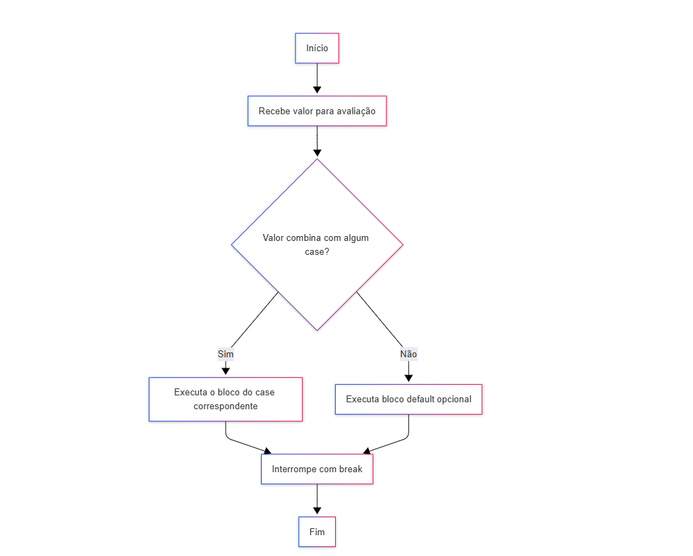

# Curso Alura Praticando C#: condicionais com if/else e switch/case

## Aula 1 - if/else

### Aula 1 - Apresentação - Vídeo 1

Transcrição  
Boas-vindas! Meu nome é Iasmin Araújo, sou instrutora na Escola de Programação da Alura, e irei te acompanhar ao longo dessa jornada de aprendizagem.

Audiodescrição: Iasmin se descreve como uma mulher branca, com cabelo castanho-escuro longo e liso repartido ao meio, sobrancelhas castanho-escuras, e olhos verdes. Ela veste uma blusa azul-marinho, e está sentada em uma cadeira preta e rosa em frente a microfone cinza, com uma parede clara ao fundo iluminada em gradiente azul.

O que vamos aprender?  
O objetivo deste curso é praticar as condicionais. Para isso, abordaremos diversos tópicos:

O que são condicionais e como elas funcionam;

- if e else, palavras-chave utilizadas para trabalhar com condicionais;
- Operadores lógicos e relacionais, utilizados nos blocos if e else;
- Expressões do tipo switch-case e como utilizá-las.

Conclusão

Temos diversos tópicos bastante importantes quando falamos sobre lógica de programação, mas também é interessante praticar todos esses conceitos. Para isso, na sequência, vamos começar a nos aprofundar nos tópicos sobre condicionais mencionados.

Bons estudos e até o próximo vídeo!

### Aula 1 - O que esperar deste curso?

Antes de mergulharmos no código, que tal alinharmos as expectativas?

O que significa um curso prático?

Já se pegou pensando — será que consigo aplicar o que aprendi na prática? Este curso é a sua resposta. Aqui, o foco é colocar a mão no código, resolver problemas e testar seu conhecimento de forma ativa. Você terá:

- Vídeo de revisão do conteúdo
- Material de apoio
- Desafios de código

Pré-requisitos  
É importante ter concluído o [curso C#: criando sua primeira aplicação](https://cursos.alura.com.br/course/csharp-criando-primeira-aplicacao), pois ele cobre os fundamentos da linguagem, garantindo que você consiga realizar os exercícios deste curso com mais segurança.

Dicas para potencializar seu aprendizado neste curso

- Assista ao vídeo de revisão com atenção. Pause, anote e revise sempre que necessário.
- Baixe o material complementar para ter um apoio nas atividades.
- Faça os desafios na sua IDE favorita.
- Compartilhe o que aprendeu no fórum, pois sua abordagem pode inspirar outras pessoas.

Vamos começar?

### Aula 1 - Preparando o ambiente: instalando o Visual Studio

Olá!  
O IDE do Visual Studio é uma plataforma de lançamento criativa que você pode usar para editar, depurar e criar código e, em seguida, publicar um aplicativo. Além do editor e depurador padrão fornecidos pela maioria dos IDEs, o Visual Studio inclui compiladores, ferramentas de conclusão de código, designers gráficos e muitos outros recursos para aprimorar o processo de desenvolvimento de software. O IDE mais abrangente para desenvolvedores .NET no Windows e Mac para criação de web, nuvem, desktop, aplicativos móveis, serviços e jogos.

Sabendo disso, preparamos alguns vídeos para instalar em diferentes sistemas operacionais. Para este curso em específico, marque a opção Desenvolvimento para Desktop com .NET. no processo de instalação.

(videos internos da plataforma, sem links externos)

Visual Studio no Windows  
Visual Studio no Mac  
C# no VSCODE (SDK)

C# em distribuições Linux

Neste link, você encontra um passo a passo da própria [Microsoft de como instalar em distribuições Linux](https://learn.microsoft.com/pt-br/dotnet/core/install/linux), como Alpine, CentOS, Debian, entre outras.

Vamos começar?

### Aula 1 - Preparando o ambiente: material de apoio

Após revisar os conceitos de condicionais em C#, é hora de colocar o conhecimento em prática com uma série de atividades focadas no tema. Caso queira acessar os slides da revisão, eles estão disponíveis no link abaixo:

[Baixe os slides do curso](https://cdn3.gnarususercontent.com.br/4568-praticando-csharp-condicionais-if-else-switch-case/Praticando%20C%23_%20%20Condicionais.pdf)

Top-level statements

A partir da versão 9.0 do C#, não é mais necessário escrever using System; ou criar uma classe Program com o método Main. Isso acontece graças ao recurso chamado top-level statements (ou instruções de nível superior), que permite eliminar a estrutura tradicional usada como ponto de entrada do programa. Antes, um aplicativo de console típico era escrito assim:

```C#
using System;
 
namespace Application
{
    class Program
    {
        static void Main(string[] args)
        {
            Console.WriteLine("Hello, World!");
        }
    }
}
```

Com as instruções de nível superior, você pode simplificar e escrever apenas:

> Console.WriteLine("Hello, World!");

Esse recurso pode te ajudar a deixar os exercícios mais simples e diretos, com foco na lógica e não na estrutura do programa. Após finalizar todos os desafios, não esqueça de compartilhar sua solução no fórum. Será incrível ver como você resolveu!

Vamos nessa?

### Aula 1 - If/else - Vídeo 2

Transcrição  
Neste vídeo, entenderemos o que são expressões condicionais e como aplicá-las.

Expressões condicionais

O que são expressões condicionais?  
Pelo próprio nome, conseguimos entender o que significam expressões condicionais: são expressões que dependem de certas condições para serem executadas.

Suponha que estamos desenvolvendo um jogo online, e só conseguimos fazer com que a pessoa usuária acesse e visualize esse jogo se a conexão estiver ativa. Se a conexão estiver inativa, o jogo não carrega. Dessa forma, o programa depende de uma condição para ser executado.

Conhecendo a estrutura condicional em C#  
Podemos representar essas condições utilizando os blocos if e else.

Na linguagem C#, a estrutura condicional possui a seguinte sintaxe:

```C#
if (expressão) 
{
    vá por esse caminho
} 
else 
{
    vá por esse outro caminho
}
```

Utilizamos a palavra-chave if, abrimos parênteses e, entre eles, colocamos uma expressão. Essa expressão pode retornar true ou false, que são valores booleanos. Se a expressão resultar em verdadeiro (true), entramos no bloco if e executamos o caminho determinado entre chaves.

Se a expressão resultar em falso (false), podemos seguir outro caminho, caso não haja nada após o bloco if. Além disso, podemos definir o que queremos fazer se a expressão for falsa.

Dessa forma, se for verdadeira, fazemos uma coisa específica; caso contrário, fazemos outra coisa diferente. O "caso contrário" é representado pelo bloco else. Teremos a palavra-chave else e, entre chaves, outro bloco que indica seguir por outro caminho.

Importante! Em expressões condicionais, ou executamos o bloco if ou executamos o bloco else. Não é possível executar ambas as coisas ao mesmo tempo.

O que são operadores relacionais?  
Quando falamos sobre expressões condicionais, que resultam em true ou false, existem vários operadores que podem nos ajudar a trabalhar com elas. Temos os operadores de comparação, que são os operadores relacionais, e dentro deles, há diversos tipos de comparação.

Observe a tabela abaixo:

| Operador | Significado      | Exemplo |
|----------|------------------|---------|
| >        | Maior que        | x > 10  |
| <        | Menor que        | x < 10  |
| ==       | Igual a          | x == 10 |
| !=       | Diferente de     | x != 10 |
| >=       | Maior ou igual a | x >= 10 |
| <=       | Menor ou igual a | x <= 10 |

Podemos, por exemplo, querer saber se uma variável tem um valor maior que outro. Suponha que queremos comparar se a variável x é maior do que 10. Nesse caso específico, utilizamos o operador de comparação representado por >. Da mesma forma, podemos comparar se uma variável é menor que outra, se é igual, se é diferente, maior ou igual, ou menor ou igual.

Atenção! O operador de igualdade é representado por dois símbolos de igual (==). Se usarmos apenas um símbolo (=), temos uma atribuição, que são coisas diferentes.

O que são operadores lógicos?  
Os operadores apresentados tratam de comparação de valores, mas podemos querer juntar as condições. Para isso, utilizamos os operadores lógicos.

Dentro dos operadores lógicos, temos o operador AND, que indica se uma condição e outra são verdadeiras. Observe a tabela-verdade abaixo:

Operador AND

| Condição 1 | Condição 2  | Resultado  |
|------------|-------------|------------|
| Verdadeiro | Verdadeiro  | Verdadeiro |
| Verdadeiro | Falso       | Falso      |
| Falso      | Verdadeiro  | Falso      |
| Falso      | Falso       | Falso      |

Se temos verdadeiro e verdadeiro, retornamos verdadeiro, mas se temos qualquer outra combinação, o resultado será falso. A condição 1 não pode ser verdadeira e a 2 ser falsa, por exemplo, se queremos que a combinação delas seja verdadeira.

Já no caso do operador OR, queremos que uma condição ou outra sejam verdadeiras. Abaixo, temos outra tabela-verdade exemplificando o seu uso:

Operador OR

| Condição 1 | Condição 2 |  Resultado |
|------------|------------|------------|
| Verdadeiro | Verdadeiro | Verdadeiro |
| Verdadeiro | Falso      | Verdadeiro |
| Falso      | Verdadeiro | Verdadeiro |
| Falso      | Falso      | Falso      |

Se temos verdadeiro e verdadeiro, retornamos verdadeiro, mas se temos qualquer outra combinação, o resultado será falso. A condição 1 não pode ser verdadeira e a 2 ser falsa, por exemplo, se queremos que a combinação delas seja verdadeira.

Já no caso do operador OR, queremos que uma condição ou outra sejam verdadeiras. Abaixo, temos outra tabela-verdade exemplificando o seu uso:

Operador OR

| Condição 1 | Condição 2 | Resultado  |
|------------|------------|------------|
| Expressão  | Negação    | Resultado  |
| Verdadeiro | Falso      | Verdadeiro |
| Falso      | Verdadeiro | Verdadeiro |
| Falso      | Falso      | Falso      |

Para a combinação das condições ser verdadeira, apenas uma precisa verdadeira. Podemos ter verdadeiro e verdadeiro, que resultará em verdadeiro; verdadeiro e falso resultando em verdadeiro; e falso com falso, resultando em falso, pois pelo menos uma condição deve ser verdadeira.

Além disso, temos o operador NOT, que será o contrário do valor: se temos uma expressão verdadeira, a negação dela é falso; e se temos uma expressão falsa, a negação dela será verdadeira.

Abaixo, a representação do operador em tabela:

Operador NOT

| Expressão  | Negação      | Resultado  |
|------------|----------    |------------|
| Verdadeiro | Falso        | Verdadeiro |
| Falso      | Verdadeiro   | Verdadeiro |

Exemplo prático no Visual Studio  
Uma vez que conhecemos esses diversos operadores, bem como os blocos if e else, podemos verificar em código como isso funciona na prática.

Com o Visual Studio aberto, começaremos com o exemplo da conexão ativa. No arquivo Program.cs, criaremos uma variável booleana bool conexaoAtiva e definiremos a conexão como válida (true).

Em seguida, se a conexão estiver ativa (if (conexaoAtiva)), vamos iniciar o jogo com Console.WriteLine() exibindo a mensagem "Iniciando o jogo!".

Por outro lado, se a conexão não estiver ativa (else), queremos mostrar outra mensagem para a pessoa usuária. Utilizando Console.WriteLine(), definiremos que, caso a conexão esteja inativa, a mensagem exibida para a pessoa usuária será "Você perdeu sua conexão!".

Program.cs:

```C#
bool conexaoAtiva = true;

if (conexaoAtiva)
{
    Console.WriteLine("Iniciando o jogo!");
}
else
{
    Console.WriteLine("Você perdeu sua conexão!");
}
```

Dessa forma, ou executamos o primeiro bloco, ou o segundo. Com isso, receberemos a mensagem "Iniciando o jogo!", pois a variável conexaoAtiva era true. Alterando conexaoAtiva para false, entraremos no bloco else. Ao executar, teremos "Você perdeu sua conexão!".

Conclusão  
Assim, conhecemos o funcionamento básico das estruturas if e else!

### Aula 1 - Mais exemplos de if/else - Vídeo 3

Transcrição  
Neste vídeo, apresentaremos outros exemplos de expressões condicionais.

Mais exemplos de expressões condicionais

Vamos pensar em um exemplo mais avançado? Suponha que trabalhamos em um e-commerce. Nesse e-commerce, se uma compra for a partir de 300 reais, o cliente ganha 10% de desconto.

Nesse caso, precisaremos trabalhar novamente com condições.

Definindo variáveis e condições iniciais  
Primeiramente, no arquivo Program.cs no Visual Studio, vamos criar uma variável double chamada valorCompra e atribuir a ela o valor de 545 reais.

Program.cs:

> double valorCompra = 545.00;

Agora, queremos verificar se o valor da compra é maior do que 300. Portanto, se (if) valorCompra for maior que (>) 300, usaremos um operador relacional de comparação.

Nesse caso, vamos informar que o cliente teve um desconto. Para calcular o valor do desconto, criaremos a variável double desconto no bloco if, que será valorCompra multiplicado por 0.1. Podemos usar interpolação para exibir $"Você ganhou {desconto} reais em desconto!".

```C#
// código omitido
double valorCompra = 545.00;

if (valorCompra > 300.00)
{
    double desconto = valorCompra * 0.1;
    Console.WriteLine($"Você ganhou {desconto} reais em desconto!");
}
```

Com isso, temos nossa condição inicial.

Configurando o caminho alternativo  
Agora, vamos pensar no caminho alternativo (else). Se o valor da compra for menor que 300 reais, precisamos saber quanto falta para atingir os 300 reais. Para isso, criaremos uma variável do tipo double chamada diferenca, que será igual a 300.00 menos (-) valorCompra.

Por que conseguimos fazer isso? Porque, no caso do bloco else, vamos considerar todos os casos em que o valor da compra é menor que 300 reais.

Por fim, vamos imprimir com Console.WriteLine() a mensagem $"Faltam {diferenca} reais para você ganhar desconto na sua compra!", utilizando interpolação.

```C#
// código omitido
    if (valorCompra > 300.00)
{
    double desconto = valorCompra * 0.1;
    Console.WriteLine($"Você ganhou {desconto} reais em desconto!");
}
else
{
    double diferenca = 300.00 - valorCompra;
    Console.WriteLine($"Faltam {diferenca} reais para você ganhar desconto na sua compra!");
}
```

Após isso, executaremos o código. Se o valor da compra for 545 reais, a saída será "Você ganhou 54,5 reais em desconto!". Por outro lado, se o valor da compra for 245 reais, por exemplo, a saída será "Faltam 55 reais para você ganhar desconto na sua compra!".

Utilizando o operador AND  
Agora, vamos pensar em combinar condições.

Suponha que o cliente só consegue 10% de desconto se comprar mais de 300 reais e for um cliente VIP. Vamos declarar uma variável bool clienteVip e defini-la como true por enquanto.

```C#
// código omitido

double valorCompra = 245.00;
bool clienteVip = true;

// código omitido
```

Agora, o bloco if será verdadeiro apenas se duas condições forem verdadeiras: se o valor da compra for maior do que 300 reais; e se o cliente for VIP.

Para isso, utilizaremos o operador AND, representado por &&.

```C#
// código omitido
if (valorCompra > 300.00 && clienteVip)
{
    double desconto = valorCompra * 0.1;
    Console.WriteLine($"Você ganhou {desconto} reais em desconto!");
}
// código omitido
```

Se ambas as condições forem verdadeiras, exibiremos a mensagem $"Você ganhou {desconto} reais em desconto!". Caso contrário, cairemos na outra condição. Ao executar o código, observamos que faltam 55 reais para ganhar desconto, pois o valor da compra está em 245 reais. Assim, a primeira condição é falsa. Logo, a combinação das duas será falsa, pois utilizamos o operador AND.

Utilizando o operador OR  
Se quiséssemos usar o operador OR, representado por ||, entraríamos no primeiro if, pois teríamos uma condição falsa ou uma condição verdadeira.

Observação: se uma das condições for verdadeira, entramos no bloco if.

```C#
// código omitido
if (valorCompra > 300.00 || clienteVip)
{
    double desconto = valorCompra * 0.1;
    Console.WriteLine($"Você ganhou {desconto} reais em desconto!");
}
// código omitido
```

Ao executar, visualizamos que o cliente ganhou 24,5 reais em desconto.

Utilizando a estrutura else if
No exemplo anterior, temos uma expressão condicional bem estruturada, pois a condição é verdadeira ou falsa, resultando em apenas dois caminhos possíveis.

Entretanto, podemos ter vários caminhos nos blocos if e else. Para isso, utilizamos else if, seguido de uma nova condição que desejamos aplicar.

Podemos verificar se o valor da compra é maior que 300 reais. Suponha que a pessoa não atingiu 300 reais, mas atingiu 200 reais. Nesse caso, enviaremos uma amostra grátis ou um brinde. Portanto, exibiremos a mensagem "Parabéns! Você ganhou um brinde!".

```C#

if (valorCompra > 300.00 || clienteVip)
{
    double desconto = valorCompra * 0.1;
    Console.WriteLine($"Você ganhou {desconto} reais em desconto!");
}
else if (valorCompra > 200.00)
{
    Console.WriteLine("Parabéns! Você ganhou um brinde!");
}
else
{
    double diferenca = 300.00 - valorCompra;
    Console.WriteLine($"Faltam {diferenca} reais para você ganhar desconto na sua compra!");
}
```

Queremos saber primeiro se o cliente pagou mais de 300 reais ou se é um cliente VIP. Se nenhuma dessas condições for verdadeira, mas o valor da compra for maior que 200 reais, ele se enquadra no caso que criamos. Ele não está entre os que gastaram mais de 300 reais, mas está entre os que gastaram entre 200 e 300 reais.

Depois, temos o else, que se aplica a quem fez uma compra menor que 200 reais. Para essas pessoas, imprimimos o que falta para alcançar o desconto, pois, no marketing, as empresas focam em clientes que fazem compras com valores mais altos. Assim, temos três casos:

- Quem gastou mais de 300 reais;
- Quem gastou entre 200 e 300 reais;
- Quem gastou menos de 200 reais.

Cada vez que encadeamos if e else if, criamos mais um caminho possível para a execução do programa. Para testar, podemos alcançar a condição de "Parabéns! Você ganhou um brinde!" se o valor da compra for 245 reais e clienteVip for false.

Conclusão  
Com isso, entendemos como funcionam as condicionais, sendo if e else as principais na lógica de programação. No entanto, também temos a opção de trabalhar com switch e case.

Na sequência, vamos explorar melhor esse tipo de expressão!

### Aula 1 - Verificando o saldo da conta - Desafio 1

Imagine que você está desenvolvendo um sistema de análise financeira para um banco digital. Como parte das funcionalidades, você precisa criar um programa que avalie o estado de um saldo bancário.

Crie um programa que:

- Receba um valor representando o saldo.
- Verifique se esse valor é positivo, negativo ou zero.
- Exiba uma mensagem indicando a situação do saldo.

Exemplo de entrada:

Digite o saldo:
-26.75

Saída esperada:

> O saldo está negativo.

Opinião do instrutor

Nessa atividade, utilizamos estruturas condicionais para tomar decisões baseadas no valor do saldo. Primeiro, lemos o valor digitado pelo usuário com o método ReadLine, e o convertemos para decimal, e em seguida as comparações são realizadas:

- Se o valor for maior que zero, mostramos que o saldo é positivo.
- Se for menor que zero, mostramos que é negativo.
- Se não for nenhum dos dois, mostramos que o saldo é zero.

```C#
Console.WriteLine("Digite o saldo:");
decimal saldo = decimal.Parse(Console.ReadLine());
 
if (saldo > 0)
{
    Console.WriteLine("O saldo está positivo.");
}
else if (saldo < 0)
{
    Console.WriteLine("O saldo está negativo.");
}
else
{
    Console.WriteLine("O saldo é zero.");
}
```

Agora é sua vez! Teste o programa, compartilhe no fórum e compare sua lógica com outras soluções.

### Aula 1 - Classificação de produtos - Desafio 2

Imagine que você está desenvolvendo um sistema de gestão de estoque para um centro de distribuição de alimentos. Seu desafio é criar um programa que classifique os produtos conforme seu tipo, para otimizar o armazenamento em áreas específicas do armazém.

Crie um programa que:

- Receba um código numérico (1 ou 2) representando o tipo de produto.
- Classifique o produto como:
- “Perecível” para código 1.
- “Não perecível” para código 2.
- Alerte o usuário caso o código seja inválido.

Exemplo de entrada:

Digite o código do produto (1 ou 2): 1

Saída esperada:

Perecível

Opinião do instrutor

Nessa atividade, exploramos a tomada de decisão usando condicionais. A lógica implementada no programa é a seguinte: primeiro, ele verifica se o código inserido é exatamente igual a 1 (codigo == 1). Se essa condição não for atendida, o programa avança para a próxima verificação, que checa se o código é igual a 2 (codigo == 2). Caso nenhuma das condições anteriores seja verdadeira, o bloco else é executado, indicando que o código não corresponde a nenhuma das opções válidas.

```C#
Console.Write("Digite o código do produto (1 ou 2): ");
int codigo = int.Parse(Console.ReadLine());
 
if (codigo == 1)
{
    Console.WriteLine("Perecível");
}
else if (codigo == 2)
{
    Console.WriteLine("Não perecível");
}
else
{
    Console.WriteLine("Código inválido");
}
```

Agora é sua vez! Teste o programa, compartilhe no fórum e compare sua lógica com outras soluções.

### Aula 1 - Classificando a nota de um aluno - Desafio 3

Você é responsável pelo desenvolvimento do sistema de avaliação de uma escola de tecnologia. Seu programa precisa analisar o desempenho dos alunos em cada módulo e atribuir uma classificação que reflita seu aproveitamento.

Crie um sistema que:

- Receba a nota final do aluno
- Classifique o desempenho conforme a tabela:

A (notas ≥ 9)
B (notas ≥ 7 e < 9)
C (notas ≥ 5 e < 7)
D (notas < 5)

Exiba a classificação obtida.

Exemplo de entrada:

> Informe a nota final do aluno: 8,5

Saída esperada:

> O aluno recebeu a nota B.

Opinião do instrutor

Nesta solução, utilizamos uma sequência de condições encadeadas para determinar a classificação do aluno. Esse encadeamento funciona da seguinte forma:

Fluxograma explicando a lógica condicional do if, else if e else. O processo começa em "Início" e segue para uma decisão "Condição IF é verdadeira?". Se sim, executa o bloco IF e vai para "Fim". Se não, verifica "Condição ELSE IF é verdadeira?". Se sim, executa o bloco ELSE IF e segue para "Fim". Se não, executa o bloco ELSE e segue para "Fim".

O código segue uma estrutura lógica decrescente:

- Primeiro verifica a condição mais restritiva (nota ≥ 9)
- Caso não seja atendida, testa a próxima faixa (nota ≥ 7)
- Continua o processo até a condição final (nota < 5)
- A ordem das verificações é crucial, começando sempre da condição mais exigente.

```C#
Console.WriteLine("Informe a nota final do aluno: ");
double nota = double.Parse(Console.ReadLine());
 
if (nota >= 9)
{
    Console.WriteLine("O aluno recebeu a nota A.");
}
else if (nota >= 7)
{
    Console.WriteLine("O aluno recebeu a nota B.");
}
else if (nota >= 5)
{
    Console.WriteLine("O aluno recebeu a nota C.");
}
else
{
    Console.WriteLine("O aluno recebeu a nota D.");
}
```

Agora é sua vez! Teste o programa, compartilhe no fórum e compare sua lógica com outras soluções.

### Aula 1 - Verificando acesso a área restrita - Desafio 4

Imagine que você está desenvolvendo um sistema de controle de acesso para um laboratório de pesquisa altamente seguro. Sua tarefa é criar um programa que valide as credenciais de quem tenta entrar, garantindo que apenas pessoas autorizadas tenham acesso.

Crie um programa que:

- Receba uma senha.
- Receba um nível de acesso.

Verifique se:

- A senha está correta (Considere a senha como 42).
- O nível de acesso é igual ou superior a 5.
- Exiba “Acesso liberado” se ambos os critérios forem atendidos, ou “Acesso negado” caso contrário.

Exemplo de entrada:

Digite a senha:  
1234

Digite o nível de acesso:  
6

Saída esperada:

Acesso negado.

Opinião do instrutor

Nessa atividade, trabalhamos com dois critérios que precisam ser atendidos ao mesmo tempo: a senha deve ser correta e o nível de acesso deve ser suficiente. Para isso, o operador lógico && (AND), que funciona da seguinte forma:

|Condição A |Condição B | A && B (Resultado) |
|-----------|-----------|--------------------|
|true       |true       | true               |
|true       |false      | false              |
|false      |true       | false              |
|false      |false      | false              |

Esse operador é utilizado dentro da estrutura condicional if, permitindo que ambas as condições sejam verificadas.

```C#
Console.WriteLine("Digite a senha:");
int senha = int.Parse(Console.ReadLine());
 
Console.WriteLine("Digite o nível de acesso:");
int nivel = int.Parse(Console.ReadLine());
 
if (senha == 42 && nivel >= 5)
{
    Console.WriteLine("Acesso liberado.");
}
else
{
    Console.WriteLine("Acesso negado.");
}
```

Agora é sua vez! Teste o programa, compartilhe no fórum e compare sua lógica com outras soluções.

### Aula 1 - Classificando a faixa etária - Desafio 5

Imagine que você está desenvolvendo uma funcionalidade para um sistema de planos de saúde. A ideia é classificar um cliente conforme a sua idade em uma das faixas: infantil (0 a 12 anos), adolescente (13 a 17), adulto (18 a 59) ou idoso (60 ou mais).

Crie um programa que:

- Receba a idade do cliente como entrada.
- Classifique-o em uma das faixas
- Infantil (0 a 12 anos)
- Adolescente (13 a 17 anos)
- Adulto (18 a 59 anos)
- Idoso (60 anos ou mais)
- Exiba a categoria correspondente

Exemplo de entrada:

Digite a idade:  
18

Saída esperada:

Classificação: adulto

Opinião do instrutor

Nessa atividade, trabalhamos com várias verificações sequenciais. O ponto chave é utilizar os operadores >= (maior igual) e <= (menor igual) para definir os intervalos de idade. Como as faixas não se sobrepões, podemos usar if, else if e finalizar com else para os casos acima de 60 anos.

Um ponto importante é o uso do operador lógico && (AND) nas comparações. Ele permite verificar duas condições simultaneamente, garantindo que a idade esteja dentro de um intervalo específico.

```C#
Console.WriteLine("Digite a idade:");
int idade = int.Parse(Console.ReadLine());
 
if (idade >= 0 && idade <= 12)
{
    Console.WriteLine("Classificação: infantil");
}
else if (idade >= 13 && idade <= 17)
{
    Console.WriteLine("Classificação: adolescente");
}
else if (idade >= 18 && idade <= 59)
{
    Console.WriteLine("Classificação: adulto");
}
else
{
    Console.WriteLine("Classificação: idoso");
}
```

Agora é sua vez! Teste o programa, compartilhe no fórum e compare sua lógica com outras soluções.

## Aula 2 - switch/case

### Aula 2 - switch/case - Vídeo 1

Transcrição  
Neste vídeo, abordaremos as estruturas switch e case.

- Utilizando switch e case
- Analisando o código de Program.cs
- Para analisarmos a estrutura de switch e case, vamos examinar o seguinte código:

Program.cs:

```C#
Console.WriteLine("\nMENU:");
Console.WriteLine("1 - Ver produtos");
Console.WriteLine("2 - Fazer pedido");
Console.WriteLine("0 - Sair");
Console.Write("Escolha uma opção: ");

int opcao = int.Parse(Console.ReadLine());

if (opcao == 1)
{
    Console.WriteLine("Mostrando produtos…");
}
else if (opcao == 2)
{
    Console.WriteLine("Pedido realizado!");
}
else if (opcao == 0)
{
    Console.WriteLine("Saindo…");
}
else
{
    Console.WriteLine("Opção inválida!");
}
```

Primeiro, temos um menu que interage com a pessoa usuária, oferecendo três opções:

- Opção 1 para ver produtos
- Opção 2 para fazer pedidos
- Opção 0 para sair

Estamos em um sistema de estoque de e-commerce. Para escolher uma opção e exibir o resultado para a pessoa usuária, lemos a opção e, com base no que foi digitado, exibimos mensagens diferentes, como "Mostrando produtos…" e "Pedido realizado!".

Para testar, vamos escolher a opção 2 no terminal. Ao fazer isso, o sistema informa que o pedido foi realizado e encerra a execução. Se executarmos novamente e escolhermos 0, ele mostra que está saindo e também finaliza a execução.

No entanto, observamos que há uma sequência extensa de if e else if. À medida que incrementamos o sistema, precisaremos de mais blocos else if, o que não é produtivo e pode causar confusão. Podemos usar expressões do tipo switch-case para tratar esse tipo de problema.

Entendendo a sintaxe do switch-case  
No switch-case, sempre teremos uma variável com valores específicos. No nosso problema, temos a variável opcao, que pode assumir os valores 0, 1 e 2.

Queremos escolher um caminho que dependa dessa variável. Para isso, utilizamos a palavra-chave switch, seguida de uma abertura e fechamento de parênteses.

Em seguida, definimos os casos do bloco switch. Teremos um case para cada expressão, que corresponde ao valor que a variável pode assumir.

Se a variável vale expressão 1, seguimos por esse caminho; se vale expressão 2, seguimos por outro caminho; e assim por diante. No final, teremos um caminho padrão para quando a variável não assume nenhum desses valores, chamado default.

```C#
switch (variável)
{
case expressão 1:
    vá por esse caminho
    break;
…
default:
    faça esse caminho padrão
    break;
}
```

Transformando if e else em switch-case  
Agora, começaremos a transformar os blocos if e else em blocos switch e case. Primeiramente, vamos aplicar o switch em opcao ao final do código.

Program.cs:

```C#
// código omitido

switch (opcao)
{

}
```

Com base nesse switch, definiremos vários casos.

Por exemplo: no caso em que opcao vale 1, exibimos "Mostrando produtos…" com Console.WriteLine(). No fim do case, sempre usamos a palavra-chave break.

Já no caso em que opcao vale 2, imprimimos "Pedido realizado!". Na sequência, para o case de valor 0, exibimos "Saindo…" e também usamos break ao final.

Caso nenhuma dessas opções seja digitada, utilizamos a opção padrão default, imprimindo a mensagem "Opção inválida!" e finalizando com break.

```C#
// código omitido

switch(opcao)
{
    case 1:
        Console.WriteLine("Mostrando produtos…");
        break;
    case 2:
        Console.WriteLine("Pedido realizado!");
        break;
    case 0:
        Console.WriteLine("Saindo…");
        break;
    default:
        Console.WriteLine("Opção inválida!");
        break;
}
```

Testando a estrutura switch-case  
Realizados os ajustes, esperamos obter o mesmo resultado dos blocos if, else if e else, então podemos apagar esse trecho e executar o programa novamente.

Trecho a ser removido do arquivo Program.cs:

```C#
if (opcao == 1)
{
    Console.WriteLine("Mostrando produtos…");
}
else if (opcao == 2)
{
    Console.WriteLine("Pedido realizado!");
}
else if (opcao == 0)
{
    Console.WriteLine("Saindo…");
}
else
{
    Console.WriteLine("Opção inválida!");
}
```

Com o menu aberto, escolheremos a opção 1 para visualizar produtos. Com isso, os produtos são exibidos. Também testaremos a opção 5, que é inválida. Agora, o sistema mostra "Opção inválida!", confirmando que o switch-case funciona corretamente.

Aplicações avançadas do switch-case  
O switch-case funciona com diversos tipos de expressões. No lugar de case 1, por exemplo, poderíamos utilizar uma string ou até mesmo um double. Esse estilo de switch-case é comum em diversas linguagens de programação, permitindo a conversão dos blocos if e else para switch e case de forma tranquila, a depender do problema que estamos resolvendo.

Exemplo de if e else com descontos  
Em C#, existe uma sintaxe mais sofisticada que nos ajuda a resolver problemas relacionados à determinação do valor de uma variável com base em expressões.

Para entender melhor esse problema, vamos analisar um código semelhante aos anteriores, onde oferecíamos um desconto maior para clientes VIP, por exemplo.

Entretanto, nesse caso específico, temos diversos tipos de clientes:

- Comum;
- VIP;
- Premium.

Com base nesses tipos, oferecemos mais ou menos desconto.

Program.cs:

```C#
// código omitido

Console.WriteLine("Digite o tipo de cliente (Comum, VIP, Premium):");
string tipoCliente = Console.ReadLine();

decimal desconto;

if (tipoCliente == "Comum")
{
    desconto = 0.05m;
}
else if (tipoCliente == "VIP")
{
    desconto = 0.10m;
}
else if (tipoCliente == "Premium")
{
    desconto = 0.15m;
}
else
{
    desconto = 0.00m;
}
```

Para implementar isso, utilizamos if com else if. Inicialmente, temos a variável tipoCliente, utilizada para comparar a expressão, e outra variável chamada desconto, que recebe um valor diferente para cada condição. Se o cliente for comum, o desconto é 0.05; se for premium, 0.15; e assim por diante. Portanto, temos uma variável que depende exclusivamente da condição.

Entendendo a sintaxe simplificada do switch-case  
Podemos usar os blocos switch e case para isso, o que é mais sofisticado.

A sintaxe do switch-case simplificado é a seguinte:

```C#
return variável switch
{
    expressão 1 => vá por esse caminho,
    expressão 2 => vá por esse outro caminho,
    …
    _ => faça esse caminho padrão
}
```

Retornamos uma expressão com base na variável escolhida, que pode ter várias expressões. Se variável corresponde a expressão 1, usamos => para indicar o desconto final; se variável corresponde a expressão 2, retornamos outro valor; e assim por diante. Se não corresponder a nenhum valor, seguimos um caminho padrão, representado por _.

Aplicando a estrutura simplificada de switch-case  
Com isso em mente, vamos retornar ao Visual Studio para converter os blocos if e else em uma estrutura de switch e case mais sofisticada. No final do código, começaremos chamando a variável que será inicializada com base no switch, que é desconto. O desconto será dado de acordo com o tipo do cliente, então atribuiremos tipoCliente switch à variável desconto.

Em seguida, passaremos entre chaves as expressões desejadas:

- Se tipoCliente for "Comum", o desconto será de 0.05m;
- Se tipoCliente for "VIP", o desconto será de 0.10m;
- Se tipoCliente for "Premium", o desconto será de 0.15m;
- Se tipoCliente não for nenhum dos valores, o desconto será de 0.00m.

Program.cs:

```C#
// código omitido

desconto = tipoCliente switch
{
    "Comum" => 0.05m,
    "VIP" => 0.10m,
    "Premium" => 0.15m,
    _ => 0.00m
};
```

Testando o código  
Após converter if e else em um switch-case mais organizado visualmente, podemos testar o código executando um Console.WriteLine() em desconto.

```C#
// código omitido
desconto = tipoCliente switch
{
    "Comum" => 0.05m,
    "VIP" => 0.10m,
    "Premium" => 0.15m,
    _ => 0.00m
};

Console.WriteLine(desconto);
```

Ao executar o programa, basta digitar o tipo de cliente: comum, VIP ou premium. Se digitarmos um tipo não cadastrado, o desconto será 0.00, seguindo o padrão. Ao digitar VIP, o resultado é 0.10, confirmando o funcionamento do switch-case.

Conclusão

Com isso, finalizamos nossos aprendizados teóricos sobre expressões condicionais. Na sequência, haverá diversos exercícios para você praticar, especialmente a parte referente ao switch-case, para aprimorar a resolução de problemas. Bons estudos e até a próxima!

### Aula 2 - Calculadora de operações básicas - Desafio 1

Você precisa construir uma minicalculadora que realiza uma operação matemática com dois números. O usuário deve digitar o primeiro número, o segundo número e qual operação deseja fazer: soma (+), subtração (-), multiplicação (*) ou divisão (/). Com base na operação digitada, o programa deve calcular e exibir o resultado.

Crie um programa que:

- Receba dois números digitados pelo usuário.
- Pergunte qual a operação matemática deseja realizar (+, -, *, /).
- Exiba “Operação inválida” caso a entrada seja diferente das operações acima.
- Exiba o resultado de acordo com a operação escolhida.
Exemplo de entrada:

Digite o primeiro número:  
5

Digite o segundo número:  
5

Digite a operação (+, -, *, /):  
*

Saída esperada:  
Resultado: 25

Opinião do instrutor

Nessa atividade, exploramos a estrutura switch como uma alternativa para evitar múltiplos condicionais if/else quando lidamos com comparações diretas. Primeiro, convertemos a entrada do usuário para double, garantindo que números decimais sejam suportados. Em seguida, o switch avalia a operação desejada e executa o cálculo correspondente.

```C#
Console.WriteLine("Digite o primeiro número:");
double num1 = double.Parse(Console.ReadLine());
 
Console.WriteLine("Digite o segundo número:");
double num2 = double.Parse(Console.ReadLine());
 
Console.WriteLine("Digite a operação (+, -, *, /):");
string operacao = Console.ReadLine();
 
switch (operacao)
{
    case "+":
        Console.WriteLine("Resultado: " + (num1 + num2));
        break;
    case "-":
        Console.WriteLine("Resultado: " + (num1 - num2));
        break;
    case "*":
        Console.WriteLine("Resultado: " + (num1 * num2));
        break;
    case "/":
        Console.WriteLine("Resultado: " + (num1 / num2));
        break;
    default:
        Console.WriteLine("Operação inválida.");
        break;
}
```

Por que usar switch e não if neste caso?

Estamos testando um único valor fixo (operacao) contra múltiplas possibilidades específicas ("+", "-", "*", "/"). O switch é mais apropriado quando:

- O valor a ser avaliado não muda durante as comparações.
- As comparações são diretas, sem necessidade de expressões compostas com and ou or.
- Queremos deixar o código mais limpo, legível e organizado.



Insira aqui a descrição dessa imagem para ajudar na acessibilidade

Vantagens do switch sobre if neste contexto:

- Evita a repetição de múltiplos if (variavel == valor).
- Agrupa todas as possibilidades de forma mais clara.
- Permite melhor manutenção e leitura futura do código.
- Torna a estrutura do programa mais enxuta quando se trata de múltiplas comparações sobre o mesmo valor.

Agora é sua vez! Teste o programa, compartilhe no fórum e compare sua lógica com outras soluções.

### Aula 2 - Saudação personalizada - Desafio 2

Você trabalha no desenvolvimento de Lura IA, um assistente virtual para um sistema de atendimento ao cliente. Ela precisa personalizar suas mensagens de acordo com o horário do dia para tornar a interação mais amigável e natural.

Para isso, você precisa de um programa que:

- Pergunte ao usuário qual o momento do dia (manhã, tarde ou noite).
- Solicite o nome do usuário.
- Exiba uma saudação personalizada com base no momento do dia e no nome fornecido.
- Exiba uma mensagem em caso de opção inválida.

Exemplo de entrada:

1 - Manhã  
2 - Tarde  
3 - Noite  

Que momento do dia é agora?  
2

Qual o seu nome?  
Mike

Saída esperada:

Boa tarde, Mike.

Opinião do instrutor

Nessa atividade, utilizamos uma estrutura switch para direcionar a saída com base na escolha do usuário. Lembrando que o switch é mais apropriado para casos onde estamos testando um único valor fixo para comparação. Neste caso, a entrada é capturada como um número inteiro (int), que é comparado nos casos do switch. Cada caso imprime a saudação correspondente, concatenando o nome fornecido pelo usuário.

```C#
Console.WriteLine("""
    1 - Manhã
    2 - Tarde
    3 - Noite
 
    Que momento do dia é agora?
    """);
int momento = int.Parse(Console.ReadLine());
 
Console.WriteLine("Qual o seu nome? ");
string nome = Console.ReadLine();
switch(momento)
{
    case 1:
        Console.WriteLine($"Bom dia, {nome}");
        break;
    case 2:
        Console.WriteLine($"Boa tarde, {nome}");
        break;
    case 3:
        Console.WriteLine($"Boa noite, {nome}");
        break;
    default:
        Console.WriteLine("Entrada inválida");
        break;
}
```

Agora é sua vez! Teste o programa, compartilhe no fórum e compare sua lógica com outras soluções.

### Aula 2 - Sistema de recompensas - Desafio 3

Imagine que você está desenvolvendo um sistema de missões para um jogo medieval. Os jogadores podem resgatar cupons secretos encontrados em baús ou derrotando inimigos para obter recompensas exclusivas. Cada cupom desbloqueia um benefício diferente.

Crie um programa que:

- Receba o cupom de recompensa inserido
- Retorne uma mensagem de acordo com o cupom
- Informe que “Recompensa indisponível” se o cupom for inválido

As recompensas de acordo com o cupom são:

- DOBRAR: Ganhar 2x EXP por 1 hora.
- CURAR: Poção de cura.
- OURO: 1000 moedas de ouro.
- ESPECIAL: Item lendário.

Sua tarefa é usar a sintaxe simplificada do switch-case para retornar a mensagem diretamente na atribuição da variável, tornando o código mais conciso e legível.

Exemplo de entrada:

Digite o código de recompensa (DOBRAR, CURAR, OURO, ESPECIAL):  
ESPECIAL

Saída esperada:

Item lendário desbloqueado!

Opinião do instrutor

Nesta atividade, usamos o switch como expressão para mapear diretamente cada código à sua mensagem correspondente. A sintaxe simplificada elimina a necessidade de múltiplos case e break, tornando o código mais limpo e fácil de manter. O padrão _ trata códigos inválidos, centralizando toda a lógica em uma única estrutura.

```C#
Console.WriteLine("Digite o código de recompensa (DOBRAR, CURAR, OURO, ESPECIAL):");
string codigo = Console.ReadLine();
 
string mensagem = codigo switch
{
    "DOBRAR" => "Você ganhou 2x EXP por 1 hora!",
    "CURAR" => "Poção de cura adquirida!",
    "OURO" => "+1000 moedas de ouro!",
    "ESPECIAL" => "Item lendário desbloqueado!",
    _ => "Recompensa indisponível."
};
 
Console.WriteLine(mensagem);
```

Agora é sua vez! Teste o programa, compartilhe no fórum e compare sua lógica com outras soluções.

### Aula 2 - Refatorando a organização de livros - Desafio 4

Você é responsável pelo sistema de catalogação de uma biblioteca universitária. Atualmente, os livros são classificados em categorias com base em seus códigos numéricos, mas o código está extenso e difícil de manter devido ao uso excessivo de condicionais if/else.

Atualmente, os livros são organizados em códigos de três dígitos e catalogados de acordo com o número inicial em seu código, seguindo a tabela abaixo:

- 1: Ficção Científica
- 2: Literatura Clássica
- 3: Fantasia
- 4: Romance
- 5: Suspense/Mistério
- 6: Não ficção
- 7: Biografias/Memórias
- 8: Distopia
- 9: Infantojuvenil

Então, um livro com o código 451 seria catalogado como “Romance”, enquanto o livro com o código 762 seria “Biografias/Memórias”. Sua tarefa é refatorar o código atual para utilizar switch/case.

Código atual:

```C#
Console.WriteLine("Digite o código do livro: ");
int codigo = int.Parse(Console.ReadLine());
 
if (codigo >= 100 && codigo <= 199)
{
    Console.WriteLine("Ficção Científica");
}
else if (codigo >= 200 && codigo <= 299)
{
    Console.WriteLine("Literatura Clássica");
}
else if (codigo >= 300 && codigo <= 399)
{
    Console.WriteLine("Fantasia");
}
else if (codigo >= 400 && codigo <= 499)
{
    Console.WriteLine("Romance");
}
else if (codigo >= 500 && codigo <= 599)
{
    Console.WriteLine("Suspense/Mistério");
}
else if (codigo >= 600 && codigo <= 699)
{
    Console.WriteLine("Não Ficção");
}
else if (codigo >= 700 && codigo <= 799)
{
    Console.WriteLine("Biografias/Memórias");
}
else if (codigo >= 800 && codigo <= 899)
{
    Console.WriteLine("Distopia");
}
else if (codigo >= 900 && codigo <= 999)
{
    Console.WriteLine("Infantojuvenil");
}
else
{
    Console.WriteLine("Código inexistente");
}
```

Exemplo de entrada:

Digite o código do livro:  
142

Saída esperada:

Ficção Científica

Opinião do instrutor

A estrutura switch/case é ideal para substituir múltiplos if/else quando a decisão depende de valores específicos. Nessa atividade, usamos divisão inteira (/ 100) para converter o código em um valor único (ex.: 142 / 100 = 1), permitindo mapear cada categoria diretamente. Isso reduz a complexidade do código e o torna mais legível.

```C#
Console.WriteLine("Digite o código do livro: ");
int codigo = int.Parse(Console.ReadLine());
switch (codigo / 100)
{
    case 1:
        Console.WriteLine("Ficção Científica");
        break;
    case 2:
        Console.WriteLine("Literatura Clássica");
        break;
    case 3:
        Console.WriteLine("Fantasia");
        break;
    case 4:
        Console.WriteLine("Romance");
        break;
    case 5:
        Console.WriteLine("Suspense/Mistério");
        break;
    case 6:
        Console.WriteLine("Não Ficção");
        break;
    case 7:
        Console.WriteLine("Biografias/Memórias");
        break;
    case 8:
        Console.WriteLine("Distopia");
        break;
    case 9:
        Console.WriteLine("Infantojuvenil");
        break;
    default:
        Console.WriteLine("Código inexistente");
        break;
}
```

Agora é sua vez! Teste o programa, compartilhe no fórum e compare sua lógica com outras soluções.

### Aula 2 - Autenticação de usuário - Desafio 5

Você é responsável por implementar o sistema de autenticação de um aplicativo corporativo. O sistema precisa diferenciar entre administradores, usuários cadastrados e visitantes, garantindo o acesso adequado a cada perfil.

Crie um programa que:

- Solicite que o usuário digite seu nome
- Verifique se o nome corresponde ao do administrador (ex: "Admin")
- Caso não seja o administrador, exibir uma mensagem de "Usuário não cadastrado" e apresentar um menu com opções:
- Cadastrar novo usuário
- Acessar como convidado
- Sair do sistema

Exemplo de entrada:

Sistema de Autenticação
-----------------------

Digite seu nome de usuário: Arthur Dent

Saída esperada:

Caso a opção escolhida seja cadastrar novo usuário:

Usuário não cadastrado.

Opções disponíveis:  
[1] Cadastrar novo usuário  
[2] Acessar como convidado  
[3] Sair  
1  

Novo usuário 'Arthur Dent' cadastrado com sucesso!

Caso a opção escolhida seja entrar como convidado:

Usuário não cadastrado.

Opções disponíveis:  
[1] Cadastrar novo usuário  
[2] Acessar como convidado  
[3] Sair  
2

Acesso concedido como convidado.

Caso o usuário esteja cadastrado:

Bem-vindo, Arthur Dent!

Opinião do instrutor

Nesta atividade, combinamos a estrutura if com switch-case para organizar o fluxo de autenticação.

Primeiro, utilizamos o if para verificar se o nome inserido pelo usuário corresponde ao do administrador. Essa abordagem é ideal porque estamos lidando com uma condição direta e única, ou seja, a comparação entre o nome digitado e o nome "Admin".

Caso o nome não seja do administrador, o sistema apresenta um menu com três opções. Para tratar essas escolhas de forma clara e organizada, utilizamos a estrutura switch, onde cada case representa uma ação específica:

Cadastrar novo usuário

Acessar como convidado

Sair do sistema

O uso do switch aqui é útil porque estamos lidando com um único valor fixo (opcao) que pode assumir diferentes caminhos predefinidos, o que torna o código mais limpo.

Esse tipo de combinação (if para decisão única + switch para múltiplos caminhos) é bastante comum em sistemas de menus interativos.

```C#
string ADMIN_USER = "Admin";
 
Console.WriteLine("Sistema de Autenticação");
Console.WriteLine("-----------------------");
Console.Write("Digite seu nome de usuário: ");
 
string username = Console.ReadLine();
 
if (username == ADMIN_USER)
{
    Console.WriteLine($"Bem-vindo, {username}!");
}
 
else
{
    Console.WriteLine("Usuário não cadastrado.");
    Console.WriteLine("Opções disponíveis:");
    Console.WriteLine("[1] Cadastrar novo usuário");
    Console.WriteLine("[2] Acessar como convidado");
    Console.WriteLine("[3] Sair");
 
    int opcao = int.Parse(Console.ReadLine());
 
    switch (opcao)
    {
        case 1:
            Console.WriteLine($"Novo usuário '{username}' cadastrado com sucesso!");
            break;
 
        case 2:
            Console.WriteLine("Acesso concedido como convidado.");
            break;
 
        case 3:
            Console.WriteLine("Saindo do sistema...");
            Environment.Exit(0);
            break;
 
        default:
            Console.WriteLine("Opção inválida. O sistema será encerrado.");
            break;
    }
}
```

Agora é sua vez! Teste o programa, compartilhe no fórum e compare sua lógica com outras soluções.

### Aula 2 - Conclusão

Parabéns por concluir este curso! Ao longo desta jornada, você adquiriu conhecimento prático e aplicou conceitos de programação em C#, com foco no uso de condicionais. Agora, você pode:

- Tomar decisões lógicas em seus programas utilizando estruturas condicionais como if/else e switch-case;
- Implementar fluxos de decisão complexos combinando operadores lógicos e comparações;
- Refatorar código substituindo estruturas condicionais aninhadas por alternativas mais legíveis.

Quer continuar explorando a programação em C#? Recomendamos a [Formação Aprenda a programar em C# com Orientação a Objetos](https://cursos.alura.com.br/formacao-c-sharp-orientacao-objetos).

Nos vemos nos próximos cursos práticos!
